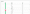

# GraphQL 教程— ReactJS 课程:第 1 课

> 原文：<https://blog.devgenius.io/graphql-tutorial-reactjs-course-lesson-1-c458f92354f8?source=collection_archive---------54----------------------->


[Duomly —编程在线课程](https://www.blog.duomly.com)

本文原载于[https://www . blog . duomly . com/graph QL-tutorial-react js-course/](https://www.blog.duomly.com/graphql-tutorial-reactjs-course/)

# 使用 GraphQL 的 ReactJS 简介

REST 是一个 API 设计架构，其中请求是通过 URL 完成的，REST API 的核心思想是，当链接到一个特定的 URL 时，您应该获得一段数据，称为资源。连接到 REST API 中的 URL 称为请求，答案就是响应。

GraphQL 是 API 的查询语言。它允许我们请求特定的数据，而不需要调用几次 API，请求是通过查询完成的。如果开发人员只需要数据库中的一个值，就没有必要获取所有的值。GraphQL 被组织为类型和字段，而不是端点。

在过去的几年里，REST 是 API 架构的标准，但是它不够灵活，不能适应快速变化的需求。为了获得更大的灵活性和效率，开发人员开始在某些应用程序中使用 GraphQL 作为设计 API 的新标准。

前段时间，我向您展示了如何在 ReactJS 中从 [REST Api 获取和显示数据。在本文中，我将向您展示如何使用 Axios 从 GraphQL API 向 React.js 应用程序获取数据。](https://www.blog.duomly.com/how-to-create-react-app-in-5-minutes/)

如果你想跟随这个教程，看看我们的 graph QLexpress js 课程，这是我的朋友做的。

一如既往，对于那些喜欢看教程而不是阅读的人来说，这里是这篇文章的视频版本。

开始吧！

# 1.创建反应堆应用程序

让我们从创建一个新的 ReactJS 应用程序开始，我们将在这里构建我们的项目。为此，打开终端并使用以下命令。

```
npx create-react-app <app-name>
```

安装完成后，让我们用以下代码启动应用程序:

```
cd <app-name>
yarn start
```

它应该在 localhost:3000 上运行，您应该会看到 ReactJS 应用程序的标准屏幕。

# 2.安装 Axios 并添加代理

现在，是时候安装 axios 库了，我们将使用它来满足我们的 GraphQL 请求。让我们回到终端，使用以下代码来安装它:

```
yarn add axios
```

看起来最重要的插件已经安装，所以我们可以照顾 CORS。为了避免这种情况，我们需要在我们的`package.json`文件中设置代理。就在脚本下面，让我们添加下面一行代码，但是记住要为你的后端 URL 设置代理。我的情况是 [http://localhost:4000](http://localhost:4000/) 。

```
"proxy": "http://localhost:4000",
```

太好了！现在，让我们添加 CSS 框架的 CDN，这将是布尔玛，我们也需要图标。

# 3.添加布尔玛和图标

我们上 bulma.io，在文档里可以找到 CDN 和字体牛逼图标的链接，这是我们要添加的。

打开下面的文件`public\index.html`，在我们主文件的 head 部分，让我们添加下面的代码。

```
<link rel="stylesheet" href="https://cdn.jsdelivr.net/npm/bulma@0.9.0/css/bulma.min.css">
<script defer src="https://use.fontawesome.com/releases/v5.3.1/js/all.js"></script>
```

现在，我们可以开始创建我们的应用程序了，让我们在您最喜欢的代码编辑器中打开代码，让我们开始吧！

# 4.创建新组件

在`src`文件夹中，让我们创建`components`文件夹，在这里我们将创建我们的组件。在新创建的文件夹中，让我们为我们的`transactions`组件创建文件夹，在该文件夹中，让我们创建`transactions.jsx`文件。

在这个文件中，让我们导入 React，然后开始创建我们的组件。

```
import React, { useEffect, useState } from 'react';function Transactions() {
  return (
    <div className="transactions section"> 
      <div className="card has-table has-mobile-sort-spaced">
        <header className="card-header">
          <p className="card-header-title">
            Transactions History
          </p>
        </header>
        <div className="card-content">
          <div className="table-wrapper has-mobile-cards">
            <table className="table is-striped is-hoverable">
              <thead>
                <tr>
                  <th>ID</th>
                  <th>Amount</th>
                  <th>Category</th>
                  <th>Date</th>
                </tr>
              </thead>
              <tbody>
                <tr>
                  <td>1</td>
                  <td>200$</td>
                  <td>shopping</td>
                  <td>10/04/2020</td>
                </tr>
              </tbody>
            </table>
          </div>
        </div>
      </div>
    </div>
  );
}export default Transactions;
```

当我们创建了事务组件的代码后，让我们转到`App.js`文件，并显示组件。

```
import React from 'react';
import Transactions from './components/transactions/transactions';
import './App.css';function App() {
  return (
    <div className="App has-background-light">
      <div className="container is-fluid">
        <div className="columns">
          <div className="column">
            <Transactions />
          </div>
        </div>
      </div>
    </div>
  );
}export default App;
```

作为此时的最后一步，我们将在我们的`App.css`文件中添加一些自定义样式。

```
.App {
  height: auto;
  min-height: 100vh;
  width: 100vw;
  overflow: hidden;
}.transactions .card-content {
  padding: 0;
}.transactions table {
  width: 100%;
}.transactions .table-wrapper {
  overflow: auto;
  max-height: 90vh;
}.transactions .card .card-header {
  border-bottom: 1px solid rgba(24,28,33,.06);
}.transactions .card {
  border-radius: 6px;
}
```

很好，现在我们可以创建 GraphQL 查询并准备 axios 调用了。

# 5.创建 GrpahQL API 查询

让我们打开`transactions.jsx`文件，首先导入 axios，定义我们的状态事务，并定义我们的查询。

```
import React, { useEffect, useState } from 'react';
import axios from 'axios';function Transactions() {
  const [transactions, setTransactions] = useState([]);  const query = `{ 
    expenses {
      id,
      date,
      category,
      amount,
      type,
    }
  }`;  ... 
}
```

准备好后，让我们使用`useEffect()`钩子来构建 API 调用。

```
useEffect(() => {
  axios({
    url: '/graphql',
    method: 'post',
    data: {
      query,
    }
  }).then((result) => {
    setTransactions(result.data.data.expenses);
  });
}, []);
```

很好，我们将数据保存在州中，所以现在我们可以将它映射到我们的表中。

# 6.地图数据

让我们找到表格行，我们将使用它来显示数据，让我们映射我们的数据来显示它。

```
<tbody>
  {transactions.map((item) => (
    <tr key={item.id}>
      <td>{item.id}</td>
      <td><span className={`${item.type === 'incoming' ? 'tag is-success' : 'tag is-danger'}`}>{item.type === 'incoming' ? '' : '-'} {item.amount} $</span></td>
      <td>{item.category}</td>
      <td>{item.date}</td>
    </tr>  
  ))}  
</tbody>
```

现在你可以看到这个表格，我想在这里做的最后一件事是给每个类别添加一个小图标。

# 7.设置图标

为了设置特定的图标，我将创建一个带有 switch 语句的函数，将特定的图标分配给每个类别，然后在表格单元格中调用它。

```
const getIcon = (category) => {
    let icon;
    switch(category) {
      case 'entertainment':
        icon = 'birthday-cake';
        break;
      case 'food':
        icon = 'pizza-slice';
        break;
      case 'bills':
        icon = 'home';
        break;
      case 'clothes':
        icon = 'tshirt';
        break;
      case 'cosmetics':
        icon = 'bath';
        break;
      case 'health':
        icon = 'first-aid';
        break;
      case 'electronics':
        icon = 'tv';
        break;
      case 'commuting': 
        icon = 'car-side';
        break;
      case 'freelance':
        icon = 'laptop-code';
        break;
      case 'salary':
        icon = 'wallet';
        break;
      case 'passive':
        icon = 'money-check-alt';
        break;
      default:
        // code block
    }
    return icon;
  }  ... <td><i className={`fas fa-${getIcon(item.category)}`}></i> {item.category}</td>
```

就是这样！让我们现在检查应用程序。结果应该如下图所示。



# 结论

恭喜你！

在本教程中，您已经学习了如何使用 axios 从 ReactJS 中的 GraphQL API 获取数据。现在，您可以同时使用 API、REST 和 GraphQL，并且还能够确定哪一个更适合您的应用程序。

别忘了看看我们的 ExpressJS 课程，在那里你可以学习如何在后端构建 GraphQL API。

如果您错过了一些代码，请随时查看我们的:

[ReactJS 课程:第 1 课—代码](https://github.com/Duomly/ReactJS-with-GraphQL-Course/tree/Lesson1)


[Duomly —编程在线课程](https://www.duomly.com/?code=lifetime-80)

感谢您的阅读，
来自 Duomly 的安娜