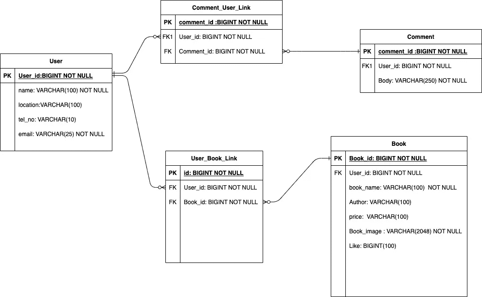
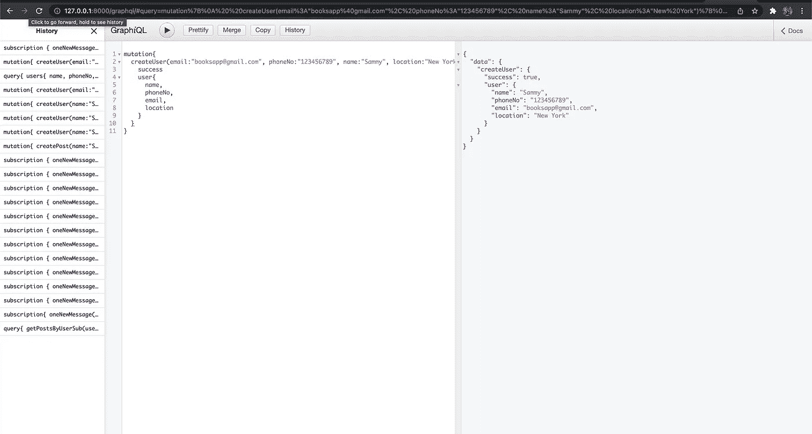
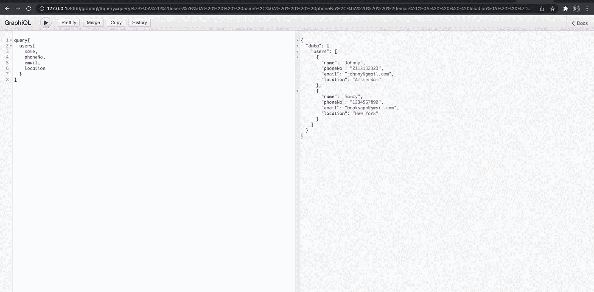

# graph QL+Django-带示例的教程

> 原文：<https://blog.devgenius.io/graphql-with-django-7dbbfb556461?source=collection_archive---------1----------------------->

**技术栈** — Django、Graphene、PostgreSQL


自从脸书推出 GraphQL 以来，它已经成为了 REST API 的革命性替代品。GraphQL 克服了 RESTful 架构的许多问题。然而，它确实带来了一系列必须评估的新问题。GraphQL 给了我们通过编写查询来请求我们想要检索的数据的强大能力。这篇博客文章将向你介绍使用 Graphene 和 Django 来使用 GraphQl API 所需要知道的一切。

让我们从头开始创建一个简单的售书应用程序，以便清楚地了解如何在 **Django** 中实现 **GraphQL** 。

首先，让我们通过下面的实体关系模型来理解构建这个应用程序所需的模型。



ERD 图

如果您想知道为什么我在中间有链接表，那么将太多的关系分解成一个太多的关系总是一个好主意，因为这使得子记录只有一个父记录，这将有助于计算更快的查找。

首先，让我们定义 GraphQL 中的查询是什么样子的，通过下面的一个简单查询，我们可以请求一个用户列表，并可以根据特定用例的需要限制细节。

**用户查询**:

```
query{
 users{
    name
    email
    phoneNo
    location
   }
}
```

**响应如下:**

```
{
  "data": {
    "users": [
      {
        "name": "Jonny",
        "email": "jonny@gmail.com",
        "phoneNo": "+1234567899",
        "location": "London"
      },
      {
        "name": "Sammy",
        "email": "sammy@gmail.com",
        "phoneNo": "+1234567898",
        "location":"New York"
      }
    ]
  }
}
```

所以我们开始吧:)

因为这是一个主要关注 GraphQL 的教程，所以我假设您对 Django 有一定的了解，但是如果没有，也没关系，我将带您从开始到如何设置和运行它的每个步骤。

你可以在这里得到整个项目的参考-[**https://github.com/samarthgowda96/resale_app.git**](https://github.com/samarthgowda96/resale_app.git)

**步骤 1** 设置

为了与 **GraphQL** 和 **Django** 一起工作，我们需要安装 **Graphene** 一个开源包，它非常酷，让我们能够利用令人惊叹的特性来定义我们的 GraphQL API，请查看他们的文档以了解更多细节——[**https://docs.graphene-python.org/projects/django/en/latest/**](https://docs.graphene-python.org/projects/django/en/latest/)

要安装 Django，请使用 pip 运行以下命令:

```
pip install Django
```

要安装 Graphene，请使用 pip 运行以下命令:

```
pip install graphene-django
```

所以我们安装了所有的包，现在让我们通过下面的命令创建一个 Django 项目:

```
django-admin startproject books
```

现在 books 是我们的父目录，在这里我们将在`books/settings.py`文件中配置所有需要的包依赖项。

让我们生成一个应用程序；`resaleapp` **，**这基本上是不同卖家转售图书的一个简单应用:

```
python3 manage.py startapp resaleapp
```

在 books 目录下的`books/settings.py`文件中包含了下面这个新生成的 app 和`graphene_django`的依赖关系。

```
INSTALLED_APPS = [
'django.contrib.admin',
'django.contrib.auth',
'django.contrib.contenttypes',
'django.contrib.sessions',
'django.contrib.messages',
'django.contrib.staticfiles',
'graphene_django',
'resaleapp'
]
```

您可以使用任何数据库来开发该应用程序，让我们在`books/settings.py`中定义配置:

```
DATABASES = {
  "default": {
      "ENGINE": "django.db.backends.postgresql",
      "NAME": "books",
      "HOST": "localhost,
      "PORT": "5432",
      "USER": "postgres",
      "ATOMIC_MUTATIONS": True,
      "PASSWORD": os.getenv('POSTGRES_PASSWORD') # Your local DB password
      }
}
```

在`books/settings.py`中添加 GraphQL

```
GRAPHENE = {
  'SCHEMA': 'resaleapp.schema.schema'
}
```

在`books/settings.py`中配置您的媒体路径以存储媒体/静态文件

```
MEDIA_URL = ‘/media/’
MEDIA_ROOT = os.path.join(BASE_DIR, ‘media’)
STATICFILES_DIRS = (os.path.join(BASE_DIR, ‘static’), )
```

现在，在`resale_app/urls.py`中，包含这些用于开发环境的库

```
from django.urls import path
from resaleapp.schema import schema
from  import views
from django.views.decorators.csrf import csrf_exempt
from graphene_file_upload.django import FileUploadGraphQLViewurlpatterns = [path('graphql/',
               csrf_exempt(FileUploadGraphQLView.as_view(graphiql=True,
               schema=schema)))]
```

最后，包含 **resaleapp** url 并将其媒体配置包装在`books/urls.py`中的父目录`urls.py`文件中

```
from django.contrib import admin
from django.urls import path, include
from django.views.decorators.csrf import csrf_exempt
from graphene_file_upload.django import FileUploadGraphQLView
from resaleapp.schema import schema
from graphene_django.views import GraphQLView
from django.conf.urls.static import static
from django.conf import settingsurlpatterns = [path('admin/', admin.site.urls), path('',
               include('resaleapp.urls'))] + static(settings.MEDIA_URL,
        document_root=settings.MEDIA_ROOT)
```

**第二步**运行你的应用程序

一旦在应用程序中完成了所有这些设置，我们就可以使用以下命令在[**http://localhost:8000/graph QL/**](http://localhost:8000/graphql/)上启动服务器了。

```
python3 manage.py runserver
```

如果你得到一个错误，那是因为我们没有创建`schema.py`并试图在`resaleapp/urls.py`中导入(现在移除它)

```
urlpatterns = [path('graphql/',
               csrf_exempt(FileUploadGraphQLView.as_view(graphiql=True)))]
```

创建你的模型

```
from django.db import modelsimport uuidimport datetimeimport os# *Create your models here.*def filepath(request, filename): # *File Path for your uploaded media* old_filename = filename
    timeNow = datetime.datetime.now().strftime('%Y%m%d%H:%M:%S')
    filename = '%s_%s' % (timeNow, old_filename)
    return os.path.join('media/', filename)class User(models.Model): id = models.UUIDField(primary_key=True, default=uuid.uuid4,
                          editable=False, unique=True)
    name = models.CharField(max_length=512)
    location = models.CharField(null=True, max_length=512)
    email = models.EmailField(null=True)
    phone_no = models.CharField(max_length=10, null=True) def __str__(self):
        return self.nameclass Book(models.Model): id = models.UUIDField(primary_key=True, default=uuid.uuid4,
                          editable=False, unique=True)
    book_name = models.CharField(max_length=512)
    author = models.CharField(max_length=512)
    price = models.CharField(max_length=512)
    book_image = models.FileField(upload_to=filepath, unique=True)class BookUser(models.Model): id = models.UUIDField(primary_key=True, default=uuid.uuid4,
                          editable=False, unique=True)
    user = models.ForeignKey(User, null=True, on_delete=models.CASCADE)
    book = models.ForeignKey(Book, null=True, on_delete=models.CASCADE)class Comment(models.Model): id = models.UUIDField(primary_key=True, default=uuid.uuid4,
                          editable=False, unique=True)
    book = models.ForeignKey(Book, null=True, on_delete=models.CASCADE)
    body = models.CharField(max_length=512)class CommentUser(models.Model): id = models.UUIDField(primary_key=True, default=uuid.uuid4,
                          editable=False, unique=True)
    user = models.ForeignKey(User, null=True, on_delete=models.CASCADE)
    comment = models.ForeignKey(Comment, null=True,
                                on_delete=models.CASCADE)
```

现在，让我们将刚才创建的模型的更改迁移到 PostgreSQL 数据库中

```
python3 manage.py makemigrations
python3 manage.py migrate
```

希望你不要在这里得到任何错误:)

让我们创建我们的`resaleapp/fields.py`文件。

一般来说，它用于将数据转换成各自的格式进行处理。

类型是一个代表模型的 GraphQL 对象，您可以对它进行定制，以允许您基于一组标准过滤您的结果。

让我们在应用程序`resaleapp/fields.py`中为`graphene`创建一个字段文件

```
import graphenefrom graphene_django import DjangoObjectTypefrom graphene_django.filter import DjangoFilterConnectionFieldfrom .models import User, Book, Comment, BookUser, CommentUserclass BookClass(DjangoObjectType): class Meta: model = Bookclass UserClass(DjangoObjectType): book = graphene.List(BookClass) class Meta: model = User def resolve_book(self, info, root):
        book_user = \
                  BookUser.objects.filter(user_id=self.id).values_list('book_id'
                )
        books = Book.object.filter(id__in=book_user)
        return booksclass BookUserClass(DjangoObjectType): class Meta: model = BookUser
class CommentClass(DjangoObjectType): class Meta: model = Commentclass CommentUserClass(DjangoObjectType): class Meta: model = CommentUser
```

如果您已经观察到，创建的每个模型都定义了自己的字段类类型，还允许为每个字段定义自定义解析器，我们可以通过调用它自己的类连接来访问它。

**步骤 4** 让我们在 GraphQL API 中创建我们的模式和变体来处理来自客户端的查询请求。

让我们在应用程序`resaleapp/mutations.py`中为`graphene`创建一个突变文件

现在，让我们定义几个`mutate`函数来存储 PostgreSQL 中的数据。

```
import graphenefrom graphene_file_upload.scalars import Uploadfrom .fields import UserClass, BookClass, CommentClassfrom .models import User, Book, Comment, BookUser, CommentUserclass createUser(graphene.Mutation): error = graphene.String()
    success = graphene.Boolean()
    user = graphene.Field(UserClass) class Meta: description = 'Add user details' class Arguments: name = graphene.String(required=True)
        email = graphene.String(required=True)
        location = graphene.String()
        phone_no = graphene.String() def mutate(
        self,
        info,
        phone_no=None,
        location=None,
        **kwargs
        ):
        try:
            user = User.objects.create(name=kwargs.get('name'),
                    email=kwargs.get('email'), phone_no=phone_no,
                    location=location)
            return createUser(user=user, success=True)
        except Exception, e:
            return createUser(user=None, success=False, error=e)class createBook(graphene.Mutation): error = graphene.String()
    success = graphene.Boolean()
    book = graphene.Field(BookClass) class Arguments: user_id = graphene.ID(required=True)
        book_name = graphene.String(required=True)
        author = graphene.String(required=True)
        book_image = Upload()
        price = graphene.Int() def mutate(self, info, **kwargs):
        try:
            book =    Book.objects.create(book_name=kwargs.get('book_name'
                    ), author=kwargs.get('author'),
                    book_image=kwargs.get('book_image'),
                    price=kwargs.get('price'))
            book_user = BookUser.objects.create(book_id=book.id,
                    user_id=kwargs.get('user_id'))
            return createBook(book=book, success=True)
        except Exception, e:
            return createBook(book=book, success=False, error=e)class createComment(graphene.Mutation): error = graphene.String()
    success = graphene.Boolean()
    comment = graphene.Field(CommentClass) class Arguments: user_id = graphene.ID(required=True)
        book_id = graphene.ID(required=True)
        body = graphene.String(required=True) def mutate(self, info, **kwargs):
        try:
            comment = \
                Comment.objects.create(book_id=kwargs.get('book_id'),
                    body=kwargs.get('body'))
            comment_user = \
                CommentUser.objects.create(user_id=kwargs.get('user_id'
                    ), comment_id=comment.id)return createComment(success=True, comment=comment)
        except Exception, e:
            return createComment(success=False, error=e)class delete(graphene.Mutation): error = graphene.String()
    success = graphene.Boolean() class Arguments: user_id = graphene.ID()
        book_id = graphene.ID()
        comment_id = graphene.ID() def mutate(self, info, **kwargs):
        try:
            if kwargs.get('user_id'):
                User.objects.filter(id=kwargs.get('user_id')).delete()
            if kwargs.get('book_id'):
                Book.objects.filter(id=kwargs.get('book_id')).delete()
            if kwargs.get('comment_id'):
                Comment.objects.filter(id=kwargs.get('comment_id'
                        )).delete()
            return delete(success=True)
        except Exception, e:
            return delete(success=False, error=e)
```

例如，我们创建了一个代表我们模型的对象`UserClass`类，然后创建了一个为`User`模型创建记录的变异函数`createUser`。

现在，让我们在应用程序`resaleapp/schema.py`中为`graphene`创建一个模式文件

模式本质上是一个文件，它将您的模型转换成 GraphQL，并告知它它们是什么以及它们应该如何交互。

```
import graphenefrom .fields import UserClass, CommentClass, BookClassfrom models import User, Book, Commentfrom mutations import createUser, createBook, createComment, deleteclass Query(graphene.ObjectType): users = graphene.List(UserClass)
    user = graphene.Field(UserClass, id=graphene.ID())
    books = graphene.List(BookClass)
    book = graphene.Field(BookClass, id=graphene.ID())
    comments = graphene.List(CommentClass)
    comment = graphene.Field(CommentClass, id=graphene.ID())def resolve_users(root, info):
        return User.objects.all()def resolve_user(root, info, id):
        return User.objects.get(id=id)def resolve_books(root, info):
        return Book.objects.all()def resolve_book(root, info, id):
        return Book.objects.get(id=id)def resolve_comments(root, info):
        return Comment.objects.all()def resolve_comment(root, info, id):
        return Comment.objects.get(id=id)class Mutation(graphene.ObjectType):create_user = createUser.Field()
    create_book = createBook.Field()
    create_comment = createComment.Field()
    delete = delete.Field()schema = graphene.Schema(query=Query, mutation=Mutation)
```

例如，我们创建了一个类`UserClass`，它是一个表示我们模型的对象，然后创建了一个解析器`resolve_users`，它返回一个字段的值

太棒了，干得好！你们都达到了使用 Graphene + Django 构建基本应用的要求:)

**Step — 7** 让我们在[**http://localhost:8000/graph QL/**](http://localhost:8000/graphql/)测试我们的应用程序

为了**创建/删除/更新**数据，我们在 GraphQL 中使用突变查询

**变异查询**:

```
mutation{
  createUser(email:"[booksapp@gmail.com](mailto:booksapp@gmail.com)", phoneNo:"123456789", name:"Sammy", location:"New York"){
    success
    user{
      name,
      phoneNo,
      email,
      location
    }
  }
}
```

**响应:**

```
{
  "data": {
    "createUser": {
      "success": true,
      "user": {
        "name": "Sammy",
        "phoneNo": "123456789",
        "email": "[booksapp@gmail.com](mailto:booksapp@gmail.com)",
        "location": "New York"
      }
    }
  }
}
```



为了**获得**数据，我们在 GraphQL 中使用解析器查询:

**查询:**

```
query{
  users{
    name,
    phoneNo,
    email,
    location
  }
}
```

**响应:**

```
{
  "data": {
    "users": [
      {
        "name": "Johnny",
        "phoneNo": "2112132323",
        "email": "[johnny@gmail.com](mailto:johnny@gmail.com)",
        "location": "Amsterdam"
      },
      {
        "name": "Sammy",
        "phoneNo": "1234567890",
        "email": "[booksapp@gmail.com](mailto:booksapp@gmail.com)",
        "location": "New York"
      }
    ]
  }
}
```



任何意见都将不胜感激。请别忘了留下评论。希望你觉得这篇文章有用，干杯:)

**Github**——[https://github.com/samarthgowda96/resale_app](https://github.com/samarthgowda96/resale_app)

**领英**——[https://www.linkedin.com/in/samarth-gowda96/](https://www.linkedin.com/in/samarth-gowda96/)

**参考**—[https://gear heart . io/articles/how-to-use-graph QL-with-django-with-example/](https://gearheart.io/articles/how-to-use-graphql-with-django-with-example/)

**感谢您的阅读！！！**