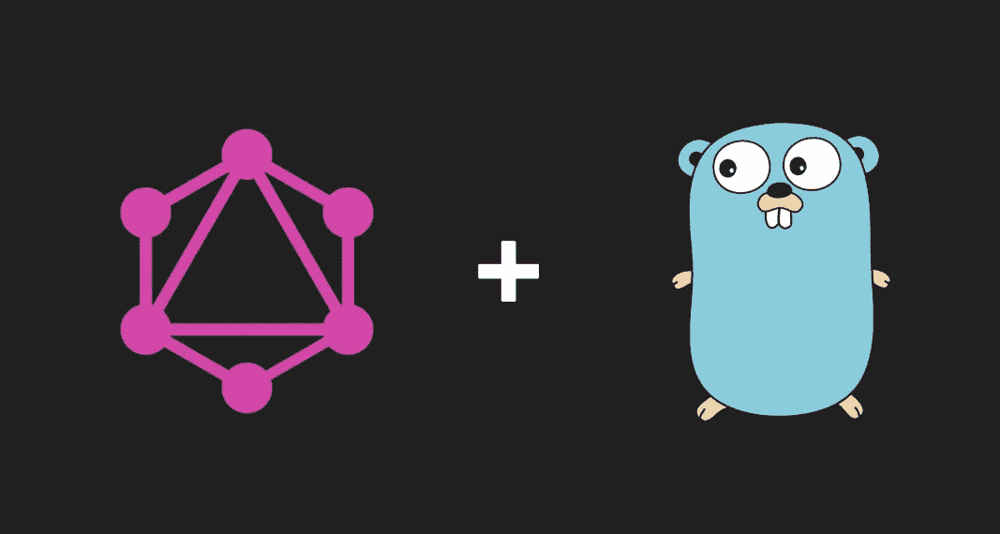
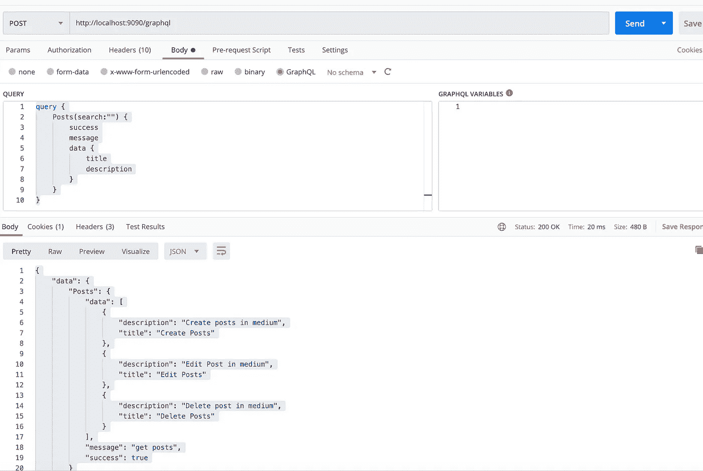

# 具有 golang clean 架构的 GraphQL

> 原文：<https://blog.devgenius.io/graphql-with-golang-clean-architecture-29e328dae58b?source=collection_archive---------7----------------------->



## 干净的建筑

Clean architecture 是一种软件设计哲学，它将设计的元素分成环形层次。干净架构的主要规则是代码依赖只能来自外部层次。内层的代码可能不知道外层的功能。它通常包含交付、用例、存储库。

## GraphQL

GraphQL 是 API 的一种查询语言，也是一种服务器端运行时，通过使用您为数据定义的类型系统来执行查询。GraphQL 不依赖于任何特定的数据库或存储引擎，而是由您现有的代码和数据提供支持。

GraphQL 服务是通过定义类型和这些类型上的字段，然后为每个类型上的每个字段提供函数来创建的。

## 我们的目标

在本练习中，我们将在 clean architecture 中使用 go 编程语言创建 graphql 服务器。我们的目标是从我们的服务器获取文章数据，也就是 post 数据。

我们的请求主体:

回应:

**设置 GraphQL Clean 架构**

我们的清洁建筑目录

```
graphql-go-clean
└── src
    ├──graphql
    │  ├── posts
    |  │  ├── usecase
    │  |  ├── resolver
    │  │  ├── serializer
    │  │  ├── repository
    │  │  ├── domain
├──main.go
├──schema.go
```

**域**

在结构中创建 graphql 架构

**储存库**

在文件夹存储库中，创建接口以将数据提取到数据库或其他涉及 CRUD 数据库的操作。在本练习中，我们只创建将文章提取到数据库的接口。

**用例**

在用例中创建接口以获取所有数据文章。在此文件夹中，您可以为您的特定业务规则添加更多逻辑

**解析器**

在这一层，我们为我们查询的字段创建解析器

**模式**

这是 graphql 模式初始化的地方。我们有一个名为 Query 的方法来处理所有的 graphql 查询。在新架构初始化中，我们包括了 postResolver 接口。所以我们可以在查询模式中称之为解析器

**Main.go**

在 main.go 中，我们首先在 schema.go 文件中初始化 graphql 模式。然后我们使用 GraphQL HTTP 处理程序，将处理程序传递给 echo WrapHandler 函数，然后运行 echo 服务器。

## **测试我们的服务器**

为了测试我们的服务器，我们可以使用 postman 或其他 graphql 工具。
运行服务器并尝试测试 graphql 查询



## 结论

Clean architecture 现在是编程中流行的架构，graphQL 是构建新 API 的新概念。我们仍然可以用干净的架构实现 graphQL，而不会失去干净架构的基本原则，即每一层都有自己的依赖关系。

使用 golang clean architecture 的 graphQL 服务器进行更深入的研究。添加更多用例来获取数据。

你可以在这里看到我的 Github 的完整代码:

[](https://github.com/hardyantz/go-graphql-clean) [## hardyantz/go-graphql-clean

### 在 clean 架构中使用 golang 的 GraphQL 服务器。为 hardyantz/go-graphql-clean 开发做出贡献，创建一个…

github.com](https://github.com/hardyantz/go-graphql-clean)