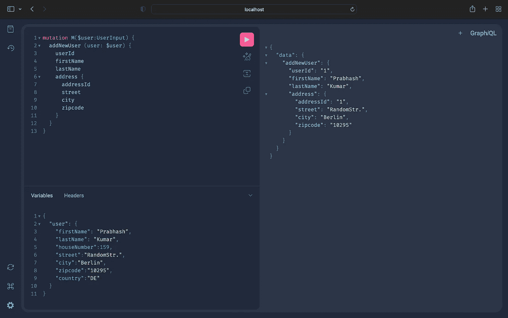

# 使用 Java 和 Spring Boot 的 GraphQL

> 原文：<https://blog.devgenius.io/graphql-with-java-and-spring-boot-b64d3ce427a2?source=collection_archive---------1----------------------->

## [GraphQL]带有基于 Java Spring Boot 注释的查询、变异和订阅示例


Java Spring Boot GraphQL 徽标

# GraphQL 是什么？

GraphQL 是 API 和服务器运行时的查询语言，用于处理这些查询**。**它主要用于仅请求您需要的数据，从而改善响应时间并减少网络带宽使用，从而限制您需要的请求数量。

GraphQL 由脸书于 2012 年创建，并于 2015 年开源。它解决了一个重要的问题，即只从一个地方获得需要的数据，而不是向多个微服务发出请求，并获得大量不需要的数据作为响应。它对于网络和性能受限的环境(如移动设备)非常有用。

在本文中，我们将学习基本术语，并使用 Java、Spring Boot 和 GraphQL 创建一个示例应用程序。GitHub 链接会在文末分享。

# GraphQL 术语

GraphQL 具有用于数据交换的客户机-服务器架构。客户端向服务器发送查询，以执行各种操作，如获取数据或创建/更新/删除数据。

## GraphQL:模式

模式描述了客户端可以通过服务查询的所有可能的数据。它由对象类型组成。[点击这里进入官方文档页面。](https://graphql.org/learn/schema/)

## GraphQL:类型语言

GraphQL 服务可以用任何语言编写。它使用“GraphQL 模式语言”，它类似于查询语言，允许我们以一种语言不可知的方式谈论 GraphQL 模式。

## GraphQL:对象类型和字段

GraphQL 中最基本/最常用的组件是 object ' *type* 。它还具有类似于' *Int* '、 *String* '、 *Float* '、 *Boolean* '和' *ID* '的缩放器类型。

例如，下面是 GraphQL 模式中的一个对象类型。请注意'*！*'用于表示非空值，您将始终获得该字段的值。

```
type Address {
    addressId: ID!,
    houseNumber: Int,
    street: String,
    city: String,
    zipcode: String,
    country: String
}
```

## GraphQL:查询、变异和订阅

GraphQL 有 3 种操作类型可以用来读写数据。

**查询**:用于读取数据。
**突变**:用于写数据(创建/更新/删除)
**订阅**:类似于查询，但这里连接持续时间更长，服务器可以随时发送数据，无需基于任何订阅请求。

# 这个故事的用例

我们将创建一个简单的 GraphQL 模式，使用*用户*和*地址*作为对象类型。我们将创建一个*查询*来获取用户数据，一个*变异*来创建一个新用户，以及一个*订阅*来问候新创建的用户。

## **先决条件**

*   Java 语言(一种计算机语言，尤用于创建网站)
*   Spring Boot (2.7+)
*   格雷尔还是梅文

## 设置

让我们使用名为' *graphql-spring-example* '的 Spring 初始化器创建一个新的 Spring Boot 项目，更新项目细节，在 dependencies 中添加 *GraphQL* 、 *Web* 和 *WebSocket* ，并点击 generate。或者干脆[点击这里直接下载项目](https://start.spring.io/#!type=gradle-project&language=java&platformVersion=2.7.4&packaging=jar&jvmVersion=17&groupId=com.graphql&artifactId=graphql-spring-example&name=graphql-spring-example&description=GraphQL%20Example&packageName=com.graphql.springexample&dependencies=graphql,web,websocket)。

我将使用 Java 17 和 IntelliJ IDEA IDE。可以用自己喜欢的配置。

## GraphQL 模式文件

现在让我们在' *src/main/resources* '目录中创建一个名为' *graphql* 的目录，并在那里添加一个模式文件。模式文件的扩展名应为'*。graph qls*’。

## GraphQL Java 服务器实现

现在我们已经创建了我们的模式，是时候创建服务器端的实现了。
我们将创建一个用“ *@Controller* ”注释注释的控制器类。然后我们将创建 4 个方法，2 个用于查询，1 个用于变异，1 个用于订阅。我们将根据模式用“*@查询映射*”、“*@变异映射*”、“*@订阅映射*”对它们进行注释。大概是这样的:

```
@Controller
public class GraphqlController {

    @QueryMapping
    public Collection<User> getAllUsers() {
        return null;
    }

    @QueryMapping
    public User getUserById(@Argument int userId) {
        return null;
    }

    @MutationMapping
    public User addNewUser(@Argument UserInput user) {
        return null;
    }

    @SubscriptionMapping
    public Publisher<String> greetNewUsers() {
        return null;
    }

}
```

这里使用了*@ Argument*’来获取输入。

我们将创建一个名为' *GraphqlService* '的服务类，并在该类中添加逻辑，为了简单起见，我们将在这里使用内存中的数据。它看起来会像这样:

请注意，我已经自动连线了一个接收器和通量，它用于订阅操作。添加新用户时，它会将数据添加到' *userSink* '中，我们将对其进行配置，使其将数据推送到' *userFlux* '中，后者会将数据发送给订户。为了简单起见，我们使用了 *Sink* ，我们也可以使用任何消息系统，比如 JMS、Kafka 等等。配置文件看起来会像这样:

我们还将在控制器中创建一个带有' *@BatchMapping* '注释的方法来获取地址。当我们获取所有用户时，这将有助于获取地址，并且响应中需要地址数据。如果我们不在用户查询中请求地址数据，这个方法就不会被调用，我们将看到下面的例子。

现在，让我们更新控制器实现。

我们在'*地址*'映射方法中添加了一个打印语句，只有在请求中要求地址时才会打印。

让我们使用' *application.properties* '配置来启用'*graphiql*UI，我们还将启用 WebSocket，以便'*订阅*映射可以工作。

```
spring.graphql.graphiql.enabled=true
spring.graphql.websocket.path=/graphql
```

现在，让我们启动我们的应用程序，并在您的浏览器中转到 URL '[*http://localhost:8080/graphiql*](http://localhost:8080/graphiql)'。这将打开一个网页，我们将在那里执行我们的查询，它应该看起来像这样:


spring graph QL—graph QL 用户界面

## GraphQL 客户端请求

**查询**:现在，让我们尝试执行一个“*查询*”。在左侧文本框中输入以下内容，然后点击运行按钮:

```
query Q {
  getAllUsers {
    userId
    firstName
    lastName
  }
}
```

此处查询的可选名称为' *Q* '，您可以根据需要将其重命名或删除。
我们可以看到响应没有任何数据，这是因为我们还没有创建任何用户。

**突变**:现在让我们通过执行下面的'*突变*'来创建一个用户(当您开始在这个 UI 中键入时，您会注意到它将开始建议模式细节):

```
mutation M($user:UserInput) {
  addNewUser (user: $user) {
    userId
    firstName
    lastName
    address {
      addressId
      street
      city
      zipcode
    }
  }
}
```

这里，我们将使用模式中定义的' *UserInput* '类型来接受输入。此外，我们可以看到，在这个变异中，它被作为变量' *$user* '传递。
在 UI 的左下方，我们可以看到用于传递变量的“*变量*部分。让我们单击那里并添加“*用户*”的值。

```
{
  "user": {
    "firstName": "Prabhash",
    "lastName": "Kumar",
    "houseNumber":159,
    "street":"RandomStr.",
    "city":"Berlin",
    "zipcode":"10295",
    "country":"DE"
  }
}
```

让我们像以前一样，通过单击中间的 run 按钮来执行，它应该会给出类似如下的输出:



GraphQL —变异输出

我们可以看到，它只回应了我们要求的数据。我们没有要求'T30 国家 T31'，并且响应没有国家。

现在我们已经添加了一个用户，让我们再次执行' *getAllUsers()* '查询。它现在应该给出一个使用一次的响应，在响应中没有任何地址对象。

我们还可以在控制台输出日志中注意到，对于这个查询，没有调用'*地址*'映射方法。它只在我们的'*突变*'查询中被调用，我们在响应中要求一个地址。这是 GraphQL 最好的特性之一，它可以帮助保存网络调用，不管是数据库还是 API。

**订阅**:现在让我们创建一个“*订阅*”，根据我们的实现，当我们通过*变异*创建一个新用户时，这个订阅者应该能够从服务器获得一个问候消息，问候新用户。

现在让我们打开另一个浏览器选项卡，点击相同的 URL '[http://localhost:8080/graphiql](http://localhost:8080/graphiql)'，这里我们将使用它来订阅事件，并且在我们之前的窗口中，我们将使用相同的*突变*查询来创建一个新用户。
订阅查询如下所示:

```
subscription s {
  greetNewUsers
}
```

现在，执行这个查询，返回到上一个窗口，用新名字创建一个新用户(我使用了名字' *John Doe* ')，您应该看到订阅者从服务器上获得了新用户的问候消息。它应该看起来像这样:

```
{
  "data": {
    "greetNewUsers": "Hello John Doe!"
  }
}
```

让我们通过创建多个用户来尝试一下，并看到对于每个用户，我们都得到问候消息。我们还可以通过调用' *getAllUsers* '查询来查看所有用户。

# 结论

在本文中，我们了解了 GraphQL 及其在 Java 和 Spring Boot 中的实现。我们创建了一个模式，启动了服务器，并通过示例执行了所有三个查询、变异和订阅。

你可以在这里的 GitHub 库[中找到这个例子的代码。](https://github.com/kumarprabhashanand/graphql-spring-example)

喜欢内容吗？你可以点击这里或者使用下面的链接给我买杯咖啡[来表示支持。](https://buy.stripe.com/14k5n2fvJ8bi4rC4gg)