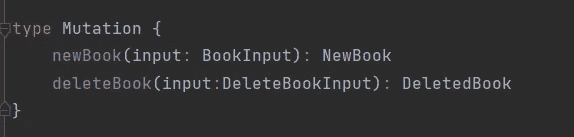

# 带弹簧启动启动器的图表

> 原文：<https://blog.devgenius.io/graphql-with-spring-boot-starter-graphql-7b406998c0b5?source=collection_archive---------0----------------------->

终于，经过 10 个月的等待，GraphQL 集成了最新发布的 [**spring boot 2.7.0**](https://spring.io/blog/2022/05/19/spring-boot-2-7-0-available-now) 。在这个版本中，**spring-boot-starter-graph QL**取代了当前的 **GraphQL java spring** 。有关此版本的更多详情，请查看此处的。

在本文中，我们将看到如何开始使用这个新的 graphql starter 或者简单地迁移您现有的项目。这里，我使用的是我之前用 graphql java spring 构建的[项目](https://medium.com/@dhakresumitra5/graphql-with-spring-boot-java-d2fa3ca1b12c)。

# 要求

您需要的设置:

*   对 spring boot 和 GraphQL 有基本的了解
*   现有的 graphql java 项目或克隆一个[在这里](https://github.com/dhakre/APIBook/tree/graphqlTypes)
*   安装在您机器上的 Docker
*   您选择的 Intellij 或 IDE
*   测试 API 的邮递员

# 项目迁移

与以前不同，使用***spring boot 2 . 7 . 0***我们只需要一个依赖项就可以将 GraphQL 集成到我们的项目中。所以我从升级 spring boot 版本开始

```
<parent>
    <groupId>org.springframework.boot</groupId>
    <artifactId>spring-boot-starter-parent</artifactId>
    <version>2.7.0</version>
    <relativePath/>
```

然后我**移除了**之前的 graphql 依赖项 **graphql-java-tools** 和**graph QL-spring-boot-starter。**

```
<dependency>
    <groupId>com.graphql-java-kickstart</groupId>
    <artifactId>graphql-java-tools</artifactId>
    <version>12.0.0</version>
</dependency>
<dependency>
    <groupId>com.graphql-java-kickstart</groupId>
    <artifactId>graphql-spring-boot-starter</artifactId>
    <version>12.0.0</version>
</dependency>
```

并且**增加了新的弹簧靴 graphql 启动器**

```
<dependency>
    <groupId>org.springframework.boot</groupId>
    <artifactId>spring-boot-starter-graphql</artifactId>
</dependency>
```

之后，删除所有已实现的解析器，并通过删除 graphql java spring 的所有导入来清理项目。


现在我们的项目是干净的，并且更新了新的依赖项。根据 [**spring graphql 文档**](https://docs.spring.io/spring-graphql/docs/current-SNAPSHOT/reference/html/#overview) ，最大的变化来自于*新的带注释的控制器*。模式文件的[默认位置是***src/main/resources/graph QL/* ****。这里就是这种情况，所以我们不需要接触 graphql 模式文件。所有文件都将被 spring graphql starter 自动拾取。](https://docs.spring.io/spring-boot/docs/2.7.0-SNAPSHOT/reference/html/web.html#web.graphql.schema)


架构文件位置

您还可以在*应用程序中自定义模式文件的位置。但是这里我们将使用默认值。*


# GraphQL 注释

使用 Graphql spring java，需要解析器组件来实现 *GraphQLQueryResolver* 或*graphqlmationresolver*类。但是随着***spring boot start*r g*raph QL***，它被移到了一个 [***基于注释的编程***](https://docs.spring.io/spring-graphql/docs/current-SNAPSHOT/reference/html/#controllers) 模型。简而言之，以前的解析器被注释所取代:

```
**GraphQLMutationResolver -> @MutationMapping****GraphQLQueryResolver -> @QueryMapping**
```

并且***@控制器*** *组件*使用*带注释的处理程序方法*来绑定和解析 graphql 模式字段/查询。

## 查询映射

顾名思义，这个注释将**处理程序方法**映射到 graphql 模式中的**查询类型。**


查询模式


带有注释查询方法的 BookQuery 类

现在让我们通过用***@ query mapping****对查询方法进行注释来配置我们的查询方法。*对于*映射查询参数*我们可以使用注释[**@参数**](https://docs.spring.io/spring-graphql/docs/1.0.0/reference/html/#controllers-schema-mapping-argument) 。为了更加灵活，您还可以为参数定义别名，例如


查询***getBookByName***在**模式**和**处理程序方法**中有一个参数 ***filter*** ，它是 **bookFilter** 。所以我们需要用***@实参(" filter")*** 定义一个别名。如果您忘记这样做，您的项目将会成功部署，但是查询将会以 NPE 结束。我浪费了一些时间，后来发现它只是缺少正确匹配的参数名。

# 模式映射

该注释将处理程序映射并绑定到 GraphQL 模式中的字段，它可以在**方法**或**类级别**使用。它接受两个参数**类型名=** 和**字段=** 。它也是其他特定于查询的注释的父注释。


模式映射元注释

我们将需要这个注释来解析图书类型的**作者** **字段类型**。


模式中的图书类型


具有模式映射注释的作者解析器方法

这里我们用参数定义了 *@SchemaMapping* 注释

*   **typeName= Book** ，即作者字段所属的类型
*   **field= author** ，指定指定的 *typeName* 的哪个字段将被这个 handler 方法解析。

之后，我定义了字段上的**参数，用*@参数*注释排序**。由于在模式和处理程序方法中有相同的名字 **order** ，spring 将自动映射它。因为我们在方法级别定义了**模式注释，所以先前的 **BookAuthorResolver** 类是不必要的，所以我移除了它，并将该方法移到了 **BookQuery** 类。**


具有查询处理程序和作者解析器方法的 BookQuery 类

# 突变作图

该注释将处理程序方法与 GraphQL 模式中的变异查询进行映射。



突变模式


具有突变注释的 deleteBook 方法

就像我们对 queryMapping 所做的更改一样，将@MutationMapping 添加到突变查询方法中，并用别名用***@ Argument(" input ")***批注来批注突变参数。

由于**变异**和**查询**映射注释是 SchemaMapping 的**元注释，**我们也可以这样替换。


用@SchemaMapping 注释定义突变方法

# 测试 API

现在所有的更改都完成了，让我们构建并运行项目。

> mvn 全新安装

然后用 docker 部署。

> docker-撰写向上-d


码头集装箱

让我们先测试一个**查询**


邮递员中的所有图书查询

正如规范中提到的，新的 spring graphql starter 使用**运行时连接**到**注册处理程序方法**到 graphql.schema.Datafetcher


您不会看到任何错误，但结果不会是预期的。所以在注释处理程序方法时要小心。


现在我们来测试一个**突变**。


《邮差》中的新书突变

API 按预期工作。我希望这篇简短的文章能帮助你开始使用新的***spring-boot-graph QL-starter***并体验它的其他酷功能。你可以在 [github 上点击](https://github.com/dhakre/APIBook/tree/springGraphQL)查看这个项目。如果你喜欢这篇文章，一定要看看我的其他与弹簧靴相关的[文章。](https://medium.com/@dhakresumitra5/list/graphql-with-spring-boot-java-6bbc89446107)