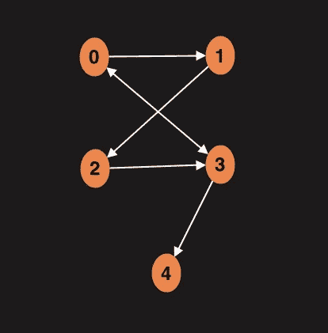
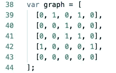
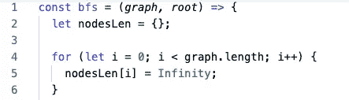
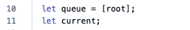
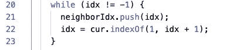
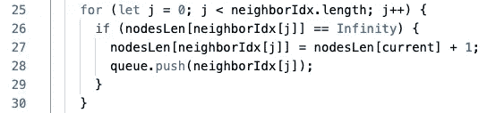

# 图形数据结构:广度优先搜索

> 原文：<https://blog.devgenius.io/graphs-data-structure-breadth-first-search-ec662dc73079?source=collection_archive---------14----------------------->

一周前我们学习了[图数据结构](https://medium.com/better-programming/data-structures-with-javascript-graphs-42084ec4db22)。今天我们将讨论如何使用图表。我们将试图找出图中两个节点之间的距离。这是图的主要用途之一，叫做图遍历。有两种主要的图形算法:广度优先搜索(BFS)和深度优先搜索(DFS ),今天我们将讨论 BFS。

我们的图表看起来是这样的:

**广度优先搜索**

在我们的例子中，我们将使用邻接矩阵。这就是矩阵如何表示上图:

我们将从一个输入节点开始，然后访问它的所有邻居，这是一个边缘。然后拜访他们所有的邻居。点是确定节点离根节点有多近。

我们马上要写的函数将返回一个带有键值对的对象，其中 key 表示节点，而 value 表示这个节点离根节点有多远。

首先，我们将循环遍历邻接矩阵(2D 数组)，在图上创建尽可能多的键值对。最初，我们将把距离分配给代表节点间缺乏连接的**无穷大**。

然后，我们将根节点指定为 0，因为到根节点的距离始终为 0:

接下来，让我们创建一个队列来跟踪要访问的节点。而 **current** 变量将保存我们此刻正在处理的一个节点:

接下来，我们将开始一个 while 循环，继续遍历队列中的节点，直到它们都被遍历完。首先从队列中移除根节点，并将其存储在变量 **current** 中。

此外，我们将创建一个空数组来存储当前节点的连接节点列表。 **idx** 变量将从索引为 1 的连接节点中获取节点。如果没有索引为 1 的节点，那么变量的值将被设置为-1。

之后，我们将执行另一个 while 循环，条件是如果 idx 不等于-1，则继续。在这个循环中，我们将把 idx 的值放入邻居节点的数组中。并将值 idx 重置为连接节点数组中的下一个值:

最后，我们需要建立另一个循环。这次我们将对循环执行**，该循环将循环通过连接的节点并获得一个距离:**

这是 BFS 算法的完整代码:

**结论**

邻接矩阵广度优先搜索的时间复杂度为 O(V*E)。

下次我们将讨论深度优先搜索算法。

可以在 [repl](https://repl.it/@PavelIlin/Graphs-breadth-first-search#index.js) 里玩代码。

不断学习，不断成长！

我们上 [LinkedIn](https://www.linkedin.com/in/pavel-ilin/) 连线吧！