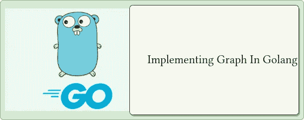
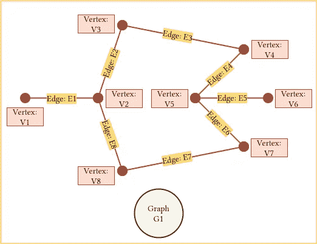

# 戈兰语图

> 原文：<https://blog.devgenius.io/graphs-in-golang-45f7ce31fd3f?source=collection_archive---------0----------------------->

## 图形数据结构的实现



## 定义

> **图** : *与数组不同，图是由顶点和边组成的非线性数据结构。*
> 
> ***有向图*** *:提到两个节点关联的图是这样的:****A->B****只提到* `*Point-A*` *和* `*Point-B*` *之间有一条边，其中* **A 能到达 B 而 B 不能到达** *。这种图叫做有向图。*
> 
> ***无向图*** *:提到两个节点关联的图是这样的:****A->B****提到*`*Point-A*``*Point-B*`*之间有一条边，其中* **A 可以到达 B & B 也可以到达 A***。这种图叫做无向图。*



## 方法

1.  AddEdge:这个方法负责添加一条从`Point-A`到`Point-B`的有向边。
2.  AddVertex:这个方法负责向图中添加一个顶点/节点。

> 下面我们有一个有向图的实现:

```
package datastructures

import "fmt"

// Graph structure
type Graph struct {
 vertices []*Vertex
}

// Adjacent Vertex
type Vertex struct {
 key      int
 adjacent []*Vertex
}

// AddVertext will add a vertex to a graph
func (g *Graph) AddVertex(vertex int) error {
 if contains(g.vertices, vertex) {
  err := fmt.Errorf("Vertex %d already exists", vertex)
  return err
 } else {
  v := &Vertex{
   key: vertex,
  }
  g.vertices = append(g.vertices, v)
 }
 return nil
}

// AddEdge will add ad endge from a vertex to a vertex
func (g *Graph) AddEdge(to, from int) error {
 toVertex := g.getVertex(to)
 fromVertex := g.getVertex(from)
 if toVertex == nil || fromVertex == nil {
  return fmt.Errorf("Not a valid edge from %d ---> %d", from, to)
 } else if contains(fromVertex.adjacent, toVertex.key) {
  return fmt.Errorf("Edge from vertex %d ---> %d already exists", fromVertex.key, toVertex.key)
 } else {
  fromVertex.adjacent = append(fromVertex.adjacent, toVertex)
  return nil
 }
}

// getVertex will return a vertex point if exists or return nil
func (g *Graph) getVertex(vertex int) *Vertex {
 for i, v := range g.vertices {
  if v.key == vertex {
   return g.vertices[i]
  }
 }
 return nil
}

func contains(v []*Vertex, key int) bool {
 for _, v := range v {
  if v.key == key {
   return true
  }
 }
 return false
}

func (g *Graph) Print() {
 for _, v := range g.vertices {
  fmt.Printf("%d : ", v.key)
  for _, v := range v.adjacent {
   fmt.Printf("%d ", v.key)
  }
  fmt.Println()
 }
}

func PrintEgDirectedGraph() {
 g := &Graph{}
 g.AddVertex(1)
 g.AddVertex(2)
 g.AddVertex(3)
 g.AddEdge(1, 2)
 g.AddEdge(2, 3)
 g.AddEdge(1, 3)
 g.AddEdge(3, 1)
 g.Print()
}

/* 
// Call In Main:: datastructures.PrintEgDirectedGraph()
// Output:
// 1 : 3 
// 2 : 1 
// 3 : 2 1 
*/ 
```

*希望这篇文章有助于理解 golang 中的图形。如有错误或进一步建议，请在下方评论。谢谢！*