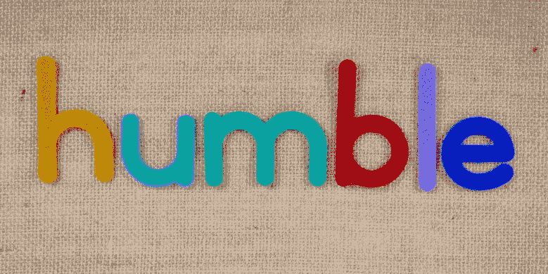

# 伟大的开发者都是谦逊的开发者

> 原文：<https://blog.devgenius.io/great-developers-are-humble-developers-b0844764388a?source=collection_archive---------5----------------------->

## 谦逊是开发人员避免犯错的方式

来自 Pexels 的玛格达·埃勒斯

> “将你的用户视为合作开发者是你快速改进代码和有效调试的最少麻烦的途径。”埃里克·雷蒙德

过于自信的开发人员不了解他们的专业技能和知识的局限性。这造成了危险的盲点，无知取代了专业知识。

谦逊的开发人员使用开发团队来突出他们错误的时候，并避免问题。

代码不关心是谁写的，但是用户关心它是否做了他们想要的。目标是提出最好的想法、设计和代码，并利用整个团队来完成。

# **自我是敌人**

> 让你陷入麻烦的不是你不知道的事。你确定的事情并不是这样的。[人名]马克·吐温(美国幽默大师、小说家、作家、演说家)

作为开发人员，你的自我推动你前进，阻碍你前进— [自我是开发人员的敌人](https://javascript.plainenglish.io/ego-is-the-enemy-for-developers-e9a74587a07f)。

当我领导一个团队时，我主要实施我自己的想法，因为要么没人愿意出主意，要么主意不好。

我反对其他观点，支持我自己的观点。后来通勤回家的时候，我会思考人们提出的想法，并加以考虑。

在讨论中，我专注于为自己的观点辩护，而不是看所提出观点的优势。

每个人都喜欢认为自己高于平均水平，我们拒绝接受其他想法/观点。它提醒我们自己很平庸。

在通勤途中或第二天

*   我不在乎这个想法是我的还是别人的。我会用最好的主意(通常不是我的)
*   当被排除在讨论之外时，我可以不带防御/攻击性地评估这些想法

我会选择最好的想法，这通常是其他人提出的想法。如果有人问你，你想错多久，你会说尽可能短的时间，但我们发现很难从我们的想法中摆脱出来。

读书是和自己讨论新想法的有力工具。这就像与专家进行讨论，在没有激烈辩论的情况下思考这些想法的优缺点。

在上下班的路上，我对自己说——如果我认为所有最好的想法都来自我，那我就是个白痴。

我让其他开发者很难

*   给我其他的观点
*   告诉我我错在哪里
*   指出我的想法/设计中的弱点

我对正确的需要(自我)阻碍了我的正确。

你不能教别人已经知道的东西。当人们相信自己是对的时，他们会停止倾听，转而告诉人们他们的想法以及其他人的想法是如何的错误。

学生和谦虚的心态是开放的新思想。专家心态不欢迎新想法，相反，他们教导。在软件开发中，这是一种危险的方法，因为技术变化很快，过去有效的技术和想法可能在未来不再有效。

# **想法没有对错**

> 我从来不允许自己对任何我没有比他们更了解对方论点的事情有看法。—查理·芒格

阅读罗杰·马丁的《T2》和《对立的头脑》改变了我对思想的看法。这本书给出了观点，即思想没有对错之分；相反，每个想法都有不同的优点和缺点。

对于一个想法是正确的，这意味着其他想法是错误的，人们可以专注于讨论为什么他们的想法是正确的，而其他想法是错误的。

如果你不再担心一个想法是对是错，而是关注它的优点和缺点，你就了解了这个想法。当你不在乎一个想法是对是错时，就很容易把想法结合起来..

[并行思维和软件开发](/parallel-thinking-and-software-development-673476957dc8)，一次创造多个想法，然后结合更好的来创造你的想法。

> 我们每时每刻都在学习、修改或摧毁想法。时机成熟时迅速摧毁你的想法是你能获得的最有价值的品质之一。你必须强迫自己考虑对方的观点。—查理·芒格

了解别人的想法有助于理解他们想法的优点和缺点。这让你对自己的想法有了不同的看法。

开发人员带来了独特的经验、技能和知识。他们的想法我永远也想不出来。如果你足够谦虚，愿意倾听和接受新的想法，这对学习很有好处。

# **我哪里错了？**

> 让你陷入麻烦的不是你不知道的事。你确定的事情并不是这样的。[人名]马克·吐温(美国幽默大师、小说家、作家、演说家)

通过在创建代码之前进行验证，我们可以避免痛苦、错误和错误的代码。聪明的开发人员和明智的开发人员的区别在于，明智的开发人员避免问题和错误，而不是在以后解决它们。

查理·芒格鼓励人们扭转局面，关注应该避免的事情，例如:我现在能做的最糟糕的事情是什么？ **我们在努力避免什么？**

如果你避免了错误和最糟糕的事情，其他任何事情都将是一种进步。

我改变了我的方法，从努力做正确的事，到努力避免犯错。我开始问人们，

*   这个想法/设计错在哪里？
*   如果这个设计会引起问题，会是什么问题呢？

当开发人员不知道或不理解他们的知识和专业技能的限制时，他们就会使自己陷入困境。过于自信的开发人员将会有目的地步入创建错误软件的陷阱。

> "无知比知识更容易带来自信。"达尔文
> 
> “成为一名真正的专家不仅需要了解世界上的事情，还需要知道自己知识和专业技能的极限。”达尔文

过分简化需求，高估开发人员的能力，导致计划过于乐观，期望过高。这是一个失败项目的秘诀。

无知是一个盲点，你看不到问题的到来。是你看不到的一拳把你击倒。

# **速度精度**

> 质量软件的乌龟打败了速度软件的兔子

许多开发人员和管理人员都不知道，创建软件的目标不是尽可能快。目标是创建合适的软件，并在将来进行维护。

开发团队创建软件的速度越快，软件的质量就越低，错误就越多。

[质量是将代码投入生产的最快方式](https://itnext.io/software-development-is-misunderstood-quality-is-fastest-way-to-get-code-into-production-f1f5a0792c69)。花时间来决定写什么代码(验证需求，避免错误)会更快。

[查尔斯·达尔文有一条思考的黄金法则](https://fs.blog/charles-darwin-thinker/)，当他遇到一个与他的想法相矛盾的想法时，他会去理解它，看看他是否同意。你越早知道有更好的想法，你就能越早改变到更好的想法。

> 许多年来，我也遵循着一条黄金法则，即每当一个发表的事实，一个新的观察或想法出现在我面前，与我的总体结果相反，我一定要立刻做一个备忘录；因为我根据经验发现，这样的事实和想法比那些有利的事情更容易从记忆中消失。由于这种习惯，很少有人对我的观点提出异议，而我至少没有注意到并试图回答这些异议。查尔斯·达尔文— [*法南大街*](https://fs.blog/charles-darwin-thinker/)

# **了解你的偏见**

> "**第一个原则是，一定不能忽悠自己，自己是最容易忽悠的人**。物理学家——理查德·费曼

我们读到的大多数东西，我们与之交谈的人们，通常分享我们的观点和意见。即使他们不这样做，我们也会解读数据来证实我们已经知道的东西。这是一个回音室，在这里你不会质疑你的想法或寻找问题。

与达尔文不同，大多数人寻找信息来证实他们的观点，而不是强调他们可能错在哪里。

霍华德·马克斯有一篇关于不确定性的精彩文章，引用如下

> 一旦我们形成了一种观点，我们就会接受证实这种观点的信息，而忽略或拒绝对这种观点产生怀疑的信息。确认偏差表明我们不能客观地感知环境。我们挑出那些让我们感觉良好的数据，因为它们证实了我们的偏见。因此，我们可能会成为我们的假设的囚犯。( [Shahram Heshmat，今日心理学，2015 年 4 月 23 日](https://www.psychologytoday.com/gb/blog/science-choice/201504/what-is-confirmation-bias))

开发人员是技术专家，但在商业和工业领域是白痴。开发人员必须拥抱用户、需求和业务专家，以便从他们那里获得信息。

开发人员根据假设猜测软件应该如何工作，这些被证明是痛苦的错误。意识到你的偏见或想法，并在你的观点中考虑到这一点。

> “有能力的程序员充分意识到他的脑壳的严格限制的大小；因此，他以完全谦逊的态度对待编程任务，除此之外，他还避免了像瘟疫一样的聪明把戏“艾德格斯格·w·迪克斯特拉— [谦逊的程序员](https://www.cs.utexas.edu/~EWD/ewd03xx/EWD340.PDF)

# **不确定的世界**

> “相反，扑克是一种不完全信息的游戏。这是一场在长期不确定条件下的决策游戏。有价值的信息仍然隐藏着。任何结果都有运气的成分。你可能在每一点都做出最好的决定，但仍然会输掉这手牌，因为你不知道会发什么样的新牌。一旦游戏结束，你试着从结果中学习

开发更像扑克而不是象棋，因为我们处理不确定性。开发人员永远不确定软件需要如何工作，需求是否正确，或者是否有任何假设就像定时炸弹一样。

决策、设计和代码可能是不正确的，特别是在敏捷项目中，功能的点滴供给会导致设计债务/技术债务。

开发团队将创建一些功能，然后下一个 sprint 发现它现在需要做一些它没有被设计去做的事情。及时/高成本地添加所需的功能意味着您必须将它添加到现有的设计中才能工作。

这就像在现有的房子上增加一个新的卧室，但是你必须穿过一个卧室才能到达。没有人会从一开始就这样设计它。这是在现有房屋上增加新卧室的经济有效的解决方案。

# **拥抱不确定性**

保持谦逊很难，但是你不太可能因为说

*   我不确定
*   我不知道
*   我可能错了

我已经学会问自己和别人我错在哪里，我还没有看到的错误在哪里。

如果没有人发现任何好的理由，如果他们提出了想法，你可以走过去看看会发生什么，如果你准备好了。从长远来看，改变想法比改变代码更痛苦。

承认很难，但是拥抱，不知道一些事情，给你时间去发现。

软件开发就像走过一片雷区。你可以自信地走过去，希望自己不会爆炸，或者你可以提前检查一下，确保自己不会爆炸。

# **结论**

怀疑自己的想法、设计和计划是保护自己不做错事的一种方式。确信无疑会带来风险，你可能会踏入一个你看不到的陷阱。

谦虚就是不要把自己的想法看做对错，而是要把想法看做有优点也有缺点。

谦逊的开发人员在编写代码之前就发现了他们的问题。自我驱动的开发人员在他们写完代码后才发现。

# 进一步阅读

*   [开发者——让卑微的蚂蚁成为你的向导](https://medium.com/codex/developers-let-the-humble-ant-be-your-guide-ab32fb5441ef)
*   如何在智力上超常发挥——查尔斯·达尔文对自己思维的思考
*   [霍华德·马克斯——不确定性](https://www.oaktreecapital.com/docs/default-source/memos/uncertainty.pdf)
*   [霍华德·马克斯——不确定性二](https://www.oaktreecapital.com/docs/default-source/memos/uncertainty-ii.pdf)
*   [需要有意见的工作](https://fs.blog/the-work-required-to-have-an-opinion/)
*   [达尔文如何思考:思考的黄金法则](https://fs.blog/charles-darwin-thinker/)
*   [什么是确认偏差](https://www.psychologytoday.com/gb/blog/science-choice/201504/what-is-confirmation-bias)