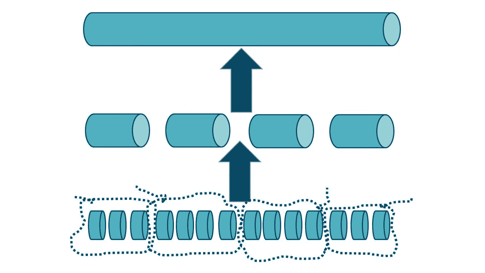
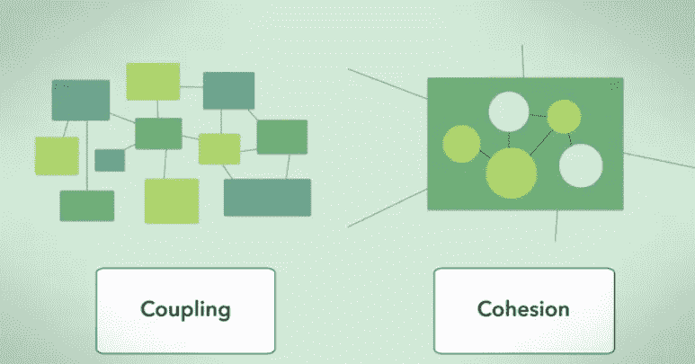
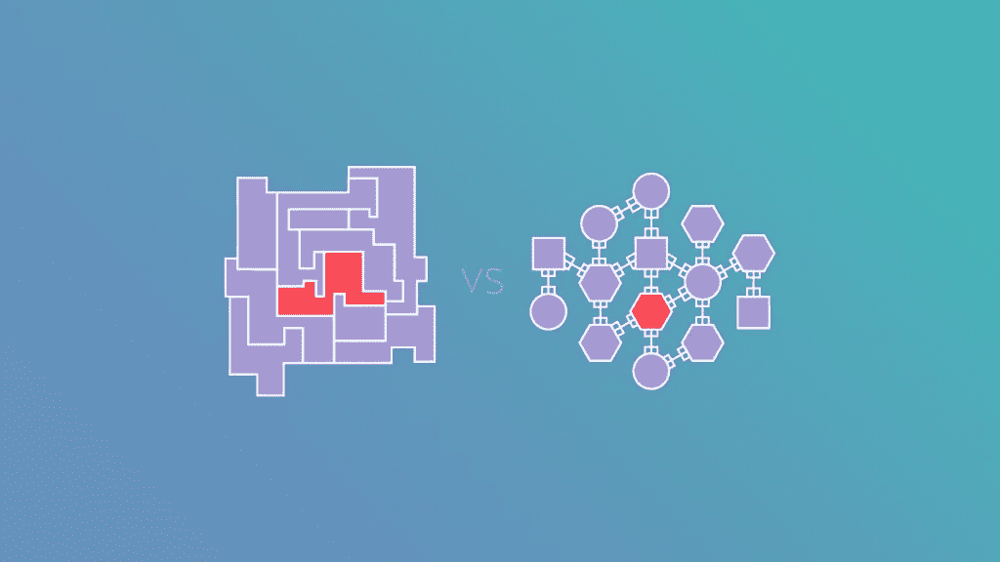
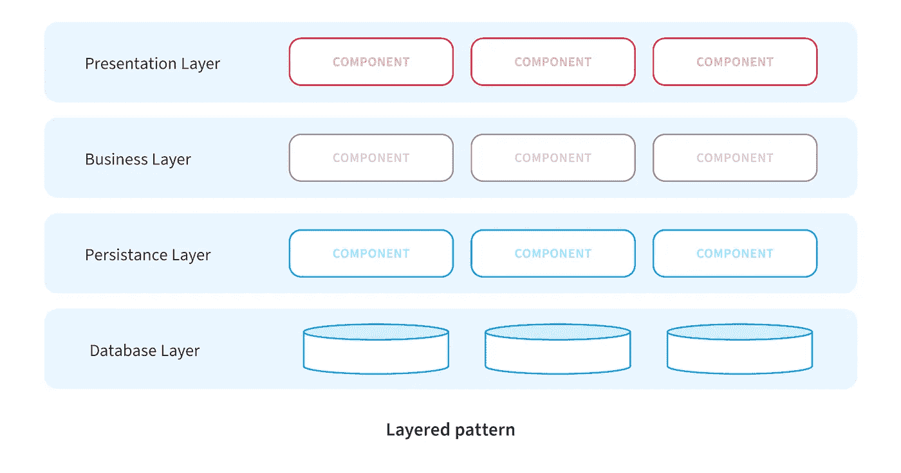
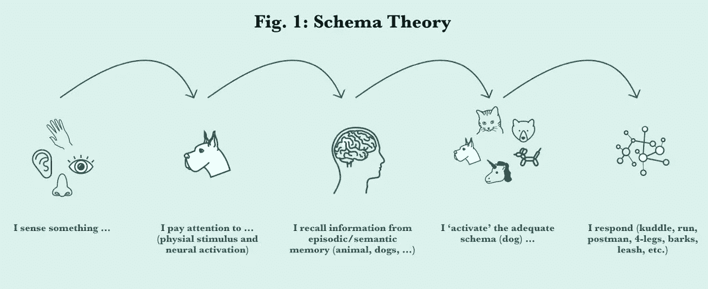
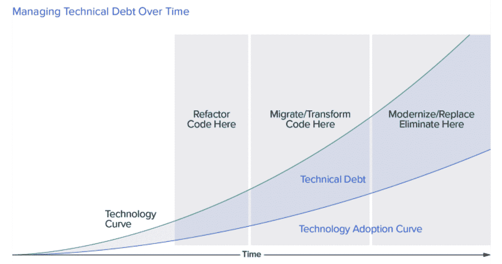

# 伟大的软件架构简单而周到

> 原文：<https://blog.devgenius.io/great-software-architecture-is-thoughtful-ccafa1d9904d?source=collection_archive---------6----------------------->

## 软件架构被最有效地认为是负责软件的人之间共享的心智模型


照片由 [Z S](https://unsplash.com/@kovacsz1?utm_source=medium&utm_medium=referral) 在 [Unsplash](https://unsplash.com?utm_source=medium&utm_medium=referral)

组织我们的思想是伟大的软件架构/设计的首要原则。软件开发和认知心理学看似无关，但都是关于信息和结构的。

> 你有没有想过大脑是如何理解我们周围的世界的？

计算机的内部工作不能完全类比大脑的信息处理，因为我们也有影响我们的动机和情绪。

然而，为了简单起见，我们可以认为大脑信息处理是输入-处理-输出模型

> 大脑接受大量的数据，提炼信息，储存信息以备后用，并建立一个外部世界的心智模型。

大脑的最终目标是创造一个心智模型。

**心智模型是一个关于事物如何运作的可靠框架。我们已经使用心智模型来认知处理我们周围的世界。**

例如，大多数时候我们可以通过一个简单的心理模型生存下来，比如当我们想开车的时候。有时我们需要一个更复杂和准确的心智模型，比如当我们想要修理或制造一辆汽车时。

我们经常在软件世界中处理更复杂的事情——软件开发人员需要快速理解软件结构，因为大脑的能力是有限的。

> *软件应用程序只不过是试图解决业务需求的复杂适应性系统。*

这就是整个想法。如果我们想要支持我们的大脑，我们需要保持我们的软件简单、清晰，并且符合信息处理的原则。

除此之外，我们还与团队合作。每个人都有不同的思维模式和思维方式。如果我们没有一致性，我们怎么能一起工作呢？

这也是为什么我们花 10%的时间写代码，90%的时间读代码。拥有干净的代码和优秀的设计非常重要。

我们可以使用我们如何组织思想的原则来设计、呈现和思考软件架构。

我们的大脑发展了三种结构构建过程

*   组块
*   等级制度
*   图式。

## 分块和模块化



组块信息

组块意味着我们的大脑不断忙于从较小的知识单元中制造较大的浓缩知识单元，即所谓的组块。

我们的短期记忆容量高达 7 到 9 块。因为我的句子通常包含七个以上的单词，所以你总是在制造更大的浓缩语块；以免丢了线。

因此，分块是一个重要的能力释放过程，但它只有在你想要分块的知识单元有一个有意义的上下文时才有效，只是任何事物彼此接近的事实并不能让我们从中获得有意义的块。

就像一只狗在一碗水果旁边的照片不能告诉我们太多。软件开发也是如此。假设您正在搜索软件中的一个 bug，并以这个名为 ProductService 的 Java 类结束

```
public class ProductService {
     ShipProduct();
     AddToInventory();
     ReceiveProduct();
     PrintDocuments();
}
```

如果你看了这个类的第一个方法，你就会意识到你可以发送产品，接收它们，并把它们添加到库存中。到目前为止，一切顺利。

但是如果我们继续读下去，我们会学到，

*“哦，在这里你也可以使用打印文档。这和彼此完全没有关系。”*

我们希望我们的软件是模块化的，结构良好，这样我们可以快速理解源代码，节省时间。

模块化是直接采用分块的架构原则。**软件是模块化的，如果它所有层次上的模块导致有意义的连接单元。**



模块化有 3 个原则:

一个真正令人兴奋的概念是**高内聚和松耦合**。高内聚我们可以认为是一个*单元，例如，一个包，包含不同的类，它们一起工作来完成一项任务。*包中的类协同工作。他们有很高的凝聚力。

他们不需要或尽可能少地需要其他包中的其他类。它们与其他包之间是松散耦合的。如果是这样的话，那么这个包就具有高内聚和松散耦合，并且它是模块化的或者具有高模块化。

计算机科学中的另一个概念叫做**关注点分离。**关注点分离基本上与高内聚说的是同一件事。它只是来自另一边。*哪些不属于一起，一起工作的应该分开？*

最后，还有 Robert Martin 的**单一责任原则**，它说*包或者类应该只有一个任务或者一个责任*。所以它的改变只有一个原因，一个单位的责任的原因。



紧密耦合与松散耦合

所有这些概念都很好地衡量了我们模块化设计的有效性。

## 层级和分层



> 开发人员需要知道什么是最大和最小级别的软件，基本上要知道组成系统的不同组件

第二个构建结构的过程是，我们的大脑试图形成层级来尽可能多地记忆。

层级降低了系统中任何给定部分必须处理的信息的级别。

例如，一个名为 inventory 的模块应该只了解产品，而不了解业务财务。

我们可以比没有顺序的网状结构更好地记住层次结构。

在软件中，我们有一个合适的架构原则，分层或分层架构。当我们分层构建我们的软件时，我们支持我们的大脑。

原则上，这都是关于分配责任的。这也加强了模块化并引入了层级结构。

每层只能访问它下面的层，而不能反方向访问。

这种类型的分层也称为技术分层，因为只有技术标准决定了哪个类属于哪个层，以及谁可以调用它。

软件开发也最好采用自顶向下的方法。

我们必须从多个层面来看待一个问题。每一种都有它的好处。软件设计或开发的不同层次如下

*   大图或者一个主题。
*   模块/系统。
*   子模块/子系统。
*   特色。
*   子功能。
*   商业规则。

从大的方面来说，它是一种商业目标。重新指向业务目标是很重要的。最终，我们所做的一切都是为了更好的商业目标。因此它将具有更高的优先级。您做出的所有决策都必须映射回业务目标

如果你想了解更多关于如何通过不同的层。我写了一篇关于拥有干净架构的文章

解释干净的建筑。网络核心(细分&示例)

## 模式理论和设计模式:



我们的大脑发展了另一种结构构建过程，即我们形成图式的能力。这是最棒的。

图式是世界某一部分的抽象概念。它帮助我们快速了解这个世界。

举例来说，如果我告诉你，我的父母都是教师，那么教师图式就会消失，你可能会想，“哦，亲爱的，那一定是一个艰难的童年，父母都是教师。”或者你可能会想，“哦，这就是他说那么多的原因。”

不管怎样，你都有联想。但是如果我告诉你，我的父亲是一把锤子，什么也不会发生，因为你没有这个术语的图式。铁锤帮是工业化之前在阿尔卑斯山的坡道上运送货物的人。

请记住这一点，在软件开发中，我们有一些完美地捕捉到这种模式原则的东西。我们有设计和架构模式，但它们只有在我们一致且有效地使用它们时才会起作用。

因此，我们用来节省维护和扩展时间的结构良好的体系结构需要模式一致性。

模式在我们的应用程序中创造了一致性，没有它，我们代码的整体质量会下降。

关于软件中不同的设计模式可以说很多。但是，每个开发人员都应该详细研究它们。

我不会深入讨论所有不同的架构/设计模式。

我推荐读《四人帮》这本书

## 外卖:

> 所有软件层次上清晰简单的代码会产生伟大的软件架构。

作为软件开发人员，我们经常想要构建最大的结构。

但是我们需要小心。我们的首要工作是让我们的应用程序对用户来说简单明了。

整体思维或系统思维是我们的出发点。在我们能建造如何建造之前，我们需要知道是什么/为什么。

否则，[偶然的复杂性](https://www.bing.com/search?q=software+accidental+complexity&qs=RI&pq=accidental+complexity+soft&sc=1-26&cvid=E383C30A274C4CECB6C432B499CB1EFD&FORM=QBRE&sp=2)会悄悄进入我们的应用程序。

> 稳定性是任何应用程序架构的一个重要方面



**换句话说，为了实现高质量的代码和良好的软件架构，我们需要限制复杂性——也就是避免**[](https://phoenixnap.com/blog/technical-debt)****。****

*常规重构是我们管理复杂性的最佳工具。*

*所以对于你的下一个项目，试着记住一个简单的规则。*

> *我们在代码设计中投入的额外的 10%将在开发周期中为我们解决 90%的问题*

*感谢您的阅读。*

## *链接:*

*[](https://www.nutshell.com/blog/accidental-complexity-software-design) [## 如何避免软件设计中的意外复杂性

### "在计算机科学中有两个难题:缓存失效、命名事物和一个接一个的错误."—莱昂…

www.nutshell.com](https://www.nutshell.com/blog/accidental-complexity-software-design) [](https://devm.io/programming/modularization-cognitive-psychology) [## 模块化与认知心理学

### 模块化经常被讨论，但是过了一段时间后，发言者意识到他们不是指同一件事…

开发 io](https://devm.io/programming/modularization-cognitive-psychology) [](https://www.simplypsychology.org/what-is-a-schema.html#:~:text=Schema%20theory%20is%20a%20branch,action%20%28Pankin%2C%202013%29.) [## 图式在心理学中的作用

### 模式是一种知识结构，它允许有机体…

www.simplypsychology.org](https://www.simplypsychology.org/what-is-a-schema.html#:~:text=Schema%20theory%20is%20a%20branch,action%20%28Pankin%2C%202013%29.) [](https://www.appnovation.com/blog/ux-schema-cards-predicting-user-behaviour-and-model-experiences) [## UX 模式卡——预测用户行为和模型体验

### 图式理论简史图式是认知心理学和认知心理学的基本概念之一

www.appnovation.com](https://www.appnovation.com/blog/ux-schema-cards-predicting-user-behaviour-and-model-experiences) [](https://nautil.us/why-is-the-human-brain-so-efficient-7216/) [## 为什么人脑的效率这么高？

### 大脑是复杂的；在人类中，它由大约 1000 亿个神经元组成，大约有 100 万亿个…

nautil.us](https://nautil.us/why-is-the-human-brain-so-efficient-7216/) [](https://www.amazon.com/Book-Why-Science-Cause-Effect/dp/046509760X) [## 为什么之书:因果的新科学

### 原因之书:关于 Amazon.com 的因果新科学。*免费*送货到…

www.amazon.com](https://www.amazon.com/Book-Why-Science-Cause-Effect/dp/046509760X)*