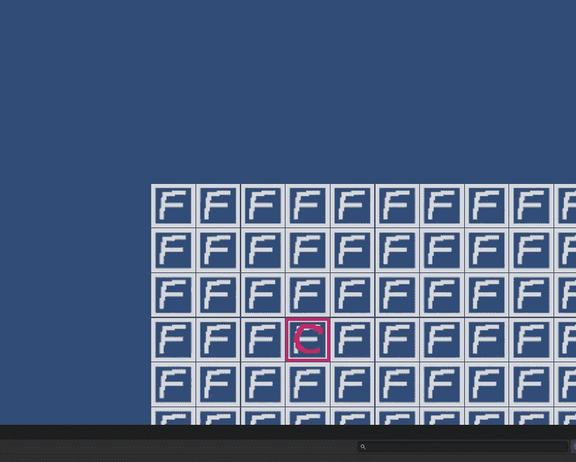
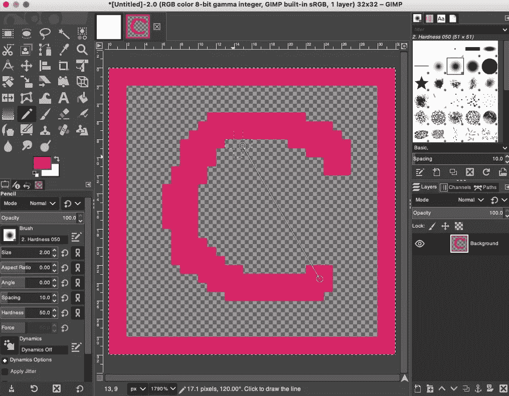
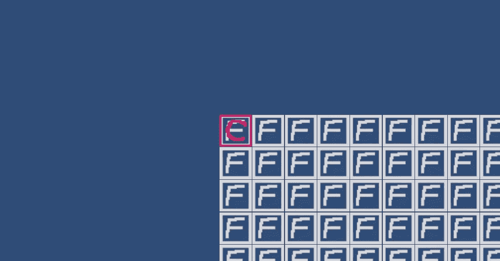

# 用 Unity 制作一个基于网格的游戏:开发日志第 2 天

> 原文：<https://blog.devgenius.io/grid-based-game-with-unity-dev-log-day-2-1b8d10baa7d9?source=collection_archive---------2----------------------->

角色移动和跟踪摄像机

# 目标

今天，我将尝试在屏幕上显示一个字符，让它夹在我第一天制作的网格上，并让它能够垂直和对角地穿过我的网格。

## 鬼怪；雪碧

我要做的第一件事是用 gimp 做一杯雪碧。同样，我将尽可能简单地开始，以保持开发的进展。

我希望我的角色在测试时容易被看到，所以我将选择一个明亮的颜色。

我们开始吧:

## 预制的

预制屋是我在第一天简要回顾的东西。

雪碧只是雪碧。它可以是 png、svg、jpeg 或任何文件，但是没有告诉计算机如何处理这个精灵。预设是游戏对象的副本，可以保存为可重复使用的对象。把这个精灵变成一个预置是很重要的，因为我们会不断地引用它，用它做一些事情，比如在按键上移动它。它还会有很多统计数据要跟踪，比如生命值和法力值。

在编程中，无论从性能角度还是从组织角度来看，尽可能地调整单个对象并让每个对象跟踪自己的属性通常都更好。

出于这些原因，我将为我们的角色创建一个游戏对象，它将包含一个变换(变换是 unity 管理游戏对象定位、比例等的方式。)

然后，我将制作一个对象的预置，这样我就可以很容易地引用它，并在将来实例化它，如果我愿意的话。然后我要做一个角色控制器来操纵我的角色对象。

关于 unity，我很快了解到游戏对象就像是这个框架的面包和黄油。游戏中的一切无论多么抽象都是游戏对象。

这种约定在很多方面都很方便，因为无论出于什么目的，都可以很容易地实例化或找到游戏对象。

## 整理操作顺序

好的，所以我把我的角色精灵制作成一个游戏对象，然后在我的资源文件夹里制作成一个预置。我使用了我在 grid_manager 中使用的相同技术来加载我的预置，然后使用它的变换在屏幕上给它一个位置。

但这是我遇到的第一个障碍。我打赌，在网格上定位我的角色的最简单的方法是将其中一个地砖标记为“start_tile ”,然后找到起始地砖，并同等地定位我的角色。

但是我的角色实例化和放置以及网格生成都是在内置的 start 方法中调用的。

这就产生了一个问题，因为我的角色放置依赖于我的网格，而我希望我的网格在我的角色被放置之前被显式地生成。

我的解决方案可能并不理想，但是通过通读一些 unity [脚本文档，我找到了一个令我满意的方法。](https://docs.unity3d.com/ScriptReference/GameObject.FindGameObjectsWithTag.html)

我的解决方案是创建一个 master_manager，它的行为类似于操作系统内核的行为。这是一个主游戏对象，它将调用其他脚本中的方法，从而可以管理游戏的生成流程。

以类似的方式，我有一个游戏对象，它是任何给定进程的管理器，所以网格有一个管理脚本，角色有一个管理脚本，等等。

这是我的 master_manager 内部的样子:

我选择将这个生成过程放在内置的唤醒功能中，因为 unity 文档告诉我在游戏的第一帧之前唤醒，这似乎是加载初始状态的合适位置。

我绝对相信，我会找到一个更优雅的方式来实现这一点，但现在，他的方法是通用和有效的，并有能力解决我在开发中可能遇到的许多未来问题。

## 将角色放到网格上

我用 character_manager 脚本做了一个角色控制器。它加载了一个直接的孩子，这个孩子就是角色预设。使用这个管理器，我可以实例化它，移动它，或者以编程方式做任何我想做的事情。

起初，我假设我可以使用 vector3 并使用 z 值来控制绘画顺序，但出于某种原因，unity 的默认行为是使用一个名为“层”的独立属性

正如我前面所讨论的，我已经让这个脚本在我的网格生成之后明确地触发，所以它所做的就是找到 start_tile 并把角色预置放在它上面:

我想指出的是，这一切花了大约 3 个小时。考虑到我以前几乎没有使用过 unity，我必须查找每个小进程并在找到它后测试语法。有时候你在老论坛上找到语法，却发现语法已经贬值了，或者因为其他原因不起作用了。

最终，我得到了这个:

这正是我想要的。

## 为什么我对所有的脚本都这样做？

Unity 给了用户很多无需编程就能创建场景的能力，但我选择这样做是因为我知道将来我希望能够通过编程快速生成地图。至少，我应该能够制作一个标记矩阵，并把它放入一个级别的目录中，这样我的脚本就可以从一个大的级别列表中读取，并通过使用一组瓷砖资产来加载它们。

此外，我的游戏将有很多随机化。(随机战利品，随机出发地点等。为了实现这一点，我需要一种编程的方式来定义事物。

我有这个设置的方式，很容易改变我的 start_tile 为我想要的。将来，我将能够以编程方式随机生成网格和 start_positions。例如，这是当我将 start_tile 更改为第 3 行第 3 列时发生的情况:

## 让摄像机固定在角色上，让角色在按键时移动。

对于这个过程，我将主相机命名为“main_camera”Unity 假设我们希望默认初始化一个摄像机，所以它会自动初始化。我所要做的就是给它起一个令人难忘的名字，并在我的角色管理器脚本中找到它。然后，把它的 x，y 位置设置成和我的角色相当。

我的角色移动也很简单。

默认情况下，unity 将游戏一帧一帧地绘制到屏幕上，并有一个名为 Update 的循环方法，可以等待玩家的输入。

我所要做的就是输入一些逻辑来寻找按键，如果按键是我想要的，就输入一些逻辑。在这种情况下，我们改变了角色的位置，改变量相当于平铺的大小。

通过将角色和摄像机实例放入我的角色管理器中的一个实例变量，我可以节省一些代码。然后我做了一个更新摄像头位置的方法。

之后，我做了一个可怕的 if…else block 和 switch 语句来处理输入，因为出于某种原因，unity 似乎没有一个优雅的解决方案来检测玩家按下的任何键。它似乎更喜欢将按键与您想要检测的按键相匹配。我相信以后我会找到一个更好的方法来做这件事，但是现在，它是有效的。

因为我希望我的角色能够正交和对角移动，所以我跟踪数字小键盘上的每个数字，并相应地移动角色。运动之后，我回忆起我的 place_camera 方法。

结果如下:

当然也没有什么撞墙什么的。那将留到下一天。

[https://www.patreon.com/taylorcoon](https://www.patreon.com/taylorcoon)