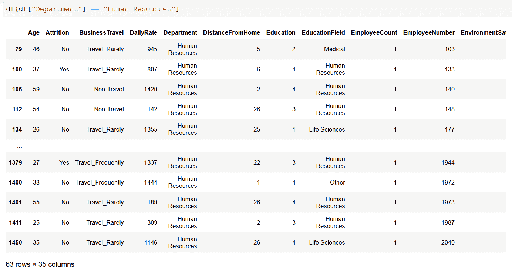
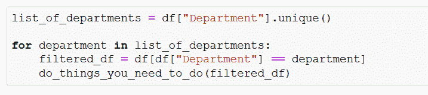
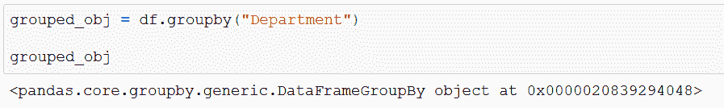
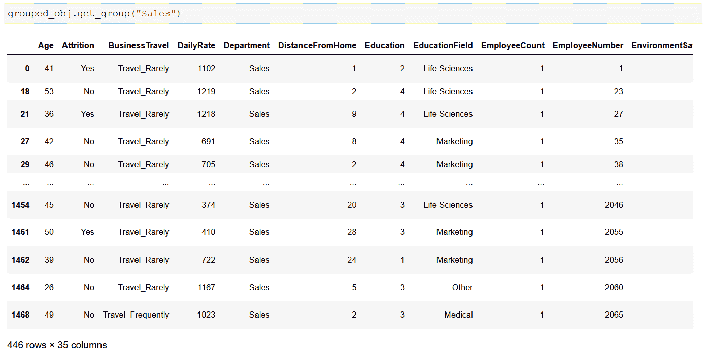
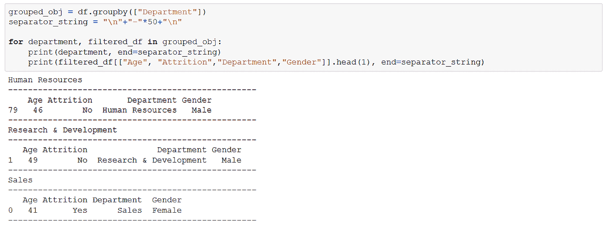
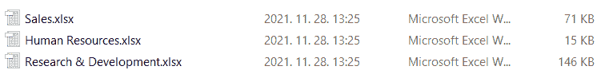
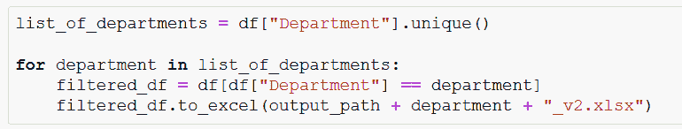
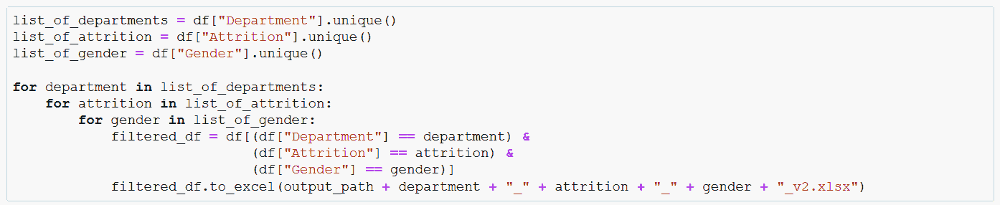
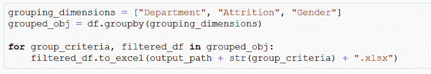
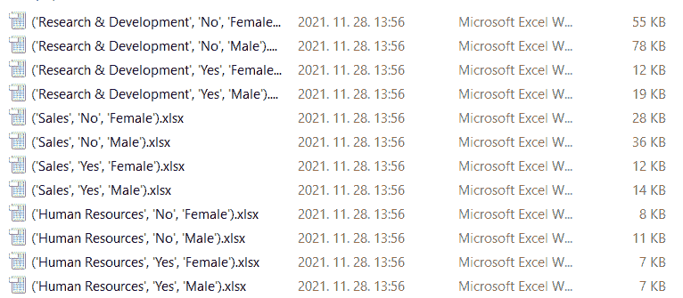

# 如何使用 Pandas 对数据进行分组和拆分— groupby，get_group

> 原文：<https://blog.devgenius.io/grouping-and-splitting-data-with-pandas-8da532bcfea0?source=collection_archive---------1----------------------->

## 熊猫数据分组和拆分指南。

照片由 [geralt](https://pixabay.com/users/geralt-9301/) 从 [pixabay](https://pixabay.com/) 拍摄

给定一个要处理的大型数据集，根据一个或多个维度，用一种精确有效的方法将它分割成更小的部分可能是一个真正的挑战。例如，在 Excel 中过滤和复制数据可能是一件痛苦的事情:做起来很乏味，更不用说考虑到人为因素还很容易出错。幸运的是，(鉴于我的帖子背后的主题，这并不令人惊讶)Pandas 再次覆盖了我们，为这项工作提供了强大的工具。

对于本文，我将使用来自 Kaggle 的 [IBM HR Analytics 员工流失&性能数据集。](https://www.kaggle.com/pavansubhasht/ibm-hr-analytics-attrition-dataset?select=WA_Fn-UseC_-HR-Employee-Attrition.csv)

让我们假设 IBM 的流失数据已经引起了人们的注意，他们可以要求您提供他们想要的数据，并且根据您之前对该主题的快速而准确的总结，他们希望您的数字背后有原始数据。

 [## 熊猫快速报告:快速探索，交叉表

### 使用熊猫进行快速探索、低调报道和分析的指南。

python .平原英语. io](https://python.plainenglish.io/pandas-rapid-reporting-quick-exploration-crosstab-b6511400c48e) 

然而，他们宁愿不要所有的原始数据，这太多了，他们只想要人力资源的数据(不用担心，在给你所有拆分的额外工作后，他们无论如何都会要求整个数据集，只是为了符合管理标准)。

当然，过滤特定部门的数据框架没什么大不了的:

作者截图

您可以将该视图分配给一个新变量，从而在内存中创建一个新的数据帧，稍后，只需将其导出为您选择的格式和文件扩展名，并将其发送给请求者。

但是，如果需要对数据中的所有部门都进行这种操作，这种方法不一定是最有帮助的。首先，您需要有准确的部门列表(例如使用 Series.unique()方法)，然后遍历该列表，过滤数据，然后做您需要做的事情:

作者截图

看起来很简单对吗？的确是这样，但幸运的是，我们可以做得更好！

> 如果你想让我保持咖啡因创造更多这样的内容，请考虑支持我，只要一杯咖啡。

## DataFrame.groupby()

可以在 DataFrame 上调用 *groupby()* 方法，并创建几乎与上述完全相同的输出:它根据给定的列将 DataFrame 分割成更小的 data frame。

*(现在，这是一个巨大的泛化:如果你阅读(请做)这种方法的* [*文档*](https://pandas.pydata.org/docs/reference/api/pandas.DataFrame.groupby.html) *，就会明白为什么这是一个有非常多用途的工具。在这篇文章中，我将关注这个特殊的用例。)*

这是使用这种方法的基本语法的样子

作者截图

我们返回的是一个 *DataFrameGroupBy* 对象:它包含沿着 Department 列拆分的数据帧，加上在 Department 中找到的实际值，基于这些值进行分组。

要访问其中一个组，我们需要 *get_group* 方法，在 *DataFrameGroupBy* 对象上调用，并使用 GroupBy()已经完成拆分的值之一调用，例如“Sales”:

作者截图

您可能会说，就访问分组数据的过程而言，这并没有什么改进，您是对的。幸运的是，这个 *DataFrameGroupBy* 对象可以被迭代，不仅可以访问被拆分的数据帧，还可以访问发生拆分的列值:

作者截图

这是一个愚蠢的例子，当然，只是为了看看幕后的数据—如果我们回到最初的任务，分割数据并根据部门进行分配，我们可以这样做:

作者截图

结果是:

作者截图

保存 Excel 文件时，以部门名称作为文件名，仅保存部门特定的数据。

我喜欢高效地编写和维护代码，所以我不得不暂时唱反调，说一说你们中的许多人可能仍然会想的话:好吧，这一切都很好，但我们可以用最初的“获得唯一部门并循环通过数组同时直接过滤”方法来做这件事。类似下面的内容:

作者截图

同样，这是在做几乎相同的事情，输出相同。然而，我仍然提倡使用 group by()——那么，这是怎么回事呢？

考虑到效率，假设这种情况(而不是涉众要求整个数据集)，您需要将数据分割成更多的维度。

根据新的要求，您需要将数据按照维度进行拆分:**部门**、**性别、**和**减员**。

当我们增加维数时，最初的方法——直接过滤——很快就失控了。

作者截图

当然，这段代码做得很好——但是扩展得相当快，更不用说当需要根据分割标准进一步扩展/缩减时，丢失某些东西的风险增加了。当然，我们可以尝试找到聪明的方法将三维列表放入一个 iterable 中，并在其中循环，等等，但是为什么要这么麻烦呢？我们不应该重新发明轮子——使用 *DataFrameGroupBy* 对象:

作者截图

在这样一个帖子里，我不得不有偏见，但这只是简单得多，漂亮得多。

实际情况是，我创建了一个新变量:一个存储分组维度的列表——如果您想与多个列一起分组，值必须以字符串(列名)的列表形式给出——单独保存它并在以后引用它是我更喜欢做的事情。然后使用新的维度调用 groupby()方法，就是这样:该方法创建了 12 个数据帧和 12 个元组(包含拆分标准，例如，“('研发'，'是'，'女性')”。遍历 *DataFrameGroupBy* 对象，并将数据保存到 XLSX 文件中，并使用应用的标准名称。(注意“group_criteria”变量上的字符串类型转换—您只能将字符串与字符串连接起来，因此我必须转换元组)。

作者截图

当然，用元组命名文件并不是最性感的命名约定，但是如果需要额外的爱和关注，您可以很容易地美化它。

要点是:不管有多少拆分维度进出，使用这个解决方案，您唯一的任务就是维护您希望处理的列的列表。一旦完成，groupby()将为您完成繁重的工作，无需繁琐的代码修改——这正是我认为您应该使用它的原因。

groupby()是一个强大的工具，上面的演示只关注数据的拆分。再一次，请访问[文档](https://pandas.pydata.org/docs/reference/api/pandas.DataFrame.groupby.html)，了解更多关于它如何让你的编码生活变得更加简单和高效。