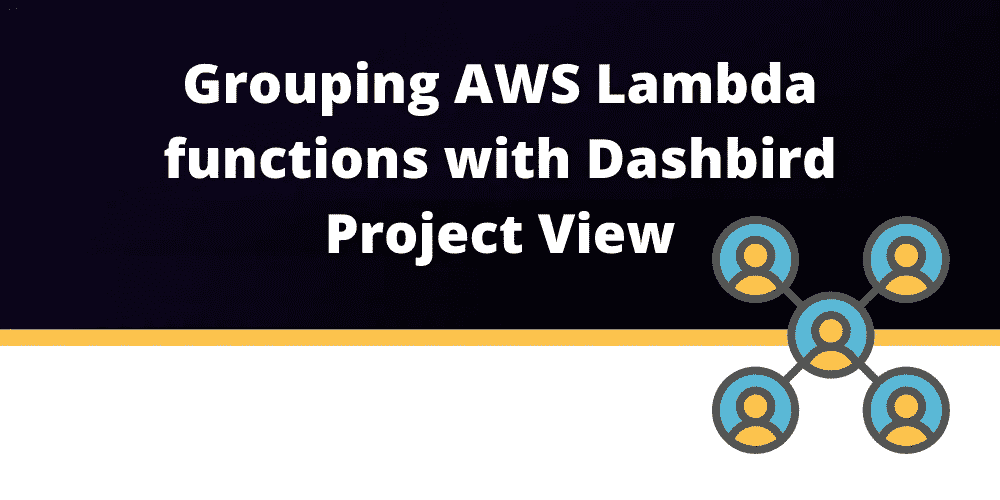

# 使用 Dashbird 项目视图对 AWS Lambda 函数进行分组

> 原文：<https://blog.devgenius.io/grouping-aws-lambda-functions-with-dashbird-project-view-cb5bfdab2722?source=collection_archive---------10----------------------->

无服务器的最佳实践之一是**单一用途功能**。你应该保持你的 [Lambda 函数](https://dashbird.io/knowledge-base/aws-lambda/anatomy-of-a-lambda-function/)很小，并且解决**恰好一个用例**。这样，你可以更好地优化它们，并控制潜在的安全问题。但是创建许多小函数会很快让人不知所措。即使是小项目也可能有超过 20 个 Lambda 函数。

如果你的无服务器系统随着时间变得越来越大，解决越来越多的用例，你**倾向于拥有多个使用多个 Lambda 函数的子系统**。这使得在[监控](https://dashbird.io/blog/innovating-serverless-monitoring/)方面很难保持领先。你想知道你的整个系统在做什么，但是你也想了解你的子系统。您不希望一个子系统的监控数据与其他子系统的监控数据混淆。

作为这个问题的解决方案，Dashbird 提供了**项目视图**。

**项目视图是一种自由分组 Lambda 函数的方式，可以为这个组获得一个度量仪表板。**

您可以完全自由地**分配哪个 Lambda 函数将被一个项目视图**跟踪。这允许你按子系统分组，也允许你按目的分组。例如，您可以为所有与第三方 API 集成的 Lambda 函数创建一个项目视图，以**监控跨项目外部集成的稳定性和性能**。

# 将 Lambda 函数分组

如果你查看 Dashbird 应用程序菜单，你会在 Dashbird 控制台的侧边栏中找到**项目视图**。

当导航到项目视图时，您可以创建称为项目的 Lambda 函数组。

出于演示的目的，我部署了两个 CDK 示例项目。它们中的每一个都至少有一个 Lambda 函数。既然这些项目互不相干，那么**把它们拆分成两个项目**是个不错的主意。你可以在下面的例子中看到如何创建一个新项目，以及如何添加 Lambda 函数。

该项目需要一个唯一的标题，不得包含特殊字符或空白字符。我选择了 API Lambda CRUD 示例的五个 Lambda 函数，并将其添加到被跟踪的 Lambda 列表中。

接下来，我为我的第二个部署创建一个项目，Cognito Protected API。下一个例子展示了我如何选择配置它。

创建后，我在项目视图列表中有两个项目，如下例所示。这些可以选择，甚至直接链接。通过这种方式，可以为这些 Lambda 函数中的每一个过滤仪表板。

# 摘要

Dashbird 的项目视图是一种分割 Lambda 函数质量的简单方法。按项目分组，或者以对你的业务有意义的任何其他方式分组。

这样，您可以在应用程序的不同部分保持最新，而不会因为一次查看所有内容而不知所措。

你可以免费用 [Dashbird 自己试试](https://dashbird.io/features/):

*   没有代码更改
*   不需要信用卡
*   简单的两分钟设置
*   获得所有高级功能
*   **立即开始处理您的数据并排除故障**

延伸阅读:

[基于日志的 AWS Lambda 监控](https://dashbird.io/blog/log-based-monitoring-for-aws-lambda/)

[登录 AWS Lambda 的最佳实践](https://dashbird.io/blog/best-practice-for-logging-lambdas/)

[为什么 AWS 控制台不是无服务器调试的最佳选择？](https://dashbird.io/blog/aws-console-serverless-debugging/)