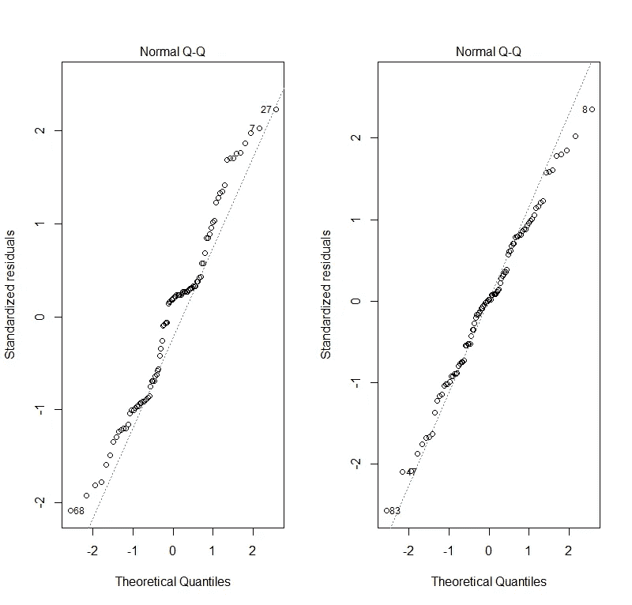
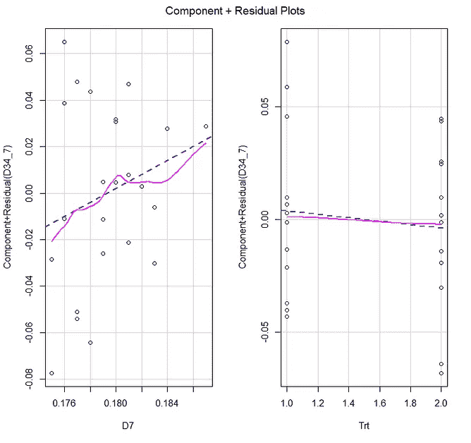
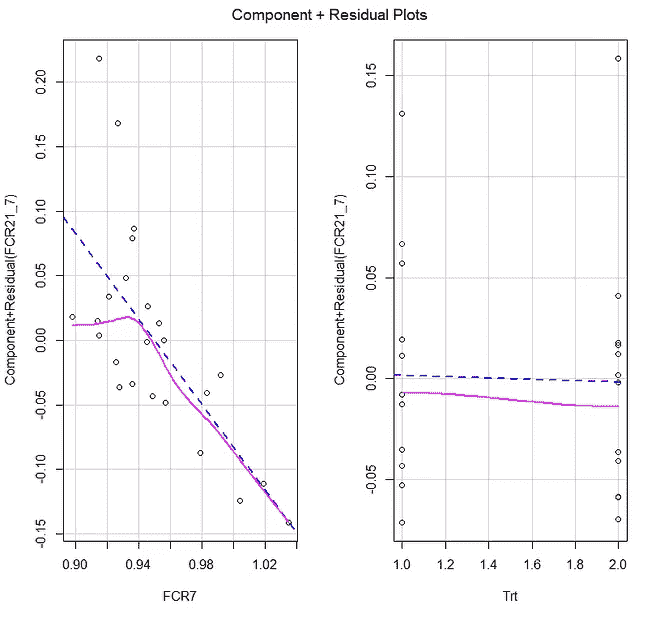

# 小猪的生长模型

> 原文：<https://blog.devgenius.io/growth-modeling-in-piglets-534766dcad1f?source=collection_archive---------13----------------------->

## 在 R 中使用混合模型

这是我多年前在一个商业数据集上做的一个项目的帖子。因为它是商业的，我不能与你分享，但我可以展示我如何处理这个小猪试验模型的请求。

从我的许多帖子中，你已经可以看出我将使用统计模型对这个数据集进行建模，最好是[混合模型](https://medium.com/mlearning-ai/introduction-to-mixed-models-in-r-9c017fd83a63)，因为它允许我对固定和随机效应进行建模，后者可以通过方差-协方差矩阵进行最佳处理。

让我们开始吧，我将带您了解整个过程。

```
rm(list = ls())#### LIBRARIES ####
library(lme4)
library(ggplot2)
library(rms)
library(plyr)
library(reshape2)
library(boot)
library(sjPlot)
library(sjstats)
library(sjmisc)
library(interval)
library(AICcmodavg)
require(parallel)  
library(gridExtra)
library(coefplot) 
library(coda)      
library(aods3)     
library(plotMCMC) 
library(bbmle)     
library(nlme)
library(merTools)
library(RLRsim) 
library(pbkrtest)
library(multcomp)
library(lsmeans)
library(multcompView)
library(lattice)
library(splines)
library(lmtest)
library(car)
library(corrplot)
library(PerformanceAnalytics)
library(eqs2lavaan)
library(mgcv)
library(gamm4)
library(robustlmm)
library(influence.ME)
library(readxl)
library(sfsmisc)#### DATA IMPORT & MANAGEMENT ####
Marc <- read_excel("")
colnames(Marc)[2]<-"Trt"
colnames(Marc)[3]<-"Number"
colnames(Marc)[4]<-"D7"
colnames(Marc)[5]<-"D21"
colnames(Marc)[6]<-"D34"
colnames(Marc)[7]<-"D42"
colnames(Marc)[8]<-"FCR7"
colnames(Marc)[9]<-"FCR21"
colnames(Marc)[10]<-"FCR34"
colnames(Marc)[11]<-"FCR42"
GUISSONA<-Marc
Marc
GUISSONA<-as.data.frame(GUISSONA)
GUISSONA<- reshape(GUISSONA,
                    varying  = list(c("D7", "D21", "D34", "D42"),c("FCR7","FCR21","FCR34","FCR42")),
                    v.names = c("Weight","FCR"),
                    timevar = "Time",
                    times = as.numeric(c("7", "21", "34", "42")),
                    direction = "long")
GUISSONA$id<-NULL
GUISSONA<-GUISSONA[order(GUISSONA$Pen),]
row.names(GUISSONA)<-NULL
GUISSONA<-GUISSONA[!is.na(GUISSONA$Weight)|!is.na(GUISSONA$FCR),]
dim(GUISSONA)
GUISSONA$Trt<-as.factor(GUISSONA$Trt)
GUISSONA<-as.data.frame(GUISSONA)
class(GUISSONA)
GUISSONA$Time_center<-scale(GUISSONA$Time, center=TRUE, scale=FALSE)
GUISSONA$Time_fact<-as.factor(GUISSONA$Time)
head(GUISSONA)
```


分层数据—纵向。

```
theme_set(theme_bw())
myx<-scale_x_continuous(breaks=c(7,21,34,42))
myy<-scale_y_continuous(breaks = seq(0, 3, by = 0.25))
ggplot(GUISSONA, aes(x=Time, y=Weight, colour=Trt, shape=Trt))+
  myx+
  myy+
  stat_summary(fun.y=mean, geom="point", lwd=2)+
  stat_summary(fun.y=mean, geom="line", lwd=1)myy<-scale_y_continuous(breaks = seq(0, 3, by = 0.25))
ggplot(GUISSONA, aes(x=as.factor(GUISSONA$Time), y=Weight, colour=Trt)) +
  geom_boxplot() +
  theme_bw() +
  myy+
  labs(title = "BW over time", y="BW", x="Time")
```


哇，在这个数据集中寻找治疗差异将是一个相当大的挑战。有时候，建模在你开始之前就已经完成了。

```
sjp.poly(GUISSONA$Weight,GUISSONA$Time, 1)
sjp.poly(GUISSONA$Weight,GUISSONA$Time, 2) 
sjp.poly(GUISSONA$Weight,GUISSONA$Time, 3)
sjp.poly(GUISSONA$Weight,GUISSONA$Time, 4)
```


老实说，线性拟合看起来足够了。

```
xyplot(GUISSONA$Weight~GUISSONA$Time|GUISSONA$Trt,
       panel = function(x, y, ...) {
         panel.grid()
         panel.xyplot(x, y)
         panel.lmline(x, y, lty = 2, col="black")
         panel.loess(x, y, lty = 2, col="red")
         panel.abline(0, 0)
       } )
```


治疗方法看起来非常相似。

```
xyplot(GUISSONA$Weight~GUISSONA$Time|GUISSONA$Pen,
       panel = function(x, y, ...) {
         panel.grid()
         panel.xyplot(x, y)
         panel.lmline(x, y, lty = 2, col="black")
         panel.abline(0, 0)
       } )
```


所有的笔似乎都有相同的反应。也许测量日应该有不同的位置？

```
bwplot(GUISSONA$Weight~GUISSONA$Trt)
bwplot(GUISSONA$Weight~as.factor(GUISSONA$Pen)) 
bwplot(GUISSONA$Time~GUISSONA$Weight)
bwplot(GUISSONA$Weight~as.factor(GUISSONA$Time)) 
bwplot(GUISSONA$FCR~as.factor(GUISSONA$Trt)|GUISSONA$Time_fact)
```


随着时间的推移和重量的增加，差异也会增加。一个普通的故事。

```
qqp(GUISSONA$Weight)densityplot(~GUISSONA$Weight|GUISSONA$Time,scales=list(relation="free"))scatterplotMatrix(~ Time + Weight + Trt,
                  span=0.7, id.n=0, data=GUISSONA)
```


重量看起来正常，时间肯定有一些峰值，需要使用数据中包含的变量来处理。除了已经知道的，其余的并没有显示出令人印象深刻的相关性

```
theme_set(theme_bw())
myx<-scale_x_continuous(breaks=c(7,21,34,42))
myy<-scale_y_continuous(breaks = seq(0, 3, by = 0.25))
ggplot(GUISSONA, aes(x=Time, y=FCR, colour=Trt, shape=Trt))+
  myx+
  myy+
  stat_summary(fun.data=mean_se, geom="pointrange", lwd=0.75)+
  stat_summary(fun.y=mean, geom="line")myy<-scale_y_continuous(breaks = seq(0, 3, by = 0.25))
ggplot(GUISSONA, aes(x=as.factor(GUISSONA$Time), y=FCR, colour=Trt)) +
  geom_boxplot() +
  theme_bw() +
  myy+
  labs(title = "FCR over time", y="BW", x="Time")
```


FRC 在不同的治疗中表现更好。

```
histogram(~GUISSONA$FCR|GUISSONA$Trt, breaks=10)
histogram(~GUISSONA$FCR|GUISSONA$Time, breaks=10)
```


不是很有帮助的情节。

```
xyplot(GUISSONA$FCR~GUISSONA$Time|GUISSONA$Trt,
       panel = function(x, y, ...) {
         panel.grid()
         panel.xyplot(x, y)
         panel.lmline(x, y, lty = 2, col="black")
         panel.loess(x, y, lty = 2, col="red")
         panel.abline(0, 0)
       } )xyplot(GUISSONA$FCR~GUISSONA$Pen|GUISSONA$Trt, # no relationship between pen & FCR
       panel = function(x, y, ...) {
         panel.grid()
         panel.xyplot(x, y)
         panel.lmline(x, y, lty = 2, col="black")
         panel.loess(x, y, lty = 2, col="red")
         panel.abline(0, 0)
       } )xyplot(GUISSONA$FCR~GUISSONA$Number|GUISSONA$Trt, # no relationship between FCR and number of chicks in a pen
       panel = function(x, y, ...) {
         panel.grid()
         panel.xyplot(x, y)
         panel.lmline(x, y, lty = 2, col="black")
         panel.loess(x, y, lty = 2, col="red")
         panel.abline(0, 0)
       } )
```


将很难发现治疗差异，或包括方差成分。

```
qqp(GUISSONA$FCR)
densityplot(~GUISSONA$FCR|GUISSONA$Time, scales=list(relation="free"))
bwplot(GUISSONA$FCR~as.factor(GUISSONA$Time)) # equal variance
bwplot(GUISSONA$FCR~as.factor(GUISSONA$Trt)|GUISSONA$Time_fact) # equal variance over time, not big differences
```


```
fitlm<-lm(Weight~ns(Time,2)*Trt, data=GUISSONA)
boxcox(fitlm,lambda=seq(-2,2,by=0.1),plotit=T)
bc1<-boxcox(fitlm,lambda=seq(-2,2,by=0.1),plotit=T)
which.max(bc1$y)
LV<-bc1[1]$x[as.numeric(which.max(bc1$y))]
LV
```


Box-Cox 变换暗示了对数变换。

```
densityplot(~(GUISSONA$Weight^LV-1/LV)|GUISSONA$Time, scales=list(relation="free"))
```


看起来很好，但不能全部正常化。对于右下角的时间空间，转换并没有消除添加预测值的需要。或者使用一种[混合](/mixture-component-zero-inflated-and-hurdle-models-44c5e6fe5d7f)型号。

```
fitbc<-lm((Weight^LV-1/LV)~ns(Time,2)*Trt, data=GUISSONA)
par(mfrow=c(1,2))
plot(fitlm, which=2)
plot(fitbc, which=2) # not much of an improvement, but improved
```



毫无疑问，Box-Cox 变换确实有所帮助。

```
summary(fitbc)
```


这就是使用 Box-Cox 回归模型的样子。治疗对体重没有任何作用，但我们已经从图表中知道了这一点。老实说，这个模型甚至没有必要。

```
summary(fitlm)fit.0<-lmer(Weight~1+
            (1|Pen),
          data=GUISSONA)
summary(fit.0) fit<-lmer(Weight~Time_center*Trt+
            (Time_center|Pen),
          data=GUISSONA) # almost no variance in slope 
summary(fit)
plot(fit)
Anova(fit, type=3, test.static="F")
```


混动车型表现出奇的差。


还是那句话，治疗不增加任何东西。

```
fit2<-lmer(Weight~Time_center*Trt+
            (1|Pen),
          data=GUISSONA)
anova(fit2, fit) # no random slope needed
Anova(fit2, type=3, test.statistic="F")
```


我也是。

```
fit3<-lmer(Weight~Time_center+Trt+
             (1|Pen),
           data=GUISSONA) 
summary(fit3)
anova(fit3, fit2, fit) 
```


我也是。没有一种新型号是真正的改进。它只是在一个可以很好地模拟数据的模型中添加预测因子，但在没有治疗差异的情况下不会产生治疗差异。

```
qqp(resid(fit3))
qqp(resid(fit2))
```


两个模型的残差几乎没有区别。

```
xyplot(Weight ~ Time_center|Pen, data = GUISSONA, 
       strip = FALSE, aspect = "xy", pch = 16, cex=0.5, grid = TRUE,
       panel = function(x, y, ..., subscripts) {
         panel.xyplot(x, y, ...)
         ypred <- fitted(fit)[subscripts]
         panel.lines(x, ypred, col = "black")
         ypred2 <- fitted(fit2)[subscripts]
         panel.lines(x, ypred2, col = "blue")
         ypred3 <- fitted(fit3)[subscripts]
         panel.lines(x, ypred3, col = "red")
        },
       xlab = "Time (centered)", ylab = "BW (kg)")
```


可以使用线性回归对数据进行建模

```
influence.weight<-influence(fit3, "Pen")
plot(influence.weight, 
     which="cook", 
     cutoff=4/length(unique(GUISSONA$Pen))) # No influential pens
```


没有影响力的小猪。

```
t.test(GUISSONA$Weight[GUISSONA$Time==7&GUISSONA$Trt=="1"], 
       GUISSONA$Weight[GUISSONA$Time==7&GUISSONA$Trt=="2"])
t.test(GUISSONA$Weight[GUISSONA$Time==21&GUISSONA$Trt=="1"], 
       GUISSONA$Weight[GUISSONA$Time==21&GUISSONA$Trt=="2"])
t.test(GUISSONA$Weight[GUISSONA$Time==34&GUISSONA$Trt=="1"], 
       GUISSONA$Weight[GUISSONA$Time==34&GUISSONA$Trt=="2"])
t.test(GUISSONA$Weight[GUISSONA$Time==42&GUISSONA$Trt=="1"], 
       GUISSONA$Weight[GUISSONA$Time==42&GUISSONA$Trt=="2"])
```


没有显著的 t 检验。顺便说一下，像这样在嵌套数据集上进行 t-test 是一个大禁忌。我只是想看看我是否能找到任何差异，并测试过程本身，但当然完全是胡说八道。

```
wilcox.test(GUISSONA$Weight[GUISSONA$Time==7&GUISSONA$Trt=="1"], 
            GUISSONA$Weight[GUISSONA$Time==7&GUISSONA$Trt=="2"], conf.int=TRUE)wilcox.test(GUISSONA$Weight[GUISSONA$Time==21&GUISSONA$Trt=="1"],           GUISSONA$Weight[GUISSONA$Time==21&GUISSONA$Trt=="2"],conf.int=TRUE) wilcox.test(GUISSONA$Weight[GUISSONA$Time==34&GUISSONA$Trt=="1"],            GUISSONA$Weight[GUISSONA$Time==34&GUISSONA$Trt=="2"],conf.int=TRUE) wilcox.test(GUISSONA$Weight[GUISSONA$Time==42&GUISSONA$Trt=="1"],            GUISSONA$Weight[GUISSONA$Time==42&GUISSONA$Trt=="2"],conf.int=TRUE)
```


T 检验的非参数版本。往往非常不必要，甚至听起来相当不可行。

让我们做一个基线变化分析。我知道，可能是一个失败的原因，但无论如何让我们多做一点。

```
Marc$D21_7<-Marc$D21-Marc$D7
Marc$D34_7<-Marc$D34-Marc$D7
Marc$D42_7<-Marc$D42-Marc$D7
# Day 21 - Day 7 
fit_D21_D7<-lm(D21_7~D7*Trt, weights = Number, data=Marc)
summary(fit_D21_D7)
par(mfrow = c(3, 2))
plot(fit_D21_D7)
influencePlot(fit_D21_D7)
avPlots(lm(D21_7~D7*Trt, data=Marc))
crPlots(lm(D21_7~D7+Trt, data=Marc))
```


一个试图用第 7 天治疗预测第 21 天的模型。


残差看起来不错，一个大的 x 级异常值。


现在，这是一个附加变量图或部分回归图。它显示了一个变量保持所有其他变量不变的影响。这显示了当试图预测 D21_7 时治疗*D7 之间的关系。


component_residual 图是部分残差图。就像附加变量图是分量残差图一样，这是一种显示两个变量之间关系的方法，同时保持其余变量不变。残差好看！

```
# Day 34 - Day 7 
fit_D34_D7<-lm(D34_7~D7*Trt, weights = Number, data=Marc)
summary(fit_D34_D7)
plot(fit_D34_D7)
influencePlot(fit_D34_D7)
avPlots(lm(D34_7~D7*Trt, data=Marc))
crPlots(lm(D34_7~D7+Trt, data=Marc))
```



```
# Day 42 - Day 7 
fit_D42_D7<-lm(D42_7~D7*Trt,weights = Number, data=Marc)
summary(fit_D42_D7)
plot(fit_D42_D7)
influencePlot(fit_D42_D7)
avPlots(lm(D42_7~D7*Trt, data=Marc))
crPlots(lm(D42_7~D7+Trt, data=Marc))
```


好的，所以我们从基线分析做了一个改变，这似乎暗示了治疗的差异(强调暗示)。让我们回到 box-cox 变换，并尝试找到一种方法来复制我们在上面看到的。

```
par(mfrow=c(2,1))
fitlm<-lm(FCR~ns(Time_center,2)*Trt, data=GUISSONA)
boxcox(fitlm,lambda=seq(-2,2,by=0.1),plotit=T)
bc1<-boxcox(fitlm,lambda=seq(-2,2,by=0.1),plotit=T)
which.max(bc1$y)
LV<-bc1[1]$x[as.numeric(which.max(bc1$y))];LV
fitbc<-lm((FCR^LV-1/LV)~ns(Time,2)*Trt, data=GUISSONA)
fitlog<-lm(log(FCR)~ns(Time,2)*Trt, data=GUISSONA)
par(mfrow=c(1,3))
plot(fitlm, which=2)
plot(fitbc, which=2) 
plot(fitlog, which=2)
summary(fitbc)
summary(fitlm)
```


转变似乎是必要的，而且一旦实施，似乎会有所帮助。不过，这真的没有那么令人信服。但是当你看到治疗之间完全没有区别时，你还能指望什么呢？

让我们转到 FCR。在最早的情节中就有差异的暗示。我要去看看是否真的是这样。

```
## LMER
fitlmer<-lmer(log(FCR)~ns(Time_center)*Trt+(Time_center|Pen), data=GUISSONA)
plot(fitlmer) # bad fit 
summary(fitlmer) # absolutely no variance in the data
plot_model(fitlmer)
bwplot(resid(fitlmer)~GUISSONA$Trt)
bwplot(resid(fitlmer)~GUISSONA$Pen)
bwplot(resid(fitlmer)~GUISSONA$Time_fact)
```


治疗差异的暗示确实存在。


```
## LM
fitlog<-lm(log(FCR)~ns(Time_center,2)*Trt, weights=Number, data=GUISSONA)
summary(fitlog)
par(mfrow=c(3,2))
plot(fitlog)
Anova(fitlog, type=3)
influencePlot(fitlog)
```


尽管模型还有许多不足之处。

这里我们也要改变基线。也许这将创造一个更稳定的模式。然而，如果混合模型不运行，我也不会真的赌基线变化模型，但还是让我们做这个练习。

```
Marc$FCR21_7<-Marc$FCR21-Marc$FCR7
Marc$FCR34_7<-Marc$FCR34-Marc$FCR7
Marc$FCR42_7<-Marc$FCR42-Marc$FCR7

fit_FCR21_FCR7<-lm(FCR21_7~FCR7*Trt, weights = Number, data=Marc)
summary(fit_FCR21_FCR7)
par(mfrow=c(3,2))
plot(fit_FCR21_FCR7)
influencePlot(fit_FCR21_FCR7)
par(mfrow=c(3,1))
avPlots(lm(FCR21_7~FCR7*Trt, data=Marc,id.n=3, id.cex=0.75))
par(mfrow=c(3,1))
crPlots(lm(FCR21_7~FCR7+Trt, data=Marc,span=0.7))
dev.off()
qqPlot(fit_FCR21_FCR7, labels=row.names(Marc), id.n=3)
influenceIndexPlot(fit_FCR21_FCR7, vars=c("Cook", "hat"), id.n=3)
spreadLevelPlot(fit_FCR21_FCR7)
ncvTest(fit_FCR21_FCR7)
summary(powerTransform(fit_FCR21_FCR7))
```



看起来更好，但没有治疗差异。


```
# Day 34 - Day 7 
fit_FCR34_FCR7<-lm(FCR34_7~FCR7*Trt, weights = Number, data=Marc)
summary(fit_FCR34_FCR7)
par(mfrow=c(3,2))
plot(fit_FCR34_FCR7)
influencePlot(fit_FCR34_FCR7)
par(mfrow=c(3,1))
avPlots(lm(FCR34_7~FCR7*Trt, data=Marc,id.n=3, id.cex=0.75))
par(mfrow=c(3,1))
crPlots(lm(FCR34_7~FCR7+Trt, data=Marc, span=0.7))
dev.off()
qqPlot(fit_FCR34_FCR7, labels=row.names(Marc), id.n=3)
influenceIndexPlot(fit_FCR34_FCR7, vars=c("Cook", "hat"), id.n=3)
spreadLevelPlot(fit_FCR34_FCR7)
ncvTest(fit_FCR34_FCR7)
summary(powerTransform(fit_FCR34_FCR7))
```


```
# Day 42 - Day 7 
fit_FCR42_FCR7<-lm(FCR42_7~FCR7*Trt, weights = Number, data=Marc)
summary(fit_FCR42_FCR7)
plot(fit_FCR42_FCR7)
influencePlot(fit_FCR42_FCR7)
avPlots(lm(FCR34_7~FCR7*Trt, data=Marc,id.n=3, id.cex=0.75))
crPlots(lm(FCR34_7~FCR7+Trt, data=Marc, span=0.7))
qqPlot(fit_FCR42_FCR7, labels=row.names(Marc), id.n=3)
influenceIndexPlot(fit_FCR42_FCR7, vars=c("Cook", "hat"), id.n=3)
spreadLevelPlot(fit_FCR42_FCR7)
ncvTest(fit_FCR42_FCR7)# ROBUST REGRESSION
# Day 21 - Day 7 
fit_RR_FCR21_FCR7<-rlm(FCR21_7~FCR7*Trt, weights = Number, data=Marc)
summary(fit_RR_FCR21_FCR7)
f.robftest(fit_RR_FCR21_FCR7, var = "Trt2")
plot(fit_RR_FCR21_FCR7)
influencePlot(fit_RR_FCR21_FCR7)
avPlots(lm(FCR21_7~FCR7*Trt, data=Marc))
crPlots(lm(FCR21_7~FCR7+Trt, data=Marc))# Day 34 - Day 7 
fit_RR_FCR34_FCR7<-rlm(FCR34_7~FCR7*Trt, weights = Number, data=Marc)
summary(fit_RR_FCR34_FCR7)
f.robftest(fit_RR_FCR34_FCR7, var = "Trt2")
plot(fit_RR_FCR34_FCR7)
influencePlot(fit_RR_FCR34_FCR7)
avPlots(lm(FCR34_7~FCR7*Trt, data=Marc))
crPlots(lm(FCR34_7~FCR7+Trt, data=Marc))# Day 42 - Day 7 
fit_RR_FCR42_FCR7<-rlm(FCR42_7~FCR7*Trt, weights = Number, data=Marc)
summary(fit_RR_FCR42_FCR7)
f.robftest(fit_RR_FCR42_FCR7, var = "Trt2")
plot(fit_RR_FCR42_FCR7)
influencePlot(fit_RR_FCR42_FCR7)
avPlots(lm(D42_7~FCR7*Trt, data=Marc))
crPlots(lm(D42_7~FCR7+Trt, data=Marc))
summary(rlm(FCR42_7~FCR7*Trt, data=Marc)) # difference in value at day 42 between treatments, setting level at day 7 at mean
```

其余的也什么都没显示。因此，尽管我们从最初的情节中知道了结果，我们还是做了大量的工作。有时候，作为一名研究人员，你必须抵制住诱惑，提前收工。

我希望你喜欢这篇文章！