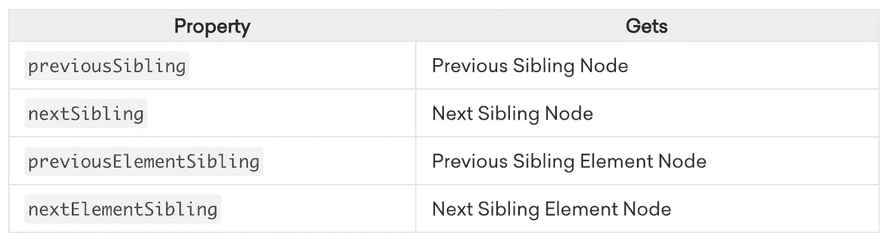

# 王国的守护者

> 原文：<https://blog.devgenius.io/guardians-of-the-dom-84ffbc782cd6?source=collection_archive---------29----------------------->

DOM 遍历和操作


# **穿越**

“遍历 DOM”基本上是通过不同的对象导航到您需要的任何地方的能力。基于选择，我们可以从选择的(当前)元素开始，轻松地在树中向上(祖先)、向下(后代)和横向(兄弟)移动。您已经离导航 DOM 树更近了一步！


DOM 树

# 特种宽银幕电影

正如上面提到的，我们有一个祖先树，它可以帮助我们根据您试图访问的节点的来源在 DOM 中移动。这可能看起来很复杂，就像任何家谱一样，可以不断增长。但是本质上所有的东西都可以分成以下几层。跟着我。

## 根节点

`document`对象是 DOM 中每个节点的根。这个对象实际上是`window`对象的一个属性，它是一个全局的顶级对象，代表浏览器中的一个选项卡。`[window](https://developer.mozilla.org/en-US/docs/Web/API/Window)`对象可以访问工具栏、窗口的高度和宽度、提示和警告等信息。`document`由内部`window`的内部组成。


## 父节点

父节点是指位于另一个节点之上的任何节点。或者 DOM 层次结构中更靠近`document`的任何节点。


* *需要注意的是，父节点、同级节点和子节点并不指特定的标签。这意味着如果你有一个

标签，它可能是 parentNode，也可能不是。它在一个实例中可能是 parentNode，在另一个实例中可能是 childNode。这不是为了迷惑你。这只是意味着，确保您理解建立什么是. parentNode 的关系。西伯利亚节点或者。子节点依赖于与其他节点的相对关系。想想你自己的母亲，她可以同时是母亲、女儿或姐妹。她的标题取决于她在那一刻描述的关系。

## 子节点

子节点是直接属于父节点或在父节点“下面”的节点。


## 嘶嘶声节点

节点的兄弟节点是 DOM 中同一树级上的任何节点。同级节点不必是同一类型的节点，文本、元素和注释节点都可以是同级节点。



我在底部附加了一些额外的精彩资源。

# DOM 操作

我们可以通过 DOM 遍历、控制台日志记录和调试器工具来隔离元素。然而，如果我们知道一个节点的类、id 或标签，我们就可以直接找到它的来源

## 查询 DOM

我们查询 DOM，以便对某些元素进行修改。

```
const elements1 = document.querySelectorAll('div')
const elements2 = document.getElementsByTagName('div')
const newElement = document.createElement('div')
```

## 更改节点

一旦您查询或遍历了一个节点，我们就可以对其进行更改并添加关系。

## 创建一个元素

```
const myNewElement = document.createElement('div')
const myNewTextNode = document.createTextNode('some text')
```

## 添加元素

`replaceChild()`方法**用另一个**替换一个子元素，这个子元素属于调用这个方法的父元素。

句法

## 移除元素

```
myParentElement.removeChild(myElement)
myElement.parentNode.removeChild(myElement)
```

## 事件监听器

事件监听器用于“监听”DOM 上的用户交互。要添加这些事件，您需要:

。addEventListener()

然后传入您正在监听的事件类型，例如“click ”,后跟一个匿名函数，该函数传递您正在监听的事件。

某些事件侦听器有一些您需要注意的默认行为

```
myForm.addEventListener('submit', function (event) {
  const name = this.querySelector('#name')

  if (name.value === 'Donald Duck') {
    alert('You gotta be kidding!')
    event.preventDefault()
  }
})
```

相反的显然是。removeEventListener()

在上面的例子中我们看到。事件上使用的 preventDefault()。这是为了防止提交按钮的事件侦听器的默认行为刷新页面。

## 添加类别

简单地添加一个类节点。className ="Class Name "就可以了。

然而，如果你想添加条件行为，一种实现方式是。优等生名单

```
myElement.classList.add('foo')
myElement.classList.remove('bar')
myElement.classList.toggle('baz')
```

## 动画

介绍时间流逝时，请注意秒是以 1000 为单位计算的。所以 1000 是 1 秒

window.setTimeout()

```
const start = window.performance.now()
const duration = 2000

window.requestAnimationFrame(function fadeIn (now)) {
  const progress = now - start
  myElement.style.opacity = progress / duration

  if (progress < duration) {
    window.requestAnimationFrame(fadeIn)
  }
}
```

额外资源:

[https://zellwk.com/blog/dom-traversals/](https://zellwk.com/blog/dom-traversals/)