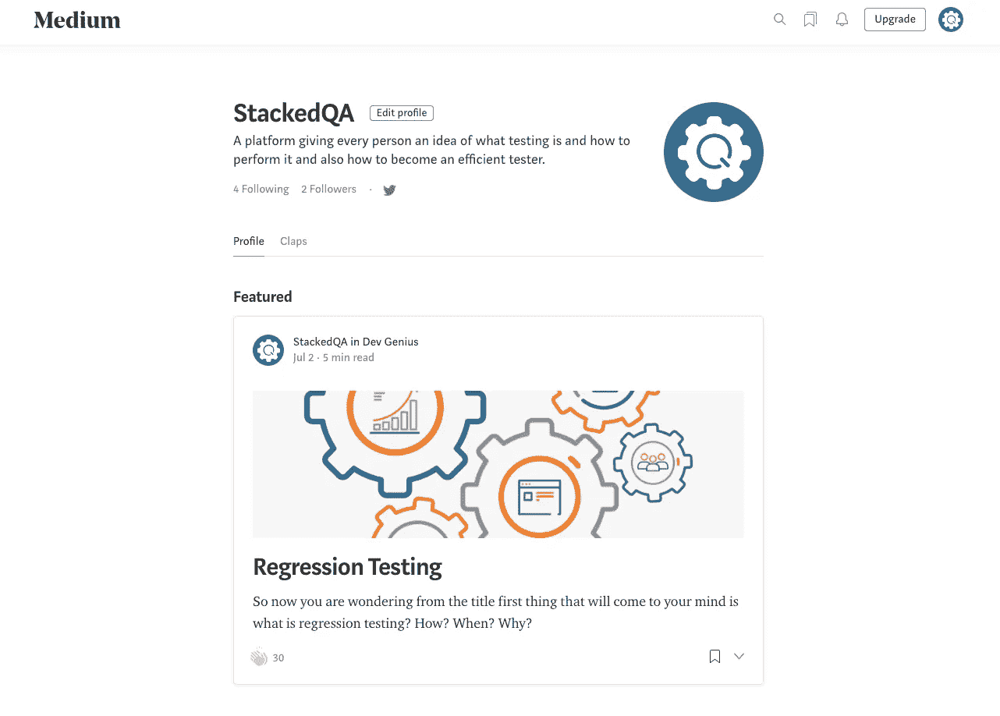

# GUI/UI 测试

> 原文：<https://blog.devgenius.io/gui-ui-testing-6712f6110b0?source=collection_archive---------4----------------------->

# 什么是“GUI”？

GUI 代表图形用户界面，在这里你使用图像而不是文本与计算机进行交互。

# 什么是 UI 测试或者用户界面测试？

## 接口测试的定义:

> “用户界面测试基本上意味着通过考虑一致性、可用性、可见性、可访问性和兼容性等参数来测试 UI。”

开发人员的工作与专业摄影师的工作没有什么不同。

摄影师大部分时间都花在寻找合适的拍摄角度、摆弄灯光和调整场景构图上。

只需一次点击，照片中的所有作品就会具体化，最终照片会出现在社交媒体上，根据用户认为照片有多漂亮或有多感人，用户会对照片赞不绝口。
很少有人会想到拍摄最后一张照片的繁重工作。在创造性的努力中，外表是一切。

同样，大多数发布的软件最终将根据其易用性和是否真正帮助用户完成工作来评判。

*你不可能总是得到你想要的……*

尽管开发人员理所当然地在软件的功能方面、底层代码和技术创新上投入了大量的骄傲和努力，但大多数用户对这些事情完全视而不见。
这是可以理解的。

用户只能看到完成的软件的照片或界面。这是他们形成观点的全部，所以在他们看来，这才是真正重要的。即使是界面上的一个小问题，也能有效地使整个产品对用户不可用，不管开发人员在产品的其余部分花费了多少不眠之夜。

无论您在编码或数据库工作方面有多出色，当用户不能通过用户界面(UI)完成他或她的请求时，您的成就就失去了任何可感知的有效性。这就引出了本文的主题。为什么用户界面测试如此重要？

*所见即所得*

用户界面测试仅仅包括在重要变量的基础上评估用户界面，如可见性、一致性、可访问性、可用性和兼容性。

在开发过程的早期进行用户界面测试是至关重要的(就像所有其他形式的测试一样)，因为你越早发现用户界面中的违规元素，就能越快解决它们，为你省去很多麻烦和尴尬。

软件开发遵循一条进化的道路。随着时间的推移，产品变得更加复杂。因此，当软件准备好发布时，在开发之初出现的任何错误都可能是很难纠正的。

这将不可避免地要求开发人员投入更多的工作时间，相应地增加团队的开支，并可能由于延迟发布而损失利润。

# 正确看待用户界面测试

用户界面测试并不总是直截了当的，它确实要求开发过程中有足够多的时间专门用于这种类型的测试，以解决 UI 中的任何问题。

如果 UI 测试的想法仍然让你困惑，从需求测试的角度来考虑它，也就是说，它是测试产品 GUI 的过程，以确保它满足书面规范。像任何类型的测试一样，您需要编写各种测试用例来覆盖系统 UI 中的所有功能。

UI 测试中面临的主要问题是处理域大小和序列。

域大小的问题是不言而喻的。与命令行界面系统不同，GUI 支持各种各样的操作，这些操作都必须经过测试。

第二个问题是排序问题。系统允许的一些功能可能只有在遵循一系列复杂的 GUI 事件之后才能实现。例如，打开一个文件可能需要用户首先点击文件菜单，然后点击打开并使用对话框选择文件并在新窗口中打开它。

自然地，GUI 中可能的操作数量越多，排序问题就越大，当测试人员必须在手工编写的测试用例中详细描述所有可能的场景时，这可能会成为一个严重的问题。

*对 GUI 测试的需求…*

现在 GUI 测试的基本概念已经很清楚了。你脑海中闪现的几个问题是

为什么要做 GUI 测试？

真的需要吗？

应用程序的功能和逻辑测试不够吗？？那为什么还要浪费时间在 UI 测试上。

要得到答案，要从用户的角度思考，而不是从测试人员的角度。用户对 XYZ 软件/应用程序没有任何了解。正是应用程序的 UI 决定了用户是否会继续使用该应用程序。

普通用户首先观察应用程序/软件的设计和外观，以及他理解 UI 的容易程度。如果用户对界面不满意，或者发现应用程序很难理解，他就不会再使用这个应用程序了。

这就是为什么 GUI 是一个值得关注的问题，应该进行适当的测试以确保 GUI 没有错误。

**以下清单将确保软件测试中详细的 GUI 测试。**

*   检查所有 GUI 元素的大小、位置、宽度、长度以及字符或数字的可接受性。例如，您必须能够向输入字段提供输入。
*   检查您是否可以使用 GUI 执行应用程序的预期功能
*   检查错误信息是否正确显示
*   检查屏幕上不同部分的界限是否清晰
*   检查应用程序中使用的字体是否可读
*   检查文本的对齐方式是否正确
*   检查字体和警告信息的颜色是否美观
*   检查图像是否清晰
*   检查图像是否正确对齐
*   检查不同屏幕分辨率的 GUI 元素的位置。

示例 GUI 测试测试用例

**GUI 测试主要涉及**

1.  测试元素的大小、位置、宽度和高度。
2.  测试显示的错误信息。
3.  测试屏幕的不同部分。
4.  测试字体是否可读。
5.  在放大和缩小的帮助下测试不同分辨率的屏幕，如 640 x 480、600x800 等。
6.  测试文本和图标、按钮等其他元素的对齐情况。是否在正确的位置。
7.  测试字体的颜色。
8.  测试错误消息、警告消息的颜色。
9.  测试图像是否具有良好的清晰度。
10.  测试图像的对齐。
11.  拼写测试。
12.  用户在使用系统界面时不能感到沮丧。
13.  测试界面是否吸引人。
14.  根据页面大小测试滚动条，如果有的话。
15.  测试禁用字段(如果有)。
16.  测试图像的大小。
17.  测试标题是否正确对齐。
18.  测试超链接的颜色。

# 演示:如何进行 GUI 测试

## 在这里，我们将为下面的屏幕使用一些样本测试用例。

## 下面是测试用例的例子，包括 UI 和可用性测试场景。

TC 01-验证带有标签“**中等**”的标题侧文本是否正确对齐。

TC 02 —验证名为“**编辑配置文件**的标签是位于“**stacked QA”**旁边的按钮。

TC 03——验证名为“**的文本标签，该平台让每个人都知道什么是测试，如何进行测试，以及如何成为一名高效的测试人员。**"是一个文本字段。

TC 04 验证在“后带有“**名称的标签是可点击的**

TC 05 验证名为“**Followers”**的标签可点击，并与以下标签对齐

TC 06 —验证 **Twitter** 的图标是否正确对齐并可点击，以及是否与关注者和追随者标签对齐。

TC 07—确认标签“ **Profile** ”是一个选项卡形式，单击它会显示中等帐户用户的配置文件。

TC 08 —确认标签“**Claps”**是一个选项卡形式，点击时显示每个公共帖子的媒体帐户用户的 Claps。

TC 09 —验证容器框是否包含以下详细信息:图片、文章封面图片、文章标题、文章简短描述、点击次数、收藏图标和选项图标。

TC 10 验证标签内的所有组件是否清楚显示并正确对齐。

TC 11 验证文本没有语法错误，并且完全符合预期的风格，以便让用户理解不同之处。

TC 12 —验证以下标签旁边是否有一个数字，该数字应该在用户每次关注某人时增加。

TC 13 验证关注者标签旁边有一个数字，该数字应该在用户每次被某人关注时增加。

TC 14 验证当点击收藏夹图标时，该图标是全阴影的。

TC 15 —验证当点击选项下拉图标时，它将显示两个选项，即**停止在您的个人资料中出现**和**编辑故事**

TC 16—验证右上角的导航栏是否有**搜索图标、收藏图标、通知图标、升级按钮和用户图像或徽标。**

TC 17 —验证单击搜索图标时，它会打开一个搜索栏，供用户搜索在 medium 中发布的文章或帖子。

TC 18 —验证当点击收藏夹图标时，屏幕会切换到用户收藏的帖子。

TC 19 —确认单击通知图标时，它将显示用户通知的下拉列表，从最上面的最新通知到最早的通知。

TC 20 —验证“**升级”**按钮是否可点击，点击后，如果用户仍然不是“中等”会员，则用户可以升级以获得“中等”会员的好处。

TC 21 —验证用户图像，当单击它时，将显示一个下拉列表，其中显示以下**用户图像，旁边是名称及其标签名称**，下面是以下**新故事、故事、系列、统计、媒体合作伙伴计划、阅读列表、出版物、自定义您的兴趣、个人资料、设置、帮助和注销。**

# GUI 测试中的挑战

在软件工程中，进行回归测试时最常见的问题是应用程序 GUI 经常变化。很难测试和识别它是一个问题还是增强。当您没有任何关于 GUI 更改的文档时，问题就显现出来了。

# 结论

尽管 UI 测试可能看起来非常复杂，但它是开发过程中的一个重要组成部分，您的团队至少应该进行一些基本形式的 UI 测试，覆盖您产品中最常见的功能，如果不是全部的话。

在发布产品之前，确保 GUI 最重要的功能正常工作是非常必要的，如果认真执行，UI 测试可以为您和您的团队成员省去很多尴尬。

如果您正在寻找我们的服务，请点击下面的网站:

[StackedQA 网站](https://www.stackedqa.com/)

查看我们的社交媒体:

[脸书](https://www.facebook.com/StackedQA)，[推特](https://twitter.com/stackedqa)， [Instagram](https://instagram.com/stackedqa) ，&Linkedin