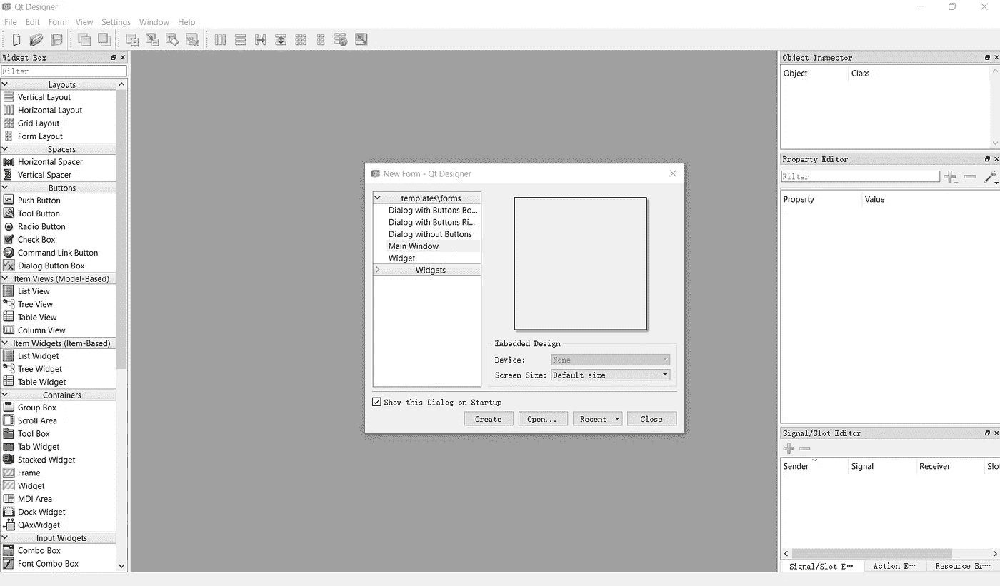
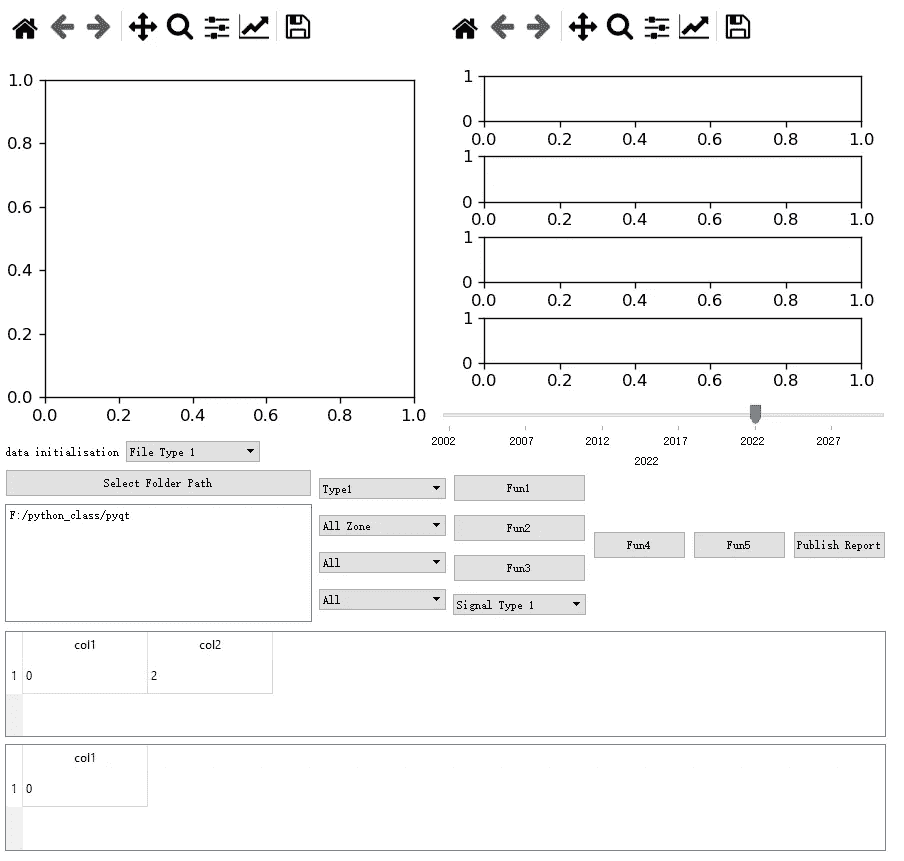

# 初学者使用 PyQt 创建 GUI 指南

> 原文：<https://blog.devgenius.io/guide-for-gui-creation-with-pyqt-for-beginner-2d966c43b7b9?source=collection_archive---------9----------------------->


什么是 GUI

大量优秀的应用和模型，由于用户交互差，最终无法被接受和使用。好的用户界面可以显著改善用户体验，实现价值最大化。虽然作为一名数据科学家或机器学习工程师，大多数时候设计和制作用户界面不是我们的工作，但理解 GUI 创建的一些基础知识肯定是有用的，这可以帮助我们进行生产编码。除此之外，如果你想建立一个端到端的应用程序，或者用你创造的工具开始你自己的生意，这将是非常有帮助的。这篇博客将展示我如何使用 PyQt 为我的数据模型构建 GUI 界面。由于这里使用的数据模型与一个商业项目相关，我不会分享代码。然而，我将展示一些函数使用的例子和一个简单的版本。

图形用户界面(GUI)构建器有各种可用的库，包括 **PyQt** 、 **Tkinter** 、 **wxPython** 等。这个博客将关注 pyqt 库，原因如下:

*   PyQt 是一个跨平台的工具，它包含一个用户友好的设计器来帮助用户设计界面
*   各种 UI 组件——Qt 提供了几个小部件，比如按钮或菜单，所有这些小部件的设计都具有所有支持平台的基本外观。
*   PyQt 有一个很大的社区，网上有很多教程

# PyQt 设计器

PyQt 的优势之一就是 Qt 设计器，可以很容易的用来设计整个 app 的结构。要进入 PyQt，通常需要使用以下代码安装 PyQt:

```
pip install pyqt5
```

安装 PyQt 库后，您可以在“…Lib \ site-packages \ PyQt 5-tools \ designer . exe”路径下打开您的 PyQt 设计器，或者在 powershell 提示符下输入以下代码:

```
designer
```

打开 Qt 设计器后，您会看到如下图所示的工具。



Qt 设计师

在这个工具中，你可以在左侧找到很多组件，并用初始窗口创建你的主窗口。可以选择各种组件，如按钮、组合框、图形视图、标签、滑块等。然后你可以把它们拖到你创建的主窗口或窗口小部件上。

在完美地构建了界面之后，您可以使用 cmd 中的几行命令将设计的用户界面转换成代码，并在 python 中打开代码来为每个设计的组件分配功能。用于接口转换的代码如下所示:

```
pyuic5 -x yourfile.ui -o yourfile.py
```

将接口转换为 python 代码后，您将获得类似于以下示例的生成代码:

```
from PyQt5 import QtCore, QtGui, QtWidgets 
# This is the basic libaray of PyQtclass Ui_MainWindow(object):
    def setupUi(self, MainWindow):
        MainWindow.setObjectName("MainWindow")
        MainWindow.resize(986, 816)
        # This is the size of the main window self.centralwidget = QtWidgets.QWidget(MainWindow)
        self.centralwidget.setObjectName("centralwidget")
        MainWindow.setCentralWidget(self.centralwidget)
        self.menubar = QtWidgets.QMenuBar(MainWindow)
        self.menubar.setGeometry(QtCore.QRect(0, 0, 986, 26))
        # This is the location of the menubar self.menubar.setObjectName("menubar")
        MainWindow.setMenuBar(self.menubar)
        self.statusbar = QtWidgets.QStatusBar(MainWindow)
        self.statusbar.setObjectName("statusbar")
        MainWindow.setStatusBar(self.statusbar) self.retranslateUi(MainWindow) # This is initialization
        QtCore.QMetaObject.connectSlotsByName(MainWindow)def retranslateUi(self, MainWindow):
        _translate = QtCore.QCoreApplication.translate
        MainWindow.setWindowTitle(_translate("MainWindow", "MainWindow"))if __name__ == "__main__":
    import sys
    app = QtWidgets.QApplication(sys.argv)
    MainWindow = QtWidgets.QMainWindow()
    ui = Ui_MainWindow()
    ui.setupUi(MainWindow)
    MainWindow.show()
    sys.exit(app.exec_())
```

然后，您可以输入其他代码或更新现有代码来分配功能或调整界面，下一节将介绍如何使用一些基本组件分配功能。

# 基本代码

本节将介绍如何分配一些基本组件的功能。

## 按钮

按钮是 GUI 中最常用的组件之一，生成的代码通常会给出它的位置和它所属的小部件，下面给出了一个示例:

```
self.Button = QtWidgets.QPushButton(self.widget)
self.Button.setObjectName(“Button”)
self.verticalLayout.addWidget(self.Button)
```

要将按钮与定义的函数连接起来，我们需要在按钮声明之后输入句子。

```
self.Button.clicked.connect(self.function)
```

然后在 Ui_MainWindow 类中定义函数。

## 组合框

组合框通常遵循与按钮相同的结构，但函数连接代码是

```
self.ComboBox.currentIndexChanged.connect(self.function)
```

## 滑块

滑块与前两个组件有点不同，前两个组件通常需要设置刻度的范围、步长和间隔。下面给出一个例子:

```
self.slider = QtWidgets.QSlider(self.horizontalLayoutWidget) 
 self.slider.setOrientation(QtCore.Qt.Horizontal)
 self.slider.setObjectName(“slider”)
 self.slider.setRange(1,100)
 self.initialyear = 50
 self.slider.setValue(self.initialyear)
 self.slider.setTickInterval(20)
 self.slider.setTickPosition(QtWidgets.QSlider.TicksBelow)
 self.slider.setSingleStep(1)
 self.slider.valueChanged.connect(self.function)
 self.horizontalLayoutWidget.addWidget(self.slider)
```

## 数字

为了在指定的窗口上绘制图形，我们通常需要定义一个布局，如下例所示:

```
self.Figure = QtWidgets.QHBoxLayout(self.horizontalLayoutWidget) 
 self.Figure.setContentsMargins(0, 0, 0, 0)
 self.Figure.setObjectName(“Figure”)
```

然后需要创建一个绘图类，如下所示

```
class MatplotlibCanvas(FigureCanvasQTAgg):
   def __init__(self,parent=None, width = 5, height = 4, dpi = 120):
       fig = Figure(figsize = (width, height), dpi=dpi)
       self.axes = fig.add_subplot(111)
       super(MatplotlibCanvas,self).__init__(fig)
       fig.tight_layout()
```

完成对该类的编码后，您可以使用下面的代码让该类在指定的小部件上绘制图形

```
try:
            self.Figure.removeWidget(self.toolbar)
            self.Figure.removeWidget(self.canv)
            sip.delete(self.toolbar)
            sip.delete(self.canv)
            self.toolbar = None
            self.canv = None
        except Exception as e:
            print(e)
            pass

        self.canv = MatplotlibCanvas(self)
        self.toolbar = Navi(self.canv,self.centralwidget)
        self.Figure.addWidget (self.toolbar)
        self.Figure.addWidget(self.canv)
        self.canv.axes.cla()
        ax = self.canv.axes
        ax.plot(df)
        self.canv.draw()
```

值得注意的是，在创建新的图之前，我们需要先删除已退出的图，否则我们将在同一个小部件中生成大量的图形。

## 数据表

为了创建一个数据表，我们通常可以如下声明一个 QTableView:

```
self.dataTable = QtWidgets.QTableView(self.widget) 
 self.dataTable.setObjectName(“DataTable”)
```

然后我们需要为数据表进程创建一个类，如下所示:

```
class TableModel(QtCore.QAbstractTableModel):
 ‘’’
 This class is created for table model which allows data can be read
 in the specified table
 ‘’’
 def __init__(self, data, header):
 super(TableModel, self).__init__()
 self._data = data
 self.header = headerdef data(self, index, role):
 if role == Qt.DisplayRole:
 # See below for the nested-list data structure.
 # .row() indexes into the outer list,
 # .column() indexes into the sub-list
 return self._data[index.row()][index.column()]def rowCount(self, index):
 # The length of the outer list.
 return len(self._data)def columnCount(self, index):
 # The following takes the first sub-list, and returns
 # the length (only works if all rows are an equal length)
 return len(self._data[0])

 def headerData(self, section, orientation, role=QtCore.Qt.DisplayRole):
 if orientation == QtCore.Qt.Horizontal and role == QtCore.Qt.DisplayRole:
 return self.header[section]
 return super().headerData(section, orientation, role)
```

下一步是用下面的代码调用 TableModel 类来可视化表中指定位置的数据:

```
 self.model = TableModel(data,[‘col1’]) 
 self.dataTable.setModel(self.model)
 self.verticalLayout_3.addWidget(self.dataTable)
```

# 例子

下面给出了一个接口示例。这个例子为不同的信号图创建了几个图形，并为文件或信号过滤器使用了组合框。这些函数可用于连接数据模型，结果可在图或数据表中可视化。它也可以创建一些数据库来存储数据以备后用，或者用数据重要性按钮导入数据。最后，它可以将模型或分析结果收集在一起，并生成一个 pdf 文件，以方便用户理解数据。



示例界面

虽然已经有很多数据管理或分析系统可用，但 PyQt 为我们提供了更多的机会来设计和制作更适合不同领域的数据软件。

此外，根据我的经验，随着更多的组件或功能添加到我们设计的用户界面中，我们需要提前规划一个良好的架构，以便更快、更有效地执行我们的代码，因为许多代码是互连的，它们很容易被重用以降低效率。

# 结论

GUI 是用户和建模者之间非常重要的桥梁。一个好的 GUI 可以最大化我们设计的软件或模型的价值。相反，难以理解的 GUI 可能会吓跑许多用户，使我们难以推进我们的项目和模型。因此，这篇博客介绍了一些 GUI 创建的基础知识，以帮助非专业人士理解并开始构建我们自己的用户界面。希望这能对你开始创建 GUI 的第一步有所帮助。最后，如果你能点击**鼓掌**来支持我的博客，我会非常感激，我会继续围绕数据科学或一些热点领域制作更多有趣的内容。