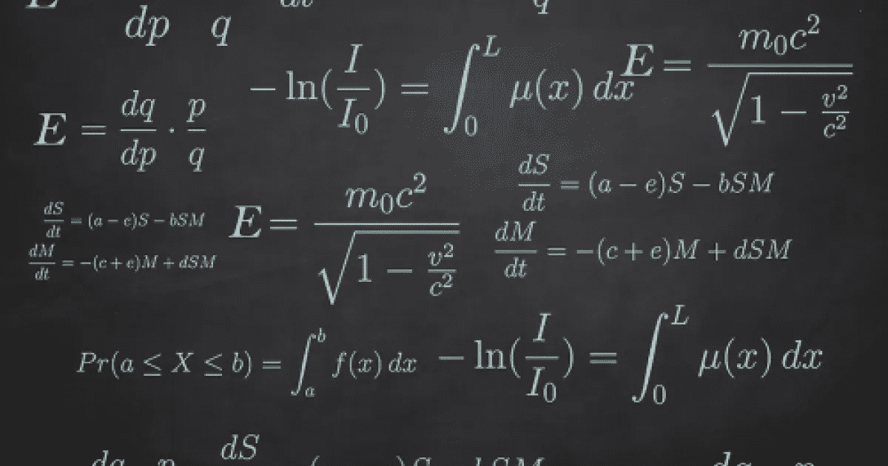

# 微积分学习指南

> 原文：<https://blog.devgenius.io/guide-for-learning-calculus-9f2ea1632c26?source=collection_archive---------7----------------------->

一个令人恐惧的课程变得简单、有趣，并且终生难忘。

我们都害怕大学里的微积分课程。教授会讲授这门学科，但我们不明白到底发生了什么。更重要的是，除了通过所有的考试，我们不能确定它在现实生活中是否有用。在这里，我们将帮助你如何轻松地摇滚微积分。

## 那么什么是微积分呢？

***微积分可以简单定义为数学的变化*** 。或者对今天已知的大多数数学主题都很重要的数学的一种广义形式。

## 为什么大家觉得微积分很难？

微积分被认为很难的原因是教授、老师和讲师的教学方法。他们通常把微积分当成神秘的东西，没有日常生活的应用，尽可能把它变得复杂。此外，他们对待这门课程的态度就像除了通过他们的课程之外没有什么重要的。

## 怎样才能克服微积分？

当你有一个计划的时候，这是非常简单的。因为数学中的每个主题都是相互关联的，所以事先学习先决主题真的会使整个过程变得更容易。如果真的没有视频，可以从函数开始学微积分，然后去极限和连续性，导数，积分，最后是级数。好消息是，在学习微积分之前，你真的不需要学习很多话题。

其次，你可以在学习微积分的同时练习题目的现实应用。通过应用这个原则，即使你很长时间没有练习过这些话题，记住这些话题也变得容易得多，甚至可能难以忘怀。更重要的是，学习与微积分密切相关的更高级的数学主题，即使在很长一段时间里，即使不学习，也会让他们难以忘怀。

**综上所述，**

1-看题目，做一个计划，

2-查找教学视频，

3-划分主题，从最基本的开始，

4-寻找现实生活中的应用，

5-最后进入下一个主题，加深理解(因为它们都是相互关联的)。

*你怎么看待微积分？根据你的说法，你是如何看待微积分的？在下面的评论区分享你的想法和经历。*