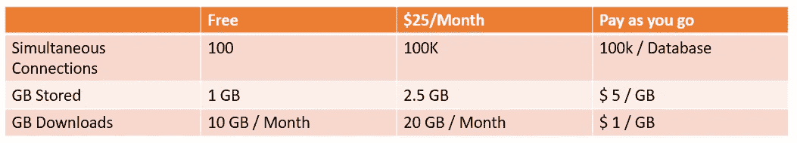
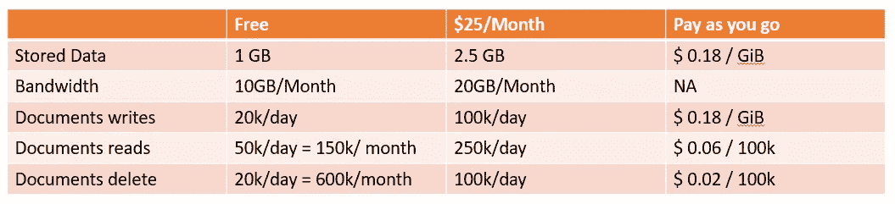
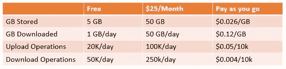

# Firebase 数据库选项选择指南(Firebase 实时数据库与 Firebase 云 Firestore)

> 原文：<https://blog.devgenius.io/guide-to-chose-between-firebase-database-options-firebase-realtime-database-vs-firebase-cloud-632fda2e4838?source=collection_archive---------0----------------------->

Firebase 是流行的移动和 web 应用程序开发平台之一。它是一个易于使用的平台，也是大多数新的移动和网络开发者为移动和网络应用托管数据的首选。从 2011 年开始到 2018 年 10 月，180 万个应用程序使用了 Firebase 平台的 18 种产品中的一种或多种，这可能是一个补充。在我学习 Android 编程的时候，Firebase 也是我在云上存储数据的选择。

使用 Firebase Cloud 很有趣，因为它易于配置环境和良好的支持系统。最重要的是，Firebase 在 2014 年被谷歌收购，这让它更有实力，因为谷歌在自己的谷歌云产品方面拥有专业知识。

谈到云数据库，Firebase 有三种选择。它们是:

1.  **Firebase 实时数据库**
2.  **Firebase Cloud Firestore**
3.  **燃料库**

# Firebase 实时数据库

Firebase 实时数据库是 Firebase 推出的第一款产品。实时数据库(Realtime Database)是一种 API，可以跨 iOS、Android 和 Web 应用程序等不同平台同步数据，并将其存储在设备上。

## 定价结构:

Firebase 实时数据库只对带宽和存储收费，但收费更高。数据库中的读取或写入次数不收费。当您知道与数据存储相比，涉及更多的读取和操作时，应该使用实时数据库。例如，如果我们正在开发一个电子商务应用程序，我们知道当用户打开应用程序或网站时，会有更多的读取操作，比如从数据库中读取目录。在这种情况下，目录的大小不会呈指数增长，但在启动时，读取操作会增长。所以实时数据库将是一个合适的选择。

# Firebase Cloud Firestore

Firebase Cloud Firestore 是 Firebase 提供的另一个云存储。Firebase 允许嵌套文档和字段，而不是 Firebase 实时数据库提供的树形视图。

## 定价结构:

Firebase cloud 主要对数据库中执行的操作(读、写、删除)收费，并以较低的费率对带宽和存储收费。当我们必须存储大量数据，并且读写操作较少或有限时，应该使用云 Firestore。在我们的电子商务应用程序示例中，我们可以使用云 Firestore 来存储用户的个人数据、他们的交易、他们所下的订单。因为这种数据会随着用户群的增长而增长，所以我们需要一种更便宜的方式来存储这种数据，与实时数据库相比，云 Firestore 提供了这种功能。

# 燃料库

另一方面，Firebase 存储用于存储大型文件，如任何附件文档、音频和视频文件或任何需要在运行时从云中检索或更新的图像，而无需更改应用程序中的任何代码。

## 定价结构:

存储定价如上所示。Firebase 存储用于存储音频、视频或图像文件。在电子商务应用示例的情况下，不同产品的图像可以存储在这里。

# 结论:

根据应用程序的需要，所有这些数据库存储选项可以单独使用，也可以同时使用。如果应用程序需要更多的读取/操作，建议使用实时数据库；如果数据数量/大小很大，建议使用 Firestore，因为它的价格更便宜。您可以选择将两个数据库放在一个应用程序中，并将相关数据存储在相关数据库中，如电子商务应用程序示例中所述。

**阅读更多:**

 [## Firebase 云功能与 AWS RDS 数据库集成

### 在本教程中，我将解释如何创建一个 AWS RDS 数据库，并将其与 Firebase 云功能集成。这个…

medium.com](https://medium.com/dev-genius/firebase-cloud-functions-integration-with-aws-rds-database-947a383e2e0c) 

快乐阅读！！！