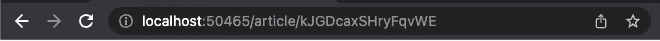
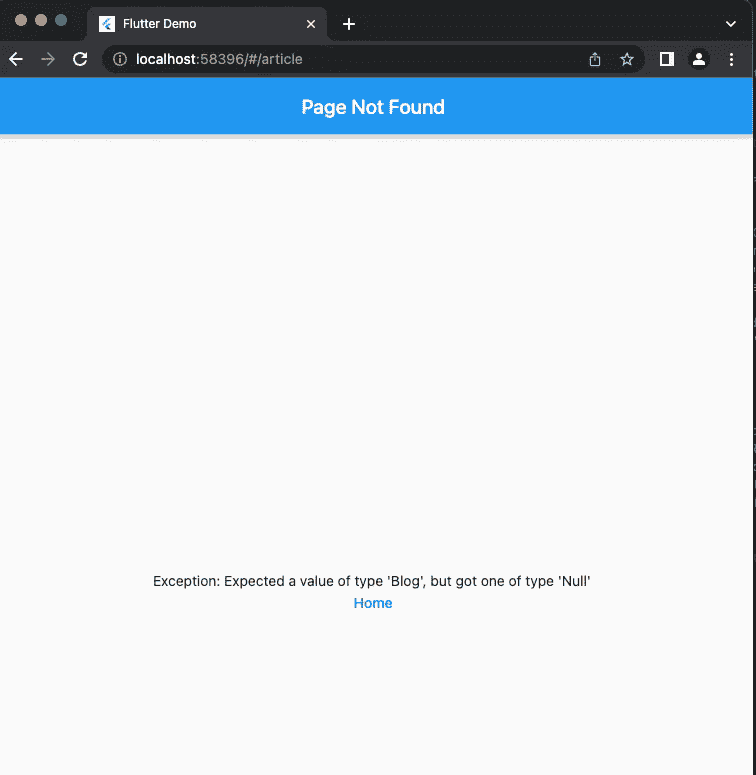
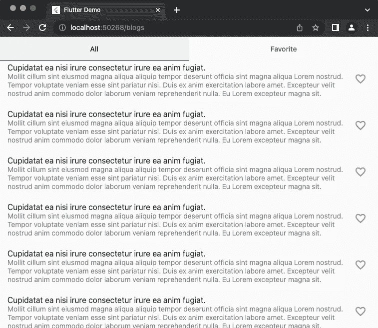

# go_router 指南(Flutter)

> 原文：<https://blog.devgenius.io/guide-to-go-router-flutter-1ddcfa56d39c?source=collection_archive---------0----------------------->


Javier Allegue Barros 在 [Unsplash](https://unsplash.com?utm_source=medium&utm_medium=referral) 上拍摄的照片

Go_router 是现在 flutter 官方支持的最新最流行的路由包。

## 设置和基本使用案例。

1.  在您的 pubspec.yaml 中添加 go_router

```
flutter pub add go_router
```

2.配置路线

这样定义路由器。

像这样使用 MaterialApp 中的路由器。

并使用 go_router 导航到不同的页面，如下所示。

```
GoRouter.of(context).go('/article');
```

瞧啊。你完成了，这是用例的最简单形式。但是你们中的许多人都知道这对于一个更大的应用程序来说是不够的。因此，我们将对此进行更深入的研究。

## 在路由中传递参数

大多数时候我们需要将数据从一个路由传递到另一个路由。而 go_router 提供了一个简单的方法来做到这一点。这样定义 go_route。这里我们使用了来自[GoRouterState]的[extra]属性。

像这样使用它。

```
GoRouter.of(context).go(AppRouter.singleArticle, extra: blog);
```

这里您可能已经注意到 go_router 只允许一个额外的参数。如果您需要向路由器传递多个值，请考虑使用 Map 或自定义类。

## 在路线中传递参数

仅使用参数导航，URL 看起来像这样。从这里，我们不能只看网址就知道是哪篇文章。为了让 URL 看起来更好，我们需要传递参数。


我们可以这样实现。

像这样使用它。

```
GoRouter.of(context).go('article/${blog.id}');
```

现在，URL 将看起来像这样。



## 未找到页面

当用户输入一个无效的 URL 时，我们需要显示一个错误页面。对 web 非常有用，用户可以明确地输入 URL。Go_router 已经默认提供了一个未找到的页面，但是我们可以修改并使用我们的小部件作为错误页面。而这样做的方法就是 ***error_widget*** 和 ***errorPageBuilder。*** 我们可以这样用。

请记住，我们只需要使用一个。如果同时使用 ***error_widget*** 和***errorPageBuilder***，error page builder 将生效。

go_router 的默认错误页面:



## URL 策略。

现在你可能已经注意到了 URL 上烦人的#号。我们可以通过在 runApp 函数之前的 main.dart 中添加下面一行来轻松地删除它。

```
GoRouter.setUrlPathStrategy(UrlPathStrategy.path);
```

## **写干净的代码**

你可能已经注意到 go_router 有点冗长。我们需要使用字符串作为路径，这在大型应用程序中可能会变得难以管理。下面是我在 go_router 中管理路由的方法。

1.  在***lib/config/routes/app _ routes . dart***中创建文件
2.  编写以下代码(示例代码)

这里你可能已经注意到了获取字符串路径的***singletarticwithparams***方法。这是为了确保我们不使用错误的路径。

## TabBarView 上的嵌套路线

对于嵌套路由，我们需要用不同的参数或数据调用相同的路由。



像这样配置路由。

这里，***_ homePageRouteBuilder***就是拿一个类型的文章来展示。可以是 ***CurrentTab.blogs*** 或者***current tab . favorite .***根据这种类型构建首页。

***首页*** 代码会是这样的。

同样，我们可以创造一条嵌套的欲望之路。

您可以在下面的资源库中找到所有这些代码。

[](https://github.com/stha-ums/go_router_example.git) [## GitHub-stha-ums/go _ router _ 示例

### 此时您不能执行该操作。您已使用另一个标签页或窗口登录。您已在另一个选项卡中注销，或者…

github.com](https://github.com/stha-ums/go_router_example.git) 

感谢您花时间阅读这篇文章。