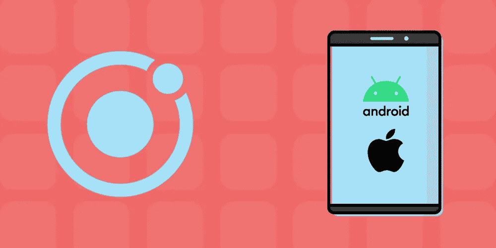

# Ionic 框架 V4+指南:使用哪种前端框架

> 原文：<https://blog.devgenius.io/guide-to-ionic-framework-v4-which-front-end-framework-to-use-e867c42b59b9?source=collection_archive---------5----------------------->

图片来源:作者

Ionic 是一个跨平台的 web 开发工具，允许您从一个隐藏的嵌入式 web 浏览器中使用移动设备组件和硬件。最初 Ionic 是用 AngularJS 开发的，但自从 Ionic 4 变得独立于框架，允许你用任何框架构建应用程序。

包含其他框架允许更多的 web 开发人员使用 Ionic，并提供更多的选择来选择最适合他们应用的框架。每个框架都有特定的优势，使其更适合某些类型的应用程序。

今天，我们将快速了解一下 Ionic 4 以及每个新框架带来的好处。

下面是我们今天要讲的内容:

*   什么是爱奥尼亚？
*   离子 V4+
*   带离子的角形
*   离子反应
*   离子型 Vue
*   后续步骤

# 什么是爱奥尼亚？

Ionic 是一个用 JavaScript 编写的开源软件开发工具包(SDK ),专为混合移动应用程序开发而设计。它最初是由 Drifty Co .的 Ionic 团队在 2013 年推出的，基于 AngularJS 和 Apache Cordova 构建。最近，它被更新为一组 web 组件。

Ionic 现在允许你为你的应用选择任何前端框架，比如 **Angular，React，或者 Vue.js** 。

Ionic 的混合开发工具允许开发人员使用 HTML、CSS 和 Sass 等常见的 web 技术创建应用程序，然后使用 Cordova 容器将它们移植到移动应用程序商店。

该设备在本地安装 Cordova 应用程序容器(就像一个本地应用程序)，但该应用程序使用嵌入式浏览器来连接任何移动平台功能。Ionic 应用程序可以访问特定于设备的功能，如 GPS、相机或移动设备的手电筒。嵌入式浏览器和任何插件对用户来说都是不可见的，这意味着对他们来说它就像一个原生的移动应用程序。

> *本质上，Ionic 可以让你构建一个单一的 web 应用代码库，并毫不费力地将其作为桌面和移动应用跨多个平台分发。*

# 爱奥尼亚的显著特点

*   跨平台支持，编写单一代码库，发布到各种设备。
*   使用特定于设备的组件，如 iOS 按钮或滑块
*   基于众所周知的 web 标准，如 HTML、CSS 和 JavaScript
*   包括 Cordova 插件以使用本地设备功能
*   附带了许多打包成一个的开发工具，包括它自己的 Ionic CLI、IDE 等等。

# 离子 V4+

2019 年，Ionic 发布了其主要的 V4 更新，全面重建了 SDK，以与现在的行业标准 web 组件系统配合使用。这为使用 Angular、React 或 Vue.js 的无数新机会打开了大门，并为 Progressive Web Apps (PWAs)等现代应用程序添加了更多功能。

此次更新标志着 Drifty Co .致力于将 Ionic 打造为面向所有网络开发者的应用开发平台。

Ionic V4 最大的变化是:

*   增加了对 Angular、React 和 Vue.js 前端框架的支持
*   角路由器提高了导航能力
*   由 web 组件组成，使用现代浏览器中可用的自定义元素和影子 DOM APIs。
*   由于返工组件优化，速度提高了 50%
*   添加了高效的 web 编译器模板，它是 PWAs 的最佳开箱即用编译器
*   增加了对延迟加载的支持

每个新支持的前端框架都有自己的优点，您可以在下一个项目中考虑这些优点。让我们来看看这些框架可以为您的 Ionic web 应用程序带来的好处。

# 带离子的角形

Angular 在 Ionic 上获得了最多的支持，因为它内置了 Angular 工具，如 Router，以及团队在 AngularJS 方面的丰富经验。

与 React 或 Vue 相比，Angular 对应用程序的 UI 提供了最深入的控制，但也有最陡的学习曲线。Ionic 使用官方的 Angular stack 来确保与现有的 Angular 生态系统无缝集成。

简而言之，Ionic 4 中 Angular Ionic 的唯一变化是性能有所提高。所有以前的工具和技术仍然有效，但现在你也有新的离子 4 功能来增强你的应用程序。Angular 对于使用 Ionic 的移动或 web 应用程序来说仍然是一个很好的选择。

**优点**

*   对 Ionic 中任何框架的大多数现有支持。
*   对用户界面各个方面的精细控制，支持更多的功能而不是简单
*   使用角度路由器在 Ionic 中提供卓越的导航功能

**缺点**

*   Angular 提供了各种不同的结构，比如可注入的、组件、管道和模块，这使得它比其他两个更难学。
*   只与真实 DOM 而不是虚拟 DOM 接口，这降低了某些应用程序的性能。

**用例**:

您是 Angular 或 Ionic 的长期用户，希望利用新的 Ionic 4 特性，或者是 Angular 的新手，但希望使用最成熟和可调的框架。

# 离子反应

Ionic React 是 Ionic 和 React 的集成，专注于创建优化的渐进式 web 应用程序。许多开发人员选择 Ionic React，而不是制作标准的 React 本地应用程序，因为它易于使用。Ionic React 使用 Ionic 强大的 UI 组件模板，让你可以在几分钟内从头开始组装一个 UI。

> Ionic React 更类似于传统的 React 开发，而不是 Native，因为 Ionic 只是一个移动友好的 web 应用程序，而不是移动应用程序的重新设计。

换句话说，Native 改变了一些行为并限制了定制，因为它在幕后与现有的 iOS 和 Android 控件一起工作。Ionic React 使用所有熟悉的 React 控件，并提供与 React web 应用程序相同的高级定制。

此外，Ionic 支持 PWAs，而 React Native 不支持。

Ionic React 提供了直观的应用构建体验，通过其出色的 PWA 支持，可以在任何平台上使用。

**优点**

*   使用 React 更快地学习和构建新应用
*   易于定制的组件，以符合所需的美学或行为
*   获得 Ionic 的跨平台灵活性和标准的反应感觉
*   渐进式 web 应用程序开发的最佳框架
*   允许您轻松导入任何当前的 React 项目

**缺点**

*   不如角离子成熟
*   比 Angular 或 Vue 更差的应用导航
*   不提供复杂的行为或组件

**用例**:

您希望快速创建一个渐进式 web 应用程序，它在 web 和移动设备上看起来都一样，并且只需要标准的 web 应用程序功能。

# 离子型 Vue

Ionic Vue 是获得 Ionic 支持的最新框架。它于 2020 年发布，与 Vue.js V3 配合使用，是 React 的简单性和全功能 Angular 之间的中间地带。

它比 Angular 更容易学习，但是包含了比 React 更多的扩展工具，比如数据绑定和免编译模板。Ionic Vue 带有 Vue 的 CLI 和 Vue 路由器，允许命令行开发和无缝导航。

Ionic Vue 是绝配；Vue 的 HTML 模板系统允许您在新组件中轻松重用旧元素，而 Ionics web components 系统可以在任何设备上查看这些模板。Ionic Vue 允许你只用 HTML 和 JavaScript 创建一个跨平台的应用。

Vue 主要用于单页 web 应用程序(spa ),而不是移动应用程序，因为它依赖于 web 技术和服务器端加载。然而，Ionic 允许在移动设备上使用 Vue 应用程序，并允许您创建一个 web 优先的应用程序，该应用程序也有移动应用程序版本。

**优点**:

*   只需要知道 HTML 和 JavaScript
*   简单性和功能性的中间地带
*   由于公司的支持，知名度和成熟度迅速增长
*   单页应用的理想选择
*   由于虚拟 DOM，性能比 Angular 更快

**缺点**:

*   Ionic 支持的最新框架
*   比反应更难使用
*   不适合纯移动应用

**用例**:

你想创建一个有点复杂的应用程序或 SPA，并希望大多数用户使用你的 web 应用程序，但也想提供一个移动版本。

# 后续步骤

每当 Ionic 添加更多的框架支持时，它都会继续将自己重新确立为 web 开发技术的下一个阶段。随着越来越多的公司看到真正跨平台网络平台的价值，Ionic 预计将进一步增长。

不管你当前选择的框架是什么，这都是一个很好的学习工具。学习 Ionic 的下一步是开始你的第一个 Ionic 项目。