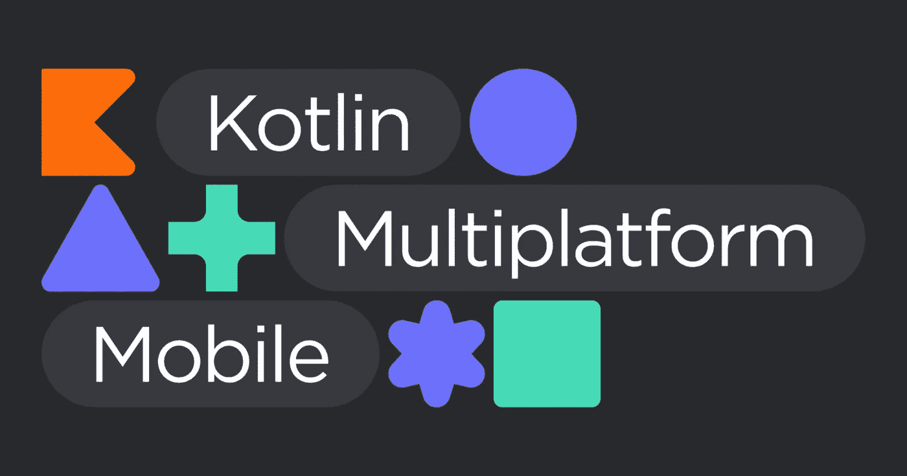
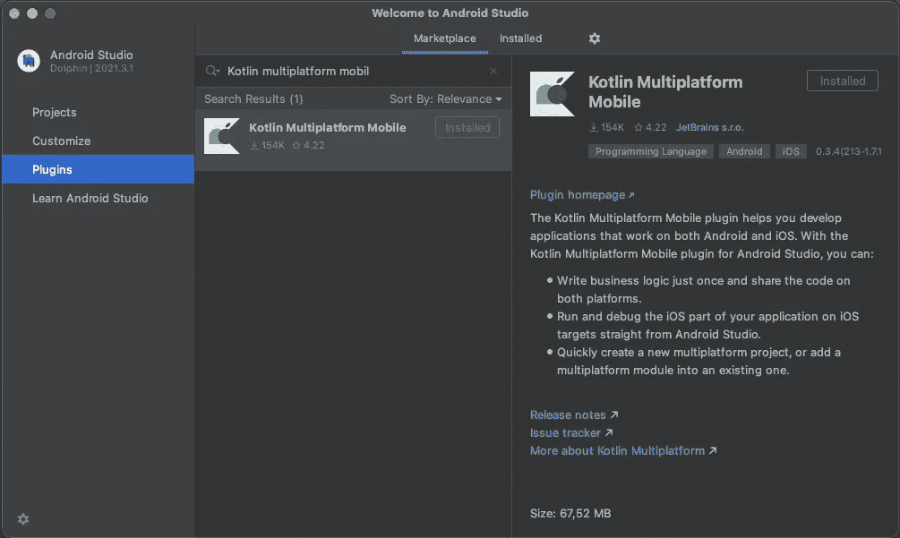
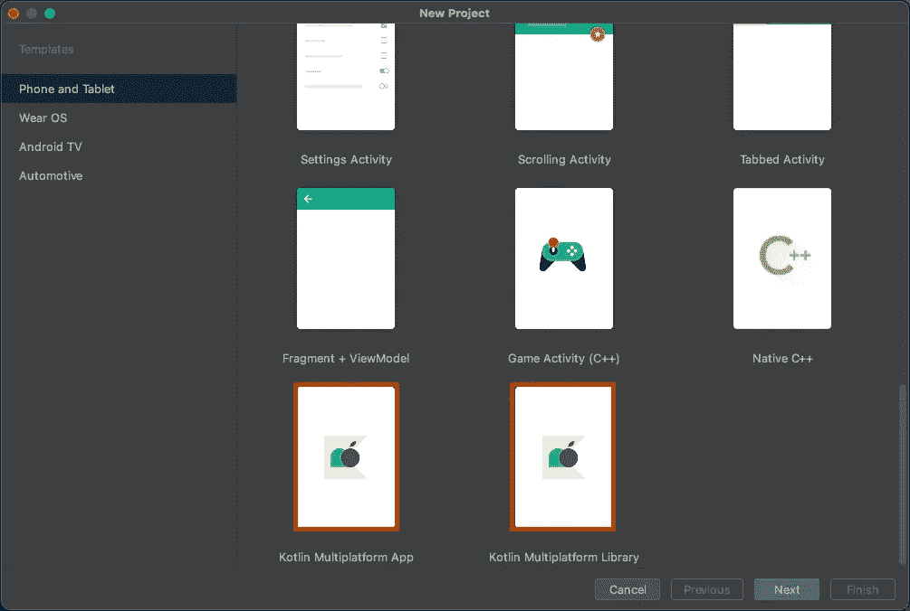
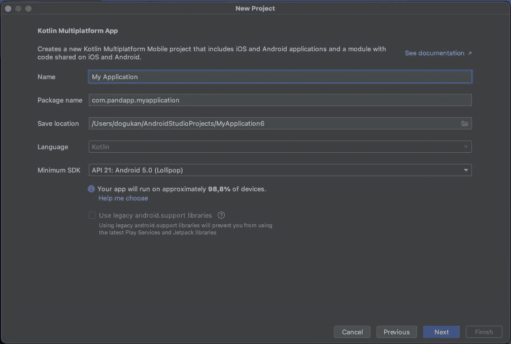
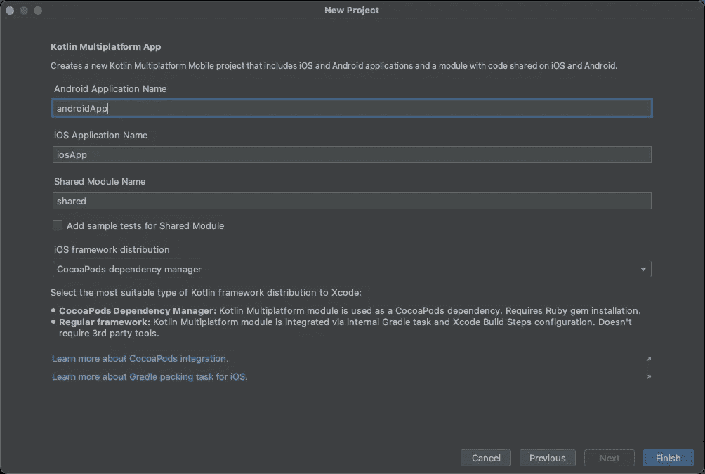
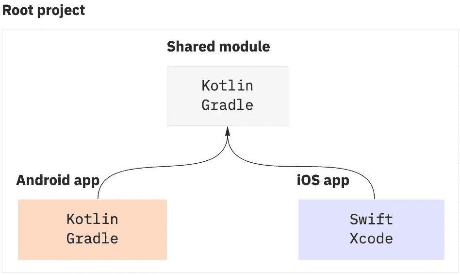

# 多平台移动开发指南

> 原文：<https://blog.devgenius.io/guide-to-multiplatform-mobile-development-1cfa7e9576ac?source=collection_archive---------5----------------------->

# 什么是 Kotlin 多平台移动设备？

Kotlin Multiplatform Mobile (KMM)是一个框架，允许您构建一个针对 Android 和 iOS 的应用程序。但是，与其他多平台框架不同，它并不试图让应用程序的所有代码都可以跨两个平台重用。相反，用干净的架构术语来说，UI 层是唯一需要本地开发的层，同时允许架构层的其余大部分被共享。

共享架构作为编译包提供给每个本机应用程序。然后在本机应用程序代码中访问这个包。KMM 有潜力成为许多平台的基础，包括 Android、JavaScript、Java、Kotlin 和 Swift iOS 代码库。

# KMM 必需的工具

**安卓工作室:** [下载安卓工作室& App 工具](https://developer.android.com/studio)

**Xcode**:[Mac App Store 上的 Xcode](https://apps.apple.com/us/app/xcode/id497799835)

**Brew :** [安装 Brew](https://brew.sh)

**苹果电脑/笔记本电脑**

# 初始设置

> 为了确保一切按预期运行，安装并运行 KDoctor 工具:

在 Android Studio 终端或您的命令行工具中，运行以下命令，使用 Homebrew 安装该工具:

*   [!]符号表示警告。

安装完成后，在控制台中调用 KDoctor:

2.

运行 KDoctor 命令后，它会扫描系统中所有的。KMM 开发所需的工具。该报告将显示在终端中。

在报告中:

*   [x]符号表示缺少的工具
*   [v]符号表示成功安装的工具
*   [!]符号表示警告。

> Kotlin 多平台移动插件

这个插件使得在 Android Studio 中创建一个 KMM 项目变得非常简单。它提供了创建 Kotlin 多平台应用程序的选项和 Kotlin 多平台库选项，在这些选项的帮助下，人们可以轻松地创建一个基本的 KMM 应用程序。

初始设置完成。我们准备创建一个 KMM 项目。

> 创建一个新项目，选择新的“Kotlin 多平台应用程序”

> 照常选择项目名、包名和项目位置。

> 您可以添加 Android 和 iOS 应用程序的名称。您还可以添加共享模块的名称。您可以选择为将保存您的业务逻辑的共享模块添加示例单元测试。

你可以在你的第一个项目中使用常规框架，因为这个选项不需要第三方工具，安装问题也较少。对于更复杂的项目，您可能需要 CocoaPods 依赖管理器来帮助处理库依赖。要了解更多关于 CocoaPods 以及如何为它们设置环境，请参见 [*CocoaPods 概述和设置*](https://cocoapods.org) *。*

> 点击完成，Android Studio 将为您创建一个 KMM 项目。

# 检查项目结构

每个 Kotlin 多平台移动项目包括三个模块:

*   *shared* 是一个 Kotlin 模块，包含 Android 和 iOS 应用程序的通用逻辑——你在平台之间共享的代码。它使用 [Gradle](https://kotlinlang.org/docs/gradle.html) 作为构建系统，帮助您自动化构建过程。*共享*模块内置于 Android 库和 iOS 框架中。
*   androidApp 是一个内置于 Android 应用程序中的 Kotlin 模块。它使用 Gradle 作为构建系统。androidApp 模块依赖并使用共享模块作为常规的 Android 库。
*   *iOSApp* 是一个构建到 iOS 应用程序中的 Xcode 项目。它依赖并使用共享模块作为 iOS 框架。共享模块可以作为常规框架使用，也可以作为 [CocoaPods 依赖项](https://kotlinlang.org/docs/native-cocoapods.html)，这取决于你在前面的 **iOS 框架分发**中选择的内容。在本教程中，它是一个常规的框架依赖。

# 参考

1.  [适用于 iOS 和 Android 的 Kotlin 多平台](https://kotlinlang.org/docs/multiplatform-mobile-getting-started.html#0)
2.  菲利普·莱克纳
3.  [继续编码](https://www.youtube.com/watch?v=ri6XfKmnC8w&t=171s)