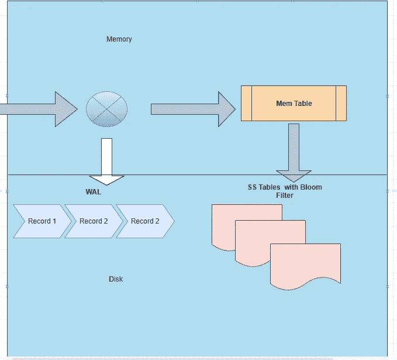

# 非 SQL 存储指南

> 原文：<https://blog.devgenius.io/guide-to-no-sql-storage-57abd2d63ca0?source=collection_archive---------5----------------------->

## LSM 树、SS 表和布隆过滤器

图片来源:[https://unsplash.com/@robsonhmorgan](https://unsplash.com/@robsonhmorgan)

在传统数据库 SQL DB 中，数据以 B 树的形式存储。它使用聚集索引来提高效率。

这对于处理大量数据来说效率不高或不可扩展。所以没有 SQL DB 不能用。

这些非 SQL 数据库使用的数据结构是日志结构的合并树。

# 存储的工作原理:

1.  所有写入数据库的数据都被写入磁盘上的 WAL(预写日志)。这是只附加日志，所以它很快。这仅用于在数据库崩溃时恢复数据库。
2.  然后将数据添加到 Mem 表中。这是在内存表中-它有键值对。键可以是事务 id，值可以是 JSON、String、HyperlogLog、Geo-Spatial Index 等任何值。
3.  数据会定期刷新到磁盘。在磁盘上，数据以排序字符串表(SS 表)的格式存储。
4.  SS 表根据关键字对数据进行排序。当存储密钥时，它也有时间戳。
5.  让我们假设一种情况，其中键值对被刷新到 SS 表 1。假设相同的键值再次出现，它再次刷新到磁盘— SS 表 2。
6.  现在我们有相同的关键是 SS 表 1 和 SS 表 2。这些表被周期性地合并以形成紧凑表。
7.  在 MongoDB 和 Cassandra 等不同的数据库中，压缩以不同的方式发生。

LST 树-记忆表和 SS 表

# 阅读的工作原理:

1.  当读取请求到来时，它在 Mem 表中搜索数据。如果存在，则返回。这是超级快的，因为它是从内存中返回的。
2.  如果不是，则在 SS 表中进行搜索。
3.  由于键是 SS 表排序，二分搜索法可以使用。
4.  现在的问题是，相同的密钥可以被刷新到不同的 SS 表。所以我们需要搜索所有的 SS 表(参考上面的步骤 5 和 6)
5.  基于时间戳，可以返回 SS 表中的最新值。
6.  然而，如果需要扫描许多 SS 表，它会减慢搜索速度。
7.  为了克服这个问题，每个 SS 表都有布隆过滤器。布隆过滤器是概率数据结构，下面解释。

# 布隆过滤器:

布隆过滤器是概率数据结构，具有以下特性

*   如果数据确实不存在，则返回 false。
*   它可以返回 true，其可能的数据可能存在，也可能不存在。

# 布鲁姆过滤器的工作原理:

下面是布隆过滤器的简化工作。

1.  假设我们有一个布尔值列表—假设大小为 100。
2.  假设有 4 个散列函数。
3.  现在，我们要搜索的键，将使用这些哈希函数进行哈希运算。
4.  假设这个键被这些散列函数散列，这个散列的值是 10，12，70，81。
5.  这些布尔值(在布尔列表中这些索引处)的值将为正。
6.  现在让我们说，如果这个键被再次搜索，这个键将被散列为相同的值。
7.  假设另一个关键字(用于搜索)散列为 10，51，52，98。
8.  当 10 存在且为正数时，布隆过滤器将返回数据存在(实际上并非如此)。所以全搜索将发生在这个 SS 表中。
9.  假设另一个关键字(用于搜索)散列为 11，71，81，95。
10.  因为这些都不是正的，它将返回这个值肯定不存在。

# 为了进一步阅读

**对于系统设计，机器学习博客在介质上遵循**[**anantech . ai**](https://smverma.medium.com/)**。**