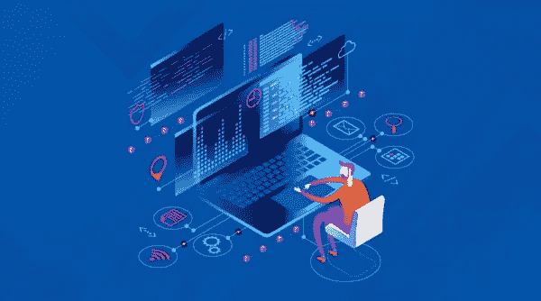
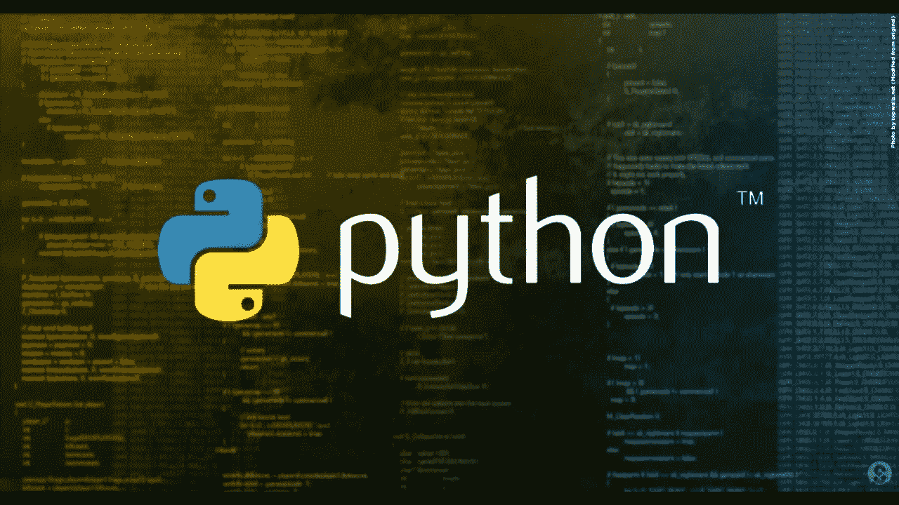

# 经济学本科生编程指南

> 原文：<https://blog.devgenius.io/guide-to-programming-for-economics-undergrads-4c6abc19fa0?source=collection_archive---------15----------------------->

你是经济学本科生吗？你想做编程吗？你知道如何开始吗？向下滚动，了解我是如何成为其中一员的。

## 1-决定你想用这种语言做什么

成为程序员的第一步是决定你想用编程做什么。否则，你在学习时会进退两难。同时决定任何种类的领域，如区块链开发、数据科学、web 开发和任何其他与编程相关的领域。

## 2-参加课程和做笔记

Youtube，Udemy，Coursera，Codeacademy，Futurelearn 等。他们为每一个可能的预算选项提供了很多很棒的课程。甚至有些提供某些免费课程，并允许某种代币交易他们的付费课程。第二部分是始终如一地跟随他们，做老师做的事情，不做任何改变，以跟上节奏，学习特定的结构。为了帮助记忆这些结构，把它们写在一张纸上，看一定时间，使它们被很好地记住。

## 3-还是老套，但是先学 Python

当一个人开始自己的编程之旅时，最常听到的话是。但是，它有一个很好的理由；因为 Python 是一种面向对象的语言，它的结构类似于大多数其他编程语言。如果你成功地学习了 Python

## 4-继续学习你所在领域所需的其他编程语言

仍然是学习编程时最常被告知的事情之一。因为不同的语言适用于不同的问题。更重要的是，在您的领域中使用的每个平台都有不同的用途，并且需要不同的编程语言。

## 5-跟上该领域的最新进展

在一个快速变化的环境中，需要跟上步伐对于让自己在编程相关领域保持领先是至关重要的。但是，如果您积极寻求改进并与您的朋友讨论，这对于跟上最新的平台和编程语言是一个好消息。更重要的是，不和谐和松散社区中的人真的很有帮助，因为他们在不同的领域工作。

## 学习你所在领域的编程语言的全部细节

因为编程需要在编程时非常注意细节。因为一个错误的函数、单词、字母和各种各样的东西都会破坏你的程序。走在这个问题的前面；你可以看教学视频，对关键结构做笔记。此外，参加更多关于最新编程语言和平台的课程，让你的领域跟上时代。

*你对经济学本科生的编程指南有什么看法？在下面的评论区分享你的想法。*