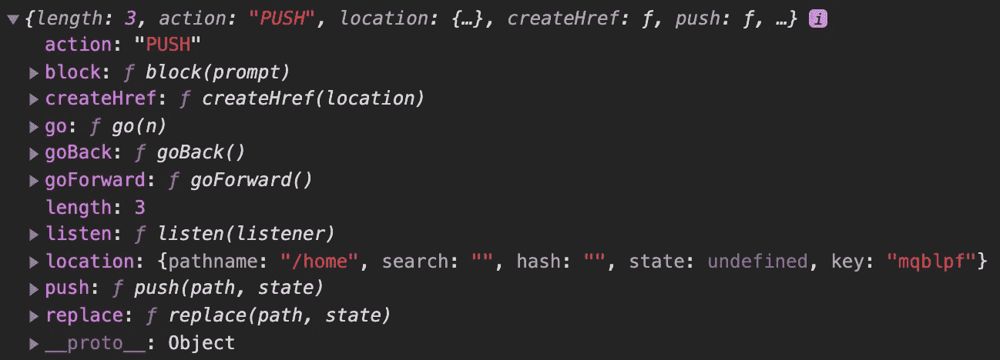
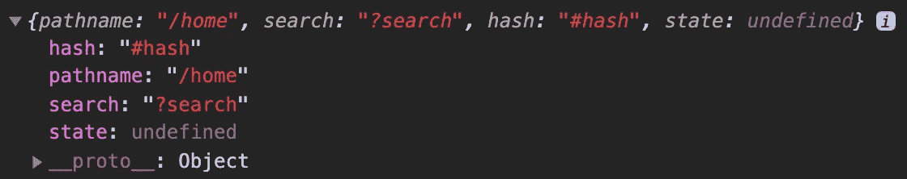
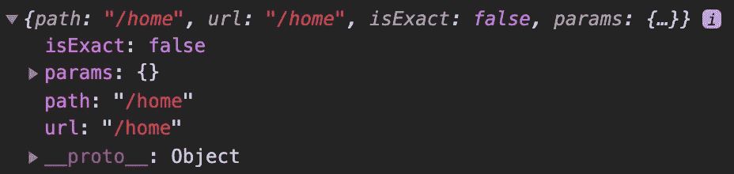
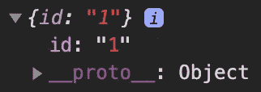
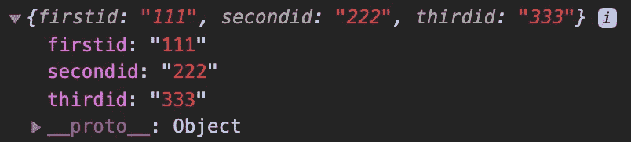

# React 路由器钩子使用指南

> 原文：<https://blog.devgenius.io/guide-to-using-hooks-in-react-router-7d9aabd6ae0e?source=collection_archive---------3----------------------->

## 了解 useHistory、useLocation、useRouteMatch 和 useParams 挂钩


照片由[莫希特·托马尔](https://unsplash.com/@mohittzomar?utm_source=medium&utm_medium=referral)在 [Unsplash](https://unsplash.com?utm_source=medium&utm_medium=referral) 上拍摄

当使用 React 构建应用程序时，处理路由的最流行的库是 React Router。如果您不熟悉 React 路由器，请查看下面的文章开始使用。

[](https://javascript.plainenglish.io/tutorial-and-beginners-guide-to-react-router-ee19ca31d7d) [## React 路由器教程和初学者指南

### 如何在 React web 应用程序中使用客户端路由

javascript.plainenglish.io](https://javascript.plainenglish.io/tutorial-and-beginners-guide-to-react-router-ee19ca31d7d) 

随着 React 16.8 的发布，React 路由器还引入了挂钩，可以轻松访问路由器的状态并执行导航。

在本文中，我们将了解 React 路由器 API 中包含的 4 个挂钩，其中包括:

*   `useHistory`
*   `useLocation`
*   `useRouteMatch`
*   `useParams`

# 使用历史

React 路由器包有两个主要的依赖项。一个是反应本身；另一个是[历史](https://github.com/ReactTraining/history)包。历史包允许你在一个 JavaScript 应用程序中管理你的会话历史。

要使用下面的任何一个钩子，我们首先需要从`react-router-dom`导入它们。

```
import { useHistory } from 'react-router-dom';
```

然后，就像任何 React 钩子一样，我们需要在一个功能组件中调用它。

```
*// inside of a functional component*
const history = useHistory();
```

`useHistory`钩子返回一个具有许多属性和方法的历史对象。



一些最常用的属性和方法包括:

*   **go( *n* )** —(函数)将历史堆栈中的指针移动 n 个条目。
*   **goBack()** —(函数)将历史堆栈中的指针移动-1。
*   goForward() —(函数)将历史堆栈中的指针移动+1。
*   **length** — (number)历史堆栈中的条目数。
*   **位置**——(对象)当前位置对象。
*   **push( *path* )** —(函数)将新条目推入历史堆栈。
*   **替换(*路径* )** —(函数)替换历史堆栈中的当前条目。

例如，我可以添加`push`方法作为按钮的`onClick`监听器。然后，如果我点击按钮，我将被路由到适当的网址。

```
<button *onClick*={() => history.push("/home")}>
  Home
</button>
```

# 使用位置

`useLocation`钩子返回一个位置对象。这与出现在`useHistory`钩子中的是同一个物体。

```
import { useLocation } from 'react-router-dom';*// inside of a functional component*
const location = useLocation();
```

每当 URL 改变时，将返回一个新的位置对象。位置对象通常由以下属性组成:

*   **hash**—(string)URL 哈希(#)片段。
*   **路径名** —(字符串)URL 的路径。
*   **搜索** —(字符串)URL 查询字符串(？).

例如，我将向 URL 添加一个搜索参数和一个散列。

```
[http://localhost:3000/home?search#hash](http://localhost:3000/blog?search#hash)
```

然后，如果我在这个 URL 上调用`useLocation`钩子，位置对象将会是这样的。



# useRouteMatch

`useRouteMatch`钩子返回一个匹配对象。

```
import { useRouteMatch } from 'react-router-dom';*// inside of a functional component*
const match = useRouteMatch();
```

match 对象包含有关路由路径如何匹配 URL 的信息。它将包含以下属性:

*   **isExact** — (boolean)检查整个 URL 是否匹配。
*   **params** —(对象)从 URL 解析的键/值对。
*   **路径** —(字符串)用于匹配的路径模式。
*   **url** —(字符串)url 的匹配部分。

比如，我会参观`[*http://localhost:3000/home*](http://localhost:3000/home)` *。*那么匹配对象会是这样的。


如果我访问`[*http://localhost:3000/home/111*](http://localhost:3000/home/111)` *，*，你可以看到`isExact`属性现在被设置为 false。这是因为整个 URL 路径不完全匹配。



# 使用参数

`useParams`钩子返回 URL 参数的键/值对对象。这是我们在来自`useRouteMatch`钩子的 match 对象中看到的同一个 params 对象。

```
import { useParams } from 'react-router-dom';*// inside of a functional component*
const params = useParams();
```

密钥将来自我们在添加路由时设置的参数。例如，我将添加以下路线:

```
<*Route* *path*="/home/**:id**" *component*={Home} />
```

那么 params 对象将看起来像这样。



我可以将 route 中的 **':id'** 的名称改为任意值，params 对象中的 key 也会随之改变。例如，我将添加以下路线:

```
<*Route* *path*="/home/**:firstid/:secondid/:thirdid**" *component*={Home} />
```

然后访问`[*http://localhost:3000/home/111/222/333*](http://localhost:3000/home/111/222/333)` *。*params 对象将看起来像这样。



# 结论

谢谢你的阅读！我希望本文有助于您更好地了解我们可以在 React Router 中使用的不同钩子。使用这些钩子可以很容易地访问路由器的状态，并在反应应用程序中执行导航。

请阅读下面的文章，继续学习反应路由器。

[](https://javascript.plainenglish.io/how-to-display-a-404-page-with-react-and-react-router-d16d66703e5e) [## 如何使用反应和反应路由器显示 404 页

### 用 404 页捕捉所有未知路线

javascript.plainenglish.io](https://javascript.plainenglish.io/how-to-display-a-404-page-with-react-and-react-router-d16d66703e5e) 

**资源**

*   [https://reactrouter.com/web/api/Hooks](https://reactrouter.com/web/api/Hooks)