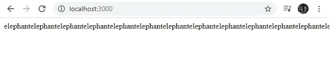
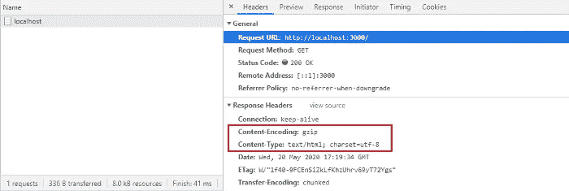

# 用 Node.js 压缩 Gzip

> 原文：<https://blog.devgenius.io/gzip-compression-with-node-js-cc3ed74196f9?source=collection_archive---------0----------------------->


**Node.js** 和 **Express.js** 中的**压缩**减少了网站或 app 的可下载数据量。通过使用这种压缩，我们可以**提高 Node.js 应用程序的性能**，因为我们的**有效负载大小显著减少了 70%** 。

# 介绍

**压缩**一般指使用数据压缩算法修改过的代码。不像**缩小**最终提供完全有效的代码，压缩代码必须在使用前解压缩。

对于每个 **HTTP 请求/响应**，浏览器和 web 服务器可以添加头部，以包含关于被搜索或接收的资产的附加信息。当浏览器在**请求头**中发送时，**接受编码**选项指定它支持哪些内容编码格式或压缩算法。

文本压缩算法有很多，但是对于 **HTTP 请求:**的压缩(和**解压缩**)只有 **3 支持** **算法**

*   **放气** ( **放气**):不常用。
*   **Gzip** ( **gzip** ):服务器和客户端交互使用最广泛的压缩格式。它基于 **Deflate** 算法，兼容当前所有浏览器。
*   **Brotli** ( **br** ):一种更新的压缩算法，旨在进一步提高压缩率，这可以导致更快的页面加载。它兼容大多数浏览器的最新版本。

另外，重要的是说还有 **2 种压缩方式**:

*   **中间件**:在这个方法中，我们直接在我们的 **Node.js** 应用程序中调用它，使用压缩**中间件**调用**压缩**。
*   **代理**:该方法通过 **NGINX** 或 **Apache** 在反向代理级别使用。

在本教程中，我们将关注第一个，通过**中间件**在我们的 **Node.js** 应用程序中直接调用它。

# 要求

我们只需要之前安装的 **Node.js** ，以及 **npm** 包管理器来下载**压缩**包:

**节点** > = **8.0** 以上

```
$ node --version
```

**npm** > = **5.0** 以上

```
$ npm --version
```

# 未压缩的示例

首先，我们运行命令 **npm init** :

```
$ npm init
```

使用 **npm init** 命令，我们将生成名为 **package.json** 的基本配置文件，从我们的教程开始，我们必须在终端中输入一些数据，另一种方法是创建 **package.json** 文件，如下所示:

```
// package.json
{
  "name": "nodejs-compression",
  "version": "0.0.1",
  "description": "Gzip compression with Node.js",
  "main": "server.js",
  "scripts": {
    "test": "echo \"Error: no test specified\" && exit 1"
  },
  "author": "Víctor Valencia Rico",
  "license": "ISC"
}
```

现在，我们需要用 **express** 包安装 **Express.js** :

```
$ npm i express --save
```

接下来，我们将创建我们的 **server.js** 文件，该文件将包含以下代码:

```
// server.js
const express = require('express');
const app = express();app.get('/', (req, res) => {
  const animal = 'elephant';
  // It will repeatedly send the word 'elephant' in a 
  // 'text/html' format file
  res.send(animal.repeat(1000));
});app.listen(3000, function () {
  console.log('Example app listening on port 3000!');
});
```

我们运行我们的应用程序:

```
$ node server.js
```

我们在浏览器中打开 [http://localhost:3000](http://localhost:3000) 来查看我们的应用程序的结果。



在上面的例子中，我们调用了一个 **GET** 操作，该操作将发送一个 **text/html** 格式文件，其中的 **word elephant 打印了 1000 次**。**不压缩**，服务器返回的响应大约为 **8 kB** ，如下图所示:


# Gzip 压缩示例

要在您的 **Node.js** 应用程序中开始使用**压缩**，您可以在您的 **Node.js** 应用程序的主文件中使用压缩**中间件**。这将**启用 GZIP** ，它支持不同的压缩方案。这将**使你的 HTTP 响应变小**。

现在我们安装**压缩**包:

```
$ npm i compression --save
```

然后，在初始化应用程序的服务器后，我们可以在应用程序中使用该模块，如下例所示，我们修改了代码:

```
// server.js
const compression = require('compression');
const express = require('express');
const app = express();// Compress all HTTP responses
app.use(compression());app.get('/', (req, res) => {
  const animal = 'elephant';
  // It will repeatedly send the word 'elephant' in a 
  // 'text/html' format file
  res.send(animal.repeat(1000));
});app.listen(3000, function () {
  console.log('Example app listening on port 3000!');
});
```

我们运行我们的应用程序:

```
$ node server.js
```

我们在浏览器中打开 [http://localhost:3000](http://localhost:3000) 来查看我们的应用程序的结果。


现在，如果打开了压缩，那么发送的响应带有一个 **Content-Encoding: gzip** 头，仅重 **336 B** 。表示与没有压缩的示例相比，最终响应中的 **96%** **节省。**



# 附加配置

除了**默认设置**之外，您还可以定制您的压缩以满足您的需求。在 options 对象中可以使用几种不同的属性。要获得可供选择的完整属性列表，请参见文档[这里](https://www.npmjs.com/package/compression)。

为了给压缩添加选项，我们将代码修改如下:

```
// server.js
const compression = require('compression');
const express = require('express');const app = express();const shouldCompress = (req, res) => {
  if (req.headers['x-no-compression']) {
    // Will not compress responses, if this header is present
    return false;
  }
  // Resort to standard compression
  return compression.filter(req, res);
};// Compress all HTTP responses
app.use(compression({
  // filter: Decide if the answer should be compressed or not,
  // depending on the 'shouldCompress' function above
  filter: shouldCompress,
  // threshold: It is the byte threshold for the response 
  // body size before considering compression, the default is 1 kB
  threshold: 0
}));app.get('/', (req, res) => {
  const animal = 'elephant';
  // It will repeatedly send the word 'elephant' in a 
  // 'text/html' format file
  res.send(animal.repeat(1000));
});app.listen(3000, function () {
  console.log('Example app listening on port 3000!');
});
```

# 结论

**压缩**我们的请求肯定会提高我们的 **Node.js** 应用程序的性能，将用户负载和等待减少**超过 70%** 。

*西班牙文原文发表于 https://www.victorvr.com*[](https://www.victorvr.com/tutorial/compresion-gzip-con-nodejs)**。
关注我:*[*https://medium.com/@victor.valencia.rico*](https://medium.com/@victor.valencia.rico)*