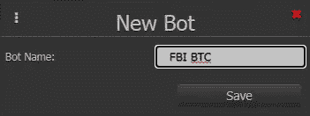

# 面向非程序员的 HaasScript

> 原文：<https://blog.devgenius.io/haasscript-for-non-programmers-672e15c9825e?source=collection_archive---------11----------------------->

卢卡·布拉沃在 [Unsplash](https://unsplash.com?utm_source=medium&utm_medium=referral) 上的照片

HaasScript 是 [HaasOnline Trade Server 的](https://www.haasonline.com/)自己的脚本语言，运行在云中。这种定制脚本语言旨在使脚本编写变得更简单、功能更强大，它有 600 多个内置命令。HaasScript 仍然相对年轻，但它有望非常强大。更多细节和例子可以在[这里](https://help.haasonline.com/api/haasscript/using-haasscript)找到，但是作为一个像我这样的非程序员，你可能不会太在意学习超过 600 个命令。是时候认输，把 HaasScript 留给开发者了吗？

# 使用第三方代码

对我们来说幸运的是，有[https://www.haasscripts.com/](https://www.haasscripts.com/)，在那里可以免费获得 HaasScript 交易机器人。下面，我将展示在没有编程知识的情况下使用 HaasScript 交易机器人的必要步骤。所以，让我们把编程留给其他人，专注于配置一个免费的交易机器人。使用第三方交易机器人对你的交易来说是令人兴奋的一步，它允许你建立在开源社区的基础上，并使用一些最好的代码。

# 使用第三方代码时要考虑的风险

严格的测试在第三方代码中经常被忽略。在第三方贸易机器人访问你的钱包之前，你应该彻底测试它。文档通常很少，需要一些努力来理解贸易机器人是如何工作的。如果出现问题，你承担全部责任和损失。如果是因为第三方代码的 bug，也没关系；如果你使用交易机器人，那是你的问题。

# 我们开始吧

开始之前，请确保您使用的是最新的测试版。请使用关于如何[将 HTS 升级到最新测试版](https://help.haasonline.com/docs/getting-started/updating-hts/beta-update)的说明。我们将使用期货 Band-It (FBI) bot，它仅在期货和杠杆交易所上工作，我们将在币安期货上使用它([加入币安期货](https://www.binance.com/en/futures/ref/usehaas)，关于如何[启用您的币安期货账户](https://help.haasonline.com/docs/getting-started/configuration/exchanges/binance-futures)的说明)。该机器人是 3 个月前发布的，此后已经修复和改进了几次。FBI 是一个非常强大和动态的网格机器人，它使用 ATR(平均真实范围)进行下单，使用 ADX(平均方向指数)来限制交易的时间和地点，它有许多设置，允许我们根据自己的喜好进行定制。

# 创建模拟账户

如果你还没有币安期货的模拟账户，那么按照这里的[步骤](https://help.haasonline.com/docs/bot-tools/backtesting-and-paper-trail#steps)创建一个，并添加一些资金。通过左侧面板，进入设置—价格驱动&账户，点击添加新账户，创建模拟币安期货账户。

输入名称，将账户类型更改为杠杆交易，选择币安期货作为平台，然后单击模拟账户复选框。单击保存创建帐户。

几秒钟后，我们的模拟帐户应该会有一个绿色的对勾。点击美元钞票编辑虚拟钱包，并检查可用资金。

里面应该已经有 100，000 USDT 了，如果没有，在虚拟钱包的 USDT 行中输入金额来添加。

请确保您了解模拟帐户如何工作，以及设定的模拟类型如何影响模拟引擎考虑未完成订单的方式。有两种选择

*   达到价格。选择此类型时，当价格为 100 美元或更高时，将填写 100 美元的未结买入订单。
*   价格突破。使用这种类型，当价格高于 100 美元时，100 美元的未结买入订单被执行。

为什么这很重要？在模拟引擎中，机器人在“空”订单簿中交易。这意味着你永远是一个价位的唯一订单。根据订单簿的流动性，交易所的情况并不总是如此。达成的设定价格可以让机器人交易比实际交易多得多。反之亦然，被突破的价格可能会使机器人无法在实际交易中进行交易。您可以通过设置—设置—常规下左侧的面板设置应用的模拟类型。

# 哈斯脚本编辑器

最后，导航到左侧面板的 HaasScript 部分中的脚本编辑器。左栏用于更改 HaasScript 设置。请将帐户、市场、杠杆和交易金额更改为打印屏幕上显示的设置。如果您的 HaasScript 有设置，它们也会出现在这里。在下一篇专栏文章中，我们将打开和关闭项目，编写脚本，并可以编辑代码。

点击“新脚本”并填写“期货 Band-It”作为脚本的名称和描述(可选)，然后点击“新建”。

几秒钟后，编辑器显示了我们的空脚本。

让我们前往[https://www.haasscripts.com/t/pshaibot-futures-band-it/](https://www.haasscripts.com/t/pshaibot-futures-band-it/)并阅读描述。在描述的下面，你可以看到几行代码。点击代码预览下方的“复制到剪贴板”。

切换回脚本编辑器，单击编辑器的第一行(左边有“1”的那一行)粘贴您之前复制的代码。

要在窗口上粘贴[，按住“Ctrl”键，再按“V”(Ctrl+V)，瞧，你就大功告成了！](https://mouse-box.com/how-to-copy-and-paste-without-a-mouse-in-different-operating-systems-os/)

最后但同样重要的是:单击蓝色磁盘符号保存我们的 HaasScript。

几秒钟后，我们的代码被保存，我们可以在左栏中看到 bot 设置。

# 哈斯实验室，疯狂科学家的实验室

在接下来的步骤中，我们必须在左侧面板的哈斯脚本部分导航到[哈斯实验室](https://help.haasonline.com/docs/bot-tools/haas-labs)。哈斯实验室是那些想要为他们的哈斯脚本找到最佳设置的“疯狂科学家”的完美去处。我们单击“Select Script ”,打开之前创建并保存的脚本。

在加载我们的脚本后，Haas Labs 向我们展示了带有大量参数的两列。左边一栏是调整设置，中间一栏是 FBI HaasScript bot 的参数。您可能希望从下面打印屏幕上的参数开始。输入所有参数后，点击中间栏底部的“开始测试”。

请注意，在哈斯实验室进行测试可能非常耗时。在我的 Haas VPS 上用上述设置运行 250 个测试已经花了 70 多分钟。

您可以按任何列对结果进行排序，例如总增益或 ROI。要在 Haas Bot 中保存设置，请在相应行的选项下单击“导出到 Bot”。

给它起一个有意义的名字，然后点击“保存”。

几秒钟后，机器人将被保存并在屏幕上打开。

# 使用哈斯机器人

通常我会在机器人设置的左栏底部再次点击“保存”，但这可能是不必要的。

请确保您了解您设置和使用的参数的后果。本例中的基本设置是 12 个连续订单，第一笔订单大小为 0.01 合约(等于币安期货的 0.01 BTC)，订单大小乘数为 1.5，获利为 0.40%。这意味着，bot 将增加订单，仓位大小增加到 1.29 份合同(1.29 BTC)。

如果需要特定参数的更多信息，请使用工具提示。

bot 的主图表允许您切换到脚本图表。脚本图表对脚本执行回溯测试，并将结果投射到图表上。这不是机器人的准确表现。

为了进一步测试这个机器人，你应该在模拟的币安期货账户上运行它。要访问我们的机器人，我们需要在左侧面板的 HaasScript 部分导航到 Haas 机器人。Haas Bots 列出了所有 HaasScript bots，并作为每个 bot 的附加选项的仪表板。

点击选项下右侧的“打开机器人”打开机器人屏幕。如果你打开一个激活的机器人，你会发现更多的信息。

我通常用不同的设置运行几个机器人，并喜欢对我的机器人的开放订单有一个概述。Haas Bots 在切换到开放订单视图后提供了这一概述。

除此之外，我还创建了一个[定制仪表板](https://help.haasonline.com/docs/bot-features/dashboard)来显示未结订单的图表视图。

# 面向非程序员的 HaasScript

即使不写代码，HaasScript 机器人也提供了很多。在哈斯实验室找到好的设置可能是一项非常耗时的任务，尤其是对于像 FBI 这样更复杂的机器人。确保你了解机器人是如何工作的，并先在模拟账户上运行一段时间。试着理解止损什么时候激活，需要多少钱才能避免在交易所被平仓。

因为这里也一样，没有付出就没有收获，没有努力就没有成功。