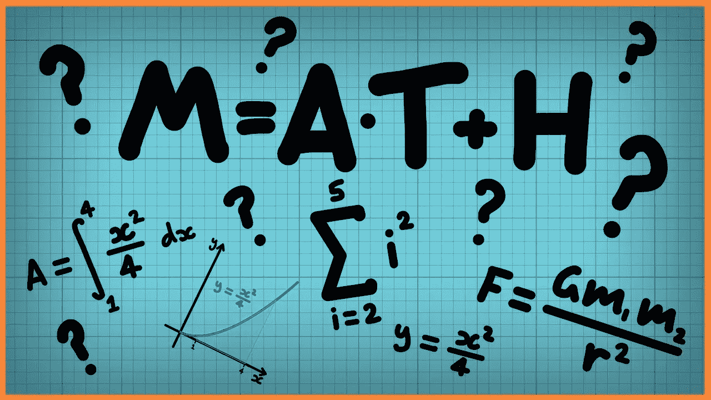
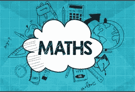

# 破解数学

> 原文：<https://blog.devgenius.io/hacking-through-mathematics-41f8e21065c0?source=collection_archive---------8----------------------->

*同样的统计黑客指南。以下是我如何设法破解数学的细节。*

尽管数学看起来非常复杂和枯燥，但当你破解这个系统时，它会有趣得多。我们来深入了解一下数学是如何被黑的。

## 1-数学不需要费力

相反，即使每天半小时也足以产生巨大的进步。你只需要仔细选择你的资源。其余的学习是通过转发主题来处理的，因为它们都是相互关联的。因此，你不必同时复习不同的科目。

## 2-当你把数学和应用结合起来的时候很有趣

我不是指大学里教的常规应用。相反，它们与你的领域、兴趣和现实生活有关。因此，你会有动力每天学习数学。而且，你对数学的理解会变得更加广泛，从而将你的知识应用到你感兴趣的应用中。

## 3-编程添加了统计数据

计算机让我们的学习变得更加简单，数学也不例外。只是统计数据变得更容易处理。但是，你仍然需要处理不断扩大的数据集。如果你不只是从事统计工作，它涵盖了你做数学计算。谢天谢地，像 python 这样的现代编程语言已经解决了复杂计算的问题。

## 数学是一个兔子洞，小心选择你的题目

这取决于你用数学做什么。你的职业是什么，你为什么学习是决定你想学什么的第一步。然后，最简单的部分开始了:为你的学习做计划。规划包括应该学习什么，以及如何在可用的时间范围内进行规划。一旦你完成了计划，你就需要一台电脑，几个好的笔记本，取决于你想学的主题，以及连贯性。在你感兴趣的领域成功地应用数学并没有太多的要求。

***综上所述，通过数学进行黑客攻击并没有太多的要求。它只需要一台电脑，好的笔记本，你可以记笔记，一致性，和对应用的好奇心。***

你是如何破解数学的？在下面的评论区分享你的想法。