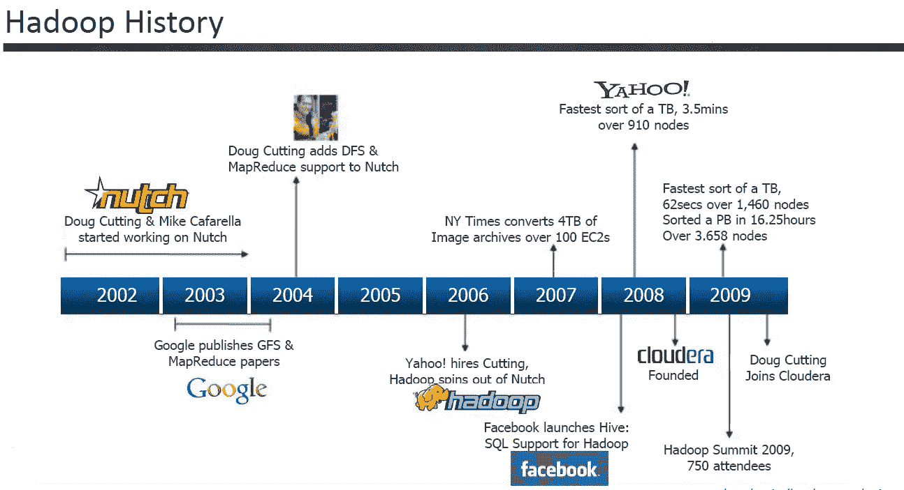
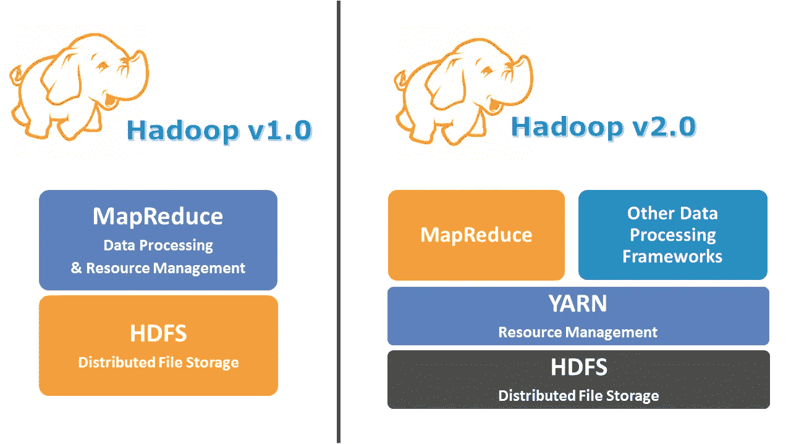
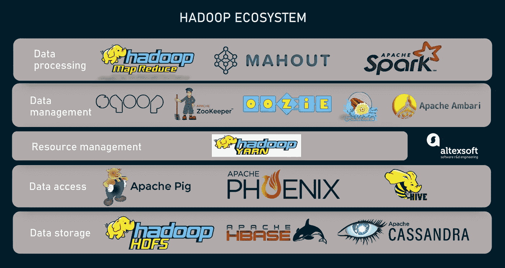
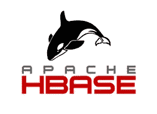

# HADOOP —大数据框架

> 原文：<https://blog.devgenius.io/hadoop-the-big-data-framework-8b063fc2d83f?source=collection_archive---------9----------------------->

让我们解决一些大问题！

# **简介**

在上一篇[***文章***](https://medium.com/@prikshitsingla78/an-introduction-to-big-data-8cebc140c2cf) 中，我们深入了解了大数据的世界，了解了何时可以将数据称为**【大】**，并了解了处理和存储数据所需的系统类型。在本文中，我们将继续我们的旅程，学习帮助我们解决大数据问题的框架— **Hadoop。**

因此，在理解它由什么组成，如何用它来解决问题之前，让我们倒回时钟🕑首先，了解更多关于它的起源。

我同意！

# **Hadoop 的演进**

让我们来看看 Hadoop 从起步到成熟的过程。

它是开源的，任何人都可以投稿，看看这个> >[https://github.com/apache/hadoop](https://github.com/apache/hadoop)

> 2002 年——这一年**道格·卡丁**和**迈克·卡法雷拉**开始了阿帕奇·努奇项目的工作。
> 
> **2003** — Google 发表了[**GFS**](https://static.googleusercontent.com/media/research.google.com/en//archive/gfs-sosp2003.pdf)**(Google 文件系统)论文。本文描述了如何存储大型数据集。**
> 
> ****2004**——谷歌发布了另一篇论文来描述如何处理大型数据集。这篇论文被命名为 [**MapReduce**](https://static.googleusercontent.com/media/research.google.com/en//archive/mapreduce-osdi04.pdf) 。**
> 
> **现在，雅虎来了！实施所有这些文件。GFS 的实现被称为 **HDFS** (Hadoop 文件系统)，实现 MapReduce 与 **MapReduce** 保持一致。**

**在上一篇文章中，我告诉你用谷歌搜索大象标志背后的有趣故事。霍普，你们都做到了🤗。因此，Hadoop 本身作为一个单词没有任何意义，实际上它是道格的儿子拥有的黄色玩具大象的名字，它的名字和标志就是从那里来的。**

****

**可爱吧！**

> ****2009** — Hadoop 归入 Apache 软件，成为**开源。开源意味着它的代码对所有人开放，任何人都可以为它做出贡献。是不是很神奇？你可以点击查看 Hadoop 开源代码****
> 
> ****2013** — Apache 发布了 Hadoop 2.0 以提供重大增强。这是一次重大的进化。我们将在接下来的文章中彻底了解它。**

**所以，看起来我们用一些简短的细节报道了重要的事件。如果你想详细了解这一历史事件，请访问 geeksforgeeks.org 的 [**页面**](https://www.geeksforgeeks.org/hadoop-history-or-evolution/) 。**

# ****Hadoop 内核****

**Hadoop 核心的两个主要组件是:**

****HDFS :** Hadoop 分布式文件存储。是 GFS 纸的实现。Hadoop 的存储组件以块的形式存储数据。至于大数据处理，我们使用分布式系统/水平扩展。因此，HDFS 通过将数据存储在集群中的多台机器上来帮助实现数据的分布式存储。它遵循主从架构，由名称节点和数据节点组成。我们将在接下来的文章中详细了解它。**

**MapReduce : MapReduce 有助于以分布式方式处理数据。是用 Java 写的。它包括两个阶段**

1.  **地图阶段**
2.  **减少阶段**

**我们还将在接下来的博客中的一篇完整的独立文章中了解它。**

**现在，正如我已经提到的，Hadoop 2.0 是一个巨大的变化。让我们来理解这个大变化。**

****

**在 Hadoop 1.0 中，我们只有 MapReduce 和 HDFS，但在 Hadoop 2.0 中，YARN 也加入了这个行列。为什么我们首先需要纱线？在 Hadoop 1.0 中，MapReduce 很庞大，要做很多工作，包括资源管理，所以 YARN(另一个资源协商者)承担了资源管理的责任，并提供了一些自己的新功能。我们也将深入挖掘纱线，请耐心等待并保持联系。**

****Hadoop 2.0****

**HDFS —存储单元**

**MapReduce —计算引擎(处理)**

**纱线——资源管理**

# **Hadoop 生态系统**

****

**让我们来看看 Hadoop 生态系统中的一些组件。**

****蜂巢****

****

*   **Hive 用于查询数据。**
*   **它将 SQL(实际上是类似于 SQL 的 HQL (Hive Query Language ))转换为核心的 MapReduce 内部代码。**
*   **它是建立在 Apache Hadoop 之上的数据仓库工具，用于提供数据查询和分析。**
*   **它是由 Meta 公司(脸书)开发的。**

****SQOOP****

****

*   **Sqoop 用于数据接收和迁移**
*   **一个命令行界面，可将数据从传统数据库传输到您的 Hadoop 或 HDFS，反之亦然**

****猪****

****

*   **它有助于数据处理**
*   **它有助于清理数据。**
*   **它用于将非结构化数据转换为结构化形式。**
*   **使用脚本语言—猪拉丁语**

****HBASE****

****

*   **在 HDFS 上运行的面向列的 NoSQL 数据库**

****OOZIE****

****

*   **管理 Apache Hadoop 作业的工作流调度系统**

****火花****

****

*   **一种分布式通用内存计算引擎**
*   **它是 MapReduce 的替代产品**
*   **可以使用任何存储，如:本地，HDFS，亚马逊 S3 和资源管理器，如:纱，Kubernetes，Mesos**
*   **Spark 是用 Scala 写的，支持 Scala、Python、Java 和 R**

**术语太多，记不住。**

****

**当然比生物简单！**

**但是我们还是有一些漂亮简洁的 logos。别担心，我们会非常详细地介绍它们。**

**干杯🤗读者，如果你已经走了这么远..**

**让我们以一个快乐的音符来结束这篇博客吧！**

****

**还是！有很多东西要学**

**我希望你们都喜欢阅读并享受学习 Hadoop 的乐趣。我们刚刚开始，接下来我们将开始了解 HDFS。**

****谢谢！为了阅读。在评论中分享你的想法，并请分享对需要改进的部分的反馈，以便我下次可以改进。****

****跟随..☺️** [**我**](https://medium.com/@prikshitsingla78) **更多这样有见地的 articles✍️****

****祝大家愉快。****