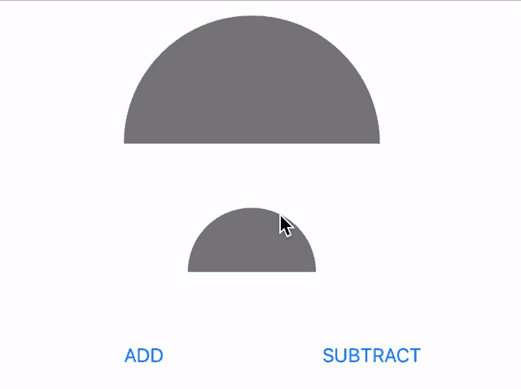
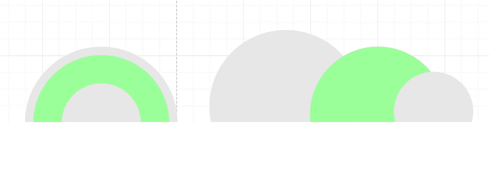
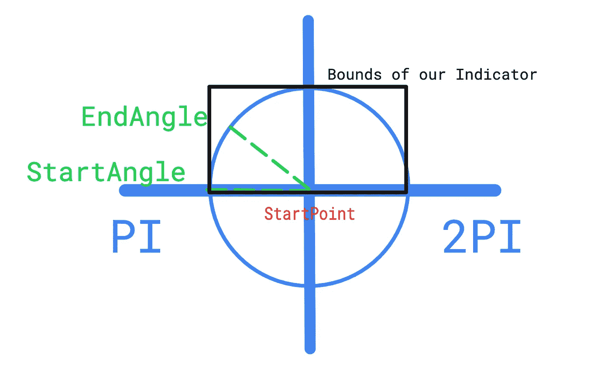

# Swift 上的半圆进度指示器。如何用 UIBezierPath 画半圆？

> 原文：<https://blog.devgenius.io/half-circle-progress-indicator-on-swift-how-to-draw-a-half-circle-with-uibezierpath-88bdf3665fb9?source=collection_archive---------1----------------------->

我想分享我在自定义进度指示器创建方面的经验。我将展示如何用 UIBezierPath 创建一个自定义进度指示器，如下图所示(完整项目在此处 [Github 库](https://github.com/alexnikol/halfCircleIndicator)):



让我们从这个想法开始。我们需要为第一个指示器创建 3 层( **CALayer** )，为第二个指示器创建 2 层。主要技巧是 3 个半圆互相夹住，如下图所示:



这是一个完整的指示器类。它有两种模式——有内圈和没有内圈，就像在第一张 gif 上一样。

现在我将解释它是如何工作的。

我们来讨论一下`**getOutherGrayCircle**`函数。在这段代码中，每个半圆有 3 个函数。因为它们都是半圆，那么我们需要理解如何只画第一个半圆，另外两个半圆也会画得一样。

```
func getOutherGrayCircle() -> CAShapeLayer {
        let center = CGPoint(x: fullSize.width / 2, y: fullSize.height)
        let beizerPath = UIBezierPath()
        beizerPath.move(to: center)
        beizerPath.addArc(withCenter: center,
                    radius: grayCircleSize.width / 2,
                    startAngle: .pi,
                    endAngle: 2 * .pi,
                    clockwise: true)
        beizerPath.close()
        let innerGrayCircle = CAShapeLayer()
        innerGrayCircle.path = beizerPath.cgPath
        innerGrayCircle.fillColor = UIColor.gray.cgColor
        return innerGrayCircle
    }
```

UIBezierPath 的中心点是视图上 X 轴和最大 Y 轴的中心点(下图中坐标系的中心)。`**startAngle**`永远是。我们需要计算圆周率和`**endAngle**`(这取决于指标应该显示多少百分比)。`**endAngle**`有 2 *的限制。圆周率



所以现在我们可以创建一个半圆。两个灰色半圆将是静态的，这就是为什么**getouthergraycound**和**getinnergraycound**中的`**startAngle**`和`**endAngle**`等于。圆周率和 2 *。

我们只有一个动态半圆— **getGreenCircle** 。这里我们需要设置`**endAngle**`来决定指示器应该显示多少百分比。例如:如果我们需要 60%的指标，那么 **:**

> endAngle = *。pi +。圆周率* 0.6*

现在，我们可以创建所有 3 个圆，并将它们添加到父层:

```
func drawShape(bounds: CGRect) {
        fullSize = bounds.size
        grayCircleSize = fullSize
        greenCircleSize = CGSize(width: bounds.width - 6.0, height: bounds.width - 6.0)
        innerGrayCircleSize = CGSize(width: greenCircleSize.width - 44.0,
                                     height: greenCircleSize.width - 44.0)
        let outerCicrcle = getOutherGrayCircle()
        let greenCircle = getGreenCircle()
        progressLayer = greenCircle
        self.layer.addSublayer(outerCicrcle)
        self.layer.addSublayer(greenCircle)
        if isInnerCircleExist {
            let innerGrayCircle = getInnerGrayCircle()
            self.layer.addSublayer(innerGrayCircle)
        }

        self.layer.masksToBounds = true
    }
```

对于没有内部灰色半圆的指标，我们就不需要画这一层了。仅此而已。

# 资源:

[Github 资源库](https://github.com/alexnikol/halfCircleIndicator)

[](https://medium.com/macoclock/quick-start-with-calayer-and-cabasicanimation-e3ff17ea6f11) [## CALayer 和 CABasicAnimation 快速入门

### 张贴关于 CALayer 和层动画的基本理解

medium.com](https://medium.com/macoclock/quick-start-with-calayer-and-cabasicanimation-e3ff17ea6f11) [](https://medium.com/macoclock/how-to-solve-the-maskstobounds-problem-with-the-shadow-of-uiview-47acc469b8ea) [## 如何用 UIView 的影子解决 masksToBounds 问题？

### 简单的技巧，只需几个盘子

medium.com](https://medium.com/macoclock/how-to-solve-the-maskstobounds-problem-with-the-shadow-of-uiview-47acc469b8ea)