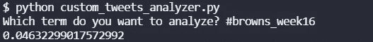
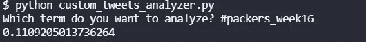

# 半场推特情绪:包装工布朗队，第 16 周

> 原文：<https://blog.devgenius.io/halftime-twitter-sentiment-browns-at-packers-week-16-22e57c66db7f?source=collection_archive---------6----------------------->

## 推特情绪能预测 NFL 比赛吗？半场版第 3 轮

[来自美国赌博网站的图片](https://www.usgamblingsites.com/news/nfl-betting-pick-green-bay-packers-at-minnesota-vikings/)

这是检验推特情绪如何预测 NFL 半场比赛的第三部分。在第 15 周[红雀队 vs 雄狮队](/can-twitter-sentiment-predict-nfl-games-cardinals-at-lions-week-15-e87ad8ace99a)的中场休息时，情绪较高的球队(雄狮队)赢得了比赛。在第 16 周泰坦的[49 人队中场休息时，情绪较高的球队(49 人队)输了。](/nfl-twitter-nlp-49ers-at-titans-week-16-84862ce4569e)

这意味着到目前为止，半场时推特预测比赛的情绪是 1 比 1。让我们看看我们从今天布朗队对包装工队的比赛中得到什么。包装工队在半场时以 21 比 12 领先，所以我希望包装工队今天有更高的情绪。让我们看看推特有什么说的。

## 布朗情绪

布朗队在上半场落后 9 分。他们现在的战绩也比包装工差得多，这对他们来说是一场客场比赛。

布朗的推特情绪@半场，第 16 周，作者图片

从各方面考虑，布朗一家有着不错的推特人气。0.0463 没那么差。这比华盛顿足球队和海鹰队进入第 15 周比赛时的情绪还要高。我很惊讶它没有像上次的 49 人队和泰坦队一样消极。也许布朗队的球迷只是更积极的人。

## 包装工情绪

包装工队领先 9 分，亚伦·罗杰斯今天打破了布雷特·法弗包装工队的触地得分记录。

包装工推特情绪@半场，第 16 周，作者图片

不出所料，包装工现在有相当高的推特人气。他们在半场领先，亚伦罗杰斯在外面做他的事情。这与他们在第 15 周对阵乌鸦队的赛前情绪相比是一个相当大的转变。我想这是因为围绕 Aaron Rodger 的 COVID 的争议已经平息了。

## 总体评论

嗯，我猜半场推特人气高的队伍会赢。那是包装工队。他们的情绪和得分都上升了不少。

要了解更多关于我们如何进行这些情感分析，请阅读[如何从命令行搜索 Twitter](https://pythonalgos.com/2021/12/02/search-twitter-from-your-command-line-with-python/)，以及这篇展示了 [Twitter 情感分析](https://pythonalgos.com/2021/11/29/twitter-sentiment-for-stocks-starbucks-11-29-21/)的文章。

如果你喜欢这篇文章，请在 Twitter 上分享！要想无限制地获取这样的媒体文章，今天就注册成为[媒体会员](https://www.medium.com/@ytang07/membership)！更多此类文章，记得关注[唐](https://www.medium.com/@ytang07)！