# [手册] AWS 步进功能输入和输出操作

> 原文：<https://blog.devgenius.io/handbook-aws-step-functions-input-and-output-manipulation-f94d57087e41?source=collection_archive---------0----------------------->

在本手册中，我们将解释 **AWS 阶跃函数输入和输出操作**。

有很多关于 AWS 阶跃函数的话题。自 2016 年 Step Functions 引入以来，网上有很多关于 AWS Step Functions 的文章。这些文章中的大部分可能会让您认为 Step Functions 实际上是 Lambda 函数的扩展，允许您组合几个 Lambda 函数来相互调用。

**但事实并非如此，阶跃函数远不止如此。** AWS Step Functions 允许用户以非常简单的方式在您的应用程序中设计和构建**整个流程执行模块**。所有这些都使开发人员能够专注于确保**每个模块运行其主要任务**，并且您不必担心将每个模块与所有其他模块连接起来。

> 您可以在我们的[阶跃函数最终指南](https://dashbird.io/blog/ultimate-guide-aws-step-functions/)和[最佳阶跃函数用例](https://dashbird.io/blog/aws-step-functions-use-cases/)文章中了解更多关于阶跃函数的信息。

# 什么是阶跃函数输入/输出？

为了在 AWS Step Functions 中有效地设计和实现工作流，理解信息从一种状态到另一种状态**的流动是至关重要的。不过，学会如何处理和过滤这些数据也很重要。**

在下图中，您将注意到 JSON 信息在整个任务状态中的移动:

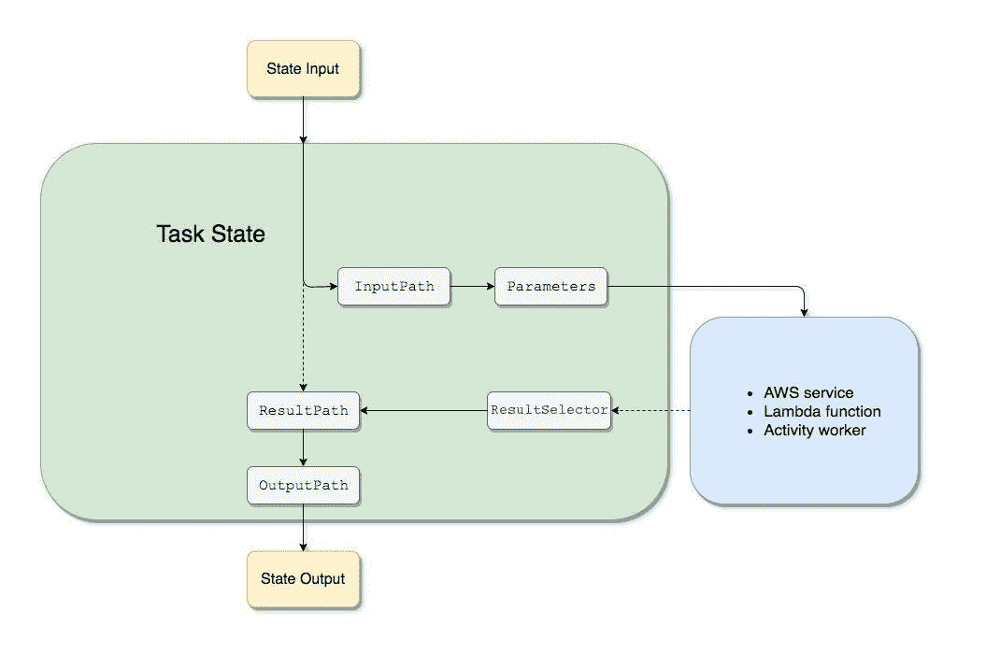

*输入路径、输出路径、结果路径、参数*和*结果选择器*，将在 JSON 通过工作流中的每个状态时对其进行操作。

# 小路

路径是亚马逊州语言中以 *$* 开头的**字符串，您可以用它来**识别 JSON 文本中的组件**。当您确定*输入路径、结果路径*和*输出路径*的值时，您可以指定一个允许您**访问输入的子集的路径。****

# 参考路径

引用路径也是一条路径，但是它的语法受到限制，只能识别整个 JSON 结构中的一个节点:

*   您只需要使用点`(.)`和方括号`([ ])` 符号就可以成功访问对象字段。
*   这些运营商`@ .. , : ? *`是不被支持的。
*   `length()`等功能也不支持。

一个很好的例子是状态输入数据具有以下值:

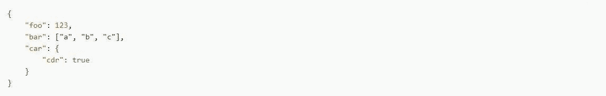

此外，这些引用路径将返回:

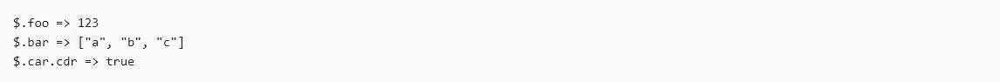

一些状态利用路径，它们也引用路径，这样它们可以**控制状态机**的整个流程，甚至配置状态的选项或设置。

# 输入路径、结果选择器和参数

*输入路径、结果选择器*和*参数*字段让您有可能在 JSON 在您的工作流程中移动时对其进行**操作。 *InputPath* 可以**限制通过过滤 JSON 符号和利用路径传递的输入**。 *ResultSelector* 字段为您提供了甚至在 *ResultPath* 被应用**之前**操纵状态结果的可能性。Parameters 字段为您提供了传递一组键值对的可能性。这些值或者是您利用路径从输入**中选择的值，或者是您将在您的状态机定义中**定义的静态值。**

AWS Step 函数将应用 *InputPath* 字段作为主字段，只有在此之后，它才会应用 Parameters 字段。如果您首先通过*输入路径*将原始输入过滤成您想要的选择，那将是最好的。然后你应该应用参数，这样你就可以**进一步操作那个特定的输入**或者添加新的值。完成这一步后，您可以使用 *ResultSelector* 字段，这样您就可以在 *ResultPath* 被应用之前操纵状态的输出。

# 输入路径

最好使用*输入路径*，这样就可以**选择状态输入**的一段。一个很好的例子是，假设状态的输入包括:

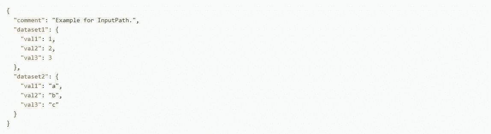

然后，您可以应用*输入路径*:

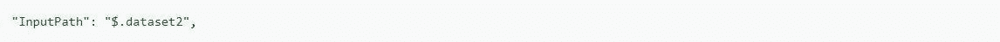

考虑到前面的*输入路径*，这是作为输入传递的 JSON:

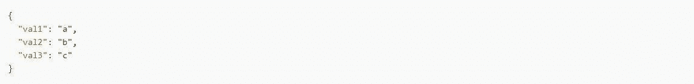

重要的是要知道路径可以产生特定值的选择，例如:

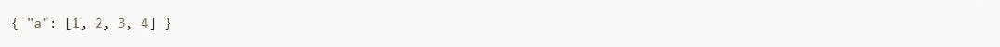

如果你已经应用了路径 *$。a[0:2]* ，这将是结果:

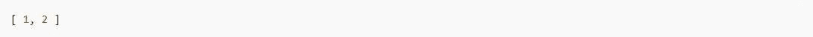

# 结果选择器

利用 *ResultSelector* 字段，这样您甚至可以在 *ResultPath* 被应用之前**操纵一个状态的结果。 *ResultSelector* 字段允许您创建一个**键值对**的集合，如果这些值是静态的或者甚至是从状态结果中选择的。此外， *ResultSelector* 的输出将替换状态的结果，并将其传递给 *ResultPath* 。**

在以下状态中,*结果选择器*不是必填字段:

*   工作
*   平行的
*   地图

此外，步骤函数服务集成将**返回元数据**到**结果的有效负载**。 *ResultSelector* 能够**选择结果的片段**，并**将它们与 *ResultPath*** 中的**状态输入全部合并**。这个例子显示您可以选择 *resourceType* 和 *ClusterId* ，这样您就可以将它们与来自 Amazon 的 EMR *createCluster.sync* 的状态输入合并在一起。下面是一个例子:

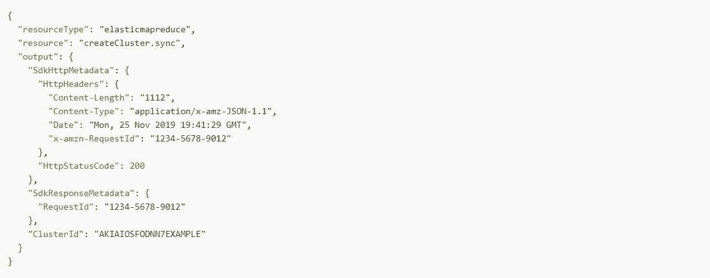

通过使用 *ResultSelector* ，您将能够选择 *resourceType* 和 *ClusterId* :

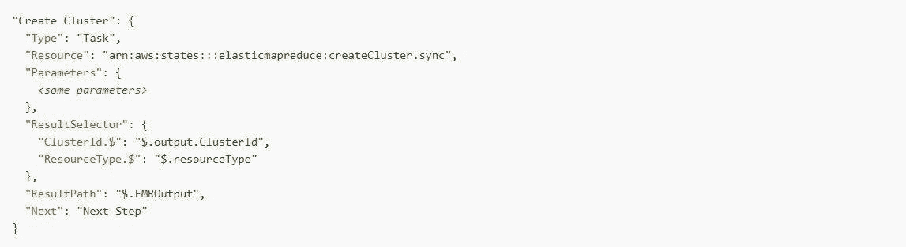

考虑到给定的输入，利用*结果选择器*将产生:

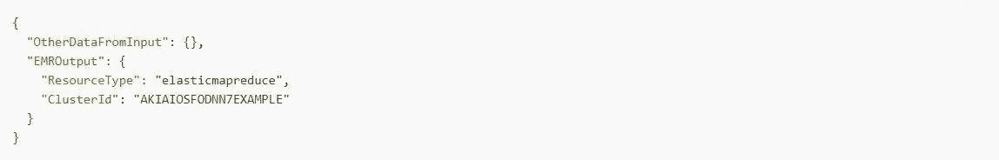

# 因素

使用参数字段将帮助您**创建一个键值对集合，这些键值对都作为输入**传递。这些值可以从带有路径的输入或上下文对象中选择，也可以是包含在状态机定义中的静态值。**密钥名必须以*结尾。$*** 用于键值对，使用路径选择其值**。**

看一下下面的输入示例:

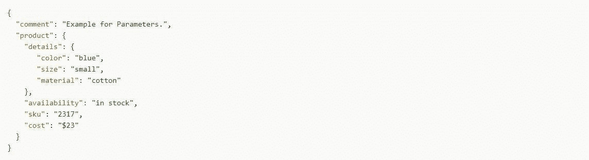

在状态机定义中指定这些参数将使您能够选择一些信息。

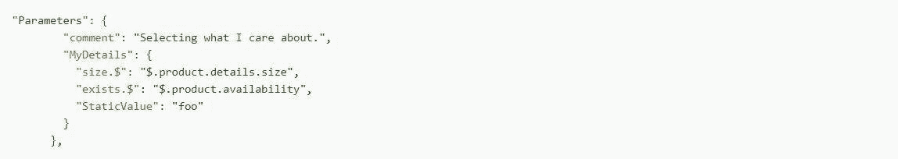

考虑到前面的输入和参数字段，这是将要通过的 JSON:

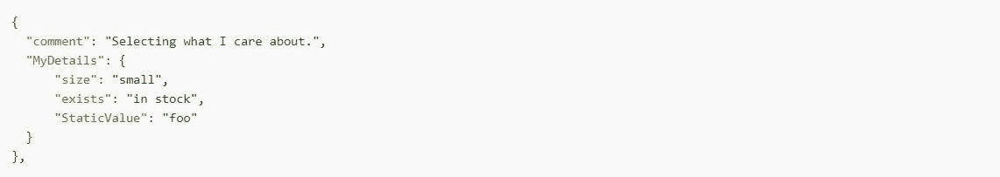

除了提供的输入之外，您还可以轻松访问一个特殊的 JSON 对象，称为“**上下文对象**”这个对象包括**所有关于状态机执行**的信息。

值得一提的是，Parameters 字段还能够将信息传递给其他连接的资源。如果您的任务状态编排了一个 AWS 批处理作业，您将很容易**将所有相关的 API 参数直接传递给该服务的 API 操作**。

# ItemsPath

在**映射状态**中使用了 *ItemsPath* 字段，因此您可以**在输入**中选择一个数组。映射状态用于**迭代在输入**中找到的数组中的每个项目的步骤。默认情况下，通过选择**整体输入**，地图状态会将*项目路径*设置为 *$* 。如果 Map 状态的输入是一个 JSON 数组，它将对数组中的每个条目运行一次迭代，并将该条目作为输入进一步传递给迭代。

*ItemsPath* 字段将允许您**在输入中选择一个位置**，这样您就可以找到用于迭代的 JSON 数组。 *ItemsPath* 的值必须是一个**引用路径**，并且它还必须标识 JSON 数组的值。想象一个包含两个数组的映射状态的输入，如下例所示:

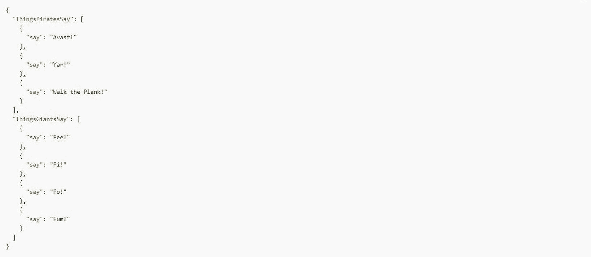

这种情况表明，您可以通过简单地选择一个带有 *ItemsPath* 的**特定数组来指定要将哪个数组用于贴图状态迭代。该状态机定义仅使用 *ItemsPath* 指定输入中的*thingspiratesay*数组。尽管如此，它还是会对位于*thingspiratasay*数组中的每一项运行 *SayWord* 的传递状态迭代。**

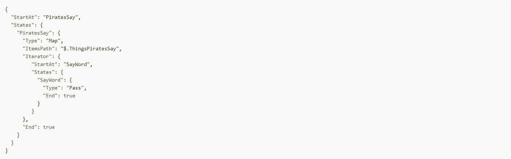

处理输入时， *ItemsPath* 应用在 *InputPath* 之后。此外，当*输入路径*完全过滤输入时，它将对状态的有效输入进行操作。

# 结果路径

任何状态的**输出**也可以是其输入的**副本，其结果与输入**的**组合，或其产生的**结果**(例如。来自任务状态的 Lambda 函数的输出)。使用 ***ResultPath*** 允许**控制**这些**组合中的哪一个将被转发到状态输出**。**

这些是可以生成结果的状态类型，也可以包括*结果路径*:

*   工作
*   平行的
*   及格

如果您利用 *ResultPath* 来组合任务输入和任务结果或者甚至选择这些选项中的一个，将会有所帮助。您提供给 *ResultPath* 的路径将控制传递给输出的所有信息。

此外， *ResultPath* 仅限于使用引用路径，将范围限制为仅识别 JSON 中的单个节点。

# 利用结果路径

您可以利用*结果路径*来:

*   用结果替换输入
*   放弃结果并保留输入
*   将结果包含在输入中
*   用结果更新输入中的节点
*   在 Catch 中包含输入和错误

# 利用 ResultPath 用结果替换输入

如果您**没有指定 *ResultPath*** ，默认行为将与您指定了“*result path*”:" $ "相同。由于这个**告诉状态用结果**替换整个输入，状态输入将被来自任务结果的结果完全替换**。**

**在这个图中，您可以看到 *ResultPath* 如何用给定任务的结果完全替换输入:**

**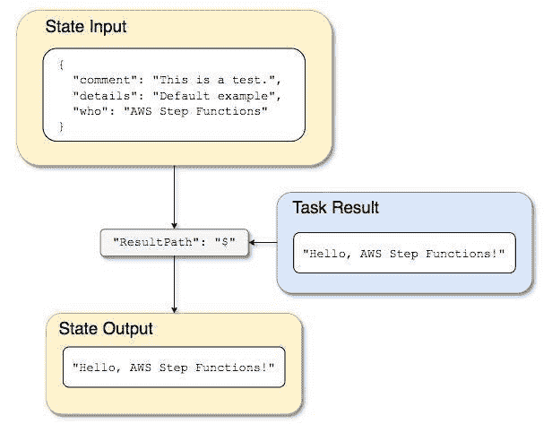**

**通过以下输入使用 Lambda 函数和状态机:**

**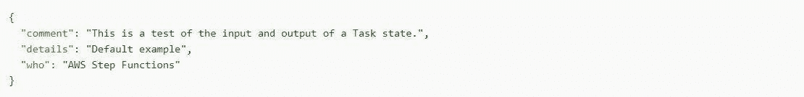**

**然后，Lambda 函数将为您提供以下结果:**

**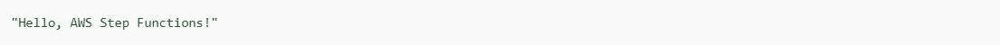**

**如果在状态中没有指定 *ResultPath* ，或者如果设置了“*result path*”:" $ "，则状态的输入被 Lambda 函数的结果替换，而状态的输出如下:**

****

***ResultPath* 用于在内容被传递到输出之前包含来自输入结果的所有内容。然而，如果没有指定 *ResultPath* ，默认情况下它将替换整个输入。**

# **丢弃结果并保留原始输入**

**如果您将 *ResultPath* 设置为 **null，**将**将原始输入直接传递给输出。**利用“*result path*”:“null”，将状态的输入载荷直接复制到输出，不管结果如何。**

**这个图展示了 null *ResultPath* 如何将输入直接复制到输出。**

**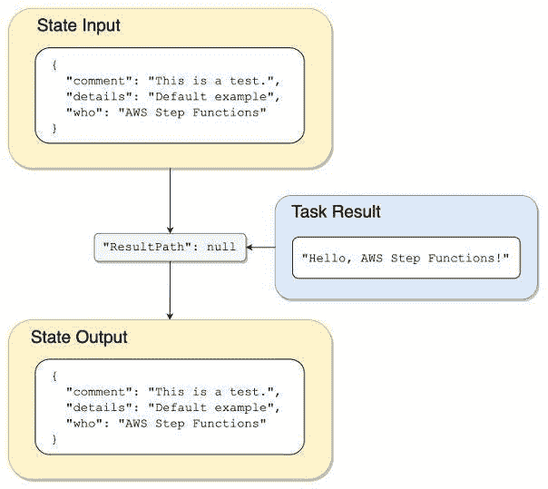**

# **利用 ResultPath 包含给定输入的结果**

**这个例子展示了 *ResultPath* 如何将结果包含在输入中。**

**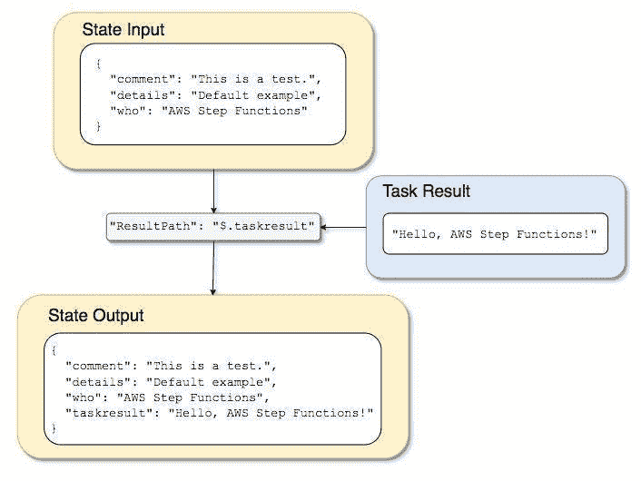**

**利用 Lambda 函数和状态机，您可以传递以下输入:**

**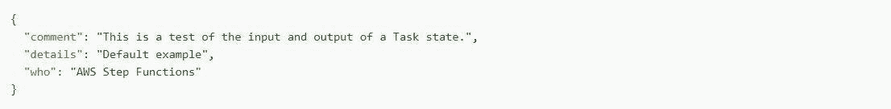**

**λ函数的结果将是:**

**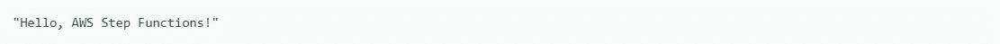**

**为了保存这个输入，您应该插入 Lambda 函数的结果，然后将合并的 JSON 传递到下一个状态，您将能够设置 *ResultPath* :**

**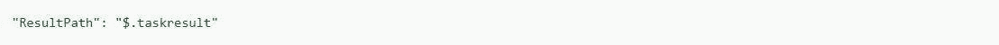**

**这也包括 Lambda 函数与原始输入的结果。**

**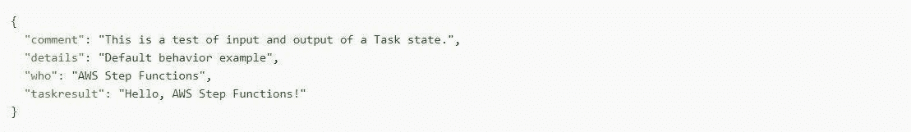**

**Lambda 函数的输出位于原始输入的**端，并呈现为 *taskresult* 的值。输入和新插入的值一起被转发到下一个状态。****

**您可以将结果放入输入的**子节点**，并且 *ResultPath* 将被设置如下:**

****

**利用以下输入开始执行:**

**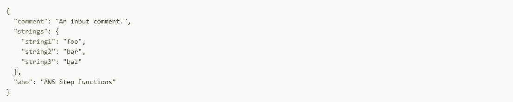**

**Lambda 函数的结果作为*字符串*节点的子节点插入到输入中。**

**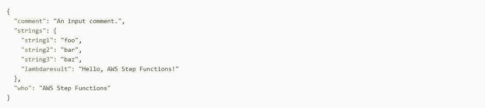**

**状态输出现在将包括原始的 JSON 输入，产生一个子节点。**

# **利用 ResultPath 用结果更新输入中的节点**

**下图展示了 *ResultPath* 如何使用任务结果的值更新输入中现有的 JSON **节点的值**:**

**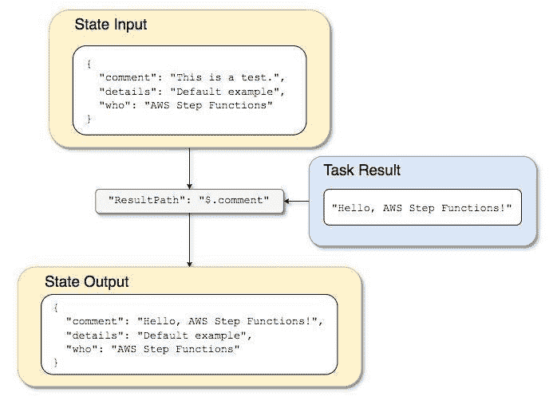**

**利用“创建使用 Lambda 的阶跃函数状态机的教程”中描述的 Lambda 函数和状态机的示例，您可以传递以下输入:**

**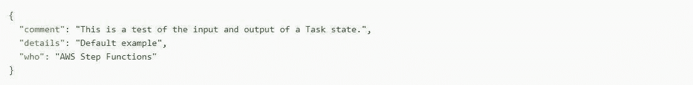**

**λ函数的结果是:**

****

**您可以**完全覆盖现有的节点**，而不是将结果作为新节点插入 JSON 并保留输入。**

**例如，设置一个 *"ResultPath": "$"* 将会用**覆盖整个节点**，并且您可以指定一个想要用结果覆盖的节点。**

**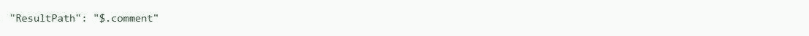**

**因为注释节点已经存在于状态输入中，所以将 *ResultPath* 设置为 *"$。注释"*用 Lambda 函数结果替换输入中的节点。这将被传递到输出**而没有由 *OutputPath*** 进行任何进一步的过滤:**

**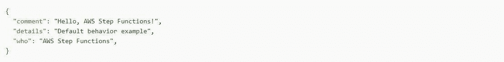**

**注释节点的值，“这是一个任务状态的输入和输出测试。”，将**替换为 Lambda 函数的结果**:“您好，AWS Step Functions！”在状态输出内。**

# **利用 ResultPath 在 Catch 中包含输入和错误**

**教程“使用阶跃函数状态机处理错误条件”解释了如何利用状态机来捕捉错误。有时，您可能希望保存包含错误的原始输入。在 Catch 中使用 *ResultPath* ,这样就可以包含来自原始输入的错误。**

**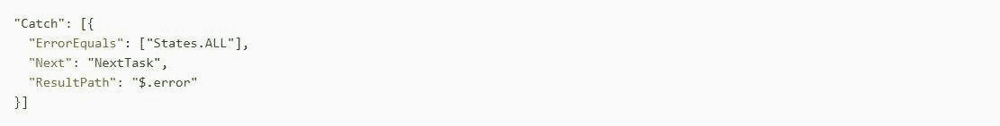**

**如果前面的 Catch 语句捕捉到任何错误，它还会在状态输入的错误节点中包含结果。以下输入是这种情况的一个很好的例子:**

**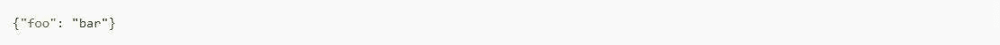**

**捕获错误时的状态输出如下所示:**

**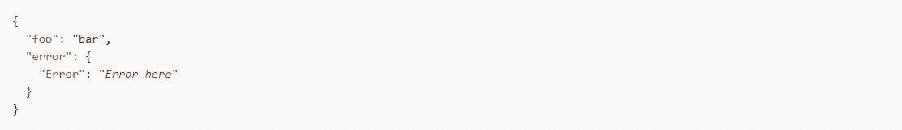**

# **输出路径**

***OutputPath* 允许你选择状态输出的一个片段，将其传递给下一个状态。这也允许你**过滤掉所有不想要的信息，只传递你真正关心的 JSON 片段**。**

**通过不指定*输出路径*，缺省值将总是 *$* 。这将把由任务结果 *ResultPath* 确定的整个 JSON 节点，包括状态输入，直接传递到下一个状态。**

# **输入路径、输出路径和结果路径示例**

**除失败状态之外的任何状态都可以包括*输入路径、输出路径*或*结果路径*。所有这些都允许您利用一个路径来过滤 JSON，因为它在您的工作流中移动。**

**例如，您可以修改状态机，使其包括*输入路径、输出路径*和*结果路径*:**

**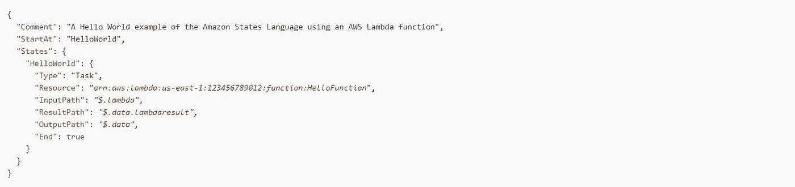**

**利用此输入开始执行:**

**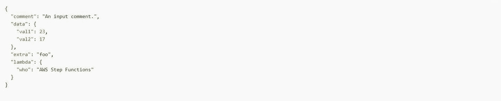**

**假设额外的节点和注释可以被丢弃，并且包括[AWSλ](https://dashbird.io/knowledge-base/aws-lambda/introduction-to-aws-lambda/)函数输出以保存位于数据节点内的信息。**

**修改任务状态以在更新的状态机内处理对任务的输入。**

**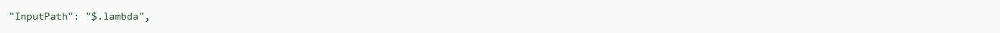**

**状态机定义中的这行代码**将任务输入限制在状态输入中的 Lambda 节点**。Lambda 函数将只接收 JSON 对象{"who": "AWS Step Functions"}作为输入。**

**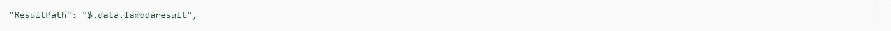**

**这个特定的 *ResultPath* 将告诉状态机**将 Lambda 函数结果**插入到名为“lambdaresult”的节点中，作为原始状态机输入中的**数据节点的子节点**。该状态的输入现在包括具有原始输入的 Lambda 函数结果，并且没有使用 *OutputPath* 的任何进一步处理。**

**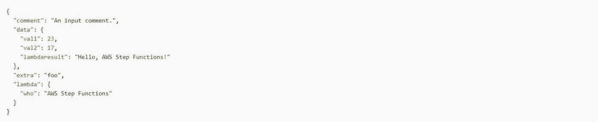**

**现在，由于目标是**仅保存数据节点**，同时包含 **Lambda 函数结果** , *OutputPath* 在将 JSON 传递给状态输出之前对其进行过滤。**

**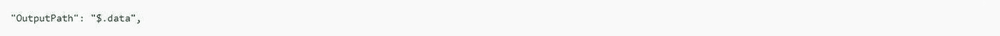**

**它专门选择来自原始输入的数据节点，以进一步向输出前进。从这里开始，过滤整个状态输出:**

**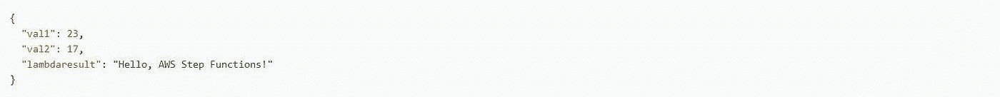**

**此外，在这个特定的任务状态中:**

*   *****InputPath*** 将只发送 Lambda 函数输入中的 Lambda 节点。**
*   *****OutputPath*** 将过滤状态输入(包括 Lambda 函数结果)以将数据节点进一步传递到状态输出。**
*   *****ResultPath*** 将结果作为数据节点的子节点插入到原始输入中。**

# **上下文对象**

**上下文对象也被称为在执行过程中可用的内部 JSON 结构，它包含了关于执行和状态机的信息。得益于此，您的工作流将获得**对有关其具体执行的信息**的访问权。可以从以下字段访问上下文对象:**

*   ***输入路径***
*   ***输出路径***
*   ***结果选择器***
*   ***项目路径(在地图状态内)***
*   ***变量对其他变量的比较运算符***
*   ***变量(在选择状态内)***

# **上下文对象格式**

**上下文对象有关于**执行、状态、任务和状态机**的信息。此外，这个 JSON 对象包括每种数据类型的节点，通常格式如下:**

**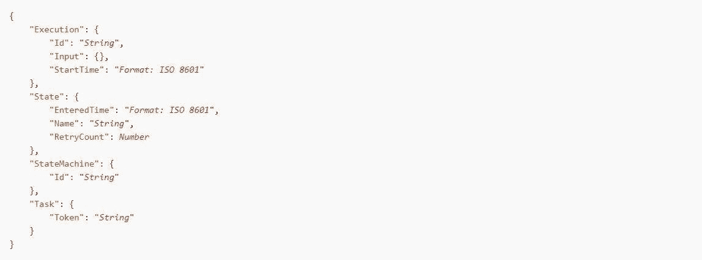**

**在每次执行期间，上下文对象被填充与从访问的参数字段相关的数据**。如果参数字段完全在任务状态之外，则任务字段值为 null。****

**正在运行的执行中的内容还包括以下格式的细节:**

**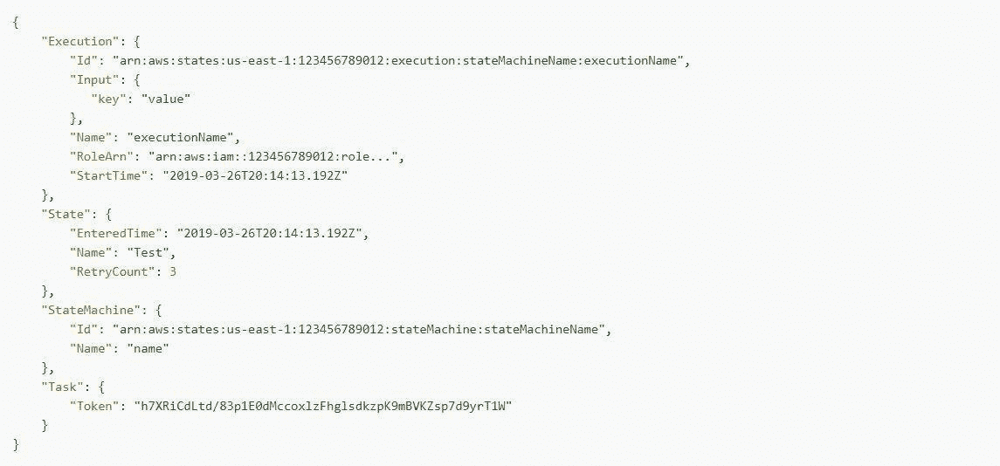**

# **如何访问上下文对象？**

**为了**成功访问上下文对象** t，首先需要通过放置*来指定参数名。$* 到最后，这和你用路径选择状态输入是一样的。此外，为了让**访问上下文对象数据而不是访问输入**，用 *$$开始路径。*。这将通知 AWS 步骤函数使用该路径来选择上下文对象中的节点。**

**这个任务状态示例利用一个路径将[亚马逊资源名称(ARN)](https://dashbird.io/knowledge-base/aws-cloud/arn-amazon-resource-name/) 执行传递和检索到[亚马逊 SQS](https://dashbird.io/knowledge-base/sqs/introduction-to-sqs-queue-service/) 消息。**

**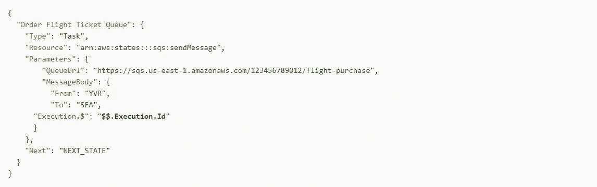**

# **用于地图状态处理的上下文对象数据**

**在处理映射状态时，上下文对象中还有两项可用:**值和索引**。索引项包含当前迭代中处理的数组项的索引号。地图状态中的上下文对象包括:**

**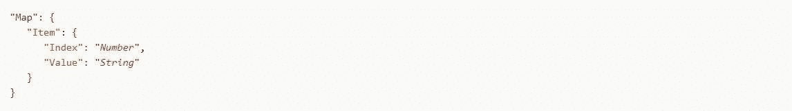**

**然而，这些仅在**映射状态**中可用，并且它们可以在参数字段中的迭代器部分之前指定**。此外，您必须在主 Map 状态的 parameters 块中定义来自上下文对象的参数，而不是在迭代器部分包含的状态中定义。****

**如果给定一个带有简单映射状态的状态机，就可以从上下文对象中注入信息:**

**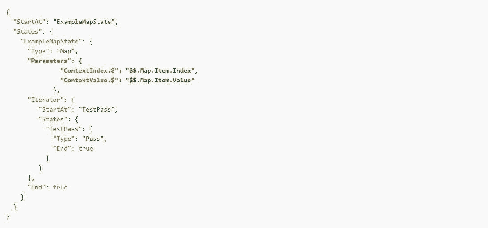**

**通过用所提供的输入执行前面的状态机，值和索引都将被插入到输出中。**

**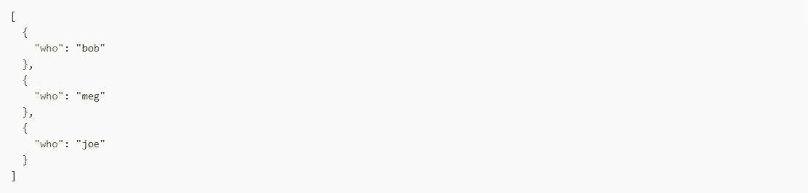**

**执行输出是:**

**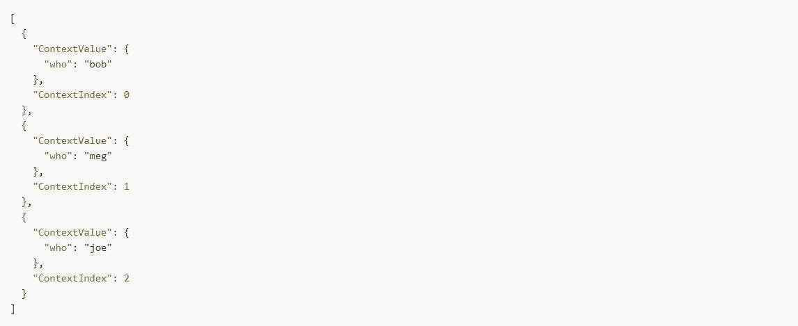**

# **包扎**

**一个步骤功能的准确描述应该是“*状态即服务*”没有他们，我们就没有机会用多个 Lambda 活动维护每个州的执行。**

**掌握步骤功能的性能至关重要，因为工作流可能出错，这会严重影响您的最终用户。AWS Step Functions 将事件和指标发布到 [CloudTrail](https://docs.aws.amazon.com/step-functions/latest/dg/procedure-cloud-trail.html) 和 [CloudWatch](https://docs.aws.amazon.com/step-functions/latest/dg/procedure-cw-metrics.html) ，它们由 Dashbird 监控并导入到单个仪表板，结合其他 AWS 服务的指标并转化为**易于理解的可操作数据**。**

**Dashbird 的 Insights 引擎可以实时检测与状态机定义或任务执行失败相关的错误，当您的工作流中出现问题或即将出错时，**会通过 Slack 或电子邮件立即通知您**。Insights 引擎基于 [AWS 架构良好的最佳实践](https://aws.amazon.com/architecture/well-architected/?wa-lens-whitepapers.sort-by=item.additionalFields.sortDate&wa-lens-whitepapers.sort-order=desc)，并根据其规则持续运行您的整个无服务器基础设施的数据，以帮助您确保您的应用在任何规模下都是优化的和可靠的。**

**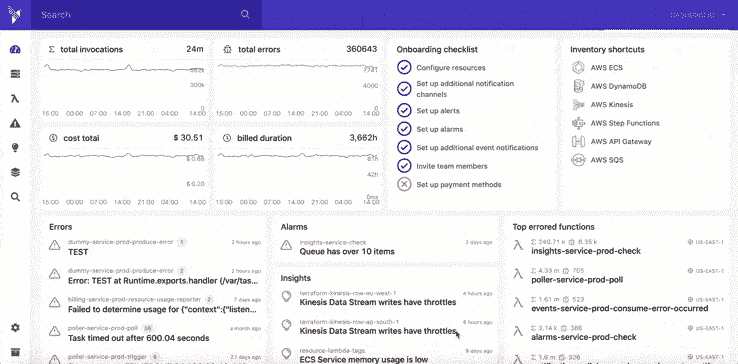**

**[你可以试试大鸟](https://dashbird.io/features/)——免费的！**

*   **没有代码更改**
*   **不需要信用卡**
*   **简单的两分钟设置**
*   **获得所有高级功能**
*   **立即开始接收自动警报并安全处理您的数据**
*   ****在几秒钟内找到并调试已知和未知的错误****
*   ****获得定制的可行见解，以改进和精心设计您的系统，使其能够随着时间的推移承担更多的复杂性****
*   ****简单、干净、易于理解的界面****
*   ****市场上最经济实惠的监控和故障排除解决方案之一****
*   ****到处都支持和友好🙂— [看看 Dashbird 用户怎么说](https://dashbird.io/customers/)****