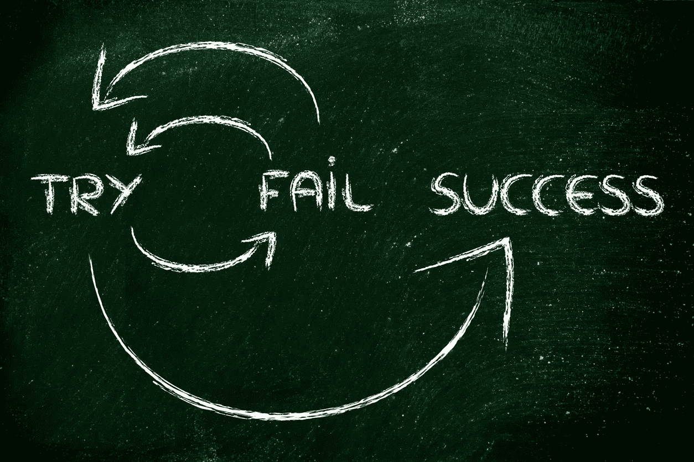
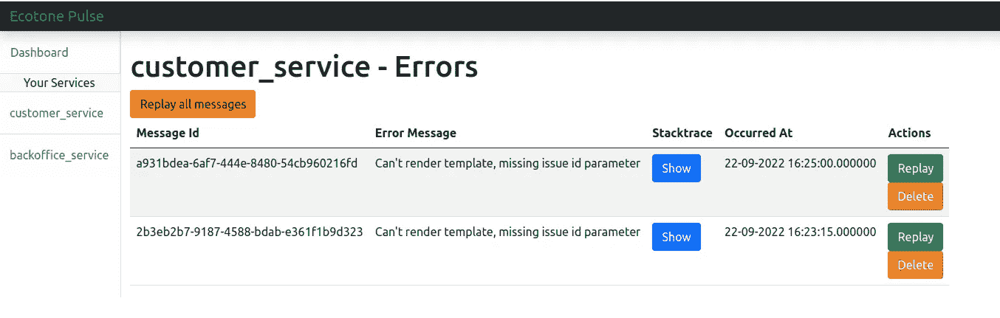

# 用 Laravel 队列、Symfony Messenger 和 econtero 处理 PHP 中的异步错误

> 原文：<https://blog.devgenius.io/handling-asynchronous-errors-in-php-with-laravel-queues-symfony-messenger-and-ecotone-9becba7fba46?source=collection_archive---------3----------------------->



您可能已经在 RabbitMQ、SQS、Beanstalkd 等消息平台上使用了[异步处理](http://essing-in-php-symfony-messenger-laravel-queues-and-ecotone-8ca17102c5b2)。
或者你可能使用其中一个框架([生态区](https://docs.ecotone.tech/)、 [Symfony Messenger](https://symfony.com/doc/current/messenger.html) 或 [Laravel Queues](https://laravel.com/docs/9.x/queues) )来隐藏消息平台的详细信息。
不管你用什么，处理消息时迟早会面临错误。那么，当你的代码异步运行时，你如何处理失败呢？

优雅地处理错误实际上可能会改变您的编码方式，使您的应用程序更易维护、更健壮。

# 尽可能自动恢复

所有的框架都带有在失败时重新传递消息的功能。
这是你避免在晚上被叫或有支援轮班的第一道防线。

存在可以自动恢复的错误，如连接失败、第三方服务不可用或乐观锁定异常。

> 我们的主要目标应该是尽可能地自我修复。消息有时会失败，这是不可避免的，可避免的是人工干预。

您希望以更大延迟重新传递这些消息，以获得更高的自愈机会。

# 处理 HTTP 请求中的所有内容

可能有处理一切事情的诱惑，比如下订单、发送电子邮件、在 HTTP 请求中接受付款。
这可能会产生一个基于 try catches 和保存错误的解决方案，以便有人可以在以后找到并修复它。
这使得我们编写自定义代码来处理故障，并可能导致不可恢复状态或手动干预以便恢复。

> 系统可以自动恢复，无需编写任何额外的代码。消息传递框架会处理它，因为您的代码可以专注于业务问题，而不是技术问题。

这是消息传递平台存在的原因之一，它可以帮助您构建更加可靠和稳定的代码。
让你的 HTTP 请求做单个动作，比如下订单，然后`as a effect`发送一个事件消息，声明订单已经下了。从那里，您可以订阅该事件，并以异步方式完成剩余的工作。

# 单个消息的多个处理程序

如果您的事件消息由多个处理程序处理，那么在由于失败而重新发送此类消息的情况下，您可以发送两次电子邮件或进行第二次支付。
一些外部提供商允许使用`imdepodency keys`，这允许处理重复的呼叫，但情况并非总是如此。

最好的方法是每条消息都有一个动作，当需要两个或更多的动作时，如何实现呢？
让我们以下订单的情况为例，结果我们想要发送电子邮件并从信用卡中付款。

# Symfony 信使

主要实现如下所示:

如果将有一个失败，我们可能会以双重付款或电子邮件结束。为了解决这个问题，我们需要创建自定义处理程序。

这解决了主要问题，但是引入了通常不存在的额外消息，增加了代码的复杂性。
我们可以尝试在下单后直接发送`SendPlaceOrderEmail`和`MakePayment`消息来解决这个问题，而不是发送`OrderWasPlaced`消息。
然而，这将把责任放在下订单期间制作这些信息上，并将颠倒责任。下单本身就是一个完整的行为，以上行为只是它的结果。

# 群落交错区

在生态交错的情况下，我们将给定的处理程序标记为异步，而不是消息。
然后，一个消息的副本被传递给每个处理程序。
这意味着每个异步处理程序以原子的方式工作，并分别处理消息。

在失败的情况下，只有单个处理程序会失败，重试是安全的。

# Laravel 队列

在 Laravel 队列的情况下，没有处理事件消息的概念，一切都是完成给定动作的工作。
这通过设计解决了主要问题，但是它颠倒了责任，并使下订单操作知道通常会订阅它的事情。

# **暂时中断流程**


不熟悉消息传递体系结构的开发人员倾向于构建周围的处理代码，而不是允许消息失败。
这可能是类似`wasEmailSent`的数据库中的一个字段，每当电子邮件发送失败时，由 try catch 填充。

> 我们可以编写与基础设施错误无关的代码，并跟踪它们，而无需为每个错误增加额外的存储空间。

信息是一等公民，而不仅仅是一项工作。它们实际上告诉了我们一个故事，在我们的系统中流动是什么样子的。消息可能由于各种原因而失败，但是如果失败，我们将自动恢复，如果没有，我们将调查、修复并重播。

> 将消息视为可以临时中断的流的一部分，修复问题后，流将恢复。

# 不可恢复的错误

有些情况下，错误是不可恢复的，或者需要很长时间才能自动恢复。

这类错误大多与应用程序代码问题、不正确的调用/与第三方 API 的兼容性中断，或者我们使用的服务长时间停机有关。
应用程序级别的错误可能真的有益

> 不可恢复的错误是学习发生的地方，因为它可能揭示我们以前没有想到的场景。

例如，作为关闭账户的结果，我们想要终止电子钱包，然而钱包有正余额，这以异常结束。
在这种情况下，我们应该怎么做，把钱支付到客户的银行账户上，还是关闭账户？
这些错误可能会向我们的产品负责人/领域专家提出问题，以便更多地了解业务是如何运作的。

# 死信队列

死信队列是不可恢复的错误消息所在的地方，我们需要进行手动干预来解决问题。
修复错误后，我们可以重放错误消息以正确处理它并恢复流程。

> 死信队列是您在出现无法自动恢复的错误时的最后一道防线。

让我们检查一下我们的框架是如何处理这些的。

# Symfony

Symfony 提供了存储不可恢复的错误的方法，这样你就可以查看，重放或删除它们。
您可以从控制台或直接从数据库查看错误消息。

> *当您的故障数据库存储关闭时，Symfony 将* [*删除您的错误消息*](https://github.com/symfony/symfony/issues/36870) *，您将无法恢复它。*

# 群落交错区

生态区提供了存储不可恢复的错误的方法，这样你就可以查看、重放或删除它们。
您可以直接从控制台和数据库查看错误。

为了从单一位置控制所有服务的错误消息，创建了`[Ecotone Pulse](https://docs.ecotone.tech/modules/ecotone-pulse)`。它允许您使用单个应用程序来查看、重放和删除错误消息。



过渡带脉冲

> *当您的故障数据库存储关闭时，econtero 会将您的消息保留在队列中，直到您的数据库恢复在线。*

# 拉勒韦尔

Laravel 提供了存储不可恢复的错误的方法，这样你就可以查看、重放或删除它们。
您可以直接从控制台和数据库查看错误。

```
php artisan queue:work redis --tries=3 --backoff=3
```

> 当您的故障数据库存储关闭时，Laravel 会将您的消息保留在队列中，直到您的数据库恢复在线。

# 摘要

现有的框架提供了各种经过实战检验的解决方案，这将有助于您构建更加可靠和稳定的应用程序。

无论我们测试或设计代码有多好，都会发生一些错误，这就是为什么我们需要支持工具来帮助我们从这些错误中恢复。
最后，它是关于客户拥有良好的体验，这意味着系统以稳定的方式工作，即使添加了大量新功能:)