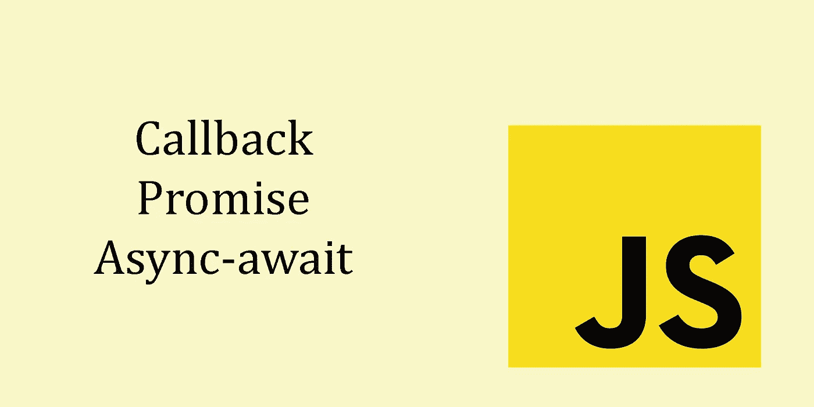
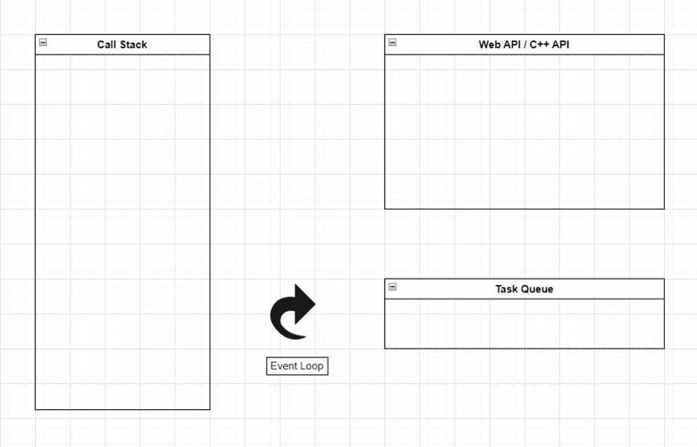

# 处理 NodeJS/JavaScript 中的异步特性

> 原文：<https://blog.devgenius.io/handling-asynchronous-nature-in-nodejs-javascript-66471aef6dae?source=collection_archive---------2----------------------->



如果您来自 JavaScript 或 NodeJS 背景，您肯定会遇到诸如同步、异步、阻塞、非阻塞等术语。在进入主要话题之前，最好对这些概念有一个扎实的了解。

同步意味着阻塞。因此，它会等到任务完成后再继续下一个任务。异步意味着非阻塞。它不会等到完成一项任务后再进入另一项任务。

JavaScript 本质上是同步的。但是有一些东西具有异步行为，比如 API 调用、setTimeout、DOM 事件(单击、鼠标悬停、滚动……)。假设您请求一个昂贵的数据库调用。JavaScript 是单线程的，所以它一次只能做一件事。因此，如果这是同步的，那么在响应来自数据库调用之前，您将不能做任何事情。

那 NodeJS 呢？它还是单线程和异步的，非常适合数据密集型应用。因为 NodeJS 不会等待一个任务完成后再继续下一个任务，所以这个线程将可以为另一个客户机服务。

为了深入了解异步代码的行为，让我们看一个例子。

你对上面代码片段的输出有什么看法？如下图。

```
Start
End
Inside timeout
```

是的。这是命令。未开始、内部超时和结束。

如果延迟设置为 0 毫秒。它会按正确的顺序运行吗？不完全是。输出将是相同的。那么，这里发生了什么？我们去幕后看看发生了什么事。



代码执行的流程

*   首先，代码将执行 console.log('Start ')。一旦完成，就从堆栈中弹出。
*   *然后下一行，setTimeout。如前所述，它显示了异步行为。因此，它将被推送到 Web APIs(我们可以说 NodeJS 的 c++ API)。*
*   *然后 JavaScript 会执行 console . log(‘End’)。一旦完成，它也会从堆栈中移除。*
*   *setTimeot 延迟 1 秒。所以 1 秒钟后，它会被推送到任务队列。*
*   *这就是事件循环发挥作用的地方。事件循环的工作是监视堆栈和任务队列。一旦堆栈变空，它将获取队列的第一个并放入堆栈*

现在你知道为什么它不改变顺序了，即使我们对 setTimeout 设置了零延迟！

直到现在，异步行为听起来还不错。为什么我们需要处理这个？

可能会有这样的情况，我们需要等待一个任务完成后才能继续下一个任务。假设你有两个功能。第一个函数将从 API 获取数据，第二个函数需要第一个函数的几个数据。如果第一个函数需要一些时间才能得到响应，那该怎么办？代码将转到第二个函数，但是第一个函数仍然没有返回数据。这就是问题发生的地方。

让我们看一个例子。

这里我们要为下面的等式中给定的 *x，*找到 *y* 。

```
 ***y = 2x + 1***
```

为此，我们使用两个函数，一个用于乘法，另一个用于加法。假设乘法需要 2 秒，加法需要 1 秒完成。实际上，执行这些操作只需要几毫秒，但这只是为了突出问题。无论如何，在进行真实世界的 API 调用、数据库请求等时，您可能会遇到这个问题。

你觉得输出怎么样？

它会显示“未定义”。大家知道原因是 *console.log(result)* 没有等到***multiply y2()***和***add 1()****函数返回值。那么，我们如何缓解这个问题呢？这里我们有三种方法。*

1.  *回调函数*
2.  *承诺*
3.  *异步等待*

*让我们看看如何使用这些。*

## *复试*

*回调方法*

*这里，我们将一个函数(称为回调函数)作为参数传递给*multiply y2()**和 *add1()* 函数。一旦输出被返回，我们就在回调函数体中得到结果。**

**但是，当我们有多个依赖回调时，这似乎并不好。因为它创建了一个嵌套在另一个内部的嵌套回调，这并不太干净和可读。这叫回调地狱。**

## **承诺**

**这里我们在两个函数中返回一个**承诺**。这就是我们通常对承诺的定义。**

```
****new Promise((resolve, reject) => {
  if (err) reject()
  resolve()
}).then(() => {
** * // Will execute once task is resolved (resolve)* **}).catch(() => {**  *// will exectue if an error occurred (reject)* **})****
```

**Promise 对象以一个函数(它被称为 executor 函数)作为参数。一旦任务完成，它就进入模块。如果出错，则进入**捕捉**模块。**

**如你所见，这种编写代码的方式比使用回调要干净得多。我们可以根据需要链接 n 个 then 块。**

## **异步等待**

**这是一种更清洁的方式。它看起来几乎像同步代码。我们需要做的是将 **await** 关键字放在函数之前。但是你只能在异步函数中使用 await。因此 calculate_y()函数应该是一个异步函数。**

**您可以在这里找到工作示例。**

**[https://github . com/kanchana 46/callback-promises-async-await . git](https://github.com/Kanchana46/callback-promises-async-await.git)**

**这都是关于处理异步的性质。编码快乐！。**