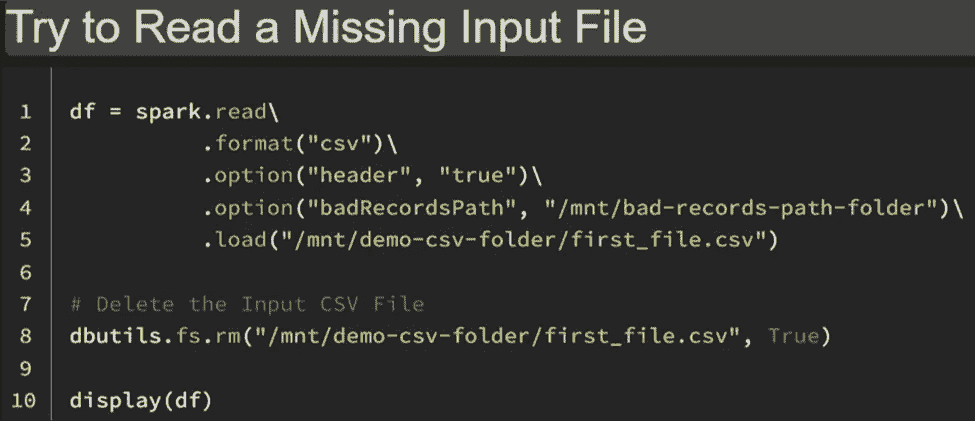
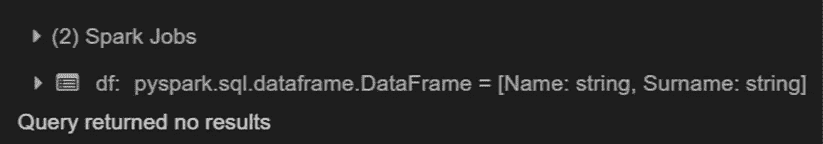
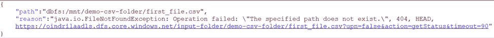
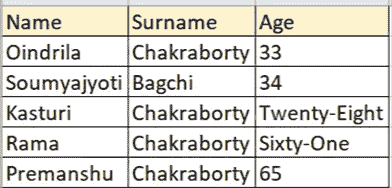
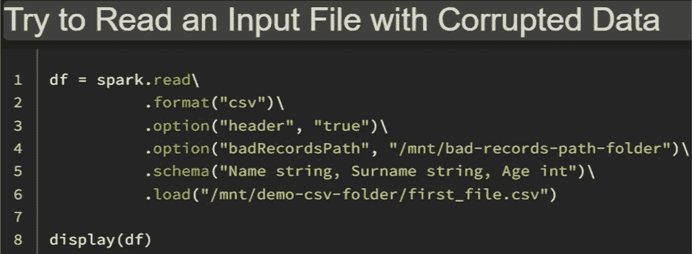
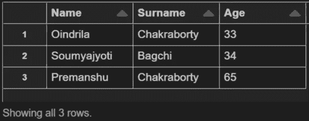
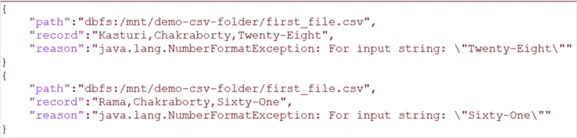

# 使用“badRecordsPath”处理数据块中的坏记录和文件

> 原文：<https://blog.devgenius.io/handling-bad-records-and-files-in-databricks-using-badrecordspath-c2d879648efc?source=collection_archive---------3----------------------->

# 什么是“badRecordsPath”选项

当 ***读取数据*** 来自一个 ***基于文件的数据源******Apache Spark SQL***面临 ***两个*** 典型 ***错误案例*** -

> ***首先是*** ， ***文件*** 可能**不是 ***可读*** (例如， ***文件*** 可能是 ***丢失*** ， ***无法访问*** 或 ***损坏*****
> 
> *****其次*** ， ***即使******文件*** 是*可处理的，有些 ***记录*** 可能 ***不是*** 是 ***可解析的******

******Azure Databricks******提供了******统一接口*** 用于 ***处理******不良记录******不良文件******无需中断火花作业*** 。它是 ***可能******获取****异常记录/文件******检索******异常原因*** 从 ***异常日志*** ，通过 ***设置********badRecordsPath***指定一个 ***路径*** 来存储 ***异常文件*** 用于 ***记录******信息*** 关于-*******

*   ****不良记录*** 为 ***CSV*** 和 *JSON* ***来源*** 。*
*   ****坏文件*** 为 ***所有******基于文件的内置源文件*** ，就像——***拼花*** 。*

# *“badRecordsPath”选项的限制*

****使用******badRecordsPath******选项*** 在基于 ***文件的数据源*** 中有几个重要的 ***限制****

****A)*** 它是 ***非事务性的*** 并且会 ***导致******不一致的结果*** 。*

****B)当读取文件*** ，*， ***网络连接异常*， ***IO 异常*** 等等，可能 ***发生*** 。这些 ***错误*** 被 ***忽略*** ，而**下的***badRecordsPath***，以及 ***Apache Spark*** 将 ***继续*** 到 ***运行*********

# ******错误文件(丢失文件)的“badRecordsPath”选项示例******

************

******输出-******

************

******在上面的例子中，由于" ***df.show()*** "是 ***无法*** 到 ***找到******输入文件*** ， ***Apache Spark 创建了一个****异常文件*在本例中， ***为******缺少输入文件*** ， ***路径******生成******异常文件*** 为***【mnt/bad-records-Path-folder/*************

*   **“ ***异常文件*** ”即“***part-00000-a9 b 05 b 0e-75ba-4797-a319–4c 82 f 6 C2 da 1 a***”是 ***中存在的指定的***badRecordsPath********
*   *****20220103t 174849***是显示的“***data frame reader***”中的“ ***创建时间*** ”。**
*   *****【坏 _ 档】*** 是 ***异常类型*** 。**
*   *****异常文件*** ，即***part-00000-a9 b 05 b 0e-75ba-4797-a319–4c 82 f 6 C2 da 1 a***是 ***文件*** 即 ***包含*** 一 ***JSON 记录*****

****

# **针对不良记录的“badRecordsPath”选项示例**

*****CSV 文件*** 、 ***中的 ***记录*** ，包括*** 的损坏记录，如下-**

****

*****代码*** 到 ***读作******显示******记录****CSV 文件*** 如下-****

****

**输出-**

****

**在这个例子中， ***DataFrame 只包含了******三条记录*** 、 ***匹配*** 提供的 ***模式*** 。**

**对于 ***两个*** ***坏记录******未*** ***匹配*** 所提供的 ***模式*** ，将 ***路径*** 的 ***生成*****

*   **“ ***异常文件*** ”，即“***part-00000-f 0 eeb7c 2–7049–4 f72–9 b04–6 ad 87 e 348398***”是 ***中存在的指定的 ***badRecordsPath********
*   **“ ***20220103T184743*** ”是显示的“***data frame reader***”的“ ***创建时间*** ”。**
*   *****bad_records*** 是 ***异常类型*** 。**
*   *****异常文件*** ，即***part-00000-f0eeb7c 2–7049–4f 72–9b 04–6a d87e 348398**JSON******文件*** 即 ***包含-*****

> **1. ***不良记录*** 。**
> 
> **2. ***路径下的**输入文件******包含******不良记录*** 。**
> 
> **3. ***异常*** 或 ***原因******消息*** 。**

*****后******异常文件*** 是 ***位于*** ，一个 ***JSON Reader*** 可以被 ***使用*** 到 ***进程*****

********