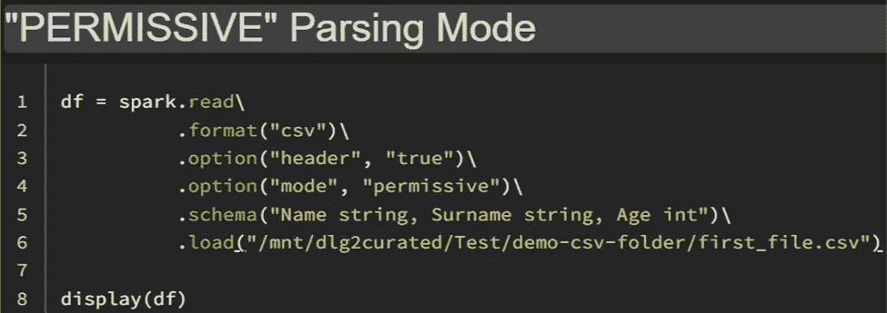

# 使用数据块中的“解析模式”处理不良记录

> 原文：<https://blog.devgenius.io/handling-bad-records-using-parsing-modes-in-databricks-ce3946f3191e?source=collection_archive---------7----------------------->

# 数据的正确性

当 ***从基于 ***文件的数据源*** 中读取数据*** 并指定 ***模式*** 时，有可能****数据******文件******与******模式***不匹配例如，一个 ***字段******年龄******包含整数*** ，将 ***不解析*** 为 ***字符串*** 。*

**

*后果取决于 ***解析器*** 运行的 ***模式*** 。到 ***设置******模式*** ， ***模式******选项*** 是 ***使用的*** -*

****A)许可(默认):*******模式*** ， ***空值******插入*** 为 ***字段*** 表示可能 ***不*****

****

**输出-**

****

**在****模式*** 中，有 ***可能的*** 到 ***检查******行的*** 可能的 ***不是*** 是为此，可以将***_ corrupt _ record******列******中的*** 添加到*模式中。****

***在下面的 CSV 文件中，字段****姓******包含字符串*** ，将 ***不解析*** 为 ***整数*** 。同理， ***字段******年龄******包含整数*** ，将 ***不解析*** 为 ***字符串*** 。****

****

**将*、将 ***读取为******CSV 文件*** 使用****模式*** 与 ***不正确解析的数据*** 作为另一个 ***列*******

****

**输出-**

****

**“***_ corrupt _ record***”***列包含空*** 为 ***行*** ， ***没有格式错误的数据*** 。**

**另一方面，***_ corrupt _ record******列包含了*** ***所有******格式错误的数据****(***)；*** )为 ***行*** 、*。****

******B)drop deformable:***中的***drop deformable******模式*** ，包含 ***字段*** 的行，可能会被****正确解析*******

****

**输出-**

****

*****C)fail fast:******fail fast******模式******Apache Spark 中止******读取******异常******如果*** 任何 ***畸形数据*****

****

**输出-**

****