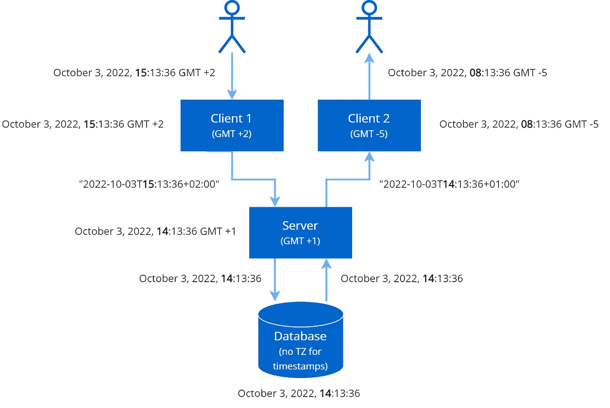
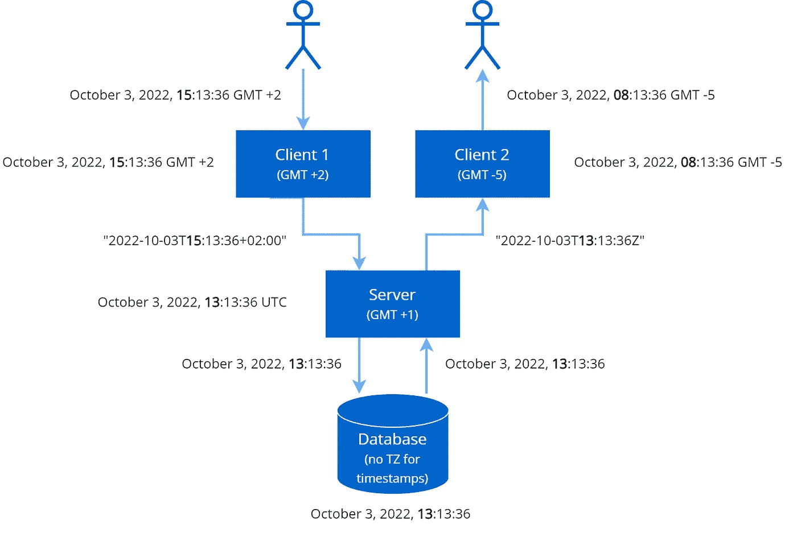

# 正确处理日期和时间

> 原文：<https://blog.devgenius.io/handling-date-and-time-the-right-way-5a6b9afa3437?source=collection_archive---------8----------------------->


由[阿格巴洛斯](https://unsplash.com/@agebarros?utm_source=medium&utm_medium=referral)在 [Unsplash](https://unsplash.com?utm_source=medium&utm_medium=referral) 上拍摄的照片

大多数软件项目都面临日期和时间值处理不正确的问题。即使系统在单一时区工作，夏令时也可能带来不愉快的惊喜。尽管如此，没有多少开发人员足够重视这个问题，因为它似乎微不足道。不幸的是，实践证明事实并非如此。

以下是您在处理软件项目时可能需要的日期/时间类型列表:

*   [日期时间](#f8ba)——“2022 年 7 月 23 日**下午 2 点 26 分 43 秒**采集到一个样本”。
*   [没有时间的日期](#ecee)——“电影将于 2022 年 10 月 28 日在美国**上映”。**
*   [时间跨度](#822b)——“导出目录用了 **3 分 12 秒**”。
*   [计划](#93aa) —“必须在每个工作日的上午 8 点从遗留系统导入数据**。**

让我们逐一查看每个案例，同时考虑[一般性建议](#f6e9)。没有时间和欲望通读全部细节的可以马上跳到[概要](#642e)。

# 日期和时间

让我们想象一下，采集标本的实验室位于+2 时区，而跟踪医学测试执行情况的中心办公室位于+1 时区。上例中提到的时间戳是由实验室记录的。有一个问题——中心局应该看到什么时间？显然，中心办公室的软件必须显示样本的时间为下午 1:26:43(减去一小时)，因为这个事件正好发生在他们所在时区的这个时刻。

我们必须确保我们的系统以这种方式工作，并根据客户端的时区显示时间戳。为了更好地理解我们如何可靠地实现这种行为，让我们看一个示例数据流，当时间戳由用户设置，然后双向通过所有层时。



1.  在客户端创建时间戳。假设是 2022 年 10 月 3 日， **15** :13:36。客户端位于 GMT +2 时区。
2.  该值被转换为字符串表示形式并发送给服务器-“2022–10–03T**15**:13:36+02:00”。
3.  服务器将时间戳反序列化为日期/时间对象，将其值转换为本地时区。如果服务器运行在 GMT +1，对象将包含 2022 年 10 月 3 日 **14** :13:36。
4.  服务器将时间戳存储在数据库中。让我们假设数据库没有为日期/时间值存储时区。在我们的示例 2022 年 10 月 3 日， **14** :13:36 将被保存，没有关于时区的信息。
5.  服务器从数据库中读取值，并创建一个日期/时间对象，保存 2022 年 10 月 3 日 **14** :13:36。由于服务器在 GMT +1 工作，该值将被视为该时区的时间戳。
6.  该值被转换为字符串表示形式并发送给客户端-“2022–10–03T**14**:13:36+01:00”。
7.  客户端将接收到的时间戳反序列化为日期/时间对象，将其值转换为本地时区。如果是 GMT -5，显示给第二个用户的值必须是 2022 年 10 月 3 日 **08** :13:36。

一切看起来都是一致的，但是让我们看看在这个流程中会出现什么问题。事实上，每一步都可能出现问题。

*   客户端上的时间可以在没有时区的情况下创建，例如，中的`DateTime`。带`DateTimeKind.Unspecified`的网。
*   序列化机制可能使用不包含时区偏移量的格式。
*   在反序列化时，尤其是在自定义序列化程序中，可能会忽略时区偏移量。
*   从数据库中读取数据时，可以创建不带时区的日期/时间对象，例如，在中的`DateTime`。用`DateTimeKind.Unspecified`网。此外，这是一种常见的情况。当读取不区分时区的类型的列时。
*   如果共享同一个数据库的应用服务器属于不同的时区，那么时间偏移将会非常混乱。由服务器 A 写入并由服务器 B 读取的值将不同于由服务器 B 写入并由服务器 A 读取的相同值。
*   将应用服务器从一个时区移动到另一个时区会导致对已经存储的时间戳的错误解释。

前面描述的方法的最大问题是在服务器代码中将时间戳转换为本地时区。如果服务器的时区没有夏令时，它可能会工作，但否则，一切最终都会崩溃。

随着时间的推移，不同的国家可能会改变他们的夏令时规则，这些变化必须事先纳入系统更新中。我在实践中遇到过几次这种机制不能正常工作的情况，所以不能保证这种情况不会再次发生。

考虑到上面的所有因素，我们可以制定传递和存储时间戳值的最简单和最可靠的方法:**服务器和数据库中的时间戳都必须与 UTC 对齐**。

让我们看看它给了我们什么:

*   当向服务器发送数据时，客户端必须为每个时间戳值传递一个时区偏移量，以便服务器可以将该值转换为 UTC。或者，客户端也可以进行这种转换，但是第一个选项更灵活。当接收回数据时，客户端会将时间戳转换为本地时区，因为它们总是采用 UTC。
*   UTC 没有夏令时，因此任何相关问题都无关紧要。
*   从数据库中读取数据时，不需要转换。确保被读取的值在后端被视为 UTC 值就足够了。例如，在。NET 可以通过设置`DateTimeKind`到`DateTimeKind.Utc`来实现。
*   共享同一数据库的服务器之间的时区差异以及在时区之间移动服务器不会影响数据的正确性。

要实现这些规则，您需要注意三件事:

*   让序列化/反序列化机制正确地将 UTC 时间戳转换为本地时区，然后再转换回来。
*   确保服务器端的反序列化程序使用 UTC 时区创建日期/时间对象。
*   确保服务端的数据访问层使用 UTC 时区创建日期/时间对象。有时不需要修改代码就可以实现——通过将所有服务器上的系统时区设置为 UTC。然而，最好以不需要的方式编写代码:在。NET 确保所有的`DateTime`实例都使用`DateTimeKind.Utc`，在 Java 中——根本不使用`LocalDateTime`,并确保使用`Instant`或带 UTC 时区的区域感知类型，等等。

这种方法稍微改变了我们之前看到的情况:



请记住，只有当两个条件成立时，上面的想法才会奏效。

*   不要求“按原样”显示原始时间戳和/或原始时区。在飞机票上可以看到相反的情况，到达和离开的时间必须按照机场的时区打印。或者，如果同一台服务器打印不同国家的发票，则每张发票都必须具有特定于国家的本地时间，而不是转换为服务器的时区。
*   所有的时间戳都是“绝对”的，所以指示一个单独的时刻。例如，“最后一架航天飞机于 2011 年 7 月 8 日 15:29:04 UTC 发射”或“会议将于美国东部时间今天下午 5 点举行”。相比之下，一些软件产品可能需要“相对”时间标记，例如“电视节目将在列表中的每个国家的上午 10 点到 11 点之间播出”。原来，电视节目播出并不是单个事件——事实上，它是由多个事件表示的，由于时区差异，这些事件可能发生在绝对时间尺度上的不同时间段。

在违反第一个条件的情况下，可以通过在服务器和数据库中使用支持时区的数据类型来解决问题。如果您的数据库不支持这种类型，只需添加一个额外的字段来存储每个时间戳字段的原始时区偏移量。

违反前面提到的第二个条件比较复杂。假设这样的“相对”时间戳只需要为了显示目的而被存储，并且没有必要为特定时区确定相应的“绝对”值。在这种情况下，避免日期/时间转换就足够了。例如，用户已经将所有位置的广播开始时间设置为 2022 年 11 月 10 日上午 10 点，这个确切的值将被传输、存储和显示。但是可能有一个计划者必须在每次广播之前运行一些自动化(例如，发送通知或检查一些数据)。这样的计划者需要了解所有位置的时区偏移量，该偏移量可能随时间而变化。关于如何维护这些知识，有不同的选择，但我会考虑全球来源，如谷歌地图时区 API。

如您所见，**没有一种全面的方法可以涵盖 100%的情况**。通常,“存储在 UTC”选项就足够了，但是最好意识到当它不起作用并且需要更复杂的解决方案时的例外情况。

# 没有时间的日期

我们已经知道如何处理时间戳，但是没有时间的日期怎么办？就拿文章开头提到的例子——“电影将于 2022 年 10 月 28 日在美国上映”。如果我们对时间戳使用相同的数据类型和相同的机制会怎么样？

并非所有的平台、语言和数据库都有专门的类型来存储不带时间部分的日期。例如，。NET 从开始获得它的`DateOnly`类型。NET 6。如果我们在创建时间戳实例时只指定日期，那么无论如何都会有一个等于“00:00:00”的时间片段。如果我们从时区-4 取值“10 月 28 日，00:00:00”并将其转换为时区-5，我们将得到“10 月 27 日，23:00:00”。对于上面提到的例子，这意味着这部电影将在一个时区的 10 月 28 日上映，而在另一个时区的 10 月 27 日上映，这是无稽之谈，因为它与最初的说法相矛盾。**“纯”日期的一般规则非常简单——在读写的任何阶段都不能转换这些值。**

有几种方法可以避免这种转换:

*   如果平台支持“仅日期”类型，就使用它。
*   将该值作为 ISO 日期字符串(“2022–10–28”)进行存储、处理和传输，并根据当前的语言环境在客户端对其进行格式化。从数据库的角度来看，这应该没问题，因为这种格式保留了正确的排序顺序，所以您的查询可以安全地对“仅日期”字符串进行排序。
*   同上，但如果数据库支持，则存储为“仅日期”类型。

请记住，并不是所有看起来像没有时间的日期的属性实际上都没有时间。例如，用于过滤一些对象的日期范围控件通常隐含时间——“从日期 A 00:00:00 到日期 B 23:59:59”，因此这些值必须被视为时间戳并进行相应的处理。

# 时间跨度

时间跨度的存储和处理很简单——它的值不依赖于时区，所以没有具体的建议。您可以将它们作为多个时间单位(整数或浮点，取决于所需的精度)来保存和传输。如果秒精度很重要—以秒为单位，如果毫秒精度—以毫秒为单位，等等。

但是时间跨度的计算可能会有一些陷阱。假设我们有一个典型的 C#代码，它计算两个事件之间的时间间隔:

```
DateTime start = DateTime.Now; 
//... 
DateTime end = DateTime.Now; 
double hours = (end - start).TotalHours;
```

看似没有问题，但事实并非如此。首先，你可能会面临一些单元测试的问题，但是我们稍后会谈到。第二，我们假设开始是在冬令时，结束是在夏令时(比如我们在测量工作时间，我们的工人有夜班)。

让我们假设这段代码运行在夏令时于 2022 年 3 月 27 日晚上开始的时区。

```
DateTime start = DateTime.Parse("2022-03-26T20:00:15+02"); 
DateTime end = DateTime.Parse("2022-03-27T05:00:15+03"); 
double hours = (end - start).TotalHours;
```

这段代码产生了 9 个小时，但是这两个事件之间只过去了 8 个小时。您可以通过这样修改代码来轻松证明这一点:

```
DateTime start = DateTime.Parse("2022-03-26T20:00:15+02")
    .ToUniversalTime(); 
DateTime end = DateTime.Parse("2022-03-27T05:00:15+03")
    .ToUniversalTime(); 
double hours = (end - start).TotalHours;
```

在这里，我们可以得出一个重要的结论— **任何带有时间戳的算术运算都必须以 UTC 值或使用时区感知类型来完成**。从这个角度来看，将`DateTime.Now`改为`DateTime.UtcNow`可以很容易地修复原来的例子。

这种细微差别不依赖于特定的平台或编程语言。下面是一个等价的 Java 代码，它也有同样的问题:

```
LocalDateTime start = LocalDateTime.*now*();
*//...* LocalDateTime end = LocalDateTime.*now*();
long hours = ChronoUnit.*HOURS*.between(start, end);
```

它也很容易修复——例如，用`Instant`、`OffsetDateTime`或`ZonedDateTime`替换`LocalDateTime`。

# 日程安排

时间表是一件更复杂的事情。标准库没有允许存储时间表的通用类型。然而，这个特性是经常需要的，所以你可以很容易地找到一个现成的解决方案。一个很好的例子是其他服务和库(如 Quartz)使用的 [cron 表达式](https://en.wikipedia.org/wiki/Cron)。它涵盖了几乎所有的日程安排需求，甚至像“每个月的第二个星期五”这样的情况。

在大多数情况下，开发自己的调度程序是没有意义的，因为市场上已经有相当多的经过实战检验的解决方案。但是如果出于某种原因，需要创建自己的实现，至少可以借鉴 cron 的调度格式。

# 一般性建议

首先，关于用来获取当前时间的静态类成员— `DateTime.UtcNow`、`ZonedDateTime.now()`等。正如我前面所说，在代码中直接使用它们可能会使单元测试变得复杂，因为没有特殊的模拟框架就不可能替换当前时间。因此，如果你要对你的代码进行单元测试，最好是关注这个方面。至少有两种方法可以解决这个问题:

*   引入一个“DateTimeProvider”接口，用一个方法返回当前时间。然后将这个接口注入到所有需要检索当前时间的类中。从可测试性的角度来看，这种方法是最灵活的。
*   引入一个自定义静态类，该类包含一个返回当前时间的方法和一个重写此方法的默认实现的方法。例如，在 C#中，这个类可以公开一个`UtcNow`属性和一个`SetUtcNowImplementation(Func<DateTime> impl)`方法。使用静态成员获取当前时间减少了显式注入应用程序类的依赖项的数量，但是从 OOP 的角度来看这并不理想。如果，不管什么原因，前面的选择对你不起作用，考虑这个。

切换到自定义“日期/时间提供者”时必须解决的另一个问题是确保没有人出于同样的目的使用标准类。使用现代代码质量工具可以很容易地解决这个问题。它归结为在所有源代码文件中搜索“不需要的”子串，除了包含默认提供者实现的那个。

获取当前时间的第二个细微差别是**客户端不可信**。客户端设备上的当前时间可能与实际的当前时间相差很大，如果存在依赖于它的逻辑，这种差异可能会破坏一切。如果可能的话，所有需要当前时间的地方都必须在服务器端执行。

我想提到的另一件事是描述数据交换的日期和时间格式的 [ISO 8601](https://en.wikipedia.org/wiki/ISO_8601) 标准。日期和时间的序列化表示必须符合该标准，以避免兼容性问题。在实践中，开发人员很少实现他们自己的日期/时间序列化，因此该标准主要用于提供信息。

# 摘要

*   如果您不需要以原始时区显示时间戳值，请在服务器和数据库中以 UTC 格式处理时间戳。将它们转换为客户端上的本地时区。
*   如果您不确定后端代码是否始终使用 UTC 值，您可以将所有服务器上的系统时区设置为 UTC。在这种情况下，即使有些地方仍然使用当地时间，一切都会保持一致。
*   如果需要存储每个时间戳的原始时区，请在服务器和数据库中使用支持时区的类型。如果数据库不支持这种数据类型，请在每个时间戳字段旁边添加一个额外的时区偏移量字段。
*   明确区分时间戳(有时间的日期)和纯日期(没有时间的日期)。在任何情况下，纯日期都不能在时区之间转换。记住，并不是所有看起来像没有时间的约会，实际上都是没有时间的。例如，搜索条件中的日期范围条件通常意味着时间分数。
*   任何带有时间戳的算术运算都必须以 UTC 值或使用时区感知类型来完成。
*   出于计划的目的，最好使用现有的解决方案。如果你需要处理底层的时间表，看看 [cron 表达式](https://en.wikipedia.org/wiki/Cron)作为时间表定义格式的一个很好的例子。
*   确保当前时间可以在单元测试中被模拟。
*   尽可能获取服务器上的当前时间。永远不要相信客户端可以决定当前时间。