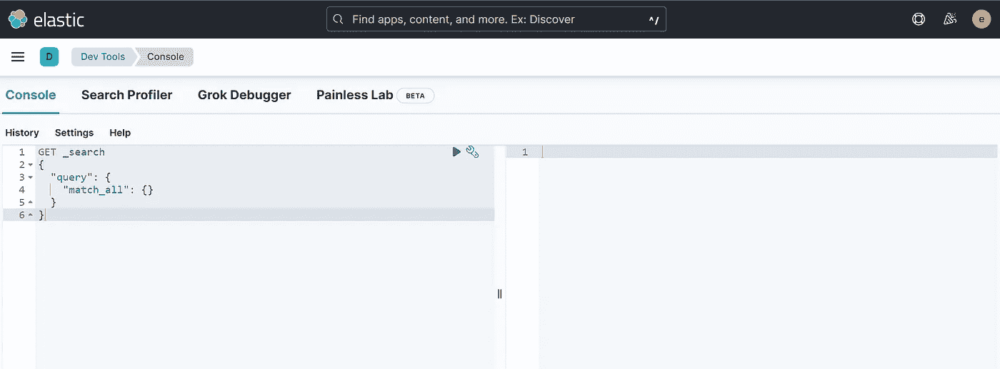

# Elasticsearch 文档和索引入门

> 原文：<https://blog.devgenius.io/handling-documents-and-indexes-on-elasticsearch-dd2690775d4f?source=collection_archive---------16----------------------->

在上一篇文章中，我们已经看到了如何在你的 PC 上本地安装 Elasticsearch 和 Kibana [或者使用](https://medium.com/@mhdabdel151/elasticsearch-and-kibana-on-windows-lets-get-started-ff005f1fe2fc) [Docker 容器](https://medium.com/@mhdabdel151/run-elasticsearch-and-kibana-as-docker-containers-c5f5f5460afd)。今天我们将运行我们的第一个**查询**并引入**索引**。

一旦启动，你可以在所谓的**开发工具**界面上与 Elasticsearch 互动，这是一个直接向 Elasticsearch 发送请求的控制台。我建议您在阅读本文时运行查询，以熟悉 Elasticsearch。所以从 Kibana 打开开发工具控制台。



在向您展示如何使用 Elasticsearch 之前，让我们看看数据是什么样子的。
**文档**用于存储数据。文档是一个带有键和值的 JSON 对象。例如:

```
{
  "name": "Jane Doe",
  "gender": "female"
}
```

要发送它，我们可以使用 Elasticsearch 提供的[REST API](https://www.redhat.com/en/topics/api/what-is-a-rest-api)。这里我们想要保存文档，所以我们使用 **PUT** ，然后我们指定*端点*。端点是将存储数据的索引的名称。例如这里我们选择'*汽车'*作为索引。我们还必须指定它是一个文档，并给它一个 *id* 。发送后，下面的请求将要求将新创建的文档添加到弹性搜索中，在*汽车*索引中使用 *id* ' *1* '。

```
PUT cars/_doc/1
{
  "brand": "Volkswagen",
  "owner": "Lewandowski",
  "color": "black"
}
```

作为回答，Elasticsearch 通知我们，该文档已被添加到指定的索引中，其版本为 ***【版本 1】***，因为我们刚刚创建了该文档，并且 ***结果*** 字段将通知我们刚刚执行的操作，此处为*创建*。

```
{
  "_index": "cars",
  "_id": "1",
  "_version": 1,
  "result": "created",
  "_shards": {
    "total": 2,
    "successful": 1,
    "failed": 0
  },
  "_seq_no": 0,
  "_primary_term": 1
}
```

例如，如果我们仅仅通过改变汽车的*品牌*来重新启动相同的查询，我们得到如下响应:

```
{
  "_index": "cars",
  "_id": "1",
  "_version": 2,
  "result": "updated",
  "_shards": {
    "total": 2,
    "successful": 1,
    "failed": 0
  },
  "_seq_no": 1,
  "_primary_term": 1
}
```

我们的操作成功执行，我们注意到字段 ***结果*** 告诉我们执行的操作是*更新*，版本*已经更改为 ***2*** ，因为这是对该文档进行的第二次操作。我们可以通过使用 **GET** 后跟 *index* ，然后是 *_doc* 来检索这个文档，以表明我们想要检索一个文档，最后是它的 *id* 。请求如下:*

```
*GET cars/_doc/1*
```

*作为回报，我们得到:*

```
*{
  "_index": "cars",
  "_id": "1",
  "_version": 2,
  "_seq_no": 1,
  "_primary_term": 1,
  "found": true,
  "_source": {
    "brand": "Maserati",
    "owner": "Lewandowski",
    "color": "black"
  }
}*
```

**true* 上的 ***found*** 字段告诉我们已经找到了该文档，并且 ***_source*** 正好包含我们的文档。*

*在添加和检索文档之后，还可以修改文档的单个字段，例如它的所有者。上面使用的 **PUT** 请求允许我们更改品牌，但是我们必须再次提供其他属性，否则它们将被删除。我们能做的是使用 ***_update*** 端点并指定文档的 ***id*** 的 **POST** 请求。
操作如下所示:*

```
*POST cars/_update/1
{
  "doc": {
    "owner": "Ronaldo"
  }
}*
```

*通过对文档执行一个 **GET** 操作，您可以验证 owner 属性是否已经更新，其他属性是否仍然存在并且没有更改。*

*现在我们来谈谈 Elasticsearch 中的**索引**。索引有两个概念需要牢记: ***数据分布*** 和 ***数据模式存储*** 。*

## *数据模式存储*

*有些人可能认为 Elasticsearch 是*无模式的*，因为我们从一开始就没有指定模式，但事实并非如此。在每次文档索引时，会自动生成一个模式，可以使用 ***_mapping*** 端点来检索该模式。例如，我们的汽车指数:*

```
*GET cars/_mapping*
```

*作为回应，我们得到我们的模式:*

```
*{
  "cars": {
    "mappings": {
      "properties": {
        "brand": {
          "type": "text",
          "fields": {
            "keyword": {
              "type": "keyword",
              "ignore_above": 256
            }
          }
        },
        "color": {
          "type": "text",
          "fields": {
            "keyword": {
              "type": "keyword",
              "ignore_above": 256
            }
          }
        },
        "owner": {
          "type": "text",
          "fields": {
            "keyword": {
              "type": "keyword",
              "ignore_above": 256
            }
          }
        }
      }
    }
  }
}*
```

## *数据分布*

*让我们检查一下集群，看看我们有多少个 Elasticsearch 节点:*

```
*GET _cat/nodes// response
127.0.0.1 52 87 5    cdfhilrmtsz * DESKTOP-8LF96VK*
```

*换句话说，目前只有一台机器在运行 Elasticsearch。Elasticsearch 将在创建索引时生成所谓的“ ***”碎片***“*”(参见将分发数据的块)*，以便传播数据。默认情况下，每个节点只创建一个*(该参数可以更改)*。其优势在于，我们可以创建这些碎片的精确副本，称为 ***副本*** ，并且我们必须确保这些副本不在相同的节点上，因此如果一个节点崩溃，由于已经制作了副本，我们总是可以恢复数据。为了获得我们的索引的*设置*，我们可以:*

```
*GET cars/_settings// output
{
  "cars": {
    "settings": {
      "index": {
        "routing": {
          "allocation": {
            "include": {
              "_tier_preference": "data_content"
            }
          }
        },
        "number_of_shards": "1",
        "provided_name": "cars",
        "creation_date": "1661376650544",
        "number_of_replicas": "1",
        "uuid": "l1hnyMG-RVe7B1F_qxzEsA",
        "version": {
          "created": "8030399"
        }
      }
    }
  }
}*
```

*我们可以看到我们的索引有一个碎片和一个副本。现在让我们通过运行以下命令来删除我们的索引:*

```
*DELETE cars*
```

*并通过指定例如设置(如碎片数量和副本数量以及映射*)来重新创建一个新的**

```
**PUT cars
{
  "settings": {
    "number_of_shards": 2,
    "number_of_replicas": 1
  },
  "mappings": {
    "properties": {
      "brand": {
        "type": "text"
      },
      "owner": {
        "type": "text"
      },
      "color": {
        "type": "text"
      }
    }
  }
}**
```

**我们得到了确认，作为一个回答，告诉我们一切进展顺利。**

```
**{
  "acknowledged": true,
  "shards_acknowledged": true,
  "index": "cars"
}**
```

**您可以检查*映射*和*设置*以查看您的参数是否已被考虑在内。**

**今天就到这里，请随意查看官方文档了解更多细节。感谢您的阅读，如果您对本文有任何问题或评论，请在下面留下您的评论。**

**我们下次再见，看更多的帖子。**

**阿卜杜尔-巴吉**