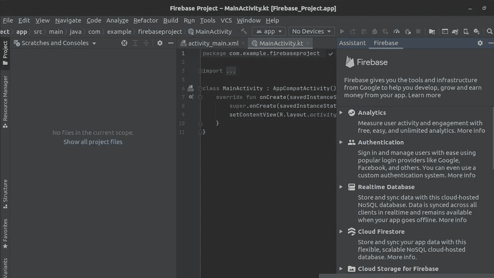
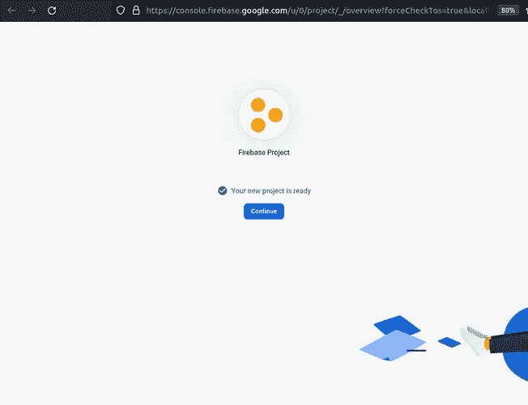
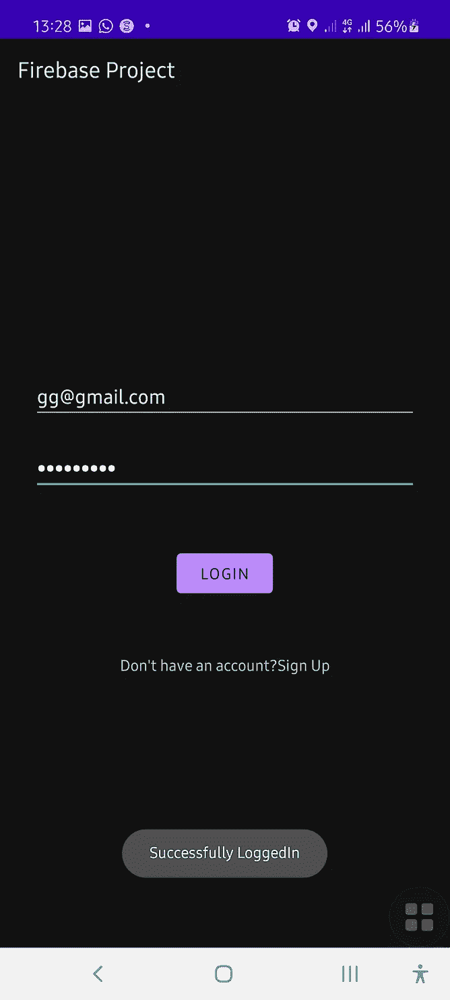

# 处理使用 Firebase 电子邮件和密码验证(Kotlin)时遇到的错误

> 原文：<https://blog.devgenius.io/handling-errors-encountered-when-using-firebase-email-and-password-authentication-kotlin-15380757242d?source=collection_archive---------4----------------------->

**简介**

Firebase 是一个解决方案，使开发人员能够更专注于构建应用程序，而无需担心后端管理。Firebase 可以处理用户认证、数据库、文件存储、通知等功能。

在 Firebase 中，可以使用多种登录方法来处理用户身份验证，例如:

1.  电子邮件和密码
2.  电话
3.  谷歌
4.  脸谱网
5.  Twitter 和更多

在这篇文章中，我们将重点学习如何使用 Firebase Email 和 Kotlin 中的密码登录方法实现用户认证。除此之外，我们将看看开发人员在这个过程中遇到的一些潜在错误以及如何解决它们。

**先决条件**

要完成本教程，您需要具备:

*   [安装在您机器上的 Android Studio IDE](https://developer.android.com/studio) 。
*   一个活跃的[谷歌账户](https://accounts.google.com/signup/v2/webcreateaccount?flowName=GlifWebSignIn&flowEntry=SignUp)。

# 步骤 1 —创建 Android 项目

首先，我们需要创建一个 Android 项目。为此，启动 Android studio 并导航至**文件**->-**新建**->-**新建项目**。选择`Empty Activity` 作为项目模板，然后点击“下一步”按钮。一旦配置完成，并且您已经为项目命名，您可以单击“finish”按钮。


选择空活动


为项目命名

# 步骤 2—创建一个 Firebase 项目

进入 Android Studio，导航至**工具**->-Firebase。这将启动 **Firebase 助手**窗格。


通往 Firebase 助理窗格之路

Firebase 助手窗格显示了 Firebase 为简化 android 开发而提供的所有功能。



Firebase 助手窗格

请记住，我们关注的是 Firebase 的用户认证部分。因此，在 Firebase Assistant 窗格中，选择**认证**，然后点击**使用自定义认证系统认证【kot Lin】**。


使用自定义验证系统进行验证

下面的窗格将弹出，我们将点击**连接到 Firebase。**


连接到 Firebase

如果您之前没有构建过您的项目，这个提示可能会弹出。点击**构建**。如果这个提示没有弹出，就继续这个过程。


在连接到 Firebase 之前生成项目

在构建项目之后，或者万一构建提示没有出现在你的终端，点击**连接到 Firebase** 会自动把你带到 Firebase 控制台(如果没有，那是因为你还没有一个 Firebase 帐户)。我的 Firebase 帐户已经有几个项目，这就是我们在这里看到的。

我们将点击添加项目。


Firebase 控制台页面

出于一致性的考虑，项目名称应该与 android studio 中声明/编写的名称相同。


添加项目 1



向 Firebase 添加项目所涉及的其他过程

现在，您已经完成了 Firebase 控制台部分。您需要返回 Android studio 来完成设置。下图应该是你的 android 工作室的样子。接下来要做的是将身份验证 SDK 添加到我们的应用程序中。点击那个。


添加 Firebase 身份验证 SDK

弹出的提示显示了将要添加到项目中的内容。单击接受更改。随后会发生 Gradle build。


将对格雷尔做出的改变

最后，下图是你的 Firebase 助手应该是什么样子。


最后，我们需要在 Firebase 控制台上设置登录方法。为此，请返回 Firebase 控制台，然后导航到所有产品->身份验证->登录方法。我们的重点是电子邮件/密码，因此这是将被启用和保存的登录方法。


启用 Firebase 电子邮件/密码登录方法

# 步骤 3-向应用程序添加用户验证屏幕

这一步将在 android studio 上处理，登录和注册页面的用户界面(UI)将使用`XML`和`Kotlin`创建。


创建新活动

要创建一个新的活动，我们需要位于项目目录的 android 部分。参考上图中我的光标所指的地方。


创建注册活动活动

一旦我们进入 Android 部分，展开应用程序，然后是 java，然后是包名(com.example.firebaseproject)。您项目中的活动列表将显示在这里。这里有一个默认的活动，叫做 MainActivity。

要创建新的活动，右键单击包名，然后依次单击 New > Activity > Empty Activity。将弹出一个新窗口，要求输入空活动的名称。布局名称会自动填充活动名称中的内容。填写完毕后，点击“完成”按钮。

注意:Gradle 将在创建每个活动后构建。

按照相同的过程创建登录页面。


活动已创建

创建完这两个活动后，我们将开始编辑 xml 文件。xml 文件位于**RES**->T5【布局】T6 目录下。打开 **activity_login.xml** 文件，添加两个 **EditText** 视图和一个**按钮，方法是**将代码更新为:

```
<?xml version="1.0" encoding="utf-8"?>
<LinearLayout
    xmlns:android="http://schemas.android.com/apk/res/android"
    xmlns:tools="http://schemas.android.com/tools"
    android:layout_width="match_parent"
    android:layout_height="match_parent"
    android:orientation="vertical"
    android:gravity="center"
    android:padding="30dp"
    tools:context=".LoginActivity">

    <EditText
        android:id="@+id/emaillogin"
        android:inputType="textEmailAddress"
        android:autofillHints="emailAddress"
        android:layout_marginBottom="20dp"
        android:layout_width="match_parent"
        android:layout_height="wrap_content"
        android:hint="@string/email"
        />

    <EditText
        android:id="@+id/passwordlogin"
        android:inputType="textPassword"
        android:layout_width="match_parent"
        android:layout_height="wrap_content"
        android:hint="@string/password"
        />

    <Button
        android:id="@+id/loginbtn"
        android:layout_marginTop="50dp"
        android:layout_marginBottom="50dp"
        android:layout_width="wrap_content"
        android:layout_height="wrap_content"
        android:text="@string/login"/>

    <LinearLayout
        android:layout_width="wrap_content"
        android:layout_height="wrap_content"
        android:orientation="horizontal">
        <TextView
            android:layout_width="wrap_content"
            android:layout_height="wrap_content"
            android:text="@string/donhaveaccount"
            />

        <TextView
            android:id="@+id/signuptxt"
            android:layout_width="wrap_content"
            android:layout_height="wrap_content"
            android:text="@string/signup"
            />
    </LinearLayout>

</LinearLayout>
```

接下来是 activity_sign_up.xml 文件，将代码更新为以下内容:

```
<?xml version="1.0" encoding="utf-8"?>
<LinearLayout
    xmlns:android="http://schemas.android.com/apk/res/android"
    xmlns:tools="http://schemas.android.com/tools"
    android:layout_width="match_parent"
    android:layout_height="match_parent"
    android:orientation="vertical"
    android:gravity="center"
    android:padding="20dp"
    tools:context=".SignUpActivity">

    <EditText
        android:id="@+id/email"
        android:inputType="textEmailAddress"
        android:layout_width="match_parent"
        android:layout_height="wrap_content"
        android:layout_margin="10dp"
        android:hint="@string/email"/>

    <EditText
        android:id="@+id/password"
        android:inputType="textPassword"
        android:layout_margin="10dp"
        android:layout_width="match_parent"
        android:layout_height="wrap_content"
        android:hint="@string/password"/>

    <EditText
        android:id="@+id/confirmpass"
        android:inputType="textPassword"
        android:layout_margin="10dp"
        android:layout_width="match_parent"
        android:layout_height="wrap_content"
        android:hint="@string/confirmpassword"/>

    <Button
        android:id="@+id/signupbtn"
        android:layout_marginTop="20dp"
        android:backgroundTint="#FF0000"
        android:layout_width="wrap_content"
        android:layout_height="wrap_content"
        android:text="@string/signup"/>

    <LinearLayout
        android:layout_marginTop="20dp"
        android:layout_width="wrap_content"
        android:orientation="horizontal"
        android:layout_height="wrap_content">
        <TextView
            android:layout_width="wrap_content"
            android:layout_height="wrap_content"
            android:text="@string/alreadysignedup"/>

        <TextView
            android:id="@+id/logintxt"
            android:layout_width="wrap_content"
            android:layout_height="wrap_content"
            android:text="@string/login"/>
    </LinearLayout>
</LinearLayout>
```

接下来是 activity_main.xml 文件，将代码更新为以下内容:

```
<?xml version="1.0" encoding="utf-8"?>
<LinearLayout
    xmlns:android="http://schemas.android.com/apk/res/android"
    xmlns:app="http://schemas.android.com/apk/res-auto"
    xmlns:tools="http://schemas.android.com/tools"
    android:layout_width="match_parent"
    android:layout_height="match_parent"
    android:orientation="vertical"
    android:gravity="center"
    android:layout_margin="20dp"
    android:padding="20dp"
    tools:context=".MainActivity">

    <Button
        android:id="@+id/signupbtna"
        android:layout_width="match_parent"
        android:layout_height="wrap_content"
        android:text="@string/signup"/>

    <Button
        android:id="@+id/loginbtn"
        android:layout_width="match_parent"
        android:layout_height="wrap_content"
        android:text="@string/login"/>
</LinearLayout>
```

在 xml 文件中，要引用的每个视图(EditText、TextView 和 Button)都包含一个唯一标识符(ID ),用于在整个布局中引用它。LinearLayout 帮助我们使用 android:orientation="vertical "垂直对齐视图。

**编写 XML 文件时可能遇到的错误**

IDE 会报错未解析的引用。

**原因**:IDE 抱怨这是因为在 xml 文件中，您引用了一个尚未创建的字符串资源(无效的字符串资源)。这可能是因为您有一个带有(')的字符串，如“没有帐户？”或者您还没有创建字符串资源。

**解决方案**:您可以通过导航到`res` > `values` > `strings`来解决错误，然后像这样创建一个字符串资源。

```
<string name="signup">Sign Up</string>
<string name="confirmpassword">Confirm Password</string>
<string name="donhaveaccount">Don\'t have an account?</string>
```

现在，让我们编辑我们的活动类。从 MainActivity 类开始，这是我们执行的起点。将代码更新为以下内容:

```
package com.example.firebaseproject

import android.content.Intent
import androidx.appcompat.app.AppCompatActivity
import android.os.Bundle
import android.widget.Button

class MainActivity : AppCompatActivity() {
    override fun onCreate(savedInstanceState: Bundle?) {
        super.onCreate(savedInstanceState)
        setContentView(R.layout.*activity_main*)

        val signupbutton: Button = findViewById(R.id.*signupbtn*)
        signupbutton.setOnClickListener **{** val intent = Intent(this, SignUpActivity::class.*java*)
            startActivity(intent)
        **}** val loginbutton: Button = findViewById(R.id.*loginbtn*)
        loginbutton.setOnClickListener **{** val intent = Intent(this, LoginActivity::class.*java*)
            startActivity(intent)
        **}** }
}
```

接下来是 SignUpActivity 类，将代码更新为以下内容:

```
package com.example.firebaseproject

import android.content.Intent
import androidx.appcompat.app.AppCompatActivity
import android.os.Bundle
import android.text.TextUtils
import android.util.Patterns
import android.widget.*
import com.google.firebase.auth.FirebaseAuth
import com.google.firebase.auth.FirebaseAuthUserCollisionException

class SignUpActivity : AppCompatActivity() {
    override fun onCreate(savedInstanceState: Bundle?) {
        super.onCreate(savedInstanceState)
        setContentView(R.layout.*activity_sign_up*)

        // Creating firebaseAuth object and Initialising auth object
        var auth: FirebaseAuth = FirebaseAuth.getInstance()

        val signupbtn: Button = findViewById(R.id.*signupbtn*)
        val logintxt: TextView = findViewById(R.id.*logintxt*)
        val etEmail: EditText = findViewById(R.id.*email*)
        val etPass: EditText = findViewById(R.id.*password*)
        val etConfPass: EditText = findViewById(R.id.*confirmpass*)

        signupbtn.setOnClickListener **{** val email = etEmail.*text*.toString()
            val pass = etPass.*text*.toString()
            val confirmPassword = etConfPass.*text*.toString()

            if (TextUtils.isEmpty(email)) { //check if the email editText field is empty
                etEmail.requestFocus()
                Toast.makeText(this, "Enter a valid email address", Toast.*LENGTH_SHORT*).show()
                return@setOnClickListener //this line simply states that no other action should happen unless the email editText field has been filled
            }

            if(!Patterns.*EMAIL_ADDRESS*.matcher(email).matches()){//check if the email entered matches a normal email address pattern

                etEmail.requestFocus()
                Toast.makeText(this, "Enter a valid email address", Toast.*LENGTH_SHORT*).show()
                return@setOnClickListener //this line simply states that no other action should happen unless the value in email editText matches an email address pattern
            }

            if (TextUtils.isEmpty(pass)) { //check if the password editText field is empty
                Toast.makeText(this, "Enter a password", Toast.*LENGTH_SHORT*).show()
                return@setOnClickListener //this line simply states that no other action should happen unless the password editText field has been filled
            }

            if(pass.length<6){//check if the value in password editText filed is less than 6 characters
                Toast.makeText(this, " Password must be at least 6 characters", Toast.*LENGTH_SHORT*).show()
                return@setOnClickListener //this line simply states that no other action should happen unless the value in password editText field is more than 6 characters
            }

            if (TextUtils.isEmpty(confirmPassword)) {//check if the confirmPassword editText field is empty
                Toast.makeText(this, "Confirm password has to be provided", Toast.*LENGTH_SHORT*).show()
                return@setOnClickListener //this line simply states that no other action should happen unless the confirmpassword editText field is filled
            }

            if(!confirmPassword.equals(pass)){//check if value in confirmPassword equals value in password
                Toast.makeText(this, "Confirm password has to be the same as password", Toast.*LENGTH_SHORT*).show()
                return@setOnClickListener //this line simply states that no other action should happen unless the value in confirmPassword equals value in password
            }

            //This next line signifies that we use the firebase instance to create user with email and password
            auth.createUserWithEmailAndPassword(email, pass).addOnCompleteListener(this) **{** if (**it**.*isSuccessful*) {
                    Toast.makeText(this, "Successfully Signed Up", Toast.*LENGTH_SHORT*).show()
                } else {
                    try {
                        throw **it**.getException()!!
                    } catch (e: FirebaseAuthUserCollisionException) {
                        // email already in use
                        Toast.makeText(*applicationContext*,
                            "Email already taken!",
                            Toast.*LENGTH_SHORT* ).show()
                    }
                    Toast.makeText(this, "Sign Up Failed!", Toast.*LENGTH_SHORT*).show()
                }

            **}

        }** logintxt.setOnClickListener **{** val intent = Intent(this, LoginActivity::class.*java*)
            startActivity(intent)
            finish()
        **}** }
}
```

然后，LoginActivity 类应更新为以下内容:

```
package com.example.firebaseproject

import android.content.Intent
import androidx.appcompat.app.AppCompatActivity
import android.os.Bundle
import android.text.TextUtils
import android.widget.Button
import android.widget.EditText
import android.widget.TextView
import android.widget.Toast
import com.google.firebase.auth.FirebaseAuth

class LoginActivity : AppCompatActivity() {
    override fun onCreate(savedInstanceState: Bundle?) {
        super.onCreate(savedInstanceState)
        setContentView(R.layout.*activity_login*)

        val loginbtn: Button = findViewById(R.id.*loginbtn*)
        val etEmail: EditText = findViewById(R.id.*emaillogin*)
        val etPass: EditText = findViewById(R.id.*passwordlogin*)

        loginbtn.setOnClickListener **{** val email = etEmail.*text*.toString()
            val pass = etPass.*text*.toString()

            if (TextUtils.isEmpty(email)) {
                Toast.makeText(this, "Enter a valid email address", Toast.*LENGTH_SHORT*).show()
                return@setOnClickListener
            }

            if (TextUtils.isEmpty(pass)) {
                Toast.makeText(this, "Enter a password", Toast.*LENGTH_SHORT*).show()
                return@setOnClickListener
            }

            // initialising Firebase auth object
            var auth: FirebaseAuth = FirebaseAuth.getInstance()
            // calling signInWithEmailAndPassword(email, pass)
            // function using Firebase auth object
            // On successful response Display a Toast
            auth.signInWithEmailAndPassword(email, pass).addOnCompleteListener(this) **{** if (**it**.*isSuccessful*) {
                    Toast.makeText(this, "Successfully LoggedIn", Toast.*LENGTH_SHORT*).show()
                } else
                    Toast.makeText(this, "Log In failed, Please Check Your login Credentials ", Toast.*LENGTH_SHORT*).show()
            **}

        }** val signuptxt: TextView = findViewById(R.id.*signuptxt*)
        signuptxt.setOnClickListener **{** val intent = Intent(this, SignUpActivity::class.*java*)
            startActivity(intent)
            // using finish() to end the activity
            finish()
        **}** }
}
```

SignUpActivity 和 LoginActivity 中的代码都有注释，解释 Firebase 身份验证对象的初始化位置，并使用电子邮件和密码创建用户(注册)以及使用已创建的电子邮件和密码登录应用程序(登录)。

**您可能遇到的其他错误**

除了已经处理的 XML 错误之外，如果不严格遵守代码，还会遇到其他错误，原因如下:

1.  传递了空的电子邮件和密码字符串:

这是上面的 SignUpActivity 类中检查的条件之一。如果这些字段中的任何一个为空，应用程序必定会崩溃，这只是因为它希望在这些字段中有一个值来创建用户。

2.该电子邮件与电子邮件地址模式不匹配:

如果在电子邮件编辑文本字段中输入的值与电子邮件地址模式不匹配，那么应用程序肯定会崩溃。在上面的 SignUpActivity 类中也检查了这个条件。

3.密码长度不超过 6 个字符:

只有当密码长度至少为 6 个字符时，Firebase 身份验证才有效。如果您没有确保密码字段中的值是这个长度，应用程序一定会崩溃。

4.该电子邮件已经作为用户存在

如果你试图用 Firebase 中已经存在的另一个电子邮件创建另一个用户，这个应用肯定会崩溃。下面的代码检查这个错误，并防止应用程序崩溃。

```
try {
                        throw **it**.getException()!!
                    } catch (e: FirebaseAuthUserCollisionException) {
                        // email already in use
                        Toast.makeText(*applicationContext*,
                            "Email already taken!",
                            Toast.*LENGTH_SHORT* ).show()
                    }
```

**运行应用程序**

将您的 Android 设备连接到计算机或启动模拟器。点按 android studio 上的运行按钮(看起来像播放按钮)。查看[开发者选项](https://developer.android.com/studio/debug/dev-options)，了解如何配置设备上开发者选项的更多详细信息。

等待 Gradle 构建完成，安装并启动您的应用程序。

弹出的第一个 UI(用户界面)是 activity_main，显示了两个按钮。



测试应用程序

回到 Firebase 控制台，在用户部分，您会找到所有已登录的用户。每个用户/帐户都有一个唯一的 ID，密码经过哈希处理。


# 结论

在本文中，我们了解了 Firebase 必须提供的一些特性。我们深入研究了使用电子邮件和密码的用户认证。在这个过程中，我们还学会了如何处理或防止一些重大错误。