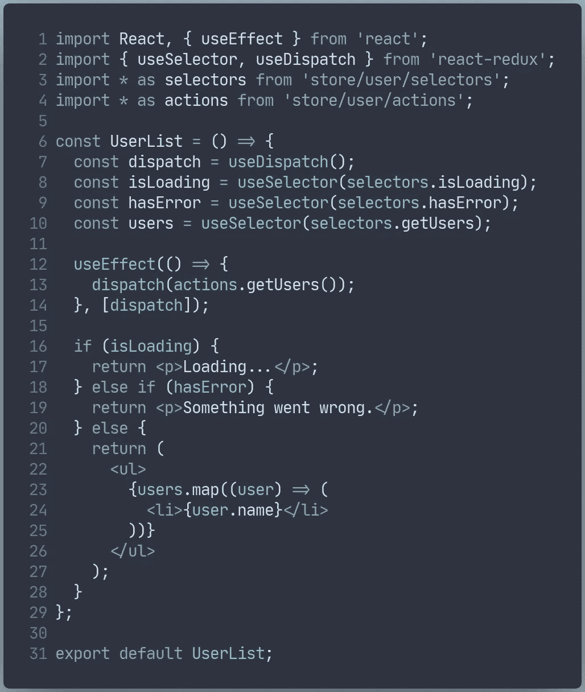
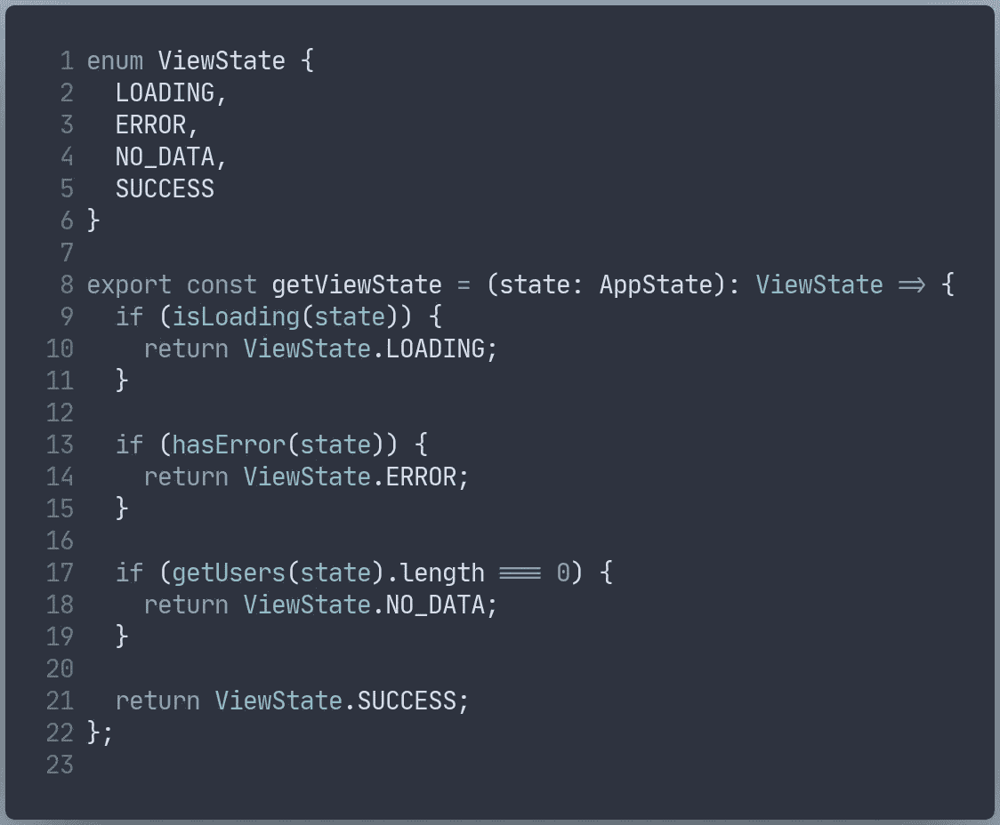
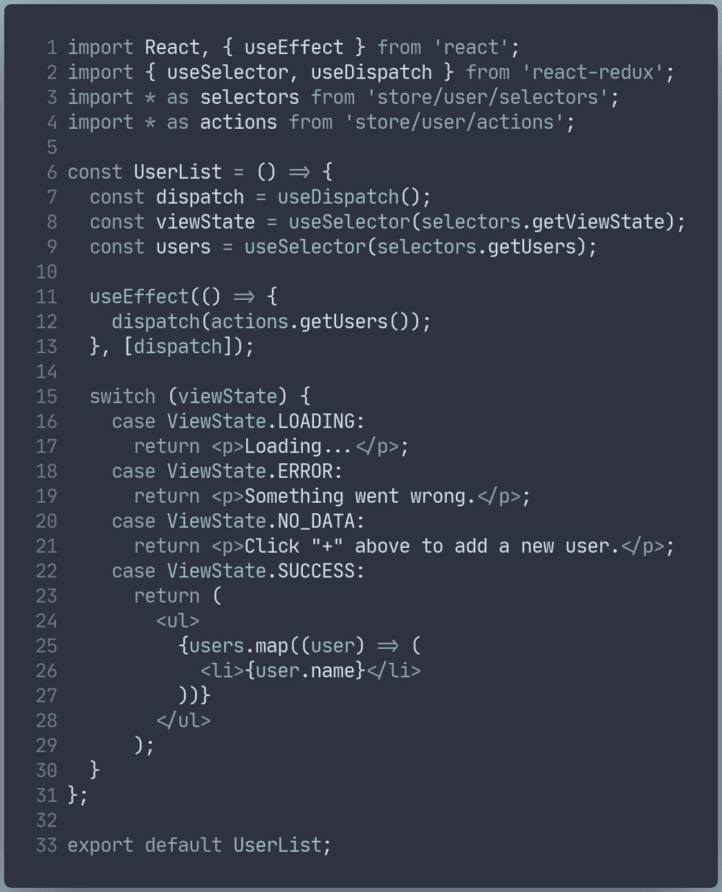

# 正确处理加载和错误状态

> 原文：<https://blog.devgenius.io/handling-loading-and-error-states-the-right-way-a9bbefd0d7cc?source=collection_archive---------11----------------------->

## 使用状态对象

前几天，我偶然发现了 Nicklas Millard 写的一篇关于我们应该如何[停止使用 If-Else 语句](https://medium.com/swlh/stop-using-if-else-statements-f4d2323e6e4)的文章，这让我思考我到底应该如何处理数据丰富的组件状态。

我敢打赌，您以前见过这种 Redux 模式，并且当您需要在组件中获取数据时处理加载和错误状态时，可能会经常使用它。

处理加载和错误状态的糟糕方式

如果你不能发现这个代码的问题，那么这个故事很可能适合你。

这种模式的问题是，您允许您的组件进入“假”状态，并且这也使得在其他组件中保持一致变得更加困难，在这种情况下，您检查加载和错误标志的顺序是一致的。

> 多种渲染条件会让你陷入不一致和复杂的混乱中。

## 问题是

例如，如果`isLoading`和`hasError`都是`true`，你应该渲染什么？无论您做出什么决定，您都必须为所有未来的组件记住这一点，以便它们的行为是相同的。

如果`hasError`是`true`，但是有数据可以显示给用户呢？您只是在重试请求时忘记了重置`hasError`属性。

当你开始引入更多在给定时间渲染什么的条件时，这很快就会变得一团糟。
假设您也想在获取成功时呈现一些帮助文本，但是列表中没有用户。你最终会用一堆 If-Else 和令人困惑的`hasError`、`isLoading`和`hasData`的组合来实现想要的结果，然后你必须向下一个开发人员解释，通过到处散布评论来打开这个噩梦。

## 那么我该如何解决这个问题呢？

简单回答:使用状态对象。

你应该引入状态对象，以确保只有有限数量的状态，并且一旦决定了如何计算它们，就可以重用这个逻辑。

这样做的目的是让代码对下一个需要做出改变的开发人员来说是可读和容易理解的。

利用选择器可以很容易地做到这一点——这实际上也使测试变得更容易，因为您已经隔离了计算逻辑。

基于存储中的数据计算状态

通过这种方式，我们可以为每个资源重用这个代码片段，并隔离测试选择器，这样我们在任何地方都有相同的行为，并且添加新的状态将非常容易，因为您只需在一个地方添加它们。

这也意味着你不会有开发人员忘记处理其中一个状态的风险，因为他们的编辑很可能会因为没有在他们的`switch`中处理所有`ViewState`的情况而对他们大喊大叫。

处理状态的正确方式

正如您在最终结果中看到的，我们将计算部分从组件中移出，现在可以安全地呈现已经定义的有限状态集。

它更清晰，更容易阅读，更容易测试——并且没有可能以奇怪的状态结束，我们都显示一个加载指示器和一个错误消息。*此外，我们还清理了一些代码，减少了这么多不同的选择器。*

## 资源

 [## 用策略模式替换条件逻辑

### 当你有一个包含大量条件逻辑(例如 if 语句)的方法时，你就是在自找麻烦。有条件…

www.jetbrains.com](https://www.jetbrains.com/help/idea/replace-conditional-logic-with-strategy-pattern.html#af8cfbe7)  [## 停止使用 If-Else 语句

### 编写干净、可维护的代码，不使用 if-else。

medium.com](https://medium.com/swlh/stop-using-if-else-statements-f4d2323e6e4) 

**Jakob Gaard Andersen** 是一家发展最快的银行的软件工程师，他在 React 中开发面向客户的应用程序。在担任目前的职位之前，他曾就职于四大咨询公司之一，并在诺和诺德、rsted、丹麦劳动力市场和招聘机构以及丹麦税务部的多个项目中发挥了自己的技能。

*连接上* [*LinkedIn*](https://www.linkedin.com/in/jakob-gaard-andersen/)