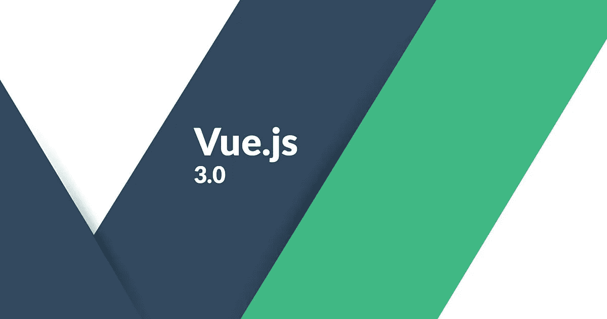

# 使用 Vue 3 处理用户交互

> 原文：<https://blog.devgenius.io/handling-user-interactions-with-vue-3-94cc628bcb5f?source=collection_archive---------6----------------------->



Vue 3 是 Vue 前端框架的最新版本。

它建立在 Vue 2 的普及性和易用性之上。

今天我们将看看如何处理用户与 Vue 3 的交互。

# 处理用户输入

`v-model`指令允许您将输入值绑定到模型属性。

例如，您可以写:

```
<!DOCTYPE html>
<html lang="en">
  <head>
    <title>App</title>
    <script src="https://unpkg.com/vue@next"></script>
  </head>
  <body>
    <div id="app">
      <input v-model="name" />
      <p>{{ name }}</p>
    </div>
    <script>
      const app = {
        data() {
          return {
            name: ""
          };
        }
      };

      Vue.createApp(app).mount("#app");
    </script>
  </body>
</html>
```

您在`app`的`data`方法中向返回的对象添加了`name`属性。

现在你可以使用`name`变量作为`v-model`中的值。

此外，您在模板中添加了`name`值的插值。

现在，当你在输入框中输入一些东西时，你将会看到同样的值显示在它的下面。

这是因为`v-model`努力获取输入值，将其设置为值`name`，反之亦然。

# 条件句和循环

您可以使用`v-if`指令有条件地呈现某些内容。

例如，您可以写:

```
<!DOCTYPE html>
<html lang="en">
  <head>
    <title>App</title>
    <script src="https://unpkg.com/vue@next"></script>
  </head>
  <body>
    <div id="app">
      <button v-on:click="toggle">toggle</button>
      <p v-if="seen">Now you see me</p>
    </div>
    <script>
      const app = {
        data() {
          return {
            seen: true
          };
        },
        methods: {
          toggle() {
            this.seen = !this.seen;
          }
        }
      };

      Vue.createApp(app).mount("#app");
    </script>
  </body>
</html>
```

你有调用`toggle`的按钮。

`toggle`方法将`this.seen`状态切换到其相反的值。

因为你在`v-if`中使用了它，如果`seen`是`true`它将渲染 p 元素，如果是`false`则不渲染。

也可以配合过渡效果使用。

# 环

您可以使用`v-for`指令显示数组中的项目。

例如，您可以这样使用它:

```
<!DOCTYPE html>
<html lang="en">
  <head>
    <title>App</title>
    <script src="https://unpkg.com/vue@next"></script>
  </head>
  <body>
    <div id="app">
      <ol>
        <li v-for="p in people">
          {{ p.name }}
        </li>
      </ol>
    </div>
    <script>
      const app = {
        data() {
          return {
            people: [{ name: "mary" }, { name: "jane" }, { name: "bob" }]
          };
        },
        methods: {
          toggle() {
            this.seen = !this.seen;
          }
        }
      };

      Vue.createApp(app).mount("#app");
    </script>
  </body>
</html>
```

在`data`方法中有一个`people`数组。

这与`v-for`指令一起使用，循环遍历数组并显示项目。

`p`是循环变量，你用来显示数组项。

# 成分

组件让我们组成一个 Vue 3 应用程序的多个部分。

每个组件都是应用程序的一小部分。

您可以通过编写以下内容来创建组件:

```
<!DOCTYPE html>
<html lang="en">
  <head>
    <title>App</title>
    <script src="https://unpkg.com/vue@next"></script>
  </head>
  <body>
    <div id="app">
      <Hello />
    </div>
    <script>
      const root = {};

      const app = Vue.createApp(root);

      app.component("Hello", {
        template: `<p>Hello</p>`
      });

      app.mount("#app");
    </script>
  </body>
</html>
```

你有了`root`对象。

然后你将`root`传递给`Vue.createApp`来创建你的 Vue 3 应用。

然后，您通过使用组件和组件对象调用`app.component`方法来创建您的`Hello`组件。

`template`有你想要显示的模板内容。

然后，我们用选择器字符串调用`mount`,将我们的应用程序安装到那个组件上。

# 结论

您可以使用`app.component`方法添加 Vue 组件。

`v-model`指令将输入值绑定到变量。

`v-for`让你循环遍历数组并呈现其条目的数据。