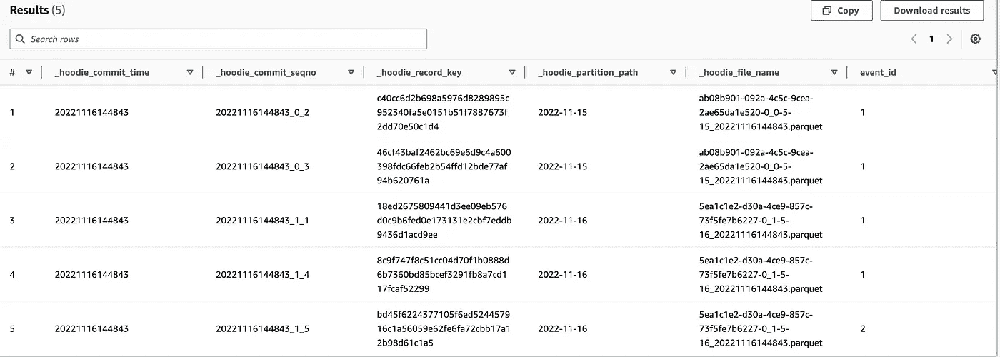
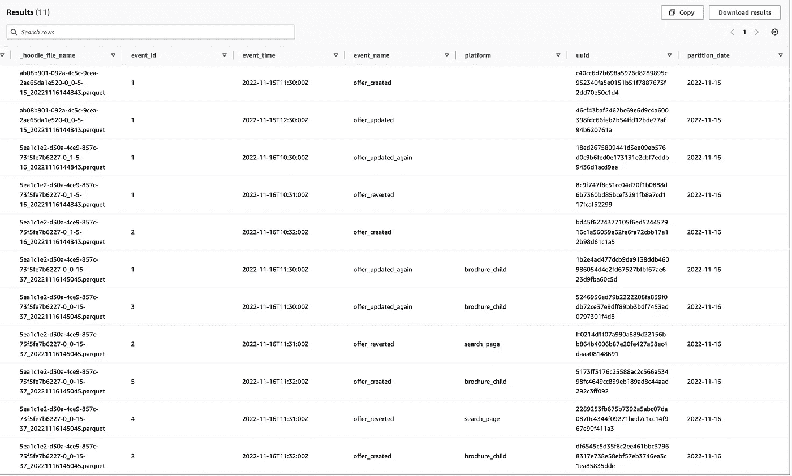
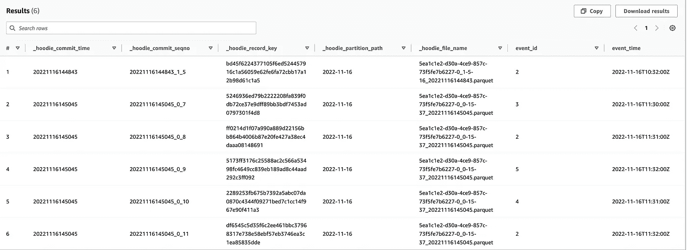

# 与雅典娜和 EMR 一起实践胡迪

> 原文：<https://blog.devgenius.io/hands-on-hudi-with-athena-and-emr-35de9edc123f?source=collection_archive---------6----------------------->

许多数据工程师需要将数据加载到他们的数据湖中，并让公司能够访问这些数据。它要求在添加新数据的同时调整模式更改并与 Metastore 同步，同时对其进行重复数据删除、分区，并将其作为分区注册到 Metastore。胡迪通过设计解决了一些问题。在这篇文章中，我想分享我们在 Athena 和 EMR 中使用胡迪的第一步，以及我们是如何设置的。我们在这里关注原始数据存储格式，因为现代数据仓库也将提供一些功能来解决这个问题。

我们调查了一下

*   [三角洲湖](https://delta.io/)
*   [阿帕奇冰山](https://iceberg.apache.org/)
*   [阿帕奇胡迪](https://hudi.apache.org/)

关于德尔塔湖的论文描述了内部概念。
他们听起来很强大，而我们的印象是 Delta Lake 正在技术之上建立一个生态系统，例如 [Delta Live Tables](https://docs.databricks.com/workflows/delta-live-tables/index.html) 。

然而，我们检查了将它与 S3、Glue 和 Athena 集成的难易程度。我们发现胡迪拥有 AWS 的一流支持:Athena 可以读取它，EMR 预装了胡迪，所以我们可以使用 Spark 来编写 S3 文件。要更深入地了解胡迪，请查看这个[链接](https://hudi.apache.org/blog/2021/07/21/streaming-data-lake-platform/)。对于 Apache Iceberg 和 Delta Lake 来说，相比较而言，粘合同步要么是不可能的(还没有)，要么不像胡迪那样容易。另一个问题是与[湖形成](https://aws.amazon.com/de/lake-formation/)的兼容性，这似乎也是胡迪提供的。

我们想测试一下

*   在 Athena 中创建表格
*   设置一个带有 PySpark 引擎的 EMR 笔记本电脑来写入数据
*   通过插入带有附加字段的新行来写入第二个数据集
*   删除一些条目

→对于每一步:我们期望 S3 文件被分区，数据(分区)+模式被同步到 Glue

## 创建 Athena 表

```
CREATE EXTERNAL TABLE `hudi_partition_cow`( 
    `_hoodie_commit_time` string, 
    `_hoodie_commit_seqno` string, 
    `_hoodie_record_key` string, 
    `_hoodie_partition_path` string, 
    `_hoodie_file_name` string, 
    `event_id` string, 
    `event_time` string, 
    `event_name` string
    )
PARTITIONED BY ( 
    `partition_date` string
)
ROW FORMAT SERDE 'org.apache.hadoop.hive.ql.io.parquet.serde.ParquetHiveSerDe' 
STORED AS INPUTFORMAT 'org.apache.hudi.hadoop.HoodieParquetInputFormat' 
OUTPUTFORMAT 'org.apache.hadoop.hive.ql.io.parquet.MapredParquetOutputFormat' 
LOCATION 's3://<YOUR_BUCKET>/<YOUR_FOLDER>/hudi_events/'
```

## 设置 EMR Jupyter 笔记本

用笔记本开始你的电子病历。

```
#ssh into your emr master and copy the Hudi JAR to a S3 Location you can access
aws s3 cp /usr/lib/hudi/hudi-spark-bundle.jar s3://<YOUR_BUCKET>/<YOUR_PATH>.jar
```

在笔记本的第一个单元格中，你必须配置它使用正确的胡迪罐

```
%%configure -f
{"conf":{
    "spark.jars": "s3://<YOUR_BUCKET>/<YOUR_PATH>.jar",
    "spark.serializer":"org.apache.spark.serializer.KryoSerializer",
    "spark.sql.hive.convertMetastoreParquet":"false"
}}
```

## PySpark 写入和胶水同步

```
from pyspark.sql.functions import sha2, concat_ws

data = [
    ("1", "2022-11-15T11:30:00Z", "offer_created", "2022-11-15"),
    ("1", "2022-11-15T12:30:00Z", "offer_updated", "2022-11-15"),
    ("1", "2022-11-16T10:30:00Z", "offer_updated_again", "2022-11-16"),
    ("1", "2022-11-16T10:31:00Z", "offer_reverted", "2022-11-16"),
    ("2", "2022-11-16T10:32:00Z", "offer_created", "2022-11-16"),
]
columns = ["event_id","event_time","event_name", "partition_date"]

df = spark.createDataFrame(data=data, schema = columns)
df = df.withColumn("uuid", sha2(concat_ws("||", *df.columns), 256))

hudiOptions = {
'hoodie.table.name': 'hudi_partition_cow',
'hoodie.datasource.write.recordkey.field': 'uuid',
'hoodie.datasource.write.partitionpath.field': 'partition_date',
'hoodie.datasource.write.precombine.field': 'event_time',
'hoodie.datasource.hive_sync.enable': 'true',
'hoodie.datasource.hive_sync.database': 'test_tmp',
'hoodie.datasource.hive_sync.table': 'hudi_partition_cow',
'hoodie.datasource.hive_sync.partition_fields': 'partition_date',
'hoodie.datasource.hive_sync.partition_extractor_class': 'org.apache.hudi.hive.MultiPartKeysValueExtractor',
'hoodie.datasource.hive_sync.jdbcurl': 'jdbc:hive2://<INTERNAL_EMR_MASTER_DNS>:10000/'
}

# Write a DataFrame as a Hudi dataset
df.write \
.format('org.apache.hudi') \
.option('hoodie.datasource.write.operation', 'insert') \
.options(**hudiOptions) \
.mode('overwrite') \
.save('s3://<YOUR_BUCKET>/<YOUR_FOLDER>/hudi_events/')
```

别忘了设置 INTERNAL_EMR_MASTER_DNS。你可以在 EMR 管理控制台中查找。还必须设置定义表位置的路径。
执行此操作后，我们可以看到我们的数据按照预期进行了分区，并且与 Glue 进行了同步。



## 通过向模式中添加新字段来添加新数据

```
from pyspark.sql.functions import sha2, concat_ws

data2 = [
    ("1", "2022-11-16T11:30:00Z", "offer_updated_again", "brochure_child", "2022-11-16"),
    ("2", "2022-11-16T11:31:00Z", "offer_reverted", "search_page", "2022-11-16"),
    ("2", "2022-11-16T11:32:00Z", "offer_created", "brochure_child", "2022-11-16"),
    ("3", "2022-11-16T11:30:00Z", "offer_updated_again", "brochure_child", "2022-11-16"),
    ("4", "2022-11-16T11:31:00Z", "offer_reverted", "search_page", "2022-11-16"),
    ("5", "2022-11-16T11:32:00Z", "offer_created", "brochure_child", "2022-11-16")
]

columns2 = ["event_id","event_time", "event_name", "platform", "partition_date"]

df2 = spark.createDataFrame(data=data2, schema = columns2)
df2 = df2.withColumn("uuid", sha2(concat_ws("||", *df2.columns), 256))

# Write a DataFrame as a Hudi dataset
df2.write \
.format('org.apache.hudi') \
.option('hoodie.datasource.write.operation', 'insert') \
.options(**hudiOptions) \ # hudi options from previous cell will be used
.mode('append') \
.save('s3://<YOUR_BUCKET>/<YOUR_FOLDER>/hudi_events/')
```

请注意，我们使用的是 spark”。模式(追加)”来追加新数据，而不是“覆盖”。覆盖将删除整个数据集。
我们也使用“insert”作为查找，因为没有发生更新，因为您看到查找的记录关键字被计算为整个条目的散列，并被放置为“UUID”。如果整个条目相等，我们可以测试重复数据删除，但是如果您想要进行更新，您也可以使用真实 ID 字段作为记录关键字，并使用“upsert”作为“hoodie . data source . write . operation”来进行适当的查找。

在执行这个单元之后，我们再次检查 Athena 表，可以看到新的条目进入，新的字段被添加到表中。



## 删除条目

```
df3 = spark.sql("SELECT uuid, partition_date FROM test_tmp.hudi_partition_cow where event_id = '1'")

df3.write.format("org.apache.hudi")\
.option('hoodie.datasource.write.operation', 'delete') \
.options(**hudiOptions) \ # hudi options from previous cell will be used
.mode('append') \
.save('s3://<YOUR_BUCKET>/<YOUR_FOLDER>/hudi_events/')
```

执行这个笔记本单元格从我们的数据集中删除了不需要的条目。



## 我们没有实现什么？

我们不能删除一列并将其作为数据集写入，这样 Glue 就可以接受它，Athena 就可以查询该表。这也是调查的终点，因为我们可以得到不同的具有可选字段的 JSON 类型。

尽管如此:胡迪，以及我们所读到的 Iceberg 和 Delta Lake，都是有前途的输出格式，它们带来了数据库功能，如“upsert”和分区数据+注册以粘合，同时对数据湖进行增量模式更改。这是一个巨大的胜利！

非常感谢我的同事 Paul Kristian 与我一起结对工作。

## 我们在调查时收集的一些链接

*   [https://docs . AWS . Amazon . com/Athena/latest/ug/query-hudi . html](https://docs.aws.amazon.com/athena/latest/ug/querying-hudi.html)
*   [https://hudi.apache.org/docs/schema_evolution/](https://hudi.apache.org/docs/schema_evolution/)
*   [https://medium . com/datalex/5-reasons-to-use-delta-lake-format-on-data bricks-d 9 e 76 cf 3 e 77d](https://medium.com/datalex/5-reasons-to-use-delta-lake-format-on-databricks-d9e76cf3e77d)
*   [https://select from . dev/delta-live-table-DLT-framework-AC 0 ABA 005571](https://selectfrom.dev/delta-live-table-dlt-framework-ac0aba005571)
*   [https://docs.delta.io/latest/presto-integration.html](https://docs.delta.io/latest/presto-integration.html)
*   [https://medium . datadriveninvestor . com/why-is-data bricks-delta-table-AWS-Athena-are-not-a-good-combo-AAF 1138 B3 d 56](https://medium.datadriveninvestor.com/why-is-databricks-delta-table-aws-athena-are-not-a-good-combo-aaf1138b3d56)