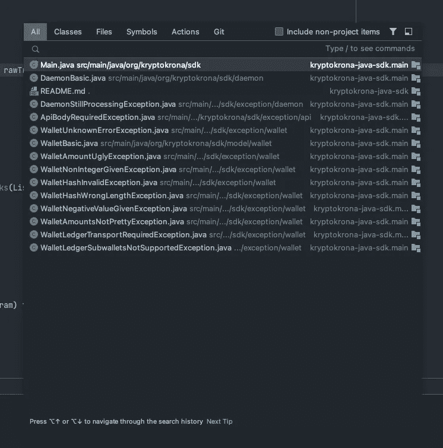
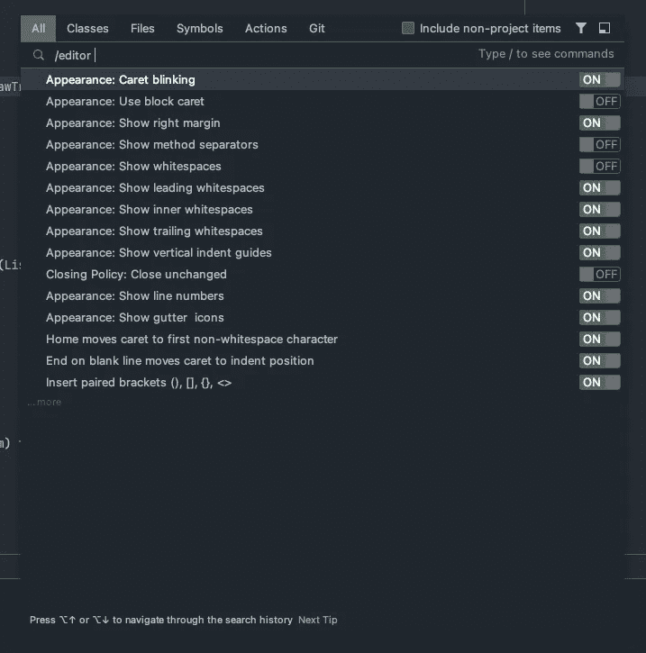
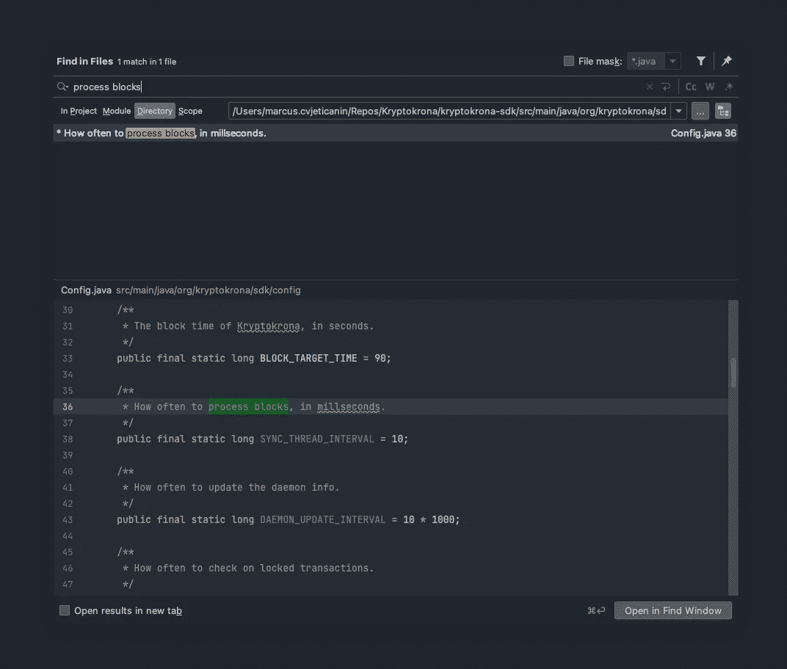
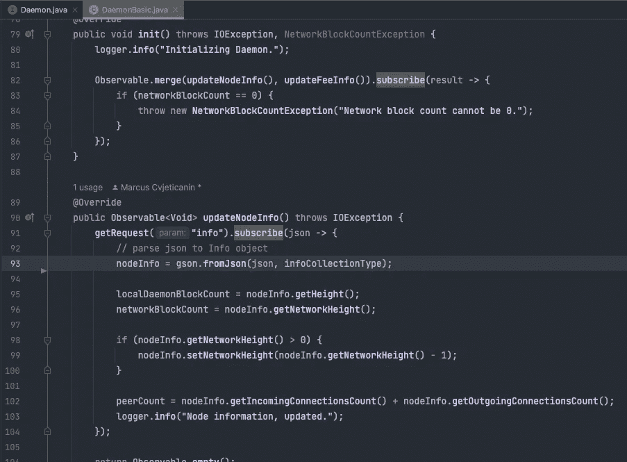
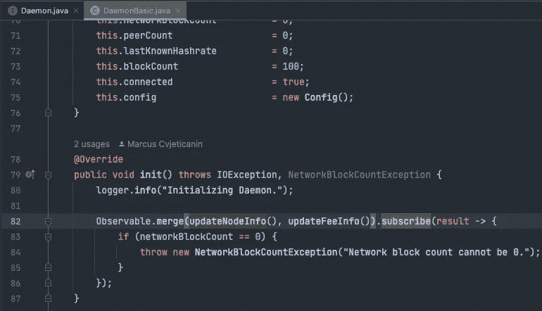
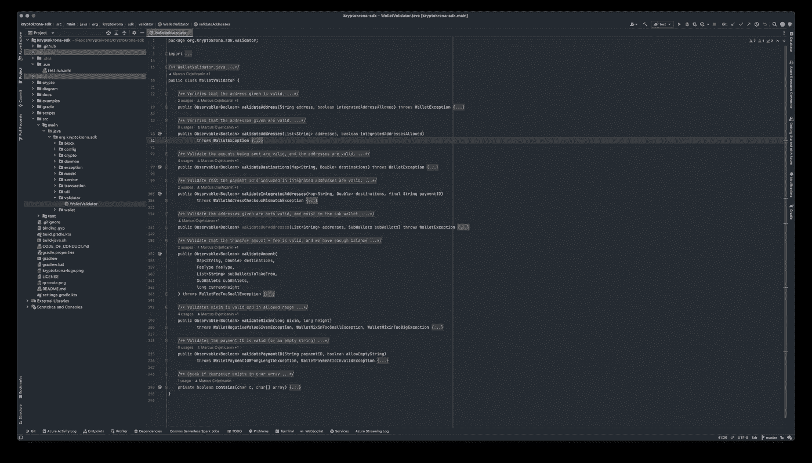
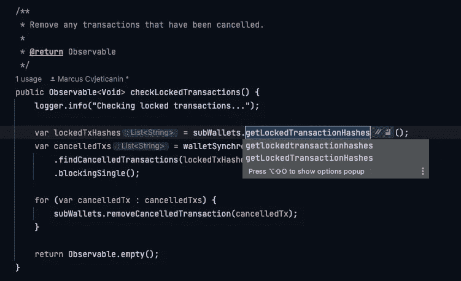

# IntelliJ IDEA 中的便捷快捷方式

> 原文：<https://blog.devgenius.io/handy-shortcuts-in-intellij-idea-abdee64ee186?source=collection_archive---------1----------------------->

[IntelliJ](https://www.jetbrains.com/idea/) 是我的日常司机。自从不久前在我的大学里被介绍给 Java 的 [Eclipse](https://www.eclipse.org/downloads/packages/release/kepler/sr1/eclipse-ide-java-developers) 并体验了那种恐惧之后，我就在寻找替代品，并且我发现了 Intellij。我一直在用它，它绝对是我最喜欢的 IDE。所有其他的 [Jetbrains](https://www.jetbrains.com/) 产品如 [PyCharm](https://www.jetbrains.com/pycharm/) 和 [WebStorm](https://www.jetbrains.com/webstorm/) 也是同样的高标准。

直到我开始在 [Softwerk AB](https://softwerk.se/) 工作，我才从我的一个同事那里学到了很多新的不同的工具和有用的快捷方式，我想分享一些我到目前为止学到的东西。

在这篇短文中，我将介绍哪些好的命令可以让您最大限度地利用 IDE 开发经验，从而提高工作效率。

# 搜索

IntelliJ 中的搜索功能非常强大。要打开快速搜索，请按:

SHIFT + SHIFT，你会得到一个这样的弹出窗口。

搜索文件、类、方法、字段等等

在这里你可以输入类名、文件、方法、字段等等，它会显示出来，你可以上下移动箭头，按回车键就可以很容易地找到位置。

您还可以添加/来查看可用的命令，如使用/plugins 搜索插件，上下移动光标并启用/禁用。

此外，还可以通过启用/禁用功能来改变编辑器的行为。

搜索/编辑器选项

这里有很多命令，所以我不会一一介绍。但这些都是有用的。

# 搜索项目中的所有内容

在文件中搜索内容

有时你想在一个文件中搜索字符串或其他东西，我通常会这样做:

## OS X

CMD + SHIFT + F

## Windows 操作系统

CTRL + SHIFT + F

## Linux 操作系统

CTRL + SHIFT + F

# 转到实施

假设您在使用方法的接口上或源代码中的任何地方，但是您想查看该代码以了解它是如何工作的。

光标位于 updateNodeInfo()上

要做到这一点，您只需将光标放在接口方法名称上，并按下。

## OS X

CMD +选项+ b

## Windows 操作系统

CTRL + ALT + b

## Linux 操作系统

CTRL + ALT + b

这将带您到 DaemonBasic 类中实现该方法的实际代码。

updateNodeInfo()实现

# 转到声明

要转到声明该方法的实际用法，您可以像以前一样操作，但这一次请按以下键。

## OS X

CMD + b

## Windows 操作系统

CTRL + b

## Linux 操作系统

CTRL + b

转到 updateNodeInfo()的声明

# 转到上一个/上一个光标位置

这是一个非常好的特性，假设你站在前面的文件上，你想回到你之前看的地方。你可以简单地按下面。

## OS X

CMD + OPTION + LEFT

## Windows 操作系统

CTRL + ALT +左键

## Linux 操作系统

CTRL + ALT +左键

如果你想往前走，就用右箭头向左拐。

# 折叠/展开所有代码块

显示所有代码块的折叠

有时我喜欢折叠所有的代码块来获得一个概览。这可以通过按以下按钮来完成。

## OS X

CMD + SHIFT (-)

## Windows 操作系统

CTRL + SHIFT (-)

## Linux 操作系统

CTRL + SHIFT (-)

要再次展开所有代码块，只需将减号改为加号。

# 重新命名

出于某种原因，我总是在 IntelliJ 中右键单击并选择 refactor > rename，它很清楚地显示了快捷方式，但无论如何。名为 [Ahmedouyahya](https://medium.com/@ahmedouyahya97?source=post_page-----4428b27087d--------------------------------) 的用户在快捷方式的评论部分推荐了我，所以我现在编辑了这篇文章并添加了它。

## OS X

SHIFT + F6

## Windows 操作系统

SHIFT + F6

## Linux 操作系统

SHIFT + F6

# 浏览最近的文件

如果你像我一样，我通常会打开多个文件。有时超出了标签栏的容纳范围。所以我平时用的就是浏览最近的文件。

## OS X

CMD + E

## Windows 操作系统

CTRL + E

## Linux 操作系统

CTRL + E

浏览最近的文件

# 摘要

每天我都会在 IntelliJ IDEA 中发现一些对我的工作效率有很大帮助的新东西。

我希望这对你有所帮助，如果你觉得这些文章有趣，请在这里关注我即将到来的教程，并考虑在我的社交媒体上关注我。我正在考虑做一个关于如何使用 IntelliJ 进行调试的单独教程。

如果你发现任何可能的错误，请留下评论，这样我就可以更新文章。

# 与我联系

*   推特——https://twitter.com/mjovanc
*   GitHub—【https://github.com/mjovanc 
*   领英—[https://www.linkedin.com/in/marcuscvjeticanin/](https://www.linkedin.com/in/marcuscvjeticanin/)

# 参考

*   IntelliJ IDEA 键盘快捷键[https://www . jetbrains . com/help/IDEA/mastering-keyboard-shortcut s . html](https://www.jetbrains.com/help/idea/mastering-keyboard-shortcuts.html)