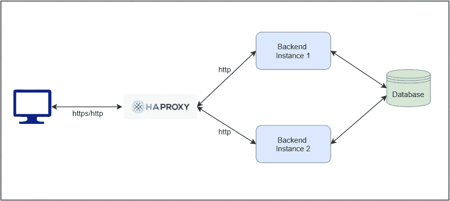
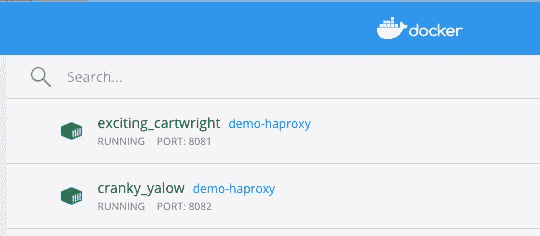
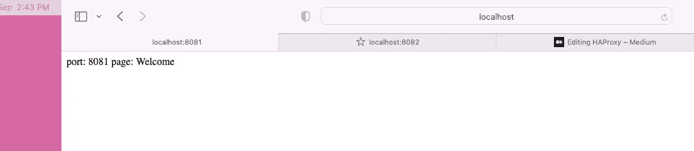
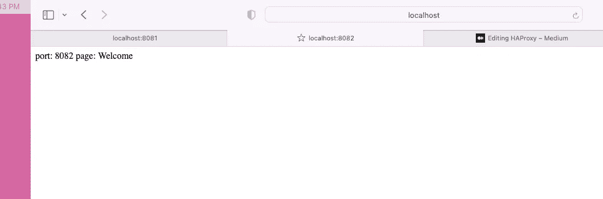
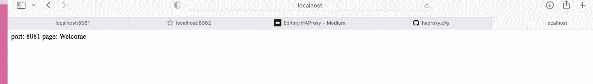
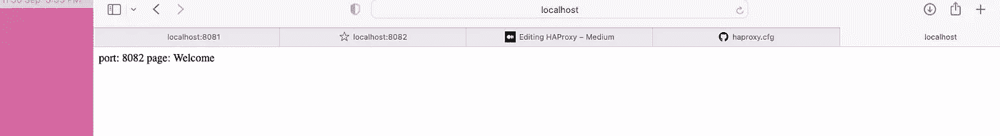
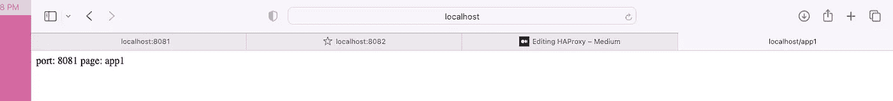
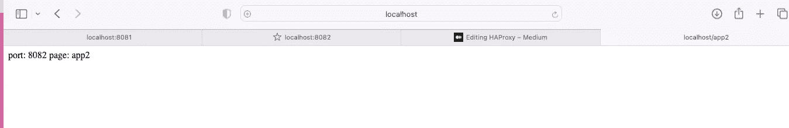

# HAProxy

> 原文：<https://blog.devgenius.io/haproxy-e5d39ca64a07?source=collection_archive---------4----------------------->



**HAProxy** 代表高可用性代理。这是一个免费的[开源](https://github.com/haproxy/haproxy)软件，在多个服务器之间提供高可用性负载平衡器，并为 TCP(第 4 层)和 HTTP(第 7 层)提供反向代理。它是用 C 语言(一种低级语言)编写的，因此在处理和 RAM 使用方面是高效的。

令人着迷的是，haproxy 同时支持 **tcp** 和 **http** **协议**，这意味着你可以为整个网站建立后端集群/服务器，或者根据客户端请求的内容指定不同的后端。

一些与 haproxy 类似的软件如 nginx，Gearman，pound，…等。

那么如果 haproxy 是“高可用”的，那么如何控制流量呢？

haproxy 拥有控制服务器之间流量分配的算法，这些算法包括:

1-循环赛:就像 Sia 在吊灯之歌(123)中说的那样，简单地一个一个地浏览服务器列表..123 喝… 123..123 喝)🕺🏻。

2-最少连接:新请求被分配给当前连接请求最少的服务器。

3-源:新请求被分配给先前响应同一客户机的服务器。

事不宜迟，让我们动手干吧

让我们创建一个简单的具有 3 个端点的 spring boot web 应用程序

创建 3 个端点后，创建一个 dockerfile，以便在两个容器上部署应用程序，就好像它们在不同的服务器上一样。

建立 docker 形象

```
docker build -t demo-haproxy .
```

将镜像部署到第一个容器**中，并使其监听端口 **8081****

```
docker run -d -e SERVER_PORT=8081 -p 8081:8081 demo-haproxy
```

将镜像部署到第二个容器**中，并使其监听端口 **8082****

```
docker run -d -e SERVER_PORT=8082 -p 8082:8082 demo-haproxy
```



现在，我们已经确保了我们的容器运行正常，页面得到了预期的服务，我们可以开始 haproxy 部分了。

在你的机器上安装 haproxy

```
brew install haproxy
```

为 haproxy 创建一个配置文件，指定绑定和后端的前端(入口点)。

在配置文件中，我们将前端名称指定为 http，因为我们将在第 7 层进行负载平衡。你可以选择任何你喜欢的名字，只要让它有意义。

在 fronend 中，您将指定您将监听的 ip 和端口，以及超时客户端，这是针对 haproxy 客户端而不是后端服务器的超时。haproxy 的默认算法是**循环调度**，但是由于浏览器是**有状态的**，它将使用**之前的会话连接**，并且不会让 Sia 的(123，123 饮料)歌曲发生，所以我们将使**模式 http** 让它知道我们不想使用之前的会话，而是创建一个新的会话。最后，默认后端只是一个指向您在配置文件中定义的后端的指针。

为了介绍您的服务器，您需要创建**后端**部分，在这里我们创建了一个默认的，将包含所有**服务器/容器**。

服务器 **app1** 会将流量路由到监听 **8081** 的容器。

服务器 **app2** 会将流量路由到监听 **8082** 的容器。

让我们点燃它，^_^

```
haproxy -f haproxy.cfg
```

转到你的浏览器(http:127.0.0.1:80/)并不断刷新页面，haproxy 将在两个容器之间分别**循环**你。

初次尝试:



第二次尝试:



正如您看到的，我们设法在两个服务器/容器之间取得了平衡，但是让我们回忆一下这个应用程序。它有 3 个端点:欢迎端点、app1 端点和 app2 端点。

我们将使**欢迎端点**路由到**两个服务器**，并将 **app1 端点**的流量路由到监听**端口 8081** 的容器，并将 **app2** b 的流量路由到监听**端口 8082** 的容器。

为此，首先让我们为配置文件创建一些新的后端。

创建后端后，让我们在前端创建一个访问控制列表 ACL，以基于 url 路径路由流量。

现在让我们启动它并检查一下

```
haproxy -f haproxy.cfg
```



要查看源代码(spring boot app+docker file+ha proxy 配置文件)请访问 github repo:[https://github.com/lamoboos223/spring-boot-haproxy](https://github.com/lamoboos223/spring-boot-haproxy)

这都是^_^

非常感谢你阅读这个故事，让我们在 linkedin 上联系:[https://www.linkedin.com/in/lama-alosaimi/](https://www.linkedin.com/in/lama-alosaimi/)