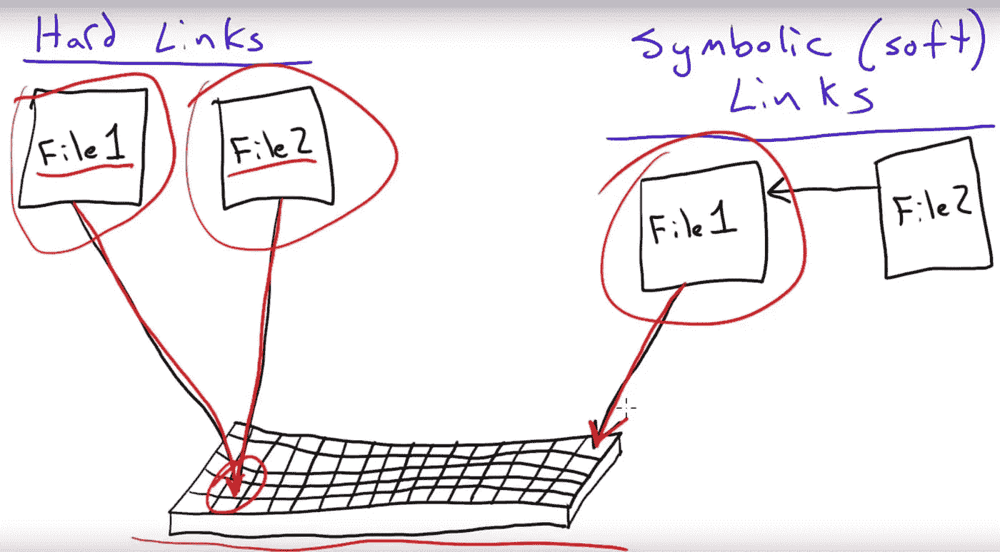

# 硬链接和符号链接，有区别吗？

> 原文：<https://blog.devgenius.io/hard-link-and-a-symbolic-link-any-difference-ef8b9bd61734?source=collection_archive---------4----------------------->

为了找出这两种类型的链接之间的差异，我们首先必须定义它们:

## 符号链接:

理解什么是 Linux 中的符号链接的最简单的方法是将其与 Windows 中的“直接链接”或“快捷方式”进行比较。文件或目录位于磁盘上的一个点上，链接是指向它的指针。每个符号链接都有自己的索引节点号，这允许在不同的文件系统之间建立符号链接。

为了创建链接(符号链接和硬链接),我们使用命令 ln。在这种情况下，我们将从测试文件中创建一个符号链接(参数):

$ ln -s 测试链接到测试

## 硬链接:

硬链接将共享同一个 inode 的两个或多个文件关联起来。这使得每个硬链接都是其余相关文件的精确副本，包括数据和权限、所有者等。这也意味着当对其中一个链接或文件进行更改时，这些更改也将对其余的链接进行。

不能针对目录或在文件系统本身之外建立硬链接。

我们之前将针对“测试”文件创建一个硬链接，我们将看到它们有效地共享了 inode，并且数据在两者之间是同步的:

$ ln 测试链接-硬测试
$ ls -li
73793 -rw-r — r — 2 娟娟 5 2011–04–27 19:09 联络-硬测试
73793 -rw-r — r — 2 娟娟 5 2011–04–27 19:09 测试

## 软链接和硬链接的区别:

可以对文件和目录进行符号链接，而硬链接只能在文件之间进行。不同的文件系统之间可以建立符号链接，而硬链接则不能。
硬链接共享索引节点号，符号链接不共享。
使用符号链接，如果原始文件或目录被删除，信息会丢失，而使用硬链接则不会。硬链接是文件的精确副本，而符号链接仅仅是指针或“快捷方式”。

在这个博客中，我们了解了什么是硬链接和符号链接，以及它们的区别。希望对你有帮助，永远不要停止学习！