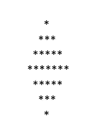
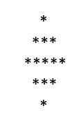

# Python 中的(硬)模式。#Python 系列-7

> 原文：<https://blog.devgenius.io/hard-patterns-in-python-python-series-7-1fedf07fbe57?source=collection_archive---------17----------------------->

在这篇文章中，我们将看到如何为高难度模式编写代码。如果你还没有看过我以前的文章，请在开始这篇文章之前参考一下。Python 文章中(Easy)模式的链接在这里是。

如果你是模式编程的新手，出现的第一个问题是“你怎么能说特定的模式是容易的、中等的还是困难的？”。答案很简单，如果你能破解模式的逻辑，那就简单了，但是如果你拿起纸和笔试图破解逻辑，那就有点难了。第二个答案可能是模式的复杂性。

现在，让我们拿一个流行的模式来破解它的逻辑。开始了…



n = 7 的全菱形图案

好看吧。这种模式被称为“满钻模式”，在编码面试中相当流行。



n = 5 时的全菱形图案

现在，对你来说只是一个简单的挑战。在滚动到解码这个模式逻辑的下一段之前。试着写下你自己的逻辑。

完成了吗？我希望你…

如果你读过我以前关于模式的文章。你会观察到，如果我们能够回答三个问题，我们就可以解决任何类型的模式。

让我们来回答这些问题。

1.  关于 n 有多少行？

当我们观察该模式时，我们可以说，如果 n = 7，则有 7 行。如果 n = 5，则有 5 行。因此，行数等于 n。

2.每行要打印多少列？

棘手的部分来了。在 7 行中，从第 1 行到第 4 行，星计数以奇数递增，然后从第 5 行到第 7 行以奇数递减。另一方面，每一行都有一些空格和星星。

3.在每行的特定列中打印什么？

简单，你需要打印“*”

记住这一切，我们将破解其中的逻辑。

逻辑是我们对行(n)进行了两次不同的循环。一个用于递增星形(n1)，另一个用于递减星形(n2)。

> n1 + n2 = n

对于 n = 7。递增行 n1 = 4，递减行 n2 = 3。求和后我们得到 7。

一般来说，我们得到 n1 = n//2，然后 n2 = n - n1

现在，让我们为 n1 而烦恼。

对于 n1 行，从第 1 行到 n1 行，我们打印一些空格，然后是星号。

对于空格，第 I 行我们必须打印(n1-i)个空格，然后对于星号，(2*i-1)个星号。

钻石图案的前半部分完成了。

当我们考虑 n = 7 时的 n2。我们得到 n2 = 3。

一般来说，我们得到 n2 = n - n1

这种模式与模式的前半部分完全相反。

在第 I 行，对于空格，我们需要打印 I 个空格。然后对于恒星，2*(n2-i+1)-1 颗恒星。

让我们来看看同样的 python 代码

```
def star_pattern(n):
    n1 = n // 2 + 1
    n2 = n - n1

    # First Half Pattern
    rows = 1
    while rows <= n1:
        spaces = 1
        # Space Loop
        while spaces <= n1 - rows:
            print(" ", end="")
            spaces = spaces + 1

        # Star Loop
        stars = 1
        while stars <= ((2 * rows) - 1):
            print("*", end="")
            stars = stars + 1

        rows = rows + 1
        print()

        # Second Half Pattern
    rows = 1
    while rows <= n2:

        # Space Loop
        spaces = 1
        while spaces <= rows:
            print(" ", end="")
            spaces = spaces + 1

        # Star Loop
        stars = 1
        while stars <= 2*(n2-rows+1)-1:
            print("*", end="")
            stars = stars + 1

        rows = rows + 1
        print()
    return

n = int(input())
star_pattern(n)
```

希望你喜欢…