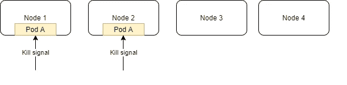
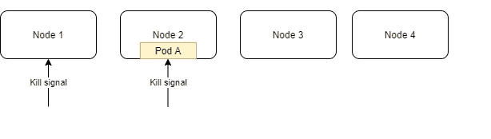
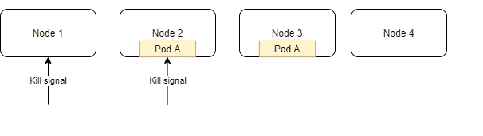
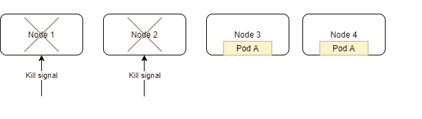

# 跟随库本内特斯的变化

> 原文：<https://blog.devgenius.io/hardening-your-kubernetes-stack-pt-3-b260d45fe6e?source=collection_archive---------5----------------------->

## 滚动更新和探测

变更是所有软件生命周期的一部分，但是我们如何确保在 Kubernetes (k8s)中安全地进行变更呢？我们将通过分别利用 k8s 的滚动更新属性和 Pod 中断预算来应对应用程序、Pod 和底层基础架构的变化。我们还将研究就绪性和活性探测。

克里斯·劳顿在 [Unsplash](https://unsplash.com?utm_source=medium&utm_medium=referral) 上的照片

## 滚动更新

[部署](https://kubernetes.io/docs/concepts/workloads/controllers/deployment/)提供了定义如何在 pod 上执行滚动更新的功能。使用 RollingUpdate 策略，可以定义两个属性:maxSurge 和 maxUnavailable。MaxSurge 定义了在更新过程中可以超过当前 pod 计数的 pod 数量或百分比。这可以是您在部署中设置的数量，也可以是由水平 pod 自动缩放器( [doc](https://kubernetes.io/docs/tasks/run-application/horizontal-pod-autoscale/#autoscaling-during-rolling-update) )设置的当前数量。MaxUnavailable 指定在更新过程中可以杀死的单元的数量或百分比。

示例:

在我们的第一次部署中(第 10–14 行)，我们将 maxSurge 和 maxUnavailable 都定义为 1。这意味着在更新过程中，会创建 1 个新 pod，并杀死 1 个旧 pod，直到所有 pod 都被替换。由于副本是 10，最多你会看到 11 个豆荚，至少你会看到 9 个豆荚。
在我们的第二次部署中(第 36–40 行),我们定义了一个百分比。maxSurge 和 maxUnavailable 的 25%。假设当前的吊舱数量是 10，这意味着 4，10 x 25%，新吊舱将旋转起来，4 个旧吊舱将被杀死，直到所有吊舱被替换。由于副本是 10，最多你会看到 14 个豆荚，至少你会看到 6 个豆荚。

那么 k8s 什么时候知道什么时候转移到下一组 pod 进行更新呢？就绪和活性探测。

## 就绪性和活性探测

K8s，特别是 [kubelet](https://kubernetes.io/docs/reference/command-line-tools-reference/kubelet/) ，使用就绪性和活性探测器来确定容器的当前状态。Kubelet 存在于每个 worker 节点上，并根据您的就绪性或/和活性探测配置不断探测您的容器。就绪探针和活性探针之间的主要区别在于 kubelet 对失败探针的反应。

活性探测器确定容器是否是“活性的”。如果探针失败，k8s 将杀死容器并重新启动它，因为假定容器已经死亡。活性终点应该是亮的，并且应该反映容器是否是活性的。

准备就绪探测器确定集装箱是否准备好为运输服务。根据容器的不同，这可能意味着建立数据库连接、设置配置或将数据加载到内存中。这意味着容器上的就绪端点应该反映一个 pod 是否就绪，并确保在它返回健康状态之前设置好所有依赖项。当准备就绪探测失败时，k8s 不会向 pod 发送流量，并将 pod 标记为`Unready`。

示例:

有许多方法可以配置您的探测器，您可以发送一个 HTTP 请求(第 3–6 行)，发送一个 TCP 请求(第 13–14 行)，或者在容器上执行一个命令(第 21–24 行)。请注意，就绪性和活性探测都可以利用这些类型的探测。

**HTTP probe** (第 3–6 行)针对 pod 上的指定端口发送 HTTP get 请求。您可以通过`scheme`在 HTTP 或 HTTPS 之间进行选择。Https 探测器跳过证书验证。`path`定义了容器服务器上的路径。`httpHeaders`为您的 HTTP 请求探测器定义自定义头。最后，`port`定义了容器的目标端口。`http`端口翻译为端口 80。大于 200 小于 400 的状态代码被认为是成功的。

**TCP 探针**(第 13–14 行)试图打开指定端口上的容器的 TCP 套接字。如果它成功了，那么它被认为是健康的，否则它被认为是失败的。

**命令探测器**(第 21–24 行)在容器上执行命令。如果命令返回 0，则视为成功。否则就被视为失败。

所有探头都有一些可配置的属性:

`periodSeconds`定义间隔，以秒为单位，k8s 应该执行探测。

`initialDelaySeconds`定义容器创建后，k8s 在执行第一次探测前应等待多长时间。

`successThreshold`和`failureThreshold`定义了在探针被视为成功或失败之前连续成功或失败的次数。

`timeoutSeconds`定义探头超时前 k8s 等待的时间，单位为秒。超时被视为失败。

## **Pod 中断预算(PDB)**

当您对 k8s 集群的底层基础设施进行更改时，您会希望确保您的 pod 保持一定程度的可用性。设置 Pod 中断预算是实现这一目标的一种方法。pod 中断预算是 k8s 中的一项资源，用于定义 k8s 在中断 pod 之前应预算多少 pod。PDB 定义了可以跟随`maxUnavailable`下降的豆荚数量或百分比，以及必须跟随`minAvailable`上升的豆荚数量或百分比。PDB 通过使用选择器来应用预算。PDB 目前支持复制集、状态集和部署。

从上面的例子中，这个 PDB 适用于任何标签为`app: test-app`的资源。在中断事件期间，k8s 将在执行更新时保持至少 1 个 pod 处于活动状态。

## PDB 在行动

假设我们从 4 个节点和 2 个豆荚开始，PDF 的最小可用空间为 1。

我们将使用`kubectl drain`排空节点 1 和 2，以确保节点上的豆荚被逐出，同时尊重 PDB。

一旦 pod A 从节点 1 被杀死，k8s 将在节点 3(或节点 4)上调度 pod A，因为当`kubectl drain`对节点 1 和节点 2 运行时，节点 1 和节点 2 将被污染为不可调度的。注意节点 2 上的吊舱 A 没有被杀死。这是因为 PDB 确保至少有一个吊舱是活着的。

现在荚果 A 也生活在节点 3 中，节点 2 上的荚果 A 将被杀死。

需要注意的是，只有当您进行 k8s 可以控制的更改时，才会考虑 PDB。如果您直接删除一个节点，k8s 将无法利用 PDB，因为 k8s 不是节点销毁过程的一部分。然而，如果你先执行`kubectl drain`然后杀死底层节点，那么 PDB 是受尊重的。

最后，您需要确定需要支撑多少吊舱，这样您就不会因为吊舱下降而停机，新的吊舱也不会立即出现。这取决于您的流量模式，因此对更新设置窗口并设置 PDB 以匹配该窗口期间需要的内容将有助于您安全地执行基础架构更新。

附带说明:将“可用”设置为 100%或与当前 pod 编号相同将意味着如果 pod 以此 PDB 为目标，k8s 将无法耗尽节点。

[公文](https://kubernetes.io/docs/tasks/run-application/configure-pdb/)

[第 1 部分:资源请求和限制](https://medium.com/dev-genius/hardening-your-kubernetes-stack-pt-1-29b7006b5085)
[第 2 部分:Pod 服务质量和优先级](https://medium.com/dev-genius/hardening-your-kubernetes-stack-pt-2-2f2db4ff410d)
[第 4 部分:水平 Pod 自动缩放器和集群自动缩放器](https://medium.com/dev-genius/hardening-your-kubernetes-stack-pt-4-cc72b09b4557)