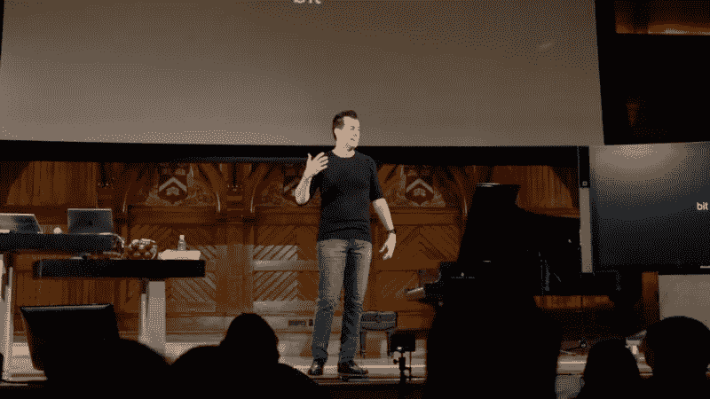
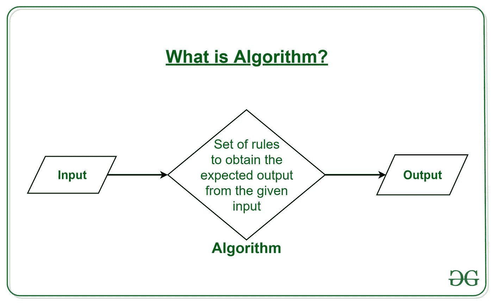
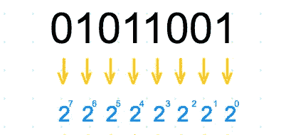
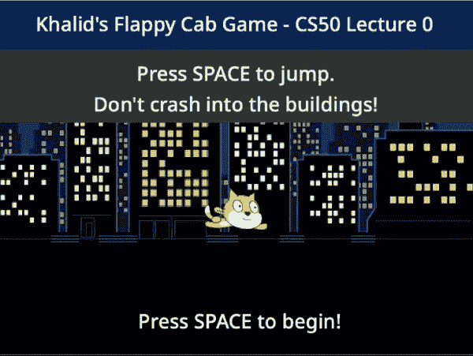
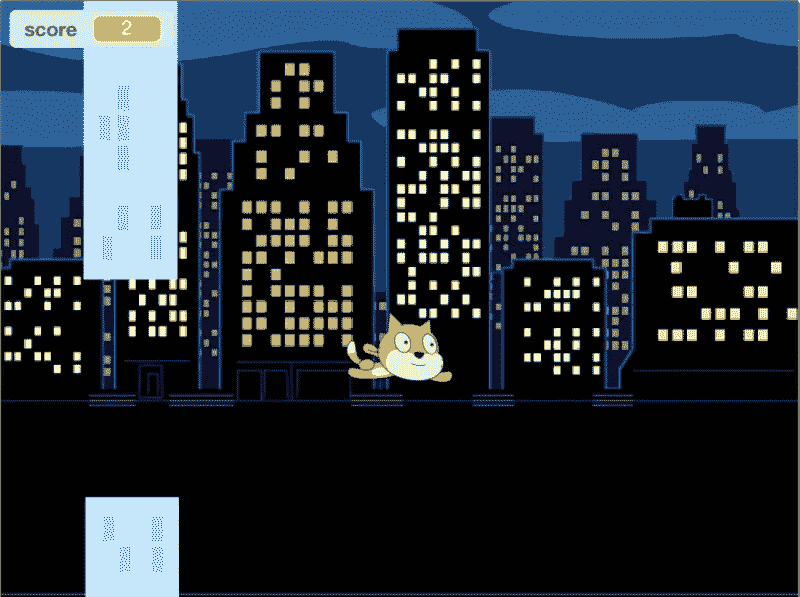

# 哈佛 CS50 第 0 周—计算思维和 Scratch

> 原文：<https://blog.devgenius.io/harvard-cs50-week-0-computational-thinking-scratch-e6b5223df17a?source=collection_archive---------16----------------------->

## 软件工程初学者之旅

欢迎来到我对[哈佛 C50x](https://cs50.harvard.edu/x/2020/) 的点评。在这里你会发现我作为一个软件工程初学者对这门课程的看法。我还会强调我遇到的任何挑战，以帮助你完成课程。

由[凯文·Ku](https://unsplash.com/@ikukevk?utm_source=medium&utm_medium=referral)在 [Unsplash](https://unsplash.com?utm_source=medium&utm_medium=referral) 上拍摄的照片

# 为什么我选择 CS50 作为初学者？

这门课程教学生如何用算法思考和有效地解决问题。本课程的首要目标是激励学生探索陌生的水域，不怕失败，创造一个所有学生都可以获得的密集、共享的体验，并在学生中建立社区。

这位名叫[大卫·j·马兰](https://cs.harvard.edu/malan/)的讲师非常迷人。这使得内容易于跟踪。

CS50 中有三分之二的学生以前从未上过 CS 课程。这让我觉得我来对地方了！

> “在这门课程中，最重要的不是你相对于同学的位置，而是你相对于自己的位置！”

介绍序列有一些严重的西方世界的氛围。电影摄影让我更加兴奋地开始了课程！

# 我学到了什么

计算机科学本质上是解决问题。在最基本的层面上，软件工程接受输入，使用算法对其进行处理，然后返回输出。

[GeeksforGeeks](https://www.google.com/url?sa=i&url=https%3A%2F%2Fwww.geeksforgeeks.org%2Fintroduction-to-algorithms%2F&psig=AOvVaw11tniIYZi7w7HPptadHPas&ust=1591890063289000&source=images&cd=vfe&ved=0CAMQjB1qFwoTCJCByeHK9-kCFQAAAAAdAAAAABAD)

## 二进制的

一位是二进制数字，即 0 或 1。

一个字节是一个 8 位序列，具有以下位置值:
128–64–32–16–8–4–2–1

看看这个关于如何在 5 分钟内读懂二进制的故事

为了让计算机理解字母，您可以将每个字母映射到一个十进制值，例如用 65 表示字母 A(或用二进制表示 01000001)。

美国信息交换标准代码(ASCII)标准定义了当今常用的所有字母和标点符号的二进制值。UNICODE 是 ASCII 的超集，超过 8 位(通常是 16 或 32 位)。

## 基本定义

算法是关于如何一步一步解决问题的一组指令。

布尔表达式是一个有真或假答案的问题。

讲座的其余部分涵盖了一些基本的思维概念和对 Scratch 的介绍。

# 第 0 周问题集

本周的问题是在 Scratch 中创建一个游戏。我决定创建一个纽约主题的 Flappy Bird 克隆体，花了我 4-5 个小时才完成。

# 结论

我觉得这个讲座相当直截了当。它是对计算机科学的一个很好的介绍。对于任何试图设置临时问题集的人，我建议你保持简单。你想在早期抓住快速的胜利来保持你的动力。不要在第 0 周过度运动，只是为了在第 3 周筋疲力尽。

请继续关注我对第一周的回顾！