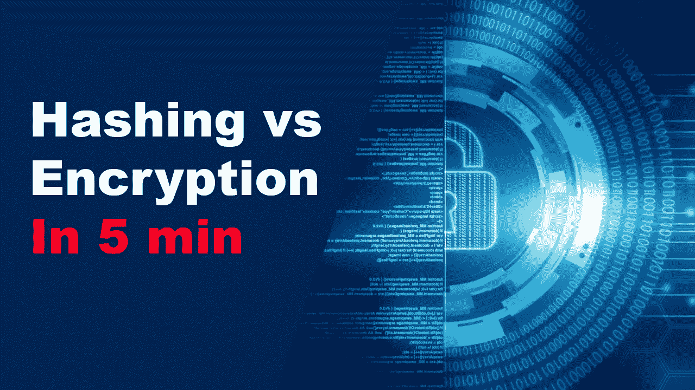
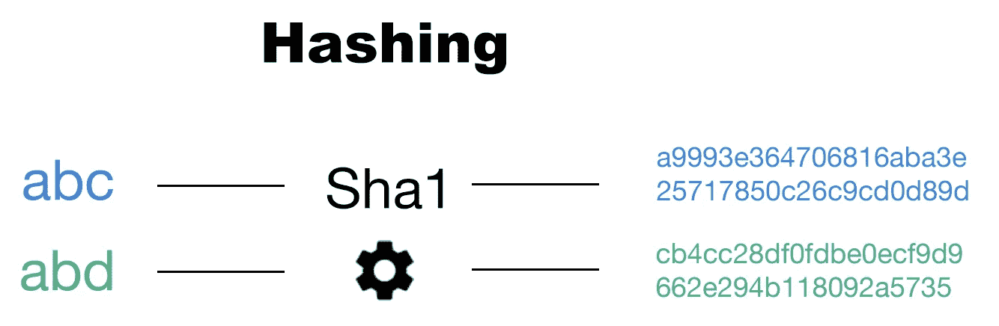
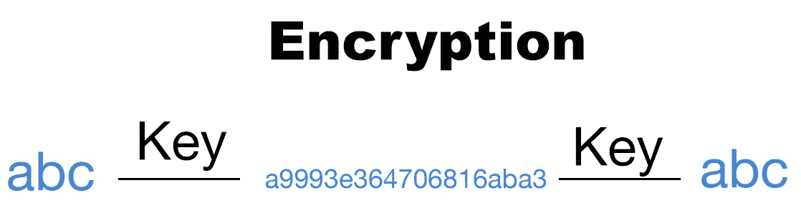
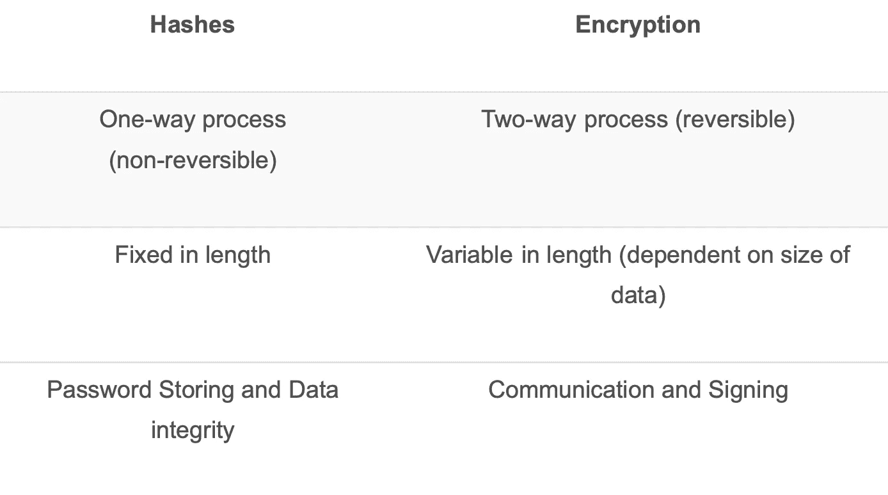

# 哈希与加密在不到 5 分钟的时间内完成

> 原文：<https://blog.devgenius.io/hashing-vs-encryption-in-less-than-5-minutes-35f306bd5756?source=collection_archive---------8----------------------->

快速了解哈希和加密之间的区别以及常见的使用案例。以下内容也可以在文斯洛夫学院 YouTube 页面看到:[https://youtu.be/9Jva1tSeAWk](https://youtu.be/9Jva1tSeAWk)

更多内容请看温斯列夫学院官方网站:https://www.reddit.com/r/vinsloevAcademy/

# 散列法

我们将从哈希开始，哈希是从可变长度的数据生成的数学计算值。当使用标准散列算法对输入值进行散列时，只要输入保持不变，您将总是得到相同的输出。如下图所示，值“abc”和“abd”将使用 Sha1 算法生成两个完全不同的输出值，但是，数据的长度是相同的，任何人通过 Sha1 获得相同的两个输入值将得到完全相同的输出。

散列图

然而，不可能通过哈希算法将输出值取回以生成原始输入，这是哈希和加密的主要区别之一(哈希是单向过程)。这确实有它的好处，因为您可以使用散列法在数据库中存储密码，以确保没有人(甚至开发者/所有者)可以读取原始格式的密码。然而，对于散列密码有不同的攻击媒介，例如彩虹表，然而，这超出了本文的范围。

除了存储密码，哈希还用于确保数据完整性，因为即使是最轻微的数据更改也会生成全新的输出。因此，将原始哈希和与数据传输后生成的值进行比较，可以快速显示是否有人在传输过程中篡改了文件/数据。

# 加密

另一方面，加密是获取数据并应用数学计算来帮助隐藏/掩盖所使用的原始数据的过程，计算这些信息的过程是一个双向过程，这意味着只要您有正确的密钥来解锁，它就可以撤消。如下图所示，您可以使用密钥加密输入数据，也可以使用密钥将其解密回初始值。

加密插图

有两种加密方式:

**对称加密—** 一个密钥。相同的密钥用于加密*和解密*。

**非对称加密—** 两个密钥。一个密钥用于加密，另一个密钥用于解密。

因此，与哈希相比，加密主要用于通信和签名。当您希望数据在双方之间传输而没有任何外人能够窃听时的通信。签名当你用你的私钥加密某个东西，并告诉接收方用你的公钥解密它时(非对称)。如果公钥能够解密消息，接收方就知道消息是用你的私钥加密的，因此是你发来的，也就是签名。

为了总结两者的区别，下表将总结本文。

哈希与加密的比较