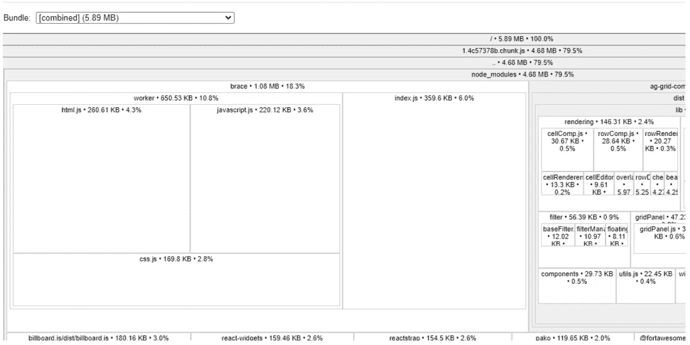
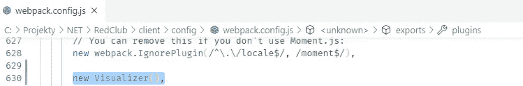
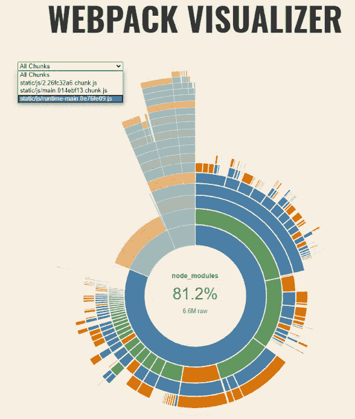

# 你有没有想过你的 CRA 网络包里有什么？

> 原文：<https://blog.devgenius.io/have-you-ever-wondered-what-is-in-your-cra-webpack-bundle-76d38ba4317a?source=collection_archive---------5----------------------->


多梅尼科·洛亚在 [Unsplash](https://unsplash.com?utm_source=medium&utm_medium=referral) 上拍摄的照片

在我的一个单页面应用程序项目中，我注意到 **webpack 包**的大小显著增加。我坚信每个人时不时都会经历同样的情况。在*紧张的*开发条件下，你的产品代码达到 5 兆字节或更多只是时间问题。

你开始开发一个小项目，然而仅仅几个月，它已经成长为超级大的包。你知道，这总是同一个故事。:)

每当我为自己设置一个新的单页面应用程序时，我都会定期使用一个名为 *create-react-app(CRA)* 的引导工具来为我的项目建立基础。这是一项可爱的技术——光是名字就让我觉得有点误导和困惑。然而，在软件行业，尤其是在 JS 领域，我们很难正确命名。任何一个名为—*hold yourself please*—*NIGHTMARE*的高级浏览器自动化库的普通用户都可以连续谈论它几个小时。

幸运的是，有一个**简单明了的解决方案**可以发现您的捆绑包包含了什么。

经典的创建-反应-应用程序

使用经典的 create-react-app，很容易获得关于包大小的详细信息。

简单地说，按照这里的指示:

[*https://create-react-app . dev/docs/analyzing-the-bundle-size/*](https://create-react-app.dev/docs/analyzing-the-bundle-size/)

简而言之:

只需在 *node_modules* 中添加一个名为 *source-map-explorer* 的新工具即可。然后运行脚本来生成并可视化结果。

然后通过查看图表进行检查，找出问题所在。

例如，这是我的小项目:



关于这些发现最酷的一点是，您可以将它们作为独立文件**接收。你只需*抓取*生成的文件，并通过*电子邮件/slack/随便什么*发送给你的同事。然后，他很容易地在浏览器中打开它，以便获得一个关于这个包有什么问题的**极好的概述**。**

当然，像往常一样，它起初并不适合我的项目:)在我的产品构建中，源地图的生成已经被关闭。启用它之后，我终于获得了一个结果，它清楚地显示了包的内容，我可以很快地**识别出罪魁祸首**。

**被弹出的 app**

在我的一个应用程序中，我退出了这个应用程序，以支持 Typescript 的惊人的、当时还是实验性的特性。事后看来，我并不认为这是一个好的举动，但伤害已经造成了。

事实上，“ *create-react-app* ”工具**几乎完美地保护了你远离 webpack、babel 和许多其他工具的混乱，这些工具在现代客户端开发中使用起来很愉快。我一直想知道 CRA 的内心世界是什么样的，于是我把实验性特征的开启作为满足我求知欲的借口。如你所料，这也让我的生活变得更加艰难。:)**

因此，如果你像我一样做出了大胆的举动，你可能会在检索 webpack 统计数据时遇到问题。我已经尝试了几种方法来解决这个问题，但是唯一有效的方法是使用 webpack-visualizer-plugin。

[*https://www.npmjs.com/package/webpack-visualizer-plugin*](https://www.npmjs.com/package/webpack-visualizer-plugin)

*" web pack-visualizer-plugin ":" ⁰.1.11 "，*

为了打开它，你必须将包添加到 *package.json* 中，然后运行你最喜欢的包管理器(npm 或 yarn)。然后，修改 web pack config—path "*your app \ config \ web pack . config . js*"

将以下代码附加到文件的开头:

```
*var Visualizer = require(‘webpack-visualizer-plugin’);*
```

并将下面的代码添加到部分插件(代码)

```
*new Visualizer(),*
```

这是一个网络包的经典插件。不过请注意，文件 *webpack.config.js* 有点乱。因此，将代码添加到*模块的 plugin 属性中。*

正如您在这里看到的:



从现在开始，没有什么能阻止你拿到报告。从运行你的**生产版本**开始。构建完成后，你会注意到一个名为*stats.html*的新文件。要检查的是一个**独立的 HTML 文件**。只需在您的浏览器中打开它，瞧，您的包的内容将以一种非常简洁明了的方式展现出来。



补充说明:这是您在没有 *create-react-app* 的情况下为设置所做的工作(您只需运行):

```
*webpack — profile — JSON > compilation-stats.json*
```

然后将生成的文件上传到此站点:

 [## Webpack 可视化工具

### 如果你正在定制你的 stats 输出或者使用 webpack-stats-plugin，一定要设置…

chrisbateman.github.io](https://chrisbateman.github.io/webpack-visualizer/) 

渴望了解更多关于 webpack stats 的信息？请点击此链接:

[https://webpack.js.org/api/stats/.](https://webpack.js.org/api/stats/.)

对于输出文件 *stats.json* 中包含的内容有一个很好的解释。我强烈建议您阅读它，以获得更多的见解。在调试和调整你的包时，它肯定会**得到回报**。

综上所述，获取和阅读分析是一项容易完成的任务。当然，删除臃肿的代码不再是小菜一碟。我将在下一篇博文中分享我所有的关于如何减小包大小的技巧和提示。