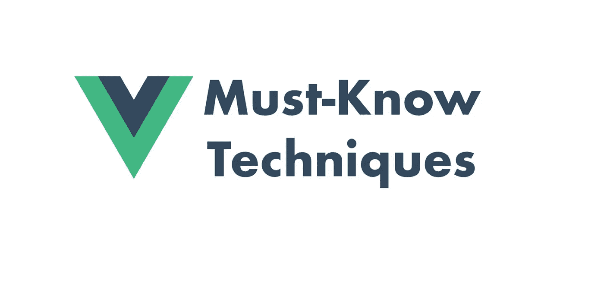

# 这 9 个 Vue 技巧你都掌握了吗？

> 原文：<https://blog.devgenius.io/have-you-mastered-these-9-vue-techniques-c4c2fb245eb8?source=collection_archive---------0----------------------->



现在 [Vue.js](https://vuejs.org/) 已经成为前端开发的热门框架。有很多工程师在利用 [Vue.js](https://vuejs.org/) 的便利和强大功能。然而，我们所做的一些解决方案可能没有遵循最佳实践。好了，让我们来看看那些必须知道的 [Vue](https://vuejs.org/) 技术。

(访问[https://pitayan.com/posts/vue-techniques/](https://pitayan.com/posts/vue-techniques/?ref=medium)阅读原文。**源代码高亮显示。**)

# [1。功能组件](https://pitayan.com/#1-functional-component)

一个[功能组件](https://vuejs.org/v2/guide/render-function.html#Functional-Components)是无状态的，没有`lifecycle`或`methods`。因此它不能被实例化

创建一个功能组件非常容易，您所需要做的就是向 SFC 添加一个`functional: true`属性或者向模板添加`functional`。由于它像函数一样轻巧，没有实例引用，所以渲染性能有了很大的提高。

功能组件依赖于`context`,并随着其中给定的数据而变异。

```
<template functional>
  <div class="book">
    {{props.book.name}} {{props.book.price}}
  </div>
</template><script>
Vue.component('book', {
  functional: true,
  props: {
    book: {
      type: () => ({}),
      required: true
    }
  },
  render: function (createElement, context) {
    return createElement(
      'div',
      {
        attrs: {
          class: 'book'
        }
      },
      [context.props.book]
    )
  }
})
</script>
```

# [2。深度选择器](https://pitayan.com/posts/vue-techniques/#2-deep-selectors)

有时你甚至需要 cha 第三方组件 CSS，它们是`scoped`样式。无法移除`scope`或开启新样式。

现在[深度选择器](https://vue-loader.vuejs.org/guide/scoped-css.html#child-component-root-elements) `>>>` `/deep/` `::v-deep`进入正确的求助位置。

```
<style scoped>
>>> .scoped-third-party-class {
  color: gray;
}
</style><style scoped>
/deep/ .scoped-third-party-class {
  color: gray;
}
</style><style scoped>
::v-deep .scoped-third-party-class {
  color: gray;
}
</style>
```

# [3。](https://pitayan.com/posts/vue-techniques/#3-advanced-watcher)高级“守望者”

## [立即执行](https://pitayan.com/posts/vue-techniques/#execute-immedately)

`watch`被监控的道具变异时触发处理程序。但有时，它是在组件创建后立即出现的。

是的，有一个简单的解决方案:调用`created`钩子中的处理程序。但这看起来并不优雅，同时也增加了复杂性。

或者，您可以向 watcher 添加一个`immediate`属性:

```
watch: {
    value: {
        handler: 'printValue',
        immediate: true
    }
},
methods : {
  printValue () {
    console.log(this.value)
  }
}
```

## [深度倾听](https://pitayan.com/posts/vue-techniques/#deep-listening)

有时守望者道具是一个`Object`。但是它的属性突变不能触发观察器处理程序。在这种情况下，给 watcher 添加`deep: true`可以使其属性的突变可被检测到。

请注意，当您的`Object`有许多层时，`deep`可能会导致一些严重的性能问题。最好考虑使用更扁平的数据结构。

```
data () {
  return {
    value: {
      one: {
        two: {
          three: 3
        }
      }
    }
  }
},
watch: {
  value: {
    handler: 'printValue',
    deep: true
  }
},
methods : {
  printValue () {
    console.log(this.value)
  }
}
```

## [多个处理程序](https://pitayan.com/posts/vue-techniques/#multiple-handlers)

实际上观察者可以被设置为一个`Array`。支持的类型有`String` | `Function` | `Object`。当被触发时，注册的观察器处理程序将被逐个调用。

```
watch: {
  value: [
    'printValue',
    function (val, oldVal) {
      console.log(val)
    },
    {
      handler: 'printValue',
      deep: true
    }
  ]
},
methods : {
  printValue () {
    console.log(this.value)
  }
}
```

## [订阅多变量突变](https://pitayan.com/posts/vue-techniques/#subscribe-to-multiple-variables-mutation)

`watcher`不能监听多个变量，但是我们可以将目标组合在一起作为一个新的`computed`并观察这个新的“变量”。

```
computed: {
  multipleValues () {
    return {
      value1: this.value1,
      value2: this.value2,
    }
  }
},
watch: {
  multipleValues (val, oldVal) {
    console.log(val)
  }
}
```

# [4。事件参数:$event](https://pitayan.com/posts/vue-techniques/#4-event-argument-event)

`$event`是事件对象的特殊变量。在一些复杂的功能场景中，它提供了更多可选的 arugment。

## [本土事件](https://pitayan.com/posts/vue-techniques/#native-events)

在本机事件中，该值与默认事件(DOM 事件或窗口事件)相同。

```
<template>
  <input type="text" @input="handleInput('hello', $event)" />
</template><script>
export default {
  methods: {
    handleInput (val, e) {
      console.log(e.target.value) // hello
    }
  }
}
</script>
```

## [自定义事件](https://pitayan.com/posts/vue-techniques/#custom-events)

在自定义事件中，值是从子组件中捕获的内容。

```
<!-- Child -->
<template>
  <input type="text" @input="$emit('custom-event', 'hello')" />
</template><!-- Parent -->
<template>
  <Child @custom-event="handleCustomevent" />
</template><script>
export default {
  methods: {
    handleCustomevent (value) {
      console.log(value) // hello
    }
  }
}
</script>
```

# [5。路由器参数解耦](https://pitayan.com/posts/vue-techniques/#5-router-parameter-decoupling)

我相信大多数人都是这样处理组件中的路由器参数的:

```
export default {
  methods: {
    getRouteParamsId() {
      return this.$route.params.id
    }
  }
}
```

在组件内部使用`$route`将为某个 URL 生成一个强耦合。这限制了组件的灵活性。

正确的解决方法是将`props`加到`Router`上。

```
const router = new VueRouter({
  routes: [{
    path: '/:id',
    component: Component,
    props: true
  }]
})
```

这样，组件就可以直接从道具中获得`params`。

```
export default {
  props: ['id'],
  methods: {
    getParamsId() {
      return this.id
    }
  }
}
```

此外，您还可以传入一个函数来返回用于定制目的的`props`。

```
const router = new VueRouter({
  routes: [{
    path: '/:id',
    component: Component,
    props: router => ({ id: route.query.id })
  }]
})
```

# [6。定制组件的双向绑定](https://pitayan.com/posts/vue-techniques/#6-two-way-binding-for-custom-components)

> *允许自定义组件自定义与 v-model 一起使用时使用的道具和事件。默认情况下，组件上的 v-model 使用 value 作为属性，使用 input 作为事件，但是一些输入类型(如复选框和单选按钮)可能希望将 value prop 用于不同的目的。在这种情况下，使用模型选项可以避免冲突。*

`v-model`以双向装订闻名。`input`是默认的更新事件。该值可以通过`$emit`更新。唯一的限制是组件需要一个`<input>`标签来绑定`value`属性。

```
<my-checkbox v-model="val"></my-checkbox><template>
  <input type="checkbox" :value="value" @input="handleInputChange(value)" />
</template><script>
export default {
  props: {
    value: {
      type: Boolean,
      default: false
    }
  },
  methods: {
    handleInputChange (val) {
      console.log(val)
    }
  }
}
</script>
```

双向绑定还有另一个解决方案，那就是`sync`修改器。与`v-model`不同，它不要求你的组件有一个`<input>`标签并将值绑定到它。它只通过事件系统触发`update:<your_prop>`使道具变异。

```
<custom-component :value.sync="value" />
```

# 7。组件生命周期挂钩

通常，您可以像这样监听子组件生命周期(例如`mounted`

```
<!-- Child -->
<script>
export default {
  mounted () {
    this.$emit('onMounted')
  }
}
</script><!-- Parent -->
<template>
  <Child @onMounted="handleOnMounted" />
</template>
```

对此还有另一个简单的解决方案。您可以使用`@hook:mounted`来代替。它在 Vue 内部系统中使用。

```
<!-- Parent -->
<template>
  <Child @hook:mounted="handleOnMounted" />
</template>
```

# 8。事件监听器 API

例如，在页面加载时添加一个计时器，但是在销毁时需要清除计时器。这看起来不错。

坦率地说，`this.timer`只有在`beforeDestroy`中用于获取定时器 id 时才有意义。不是刻薄，而是你的反应变量越少，你的表现就越好。

```
export default {
  data () {
    return {
      timer: null
    }
  },
  mounted () {
    this.timer = setInterval(() => {
      console.log(Date.now())
    }, 1000)
  },
  beforeDestroy () {
    clearInterval(this.timer)
  }
}
```

使它只能在生命周期挂钩中访问。用`$once`放下不必要的东西。

```
export default {
  mounted () {
    let timer = null timer = setInterval(() => {
      console.log(Date.now())
    }, 1000) this.$once('hook:beforeDestroy', () => {
      clearInterval(timer)
    })
  }
}
```

# [9。以编程方式安装组件](https://pitayan.com/posts/vue-techniques/#9-mount-components-programmatically)

在某些场景中，以编程方式加载组件要优雅得多。例如，可以通过全局上下文`$popup()`或`$modal.open()`打开弹出窗口或模态。

```
import Vue from 'vue'
import Popup from './popup'const PopupCtor = Vue.extend(Popup)const PopupIns = new PopupCtr()PopupIns.$mount()document.body.append(PopupIns.$el)Vue.prototype.$popup = Vue.$popup = function () {
  PopupIns.open()
}
```

[元素 UI](https://github.com/ElemeFE/element/blob/dev/packages/message-box/src/main.js) 实现了一个结构良好的模态组件，允许使用自定义 API 来控制实例的生命周期。这个理论和我上面演示的非常相似。

这是关于 Vue 2.x 的 9 个技巧。希望通过这篇文章，你能对使用这个框架有一个更好的认识。如果你觉得这篇文章很棒，请分享到其他社交网络上。

感谢阅读！

# [参考文献](https://pitayan.com/posts/vue-techniques/#references)

*   [https://vuejs.org](https://vuejs.org/)
*   [https://www . digital ocean . com/community/tutorials/vue js-add-v-model-support](https://www.digitalocean.com/community/tutorials/vuejs-add-v-model-support)
*   [https://vue-loader . vue js . org/guide/scoped-CSS . html # child-component-root-elements](https://vue-loader.vuejs.org/guide/scoped-css.html#child-component-root-elements)

原载于[pitayan.com](https://pitayan.com)

[](https://pitayan.com/posts/vue-techniques/) [## 这 9 个 Vue 技巧你都掌握了吗？-皮塔扬

### 现在 Vue.js 已经成为前端开发的热门框架。有很多工程师在利用这种便利…

pitayan.com](https://pitayan.com/posts/vue-techniques/)